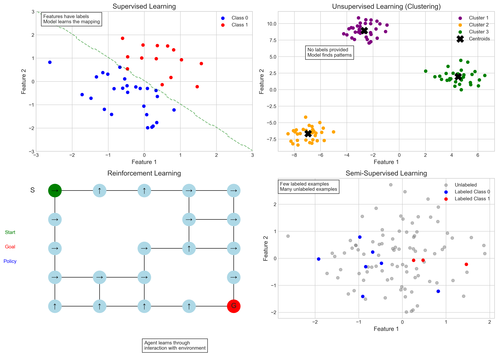
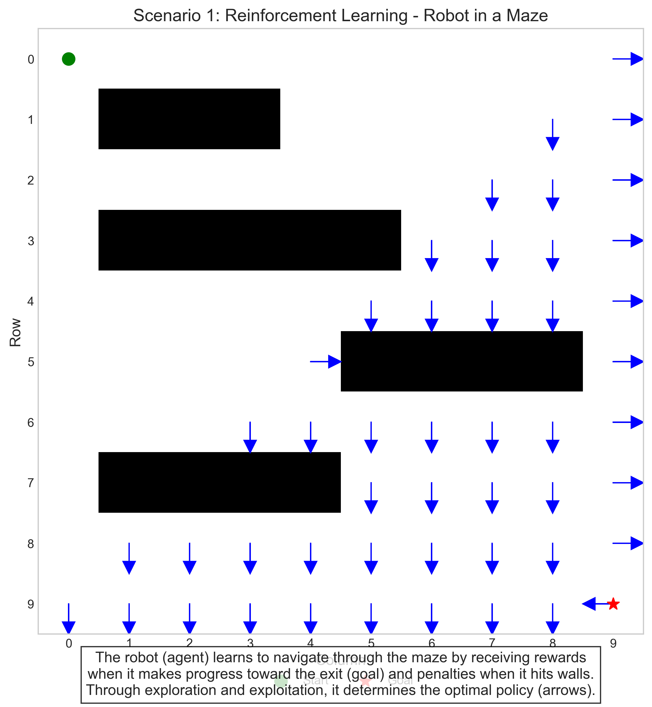
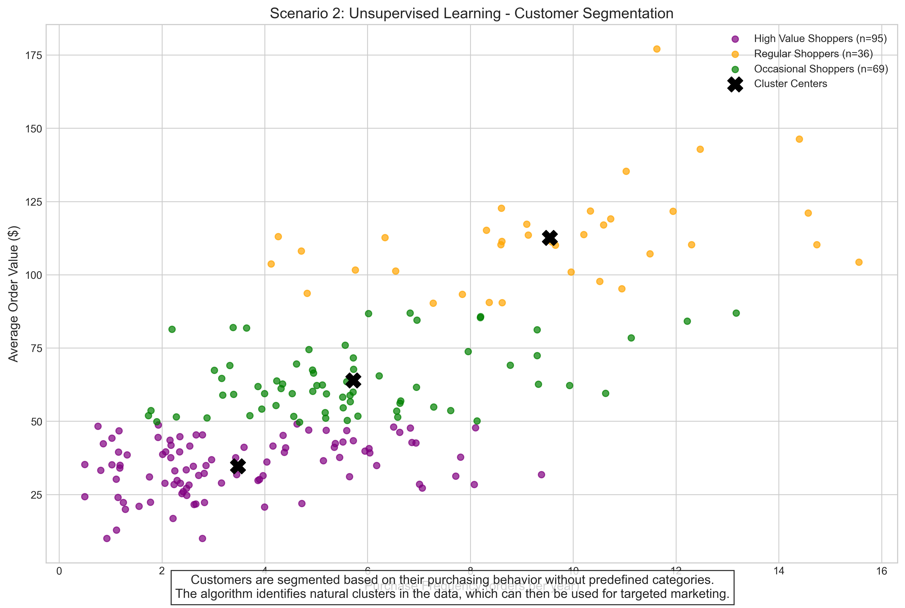
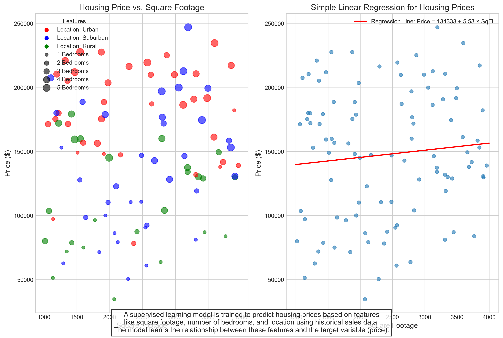
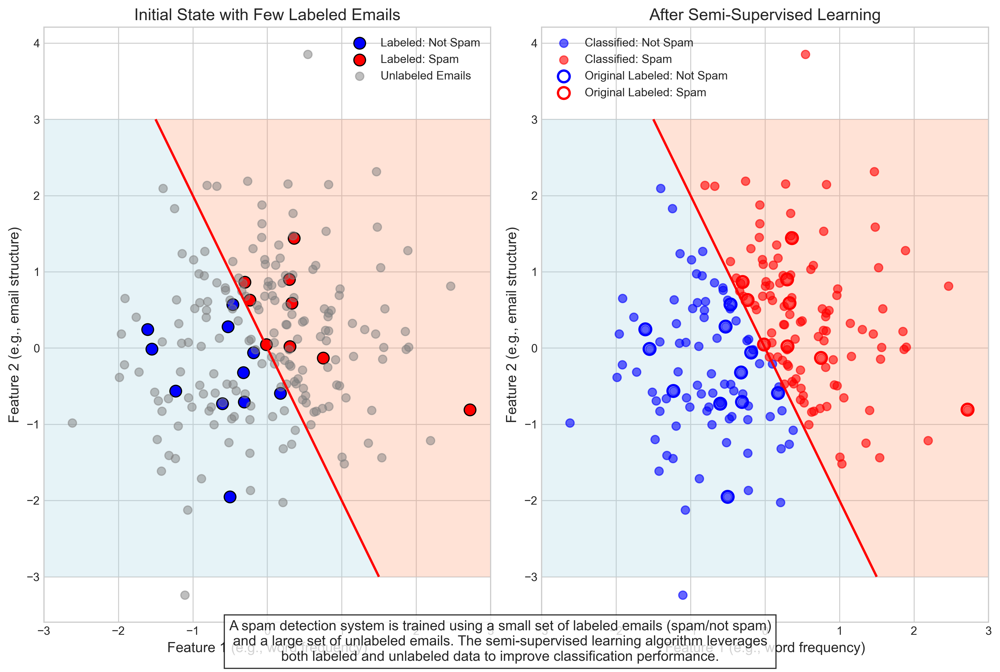

# Question 1: Types of Machine Learning

## Problem Statement
For each of the following scenarios, identify the most appropriate type of machine learning approach (supervised, unsupervised, reinforcement, or semi-supervised learning) and explain your reasoning.

## Scenarios
1. A robot learning to navigate through a maze by receiving rewards when it makes progress toward the exit and penalties when it hits walls
2. Grouping customers into different segments based on their purchasing behavior without any predefined categories
3. Training a system to predict housing prices based on features like square footage, number of bedrooms, and location using historical sales data
4. Training a spam detection system using a small set of labeled emails (spam/not spam) and a large set of unlabeled emails

## Solution

### Introduction to Machine Learning Types

Machine learning can be broadly categorized into four main types:

1. **Supervised Learning**: Learning from labeled data, where the algorithm is trained on pairs of input-output examples.
2. **Unsupervised Learning**: Learning from unlabeled data, where the algorithm identifies patterns without predefined categories.
3. **Reinforcement Learning**: Learning through interaction with an environment, where the algorithm receives feedback in the form of rewards or penalties.
4. **Semi-Supervised Learning**: Learning from a combination of labeled and unlabeled data, leveraging both to improve performance.

### Analysis of Each Scenario

#### Scenario 1: Robot Navigation in a Maze

**Type**: Reinforcement Learning

**Explanation**: This is a classic reinforcement learning scenario where the agent (robot) takes actions (movements) in an environment (maze) and receives feedback in the form of rewards and penalties. The robot learns to maximize rewards over time by exploring the environment and adjusting its policy.

**Key Components**:
- **Agent**: The robot
- **Environment**: The maze
- **Actions**: Movements (up, down, left, right)
- **Rewards**: Progress toward the exit
- **Penalties**: Hitting walls
- **Policy**: The strategy for choosing actions

Through trial and error, the robot learns which actions lead to rewards and which lead to penalties, eventually developing an optimal policy for navigating the maze.

In the visualization above, the robot learns to navigate from the start (green circle) to the goal (red star) by receiving rewards for progress and penalties for hitting obstacles (black squares). The blue arrows represent the learned policy, indicating the best direction to move in each state.

#### Scenario 2: Customer Segmentation

**Type**: Unsupervised Learning

**Explanation**: This is unsupervised learning because we're finding patterns in data without labeled examples. Specifically, this is a clustering task where we group similar customers together based on their purchasing behavior without having predefined categories or labels.

**Key Components**:
- **Data**: Customer purchasing behaviors
- **Algorithm**: Clustering (e.g., K-means)
- **Output**: Customer segments/clusters

The algorithm identifies natural patterns in the data and groups customers with similar behaviors, without any predefined categories or ground truth labels.

In the plot above, customers are segmented into three distinct groups based on their purchase frequency and average order value. The algorithm identifies these natural clusters without being provided any predefined categories or labels. The black X marks represent the cluster centers.

#### Scenario 3: Housing Price Prediction

**Type**: Supervised Learning

**Explanation**: This is supervised learning because we have labeled training data (historical sales with known prices) and a clear target variable (price) to predict. The algorithm learns the relationship between input features and the target variable.

**Key Components**:
- **Features/Inputs**: Square footage, number of bedrooms, location
- **Labels/Outputs**: Housing prices
- **Training Data**: Historical sales data
- **Algorithm**: Regression (predicting a continuous value)

The model learns from examples of houses with known prices and their associated features, so it can predict prices for new houses based on their features.

The left plot shows how housing prices vary with square footage, colored by location (red: Urban, blue: Suburban, green: Rural) and sized by the number of bedrooms. The right plot demonstrates a simple linear regression model that learns to predict house prices based on square footage.

#### Scenario 4: Spam Detection with Limited Labels

**Type**: Semi-Supervised Learning

**Explanation**: This is semi-supervised learning because we have a combination of labeled data (the small set of emails marked as spam/not spam) and unlabeled data (the large set of unlabeled emails). The algorithm can use both to improve its performance.

**Key Components**:
- **Labeled Data**: Small set of emails with spam/not spam labels
- **Unlabeled Data**: Large set of emails without labels
- **Learning Process**: Using both labeled and unlabeled data to build a classifier

Semi-supervised learning is particularly useful when labeling data is expensive or time-consuming, as it allows the algorithm to leverage the structure in the unlabeled data while still being guided by the labeled examples.

The left plot shows the initial state with a few labeled emails (marked with black borders) and many unlabeled emails (gray). The right plot shows how a semi-supervised learning algorithm can classify all emails by learning from both the labeled and unlabeled data.

### Summary and Conclusion

Each of these scenarios illustrates a different type of machine learning approach:

1. **Reinforcement Learning**: Robot navigation through a maze with rewards and penalties
2. **Unsupervised Learning**: Customer segmentation based on purchasing behavior without predefined categories
3. **Supervised Learning**: Housing price prediction using labeled historical sales data
4. **Semi-Supervised Learning**: Spam detection with a small set of labeled emails and a large set of unlabeled emails

The choice of machine learning approach depends on several factors:
- The nature of the data (labeled, unlabeled, or partially labeled)
- The learning objective (prediction, classification, clustering, policy learning)
- The feedback mechanism (direct supervision, rewards/penalties, no feedback)
- The availability of labeled data (abundant, limited, or none)

Understanding these different approaches is fundamental for selecting the most appropriate technique for a given problem. 