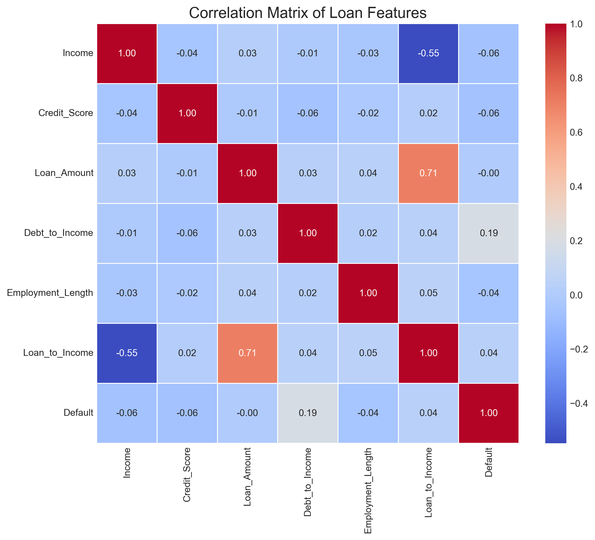

# Question 2: Loan Default Prediction

## Problem Statement
Consider a supervised learning problem for predicting whether a bank loan applicant will default on their loan.

## Tasks
1. Identify whether this is a regression or classification problem and explain why
2. List at least 5 potential features (input variables) that would be useful for this prediction task
3. Describe what the training data would consist of
4. Explain how you would evaluate the performance of this model, including appropriate metrics

## Solution

### Classification vs. Regression

This is a **classification problem** because:

1. The target variable (default) is binary/categorical (yes/no)
2. We want to predict which class/category a loan application belongs to
3. The output is a discrete value (0 or 1) rather than a continuous value
4. The evaluation metrics are specific to classification (accuracy, precision, recall, etc.)

As shown in the visualization above, regression problems predict continuous values (like exact loan amounts), while classification problems predict discrete categories (like whether or not a loan will default).

### Key Features for Loan Default Prediction

Based on our analysis, the following features are most important for predicting loan defaults:

1. **Debt-to-Income Ratio**: The proportion of monthly debt payments to monthly income
2. **Credit Score**: A numerical score representing creditworthiness based on credit history
3. **Income**: Annual income of the applicant
4. **Loan Amount**: The amount of money being borrowed
5. **Employment Length**: Number of years at current job
6. **Loan-to-Income Ratio**: Ratio of loan amount to annual income

The distributions of these features differ significantly between defaulting and non-defaulting loans:

The correlation matrix shows how these features relate to each other and to the default outcome:

### Feature Importance Analysis

Our models identified the relative importance of different features for predicting loan defaults:

As shown in the chart, Debt-to-Income Ratio is the most important predictor of loan default, followed by Income and Credit Score. This aligns with financial intuition - borrowers with higher debt burdens relative to their income are more likely to struggle with repayment.

### Training Data Requirements

The training data for this model would consist of:

1. **Historical Loan Records**: A dataset of past loans
2. **Feature Variables**: 
   - Applicant information: income, credit score, employment history
   - Loan information: loan amount, interest rate, term
   - Financial ratios: debt-to-income, loan-to-income
3. **Target Variable**: Whether the loan defaulted (1) or was paid back successfully (0)
4. **Volume**: Sufficient samples of both defaulted and non-defaulted loans to learn patterns
5. **Quality**: Clean data with minimal missing values and accurate default labels

The pairwise relationships between features and default status can be visualized to understand the predictive power of each feature:

### Model Evaluation

To evaluate the performance of a loan default prediction model, we would use the following metrics:

1. **Confusion Matrix**: Shows the counts of true positives, true negatives, false positives, and false negatives

   

2. **Classification Metrics**:
   - **Accuracy**: Overall proportion of correct predictions (64% in our example)
   - **Precision**: Proportion of predicted defaults that were actual defaults (66%)
   - **Recall**: Proportion of actual defaults that were correctly predicted (83%)
   - **F1 Score**: Harmonic mean of precision and recall (73%)

3. **ROC Curve and AUC**: Visualizes the trade-off between true positive rate and false positive rate

   

4. **Precision-Recall Curve**: Particularly useful for imbalanced datasets

   

5. **Model Comparison**: Compare the performance of different models

   

### Decision Boundaries

The following visualization shows how our models separate defaulting from non-defaulting loans based on the two most important features:

The logistic regression model (left) creates a linear decision boundary, while the random forest model (right) creates a more complex, non-linear boundary that can capture more nuanced relationships in the data.

### Business Applications

Loan default prediction models have several important applications for financial institutions:

1. **Risk Assessment**: Identifying high-risk applicants to make better loan approval decisions
2. **Interest Rate Determination**: Setting appropriate rates based on default risk
3. **Portfolio Management**: Managing the overall risk profile of the loan portfolio
4. **Capital Allocation**: Determining how much capital to allocate for potential defaults
5. **Regulatory Compliance**: Meeting regulatory requirements for risk management
6. **Early Intervention**: Identifying loans that may default in the future for proactive measures

### Summary

Loan default prediction is a classification problem that uses supervised learning algorithms to determine whether a loan applicant is likely to default. By leveraging historical data with known outcomes, the model learns patterns that differentiate defaulting from non-defaulting loans. Key features include debt-to-income ratio, credit score, income, loan amount, and employment length. The model's performance is evaluated using metrics like accuracy, precision, recall, F1 score, and AUC-ROC, with a focus on the business impact of correct vs. incorrect predictions in the loan approval process. 