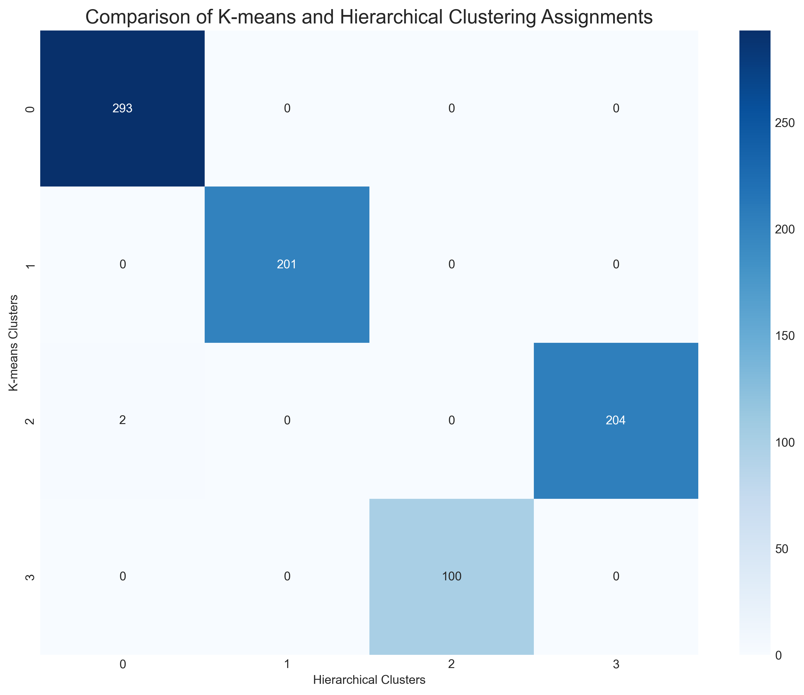

# Question 3: Customer Clustering Analysis

## Problem Statement
Consider the following unsupervised learning problem: clustering customer transaction data to identify patterns of purchasing behavior.

## Tasks
1. Explain the difference between hierarchical clustering and k-means clustering approaches for this problem
2. What are the key challenges in determining the optimal number of clusters?
3. How would you evaluate the quality of the resulting clusters without ground truth labels?
4. Describe a real-world business application where this clustering could provide actionable insights

## Solution

### Introduction to Customer Clustering

Customer clustering is an unsupervised learning approach used to segment customers into groups with similar purchasing behaviors. This analysis helps businesses understand their customer base, identify distinct behavioral patterns, and develop targeted marketing strategies without relying on predefined categories.

In our analysis, we've used synthetic customer transaction data with features like:

- Purchase frequency (number of purchases per year)
- Average purchase amount
- Recency (days since last purchase)
- Category diversity (number of different product categories purchased)
- Online purchase ratio (proportion of purchases made online vs. in-store)
- Annual spend (total yearly spending)

### 1. K-means vs. Hierarchical Clustering

#### K-means Clustering

K-means is a partitioning method that divides the dataset into k non-overlapping clusters, where each data point belongs to the cluster with the nearest mean (centroid).

**Process**:
1. Randomly initialize k centroids
2. Assign each data point to the closest centroid
3. Recalculate centroids as the mean of all points in the cluster
4. Repeat steps 2-3 until convergence

**Key characteristics**:
- Requires pre-specifying the number of clusters (k)
- Scalable to large datasets (O(n) complexity)
- Simple to understand and implement
- Works well with globular, evenly-sized clusters
- Results may vary with different initializations (non-deterministic)
- Struggles with non-globular cluster shapes

#### Hierarchical Clustering

Hierarchical clustering builds a tree of clusters (dendrogram) that shows relationships between data points at different levels of granularity.

**Process (Agglomerative approach)**:
1. Start with each data point as its own cluster
2. Merge the two closest clusters
3. Repeat step 2 until all points are in a single cluster
4. Cut the dendrogram at desired level to form clusters

**Key characteristics**:
- No need to specify the number of clusters beforehand
- Creates a hierarchical structure (dendrogram) 
- Deterministic results (same outcome each time)
- Can handle various cluster shapes
- Computationally intensive for large datasets (O(n²) or O(n³))
- May be difficult to determine where to 'cut' the dendrogram

#### Comparison

The two methods often produce similar clusters in well-separated data but can yield different results when cluster boundaries are less distinct. In our customer analysis, the confusion matrix shows that while there's significant agreement between the methods, they aren't identical:

The t-SNE visualization provides a clearer picture of how both methods identify similar underlying patterns:

### 2. Challenges in Determining the Optimal Number of Clusters

Determining the optimal number of clusters is one of the most challenging aspects of clustering analysis. Several key challenges include:

1. **Subjective interpretation of metrics**: Different evaluation metrics may suggest different optimal values of k.

2. **Balance between simplicity and detail**: Fewer clusters provide simpler, more generalizable segments, while more clusters capture finer distinctions but may overfit to noise.

3. **Business interpretability vs. statistical optimization**: The mathematically optimal number of clusters may not align with what makes business sense.

4. **Inconsistent results across methods**: Different methods for determining k may suggest different values.

5. **Domain knowledge requirements**: The final decision often requires domain expertise.

In our analysis, we used multiple metrics to determine the optimal number of clusters:

- **Elbow Method** (top-left): Looks for the "elbow" in the inertia curve, suggesting 3-4 clusters
- **Silhouette Score** (top-right): Peaks at 3 clusters, suggesting this is optimal
- **Calinski-Harabasz Index** (bottom-left): Peaks at 4 clusters
- **Davies-Bouldin Index** (bottom-right): Lowest at 3 clusters (lower is better)

While the metrics suggest 3-4 clusters would be appropriate, we must balance this statistical evidence with business considerations like interpretability and actionability.

### 3. Evaluating Cluster Quality Without Ground Truth Labels

In unsupervised learning, we don't have ground truth labels to evaluate cluster quality. Instead, we can use:

1. **Internal validation metrics**:
   - **Silhouette Score**: Measures how similar an object is to its own cluster compared to other clusters (ranges from -1 to 1, higher is better)
   - **Calinski-Harabasz Index**: Ratio of between-cluster variance to within-cluster variance (higher is better)
   - **Davies-Bouldin Index**: Average similarity between clusters (lower is better)
   - **Inertia**: Within-cluster sum of squares or variance (lower is better)

2. **Visual assessment**:
   - **Dimensionality reduction techniques**: PCA, t-SNE, or UMAP to visualize high-dimensional clusters in 2D or 3D
   - **Feature distribution by cluster**: Examining the distribution of features within each cluster
   - **Cluster profiles**: Comparing the mean values of features across clusters

3. **Business validation**:
   - **Interpretability**: Can we assign meaningful descriptions to the clusters?
   - **Actionability**: Can the clusters lead to specific business actions?
   - **Stability**: Do the clusters remain consistent with new data?
   - **Face validity**: Do the clusters make intuitive sense to domain experts?

In our analysis, we created cluster profiles to help interpret and evaluate the clusters:

The radar chart provides another way to visualize and compare cluster characteristics:

Based on these profiles, we identified four distinct customer segments:

1. **High-Frequency Low-Value Shoppers** (36.6%):
   - Frequent purchases (~6 per year)
   - Moderate purchase amounts (~$80)
   - Recent activity (30 days)
   - Moderate category diversity (5 categories)
   - Balanced online/offline shopping

2. **Low-Frequency High-Value Shoppers** (25.1%):
   - Infrequent purchases (~2 per year)
   - High purchase amounts (~$199)
   - Less recent activity (58 days)
   - High category diversity (8 categories)
   - Strong preference for online shopping

3. **High-Frequency Low-Value Shoppers** (25.8%):
   - Very frequent purchases (~12 per year)
   - Low purchase amounts (~$31)
   - Very recent activity (15 days)
   - Low category diversity (3 categories)
   - Strong preference for in-store shopping

4. **Inactive/Rare Shoppers** (12.5%):
   - Rare purchases (<0.5 per year)
   - Low purchase amounts (~$48)
   - Not recent (122 days)
   - Very low category diversity (1-2 categories)
   - Strong preference for in-store shopping

### 4. Business Applications of Customer Clustering

Customer clustering provides valuable insights that can drive numerous business applications:

1. **Personalized Marketing Strategies**:
   - **High-Frequency Low-Value Shoppers**: Upsell to higher-value products, create bundle offers, loyalty program rewards
   - **Low-Frequency High-Value Shoppers**: VIP treatment, early access to new products, premium customer service
   - **High-Frequency Very-Low-Value Shoppers**: Create bundle offers to increase basket size, encourage category exploration
   - **Inactive/Rare Shoppers**: Re-engagement campaigns, win-back offers, surveys to understand churn reasons

2. **Product Recommendations**:
   - Suggest products based on cluster preferences and purchase history
   - Recommend category expansion for customers with low diversity
   - Cross-sell complementary products based on cluster buying patterns

3. **Pricing and Promotion Strategy**:
   - Develop cluster-specific pricing strategies
   - Create targeted promotions for different segments
   - Design loyalty programs that resonate with each segment

4. **Customer Retention**:
   - Identify at-risk segments (e.g., customers with decreasing engagement)
   - Develop retention strategies tailored to each segment
   - Focus resources on high-value customers

5. **Channel Optimization**:
   - Adjust marketing channel strategy based on online vs. offline preferences
   - Optimize the customer experience in preferred channels
   - Develop omnichannel strategies to engage customers across channels

6. **Inventory Management and Merchandising**:
   - Stock products preferred by dominant customer segments
   - Arrange store layouts based on cluster shopping patterns
   - Develop new products to meet unmet needs in specific segments

### Conclusion

Customer clustering is a powerful unsupervised learning approach that helps businesses identify natural patterns in customer behavior without predefined categories. By comparing methods like K-means and hierarchical clustering, carefully determining the optimal number of clusters, and rigorously evaluating cluster quality, businesses can develop meaningful customer segments that drive targeted marketing strategies and improve customer satisfaction.

The choice between K-means and hierarchical clustering should be based on the specific needs of the business, the size of the dataset, and the desired cluster characteristics. While K-means is more scalable and straightforward for large datasets, hierarchical clustering provides a richer structure that may reveal relationships between segments at different levels of granularity.

By translating cluster insights into actionable business strategies, companies can enhance customer experience, optimize marketing efforts, and ultimately increase customer lifetime value across all segments. 