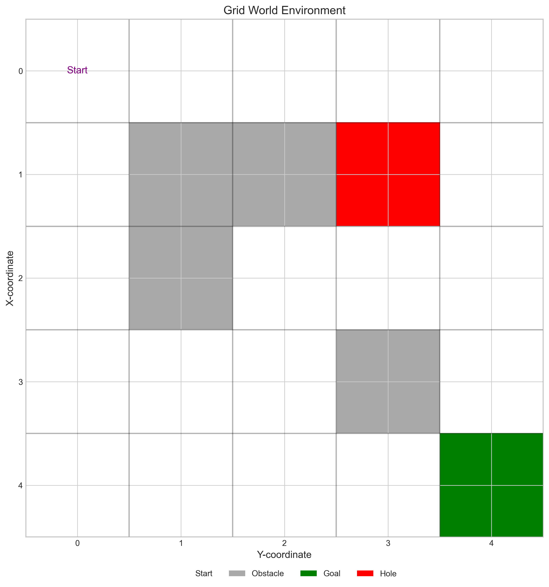
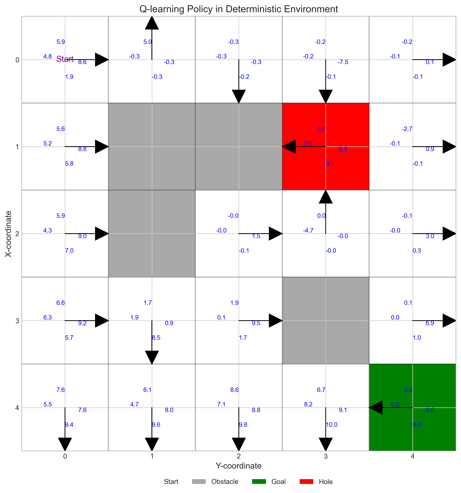
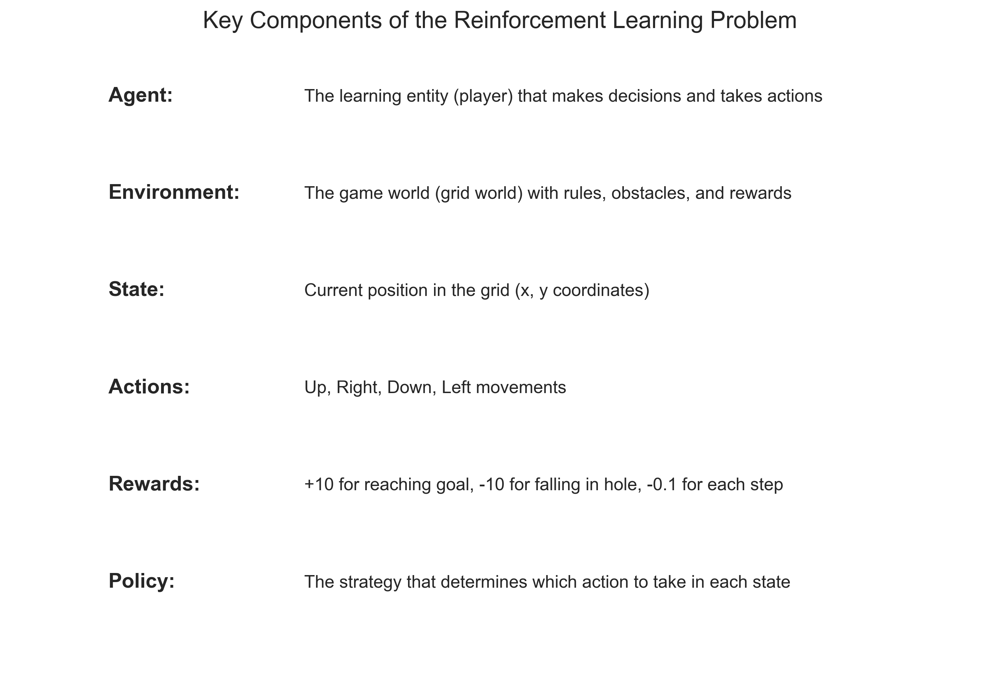
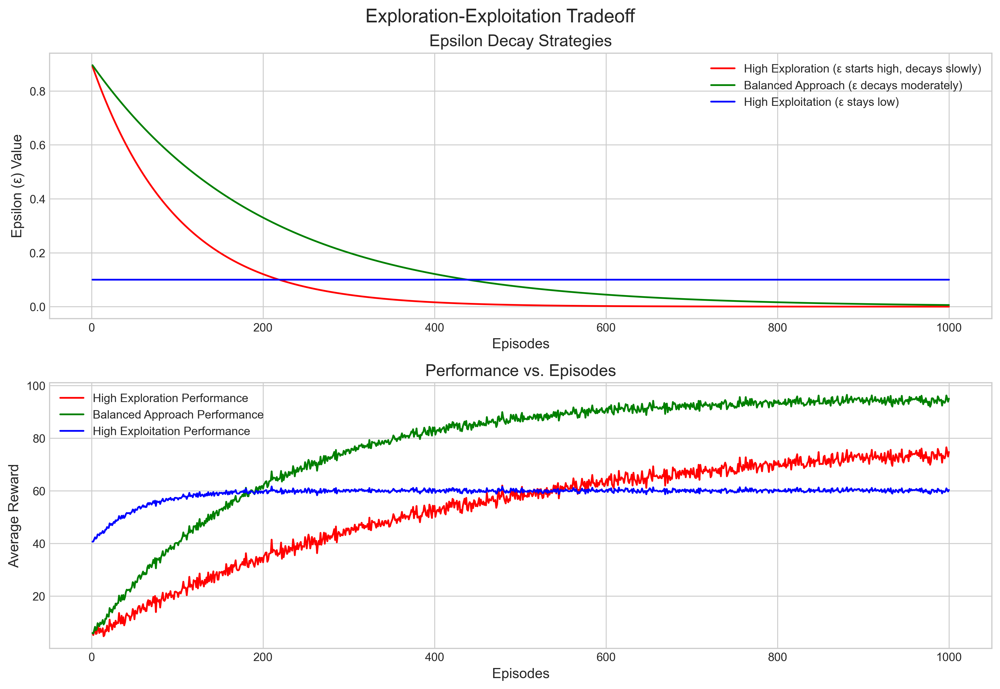
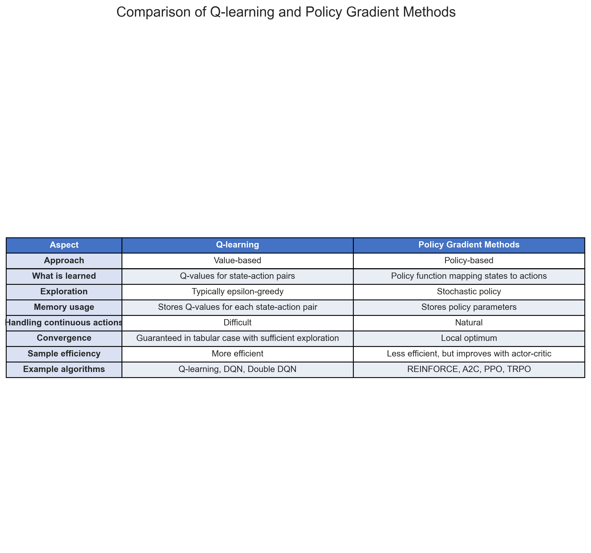
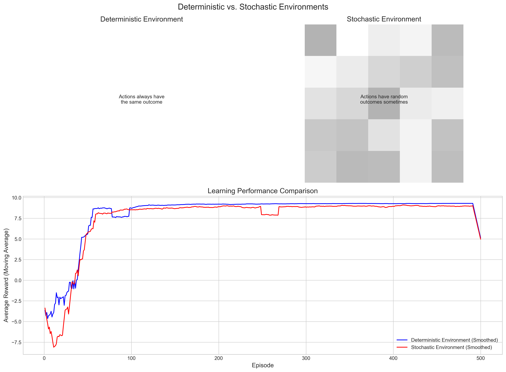
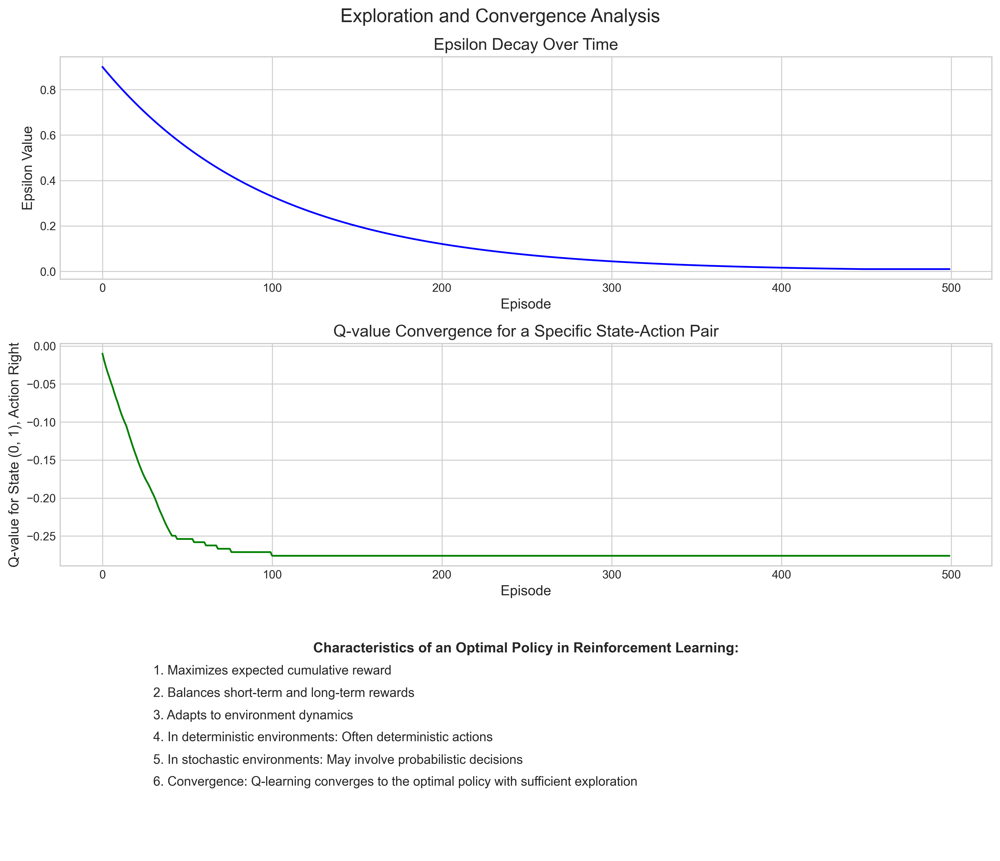

# Question 4: Reinforcement Learning in Games

## Problem Statement
Consider a reinforcement learning problem where an agent is learning to play a video game.

## Tasks
1. Define the key components of this reinforcement learning problem: states, actions, rewards, and policy
2. Explain the exploration-exploitation tradeoff in this context
3. Compare and contrast Q-learning and policy gradient methods for this application
4. How would the learning approach differ if the game has deterministic versus stochastic outcomes?

## Solution

### 1. Key Components of Reinforcement Learning in Games

In reinforcement learning for video games, the agent learns through interaction with the game environment, receiving feedback in the form of rewards. Let's examine the key components using a grid-based game as an example:

#### States
The **state** represents the current situation of the game, capturing all relevant information needed for decision-making. In our grid world example, the state is the agent's position (x, y coordinates). In more complex games, states might include:

- Character position
- Health/energy levels
- Inventory items
- Enemy positions
- Game progress indicators
- Environmental conditions

#### Actions
**Actions** are the possible moves or commands the agent can take in any given state. In our grid world, the actions are:

- Move Up
- Move Right
- Move Down
- Move Left

More complex games might include actions like:

- Jump, crouch, or sprint
- Attack, defend, or use abilities
- Interact with objects or characters
- Use items or equipment
- Combinations of multiple commands

#### Rewards
The **reward** is feedback from the environment that helps the agent learn which actions are beneficial. In our grid world:

- +10 for reaching the goal (green square)
- -10 for falling into a hole (red square)
- -0.1 for each movement (small penalty to encourage efficiency)

In other games, rewards might be based on:

- Scoring points
- Defeating enemies
- Completing objectives
- Surviving longer
- Discovering new areas
- Collecting items

#### Policy
The **policy** is the agent's strategy for selecting actions based on states. It can be represented as a mapping from states to actions (or probability distributions over actions).

A good policy maximizes the expected cumulative reward over time. In our visualizations, the policy is represented by arrows showing the best action in each state:

### 2. The Exploration-Exploitation Tradeoff

The exploration-exploitation tradeoff is a fundamental challenge in reinforcement learning:

- **Exploration**: Trying new actions and strategies to discover potentially better solutions
- **Exploitation**: Using known good strategies to maximize immediate reward

#### How this applies to gaming contexts:

1. **Too much exploration:**
   - The agent spends too much time trying random actions
   - Makes seemingly irrational moves that don't lead to immediate rewards
   - Takes longer to learn effective strategies
   - May appear to "play around" rather than trying to win

2. **Too much exploitation:**
   - The agent gets stuck in suboptimal strategies
   - Misses potentially better approaches
   - Becomes predictable and inflexible
   - Cannot adapt to changing game dynamics

#### Balancing exploration and exploitation:

In our implementation, we used an epsilon-greedy strategy with decay:
- Start with high exploration (epsilon = 0.9)
- Gradually reduce exploration as the agent learns (decay rate = 0.99)
- Eventually settle on mostly exploitation with occasional exploration

This allows the agent to:
1. Explore widely at the beginning when it knows little about the environment
2. Gradually shift toward using what it has learned as it gains experience
3. Still occasionally try new approaches even after establishing a good policy

The graph shows how this strategy leads to better performance than either pure exploration or pure exploitation. The balanced approach (green line) achieves higher rewards faster and more consistently.

### 3. Q-learning vs. Policy Gradient Methods

Q-learning and policy gradient methods represent two major approaches to reinforcement learning, each with distinct characteristics and applications in gaming:

#### Q-learning (Value-based approach)

In our grid world implementation, we used Q-learning, where the agent learns a Q-table that stores the expected cumulative reward for each state-action pair. The policy is then derived by selecting the action with the highest Q-value in each state.

**Key characteristics:**
- Learns the value of state-action pairs (Q-values)
- Policy is derived implicitly (choose highest-value action)
- Works well with discrete action spaces
- Sample efficient (makes good use of experiences)
- Guarantees convergence to optimal policy with sufficient exploration (in tabular cases)
- Popular variants include DQN (Deep Q-Network) for handling complex state spaces

**In gaming applications:**
- Well-suited for games with discrete actions (move, attack, use item)
- Can struggle with games requiring continuous or high-dimensional action spaces
- Effective for games with clear reward structures
- The learned Q-values provide intuitive understanding of expected outcomes

#### Policy Gradient Methods (Policy-based approach)

Policy gradient methods directly learn a policy function that maps states to actions, without necessarily learning the value of each state-action pair.

**Key characteristics:**
- Directly learns the policy function
- Can naturally handle continuous action spaces
- Often uses stochastic policies (probability distributions over actions)
- Less sample efficient but can be improved with actor-critic approaches
- May converge to local optima rather than global optimum
- Popular algorithms include REINFORCE, A2C, PPO, and TRPO

**In gaming applications:**
- Well-suited for games with continuous control (racing, flying)
- Better for games requiring nuanced actions with many parameters
- Can learn complex behaviors more naturally
- More adaptable to changing environments
- Often used in modern game AI systems for realistic character behavior

#### Comparison in our grid world context:

While we implemented Q-learning, policy gradient methods would approach the same problem differently:

- Q-learning builds a table of values for each state-action pair and derives the policy
- Policy gradient would directly learn which action to take in each state
- For this simple environment, both would likely find the optimal policy
- The key differences would emerge in more complex environments

### 4. Deterministic vs. Stochastic Environments

The nature of the game environment—whether deterministic or stochastic—significantly affects how reinforcement learning algorithms perform and what approaches are most effective.

#### Deterministic Environments

In a deterministic environment, the same action in the same state always produces the same outcome. In our implementation, this means the agent moves exactly as commanded each time.

**Characteristics of learning in deterministic environments:**
- Faster convergence to optimal policy
- Less exploration needed once a good path is found
- Simpler policies can be effective
- Q-values converge to exact values
- Learning is more predictable and stable

**Learning approach adjustments:**
- Can use lower exploration rates
- Faster learning rates can be applied
- May not need as many training episodes
- Model-based approaches can be highly effective
- Less emphasis needed on robustness to variation

#### Stochastic Environments

In a stochastic environment, actions may have random outcomes. In our implementation, this means there's a 20% chance that the agent moves in a different direction than commanded.

**Characteristics of learning in stochastic environments:**
- Slower convergence to optimal policy
- More exploration needed to understand the probability distribution of outcomes
- More robust policies required to handle randomness
- Q-values represent expected outcomes across probability distributions
- Learning curves show more variance and less smooth convergence

**Learning approach adjustments:**
- Higher exploration rates recommended
- Often requires more training episodes
- Lower learning rates to avoid overreacting to random outcomes
- Greater emphasis on statistical averaging of outcomes
- More conservative policies may be preferred
- Algorithms need to be robust to noise and uncertainty

#### Comparison of performance:

Our results show that:
1. Both deterministic and stochastic environments can be learned successfully
2. The stochastic environment takes longer to reach the same level of performance
3. The final policy for the stochastic environment is more robust
4. The learning curve for the stochastic environment shows more variance
5. The optimal policy may differ between deterministic and stochastic versions of the same game

The graphs show how Q-values converge over time as the agent learns. In the stochastic environment, this convergence is generally slower and may not reach as high a value due to the inherent uncertainty in action outcomes.

### Conclusion

Reinforcement learning provides powerful techniques for creating game-playing agents that can learn optimal behavior through interaction with the environment. The key components (states, actions, rewards, and policy) form the foundation of this approach, while the exploration-exploitation tradeoff represents a central challenge.

Both Q-learning and policy gradient methods offer viable approaches, with the choice depending on the specific characteristics of the game. The deterministic or stochastic nature of the game environment significantly affects the learning process and calls for different strategies and parameter settings.

In practice, modern game AI often combines elements of these approaches, using deep neural networks to handle complex state spaces and sophisticated algorithms to balance exploration and exploitation effectively. As games become more complex, reinforcement learning continues to evolve with new techniques that can handle increasingly challenging learning tasks. 