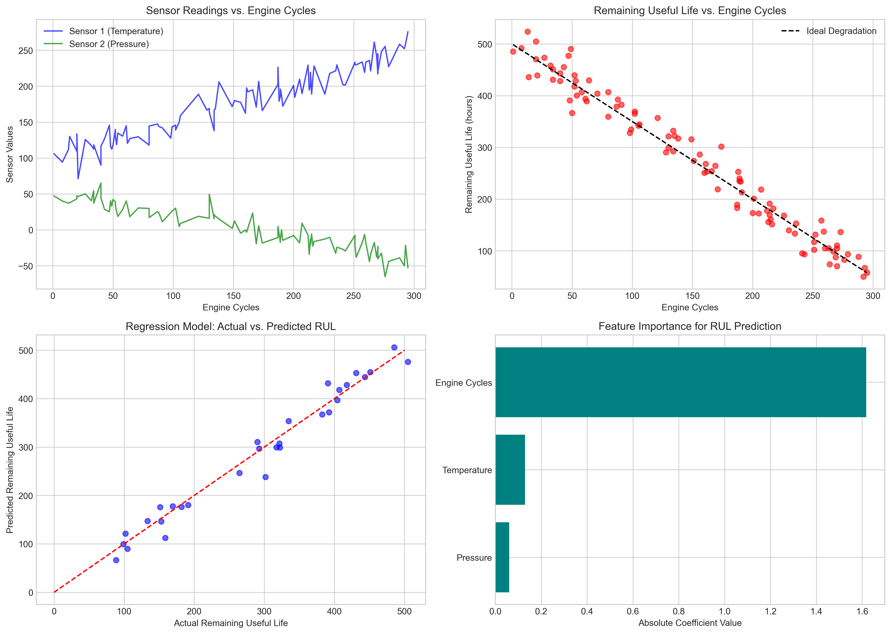
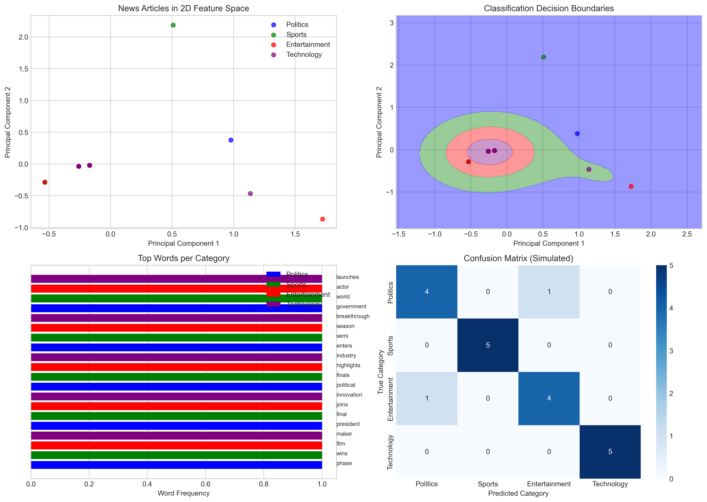
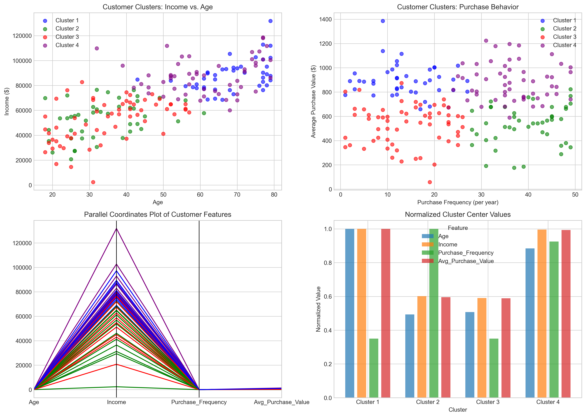
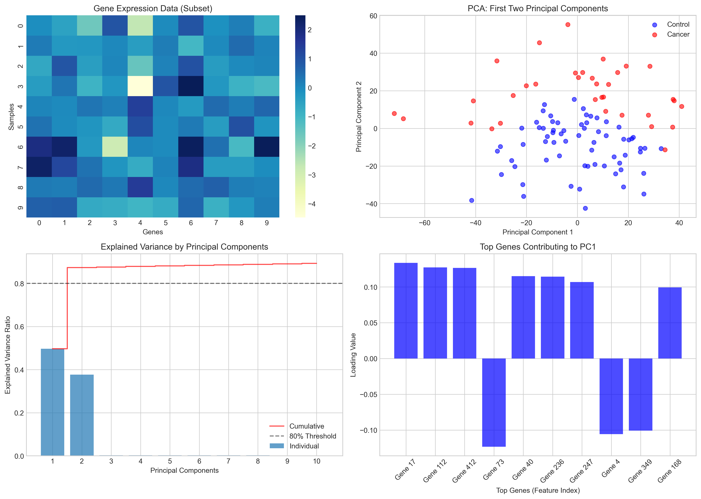

# Question 1: Identifying Learning Problems

## Problem Statement
For each of the following real-world scenarios, identify whether it is a classification, regression, clustering, or dimensionality reduction problem. Then formulate it as a learning task by specifying the input features, output variables, and the goal.

## Tasks
1. Predicting the remaining useful life of aircraft engines based on sensor readings
2. Categorizing news articles into topics like politics, sports, entertainment, etc.
3. Identifying groups of similar customer profiles from demographic and purchasing data
4. Reducing the number of features in a high-dimensional gene expression dataset while preserving the most important patterns

## Solutions

### Task 1: Aircraft Engine Remaining Useful Life

**Type: Regression Problem**

Regression problems involve predicting continuous, numerical values based on input features. In this case, we need to predict a continuous value (time remaining until failure) based on sensor readings.

**Formulation:**
- **Input Features (X)**: Sensor readings from the aircraft engine (temperature, pressure, vibration, etc.)
- **Output Variable (y)**: Remaining useful life in hours or cycles
- **Goal**: Minimize the prediction error between actual and predicted remaining useful life

**Explanation:**
This is a regression problem because:
1. The target variable (remaining useful life) is a continuous value, not a discrete category
2. We need to predict a specific numerical value rather than classify into categories
3. The goal involves minimizing error between predicted and actual values

In practical applications, various types of regression models can be applied, including linear regression, random forest regressors, or neural networks. The model shown in the visualization uses multiple sensor features to make predictions about the engine's remaining life.

### Task 2: News Article Categorization

**Type: Classification Problem**

Classification problems involve assigning input data to predefined categories or classes. Here, we need to assign each news article to one of several topic categories.

**Formulation:**
- **Input Features (X)**: Text content of news articles (processed into numerical features through techniques like word embeddings or TF-IDF)
- **Output Variable (y)**: Category labels (politics, sports, entertainment, technology, etc.)
- **Goal**: Maximize the accuracy of category predictions

**Explanation:**
This is a classification problem because:
1. The target variable is categorical (discrete labels for article topics)
2. We need to assign each article to one of several predefined categories
3. The goal involves maximizing classification accuracy

The visualization demonstrates how text data can be processed into numerical features and how a classifier separates articles into different topic categories. The confusion matrix shows the performance of a model by comparing predicted categories against true categories.

### Task 3: Customer Profile Clustering

**Type: Clustering Problem**

Clustering problems involve finding natural groupings in data without predefined labels. Here, we aim to discover groups of similar customers based on their characteristics.

**Formulation:**
- **Input Features (X)**: Customer demographic data and purchasing behavior (age, income, purchase frequency, average purchase value, etc.)
- **Output**: Cluster assignments (customer segments)
- **Goal**: Find meaningful customer segments with high intra-cluster similarity and low inter-cluster similarity

**Explanation:**
This is a clustering problem because:
1. There are no predefined classes or labels
2. We want to discover natural groupings in the data
3. The goal is to find segments where customers within a segment are similar to each other but different from customers in other segments

Clustering algorithms like K-means (shown in the visualization) group customers based on various attributes, allowing businesses to develop targeted marketing strategies for different customer segments. The visualization shows how customers are grouped into clusters based on demographic and purchasing behavior.

### Task 4: Gene Expression Dimensionality Reduction

**Type: Dimensionality Reduction Problem**

Dimensionality reduction problems involve finding a lower-dimensional representation of high-dimensional data while preserving its important patterns or variance.

**Formulation:**
- **Input Features (X)**: High-dimensional gene expression data (thousands of genes/features)
- **Output**: Lower-dimensional representation of the data
- **Goal**: Preserve the most important patterns/variance in the data with fewer dimensions

**Explanation:**
This is a dimensionality reduction problem because:
1. We want to reduce the number of features in the dataset
2. The goal is to find a more compact representation that preserves important information
3. We need to identify which features (genes) contribute most to the observed patterns

The visualization shows how Principal Component Analysis (PCA) can reduce high-dimensional gene expression data to fewer dimensions while preserving the most important variance. The explained variance plot shows how much information is captured by each principal component, and the feature loading plot shows which genes contribute most to the principal components.

## Summary

Learning problems can be categorized into four main types, each with different goals and approaches:

1. **Regression**: Predicting continuous values (e.g., remaining useful life of aircraft engines)
2. **Classification**: Assigning data to predefined categories (e.g., news article topics)
3. **Clustering**: Finding natural groupings without predefined labels (e.g., customer segments)
4. **Dimensionality Reduction**: Finding compact representations of high-dimensional data (e.g., gene expression patterns)

Formulating a problem correctly is essential for choosing appropriate algorithms, evaluation metrics, and interpretation methods. The problem formulation guides the entire machine learning process from data collection to model selection to performance evaluation. 