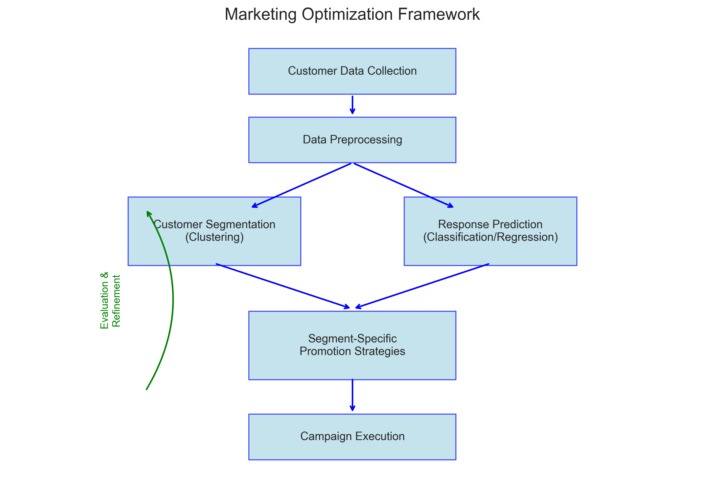
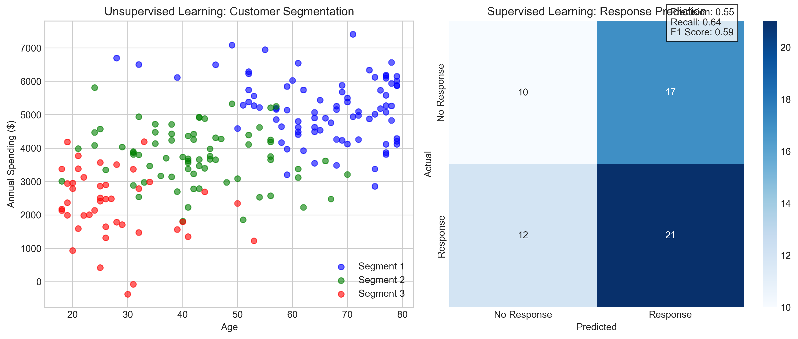
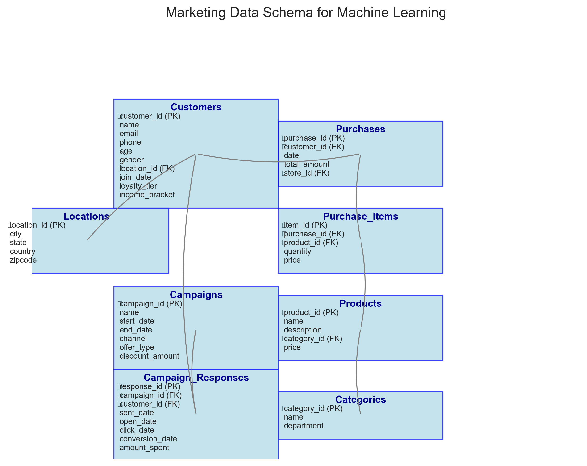
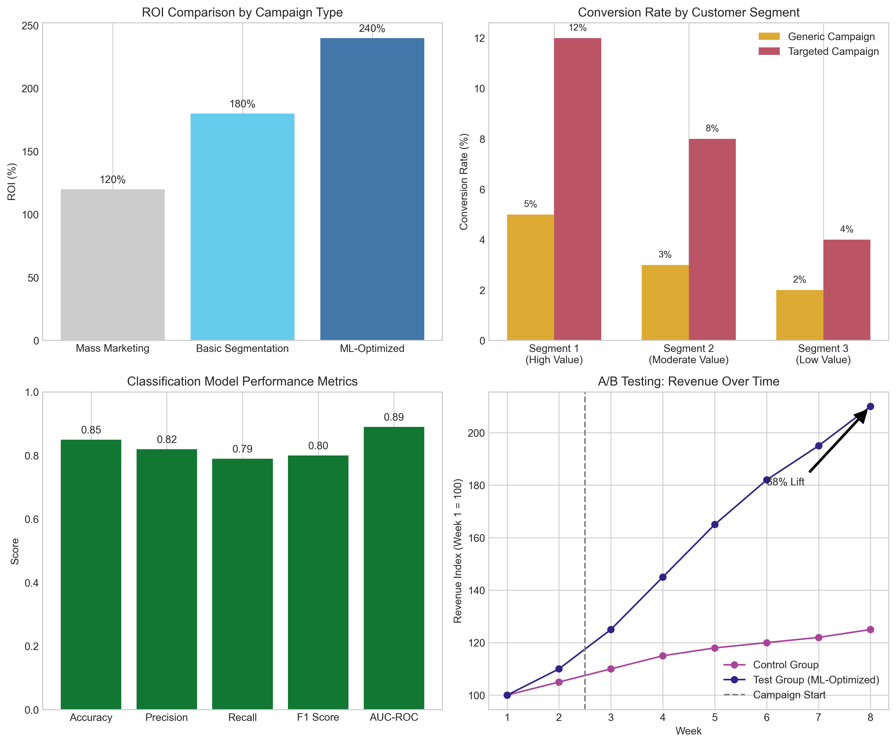
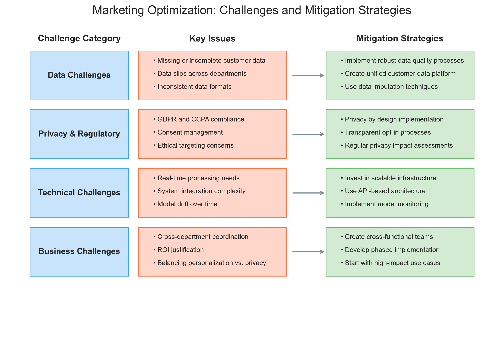

# Question 2: Marketing Optimization Problem

## Problem Statement
Consider a business problem: A retail company wants to optimize its marketing strategy by targeting specific customer segments with personalized promotions.

## Tasks
1. Formulate this as a machine learning problem
2. Identify what type of learning problem this is
3. Specify what data you would need to address this problem
4. Describe how you would evaluate the success of your solution
5. Discuss potential challenges and limitations

## Solution

### Task 1: Formulate as a Machine Learning Problem

The marketing optimization problem can be broken down into two complementary machine learning tasks that work together to create a comprehensive solution:

**Task 1A: Customer Segmentation**
- **Objective**: Group customers into segments with similar characteristics, behaviors, and preferences
- **Approach**: Apply unsupervised learning to discover natural customer groups
- **Output**: Distinct customer segments, each with unique characteristics

**Task 1B: Response Prediction**
- **Objective**: Predict which customers will respond positively to specific types of promotions
- **Approach**: Apply supervised learning to predict response rates for each segment
- **Output**: Probability scores for customer response to different promotion types

By combining these tasks, we can create targeted marketing campaigns for each customer segment, tailored to their preferences and likelihood of response. This approach allows for:
- More efficient allocation of marketing resources
- Higher conversion rates through personalized promotions
- Improved customer experience through relevant offers
- Increased return on marketing investment

### Task 2: Type of Learning Problem

This is a multi-stage machine learning problem that combines:

**1. Unsupervised Learning (for Customer Segmentation)**
- No predefined labels or categories
- The algorithm discovers patterns and natural groupings in customer data
- Typically uses clustering algorithms like K-means, hierarchical clustering, or DBSCAN
- Features used for clustering include demographics, purchasing behavior, and engagement metrics

**2. Supervised Learning (for Response Prediction)**
- Requires labeled data from past marketing campaigns (responded vs. did not respond)
- Predicts the likelihood of response to specific promotions
- Uses classification algorithms to predict binary outcomes (will respond vs. won't respond)
- Can also use regression to predict continuous values (e.g., expected purchase amount)

The combination of these approaches allows us to not only group similar customers together but also predict how each segment will respond to different types of marketing interventions.

### Task 3: Required Data

To effectively implement this marketing optimization strategy, we would need the following data:

**1. Customer Demographics**
- Age, gender, location, income level, family size
- Customer tenure, loyalty program status
- Career, education level, lifestyle indicators
- Contact preferences and opt-in settings

**2. Purchase History**
- Product categories and specific items purchased
- Purchase frequency, recency, and monetary value (RFM metrics)
- Seasonal buying patterns and basket composition
- Price sensitivity and response to previous discounts
- Returns and exchanges behavior

**3. Browsing/Interaction Data**
- Website visit patterns and dwell time
- App usage data and features accessed
- Email open/click rates and engagement levels
- Social media interactions and product views
- Abandoned cart information

**4. Past Campaign Results**
- Customer responses to previous promotions (opened, clicked, purchased)
- Channel preferences (email, SMS, app notifications, direct mail)
- Offer type preferences (discounts, buy-one-get-one, free shipping, etc.)
- Time and day of week engagement patterns
- Campaign fatigue indicators

The data schema shows how these different data sources would be organized in a relational database system, allowing for comprehensive analysis and modeling.

### Task 4: Evaluation Methods

To evaluate the success of our marketing optimization solution, we would use multiple metrics:

**1. Business KPIs**
- **Conversion rate**: Percentage of customers who make a purchase after receiving a promotion
- **Revenue**: Total sales generated from the campaign
- **ROI**: Return on investment for marketing spend
- **Customer acquisition cost (CAC)**: Cost to acquire each new customer
- **Customer lifetime value (CLV)**: Projected revenue from a customer over their entire relationship
- **Customer engagement metrics**: Email opens, click-through rates, time spent on site

**2. Model Performance Metrics**
- **For clustering (segmentation)**: 
  - Silhouette score to measure cluster separation and cohesion
  - Davies-Bouldin index to evaluate cluster similarity
  - Business interpretability of the segments
- **For classification (response prediction)**:
  - Precision: Proportion of positive identifications that were actually correct
  - Recall: Proportion of actual positives that were correctly identified
  - F1-score: Harmonic mean of precision and recall
  - AUC-ROC: Area under the Receiver Operating Characteristic curve

**3. A/B Testing**
- Compare optimized marketing strategies against control groups
- Statistical significance testing of results
- Incrementality measurement: How much lift the ML-optimized campaigns provide over baseline
- Multi-armed bandit approaches for continuous optimization

The evaluation charts demonstrate the potential impact of the optimized strategy, with ML-optimized campaigns showing significantly higher ROI (240% vs. 120% for mass marketing) and conversion rates (up to 12% for high-value segments vs. 5% for generic campaigns).

### Task 5: Challenges and Limitations

Implementing this machine learning approach comes with several challenges:

**1. Data Quality and Integration Challenges**
- **Issues**: Missing data, data silos, inconsistent formats
- **Mitigation**: Implement data quality processes, create unified customer data platforms, use data imputation techniques

**2. Privacy and Regulatory Concerns**
- **Issues**: GDPR, CCPA compliance, consent management, ethical targeting
- **Mitigation**: Privacy by design approach, transparent opt-in processes, regular privacy impact assessments

**3. Technical Challenges**
- **Issues**: Real-time processing needs, complex system integration, model drift
- **Mitigation**: Scalable infrastructure, API-based architecture, model monitoring and retraining protocols

**4. Business Challenges**
- **Issues**: Cross-department coordination, ROI justification, balancing personalization vs. privacy
- **Mitigation**: Cross-functional teams, phased implementation, focusing on high-impact use cases first

These challenges need to be addressed systematically to ensure the successful implementation of the machine learning solution.

## Summary

The retail marketing optimization problem can be effectively formulated as a machine learning problem through a multi-stage approach that combines unsupervised learning for customer segmentation and supervised learning for response prediction.

This solution requires comprehensive customer data, ranging from demographics to purchase history to interaction data, all organized in a structured database system. The success of the implementation can be measured through both business KPIs (conversion rates, revenue, ROI) and technical metrics (model accuracy, precision, recall).

While there are significant challenges to implementation, including data quality issues, privacy concerns, and technical complexity, these can be addressed through careful planning and appropriate mitigation strategies.

When successfully implemented, this machine learning approach to marketing optimization can lead to more efficient use of marketing resources, higher customer satisfaction through relevant offers, and improved business outcomes through increased sales and customer loyalty. 