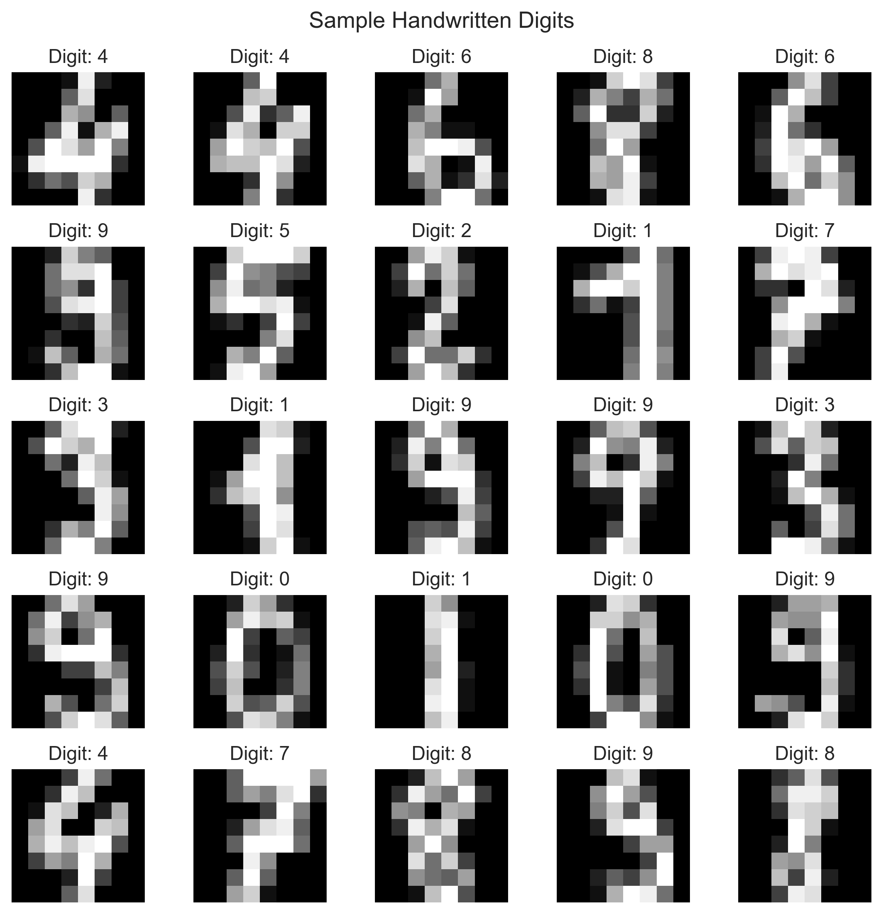
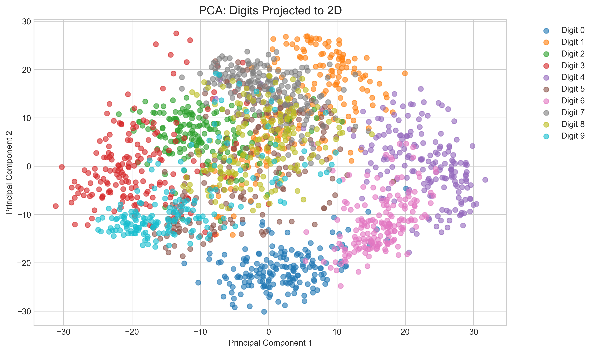
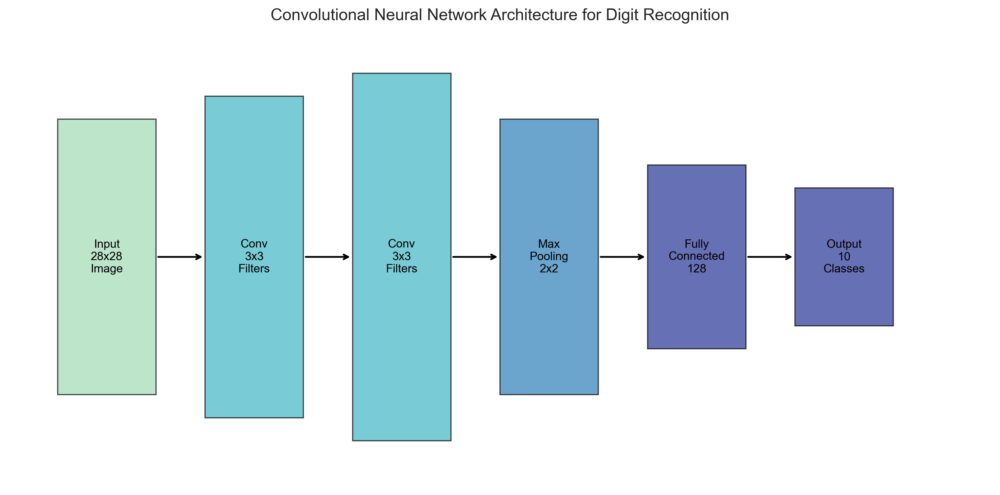
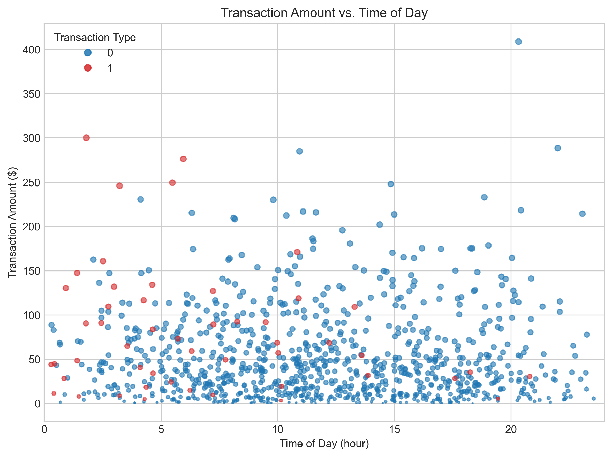
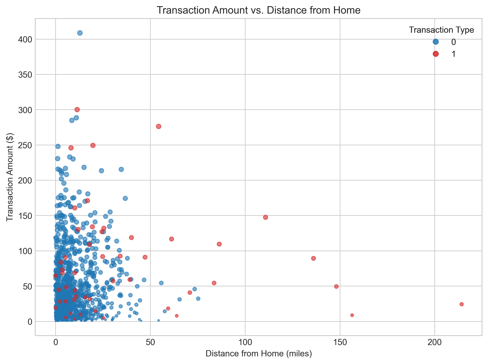
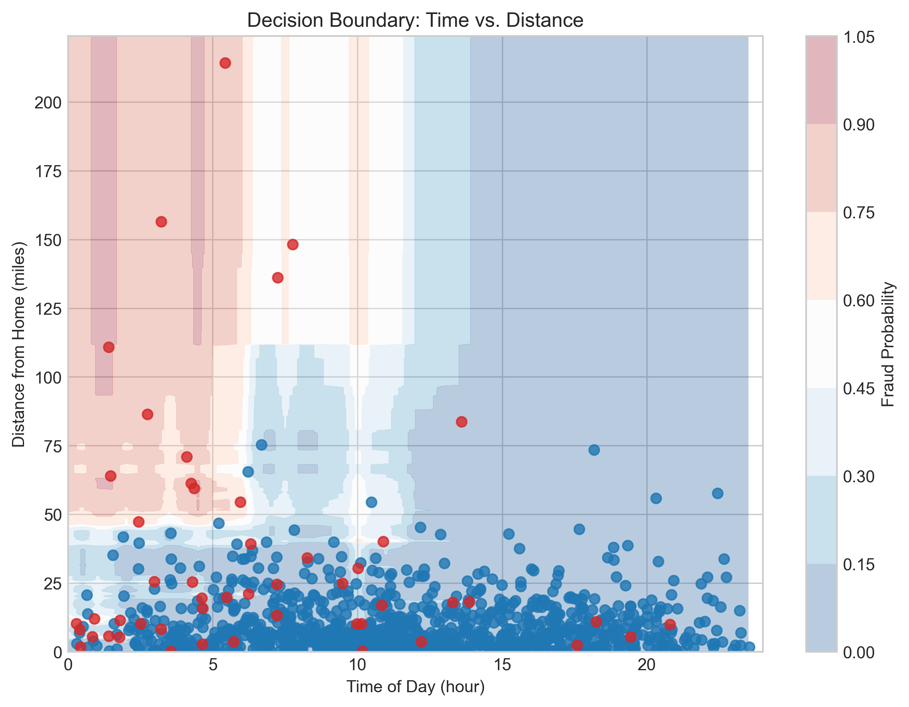
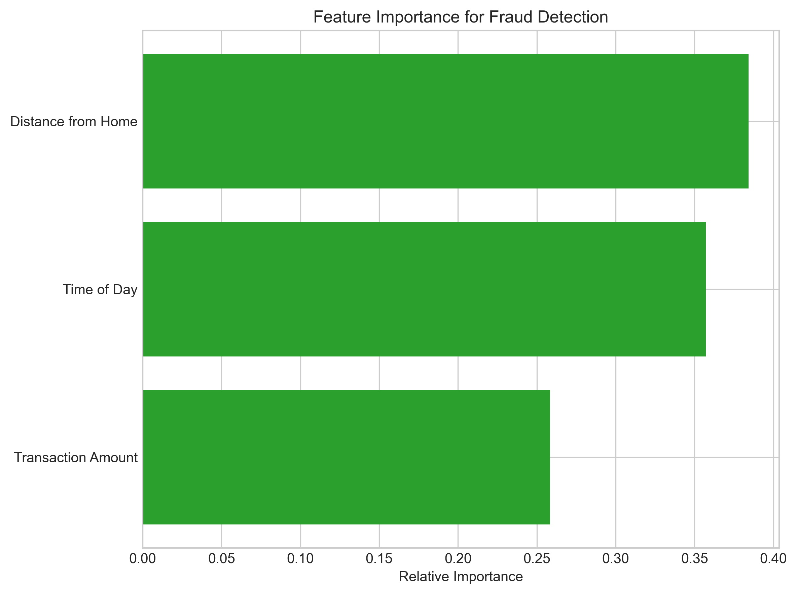
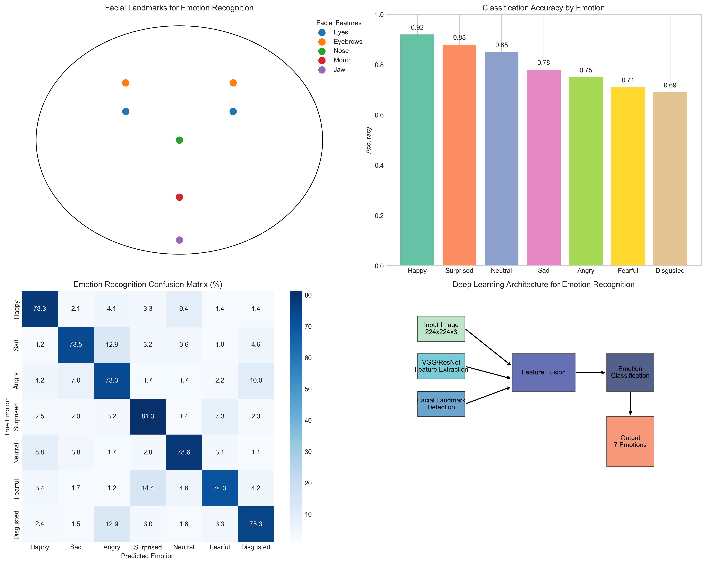
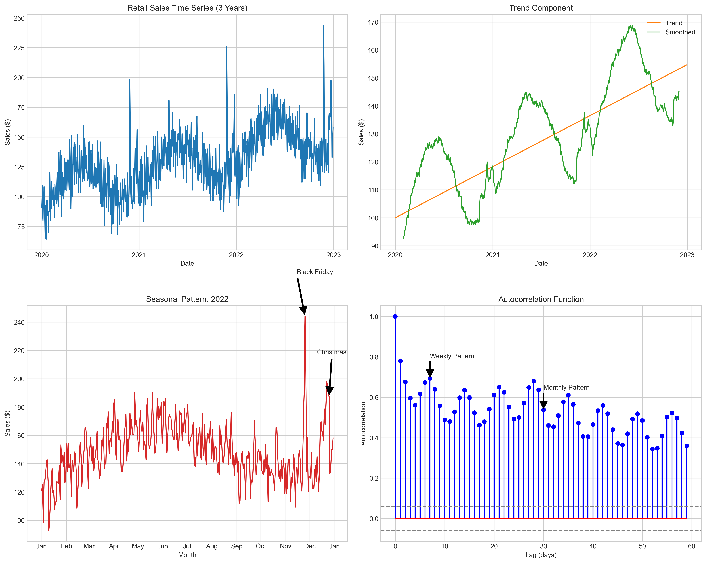

# Question 3: Pattern Recognition Approaches

## Problem Statement
Pattern recognition is a fundamental aspect of machine learning. For each of the following patterns, describe how you would approach recognizing them using machine learning techniques.

## Tasks
1. Identifying handwritten digits (0-9)
2. Detecting fraudulent credit card transactions
3. Recognizing emotions in facial expressions
4. Identifying seasonal patterns in retail sales data

## Solutions

### Task 1: Identifying Handwritten Digits (0-9)

**Problem Type: Image Classification (Multi-class)**

Handwritten digit recognition is a classic pattern recognition problem where the goal is to identify which digit (0-9) is represented in a given image.

**Key Challenges:**
- Variations in handwriting styles across different individuals
- Different stroke widths, orientations, and proportions
- Noise and image quality issues
- Need for invariance to small distortions and translations

**Approach:**
1. **Preprocessing:**
   - Normalize image size (e.g., 28×28 pixels)
   - Center the digit within the image
   - Apply noise reduction if necessary
   - Perform contrast enhancement to emphasize the digit

2. **Feature Engineering Options:**
   - Raw pixel values as features
   - Edge detection features to capture stroke patterns
   - HOG (Histogram of Oriented Gradients) to capture shape information
   - Dimensionality reduction techniques (PCA) to extract key patterns

3. **Suitable Algorithms:**
   - **Convolutional Neural Networks (CNNs):** The state-of-the-art approach due to their ability to learn hierarchical spatial features automatically
   - **Support Vector Machines (SVMs):** Can perform well with properly engineered features
   - **K-Nearest Neighbors (KNN):** Simple but effective for this task when the training set is representative

4. **Implementation Strategy:**
   - Use a CNN architecture with multiple convolutional layers to extract features
   - Apply pooling layers to reduce dimensionality while maintaining spatial information
   - Use fully connected layers at the end for classification
   - Train with a large dataset of labeled digits (e.g., MNIST)
   - Apply data augmentation (rotations, small distortions) to improve robustness

**Applications:** This approach is used in OCR (Optical Character Recognition) systems, automated mail sorting, form processing, and check reading systems.

### Task 2: Detecting Fraudulent Credit Card Transactions

**Problem Type: Binary Classification with Class Imbalance**

Fraud detection involves identifying unauthorized or suspicious transactions in a sea of legitimate ones, making it both a classification problem and an anomaly detection challenge.

**Key Challenges:**
- Highly imbalanced data (fraud typically <1% of transactions)
- Need for real-time detection with low latency
- Evolving fraud patterns as fraudsters adapt
- High cost of false positives (legitimate transactions declined) and false negatives (fraud missed)
- Limited labeled data for new fraud patterns

**Approach:**
1. **Feature Engineering:**
   - Transaction attributes: amount, time, location, merchant category
   - Customer historical behavior: average spending, typical merchants
   - Velocity features: rate of transactions in a given time window
   - Derived features: deviation from normal spending patterns
   - Network features: connections between cards, merchants, and devices

2. **Handling Class Imbalance:**
   - SMOTE (Synthetic Minority Over-sampling Technique) to create synthetic fraud examples
   - Class weighting to penalize misclassification of the minority class more heavily
   - Anomaly detection approaches that don't require balanced classes
   - Ensemble methods with different sampling strategies

3. **Suitable Algorithms:**
   - **Gradient Boosting (XGBoost, LightGBM):** Perform well with tabular data and can handle class imbalance
   - **Random Forests:** Good for capturing complex relationships and less prone to overfitting
   - **Isolation Forests and One-Class SVM:** For anomaly detection
   - **Deep Learning with Attention:** For capturing sequential patterns in transaction history

4. **Implementation Strategy:**
   - Real-time scoring system with quick inference capabilities
   - Multi-stage approach: rules + machine learning
   - Active learning to rapidly incorporate feedback on false positives/negatives
   - Regular model retraining to adapt to evolving fraud patterns

**Applications:** This approach is used in payment processing systems, online purchases, insurance claim fraud detection, and anti-money laundering monitoring.

### Task 3: Recognizing Emotions in Facial Expressions

**Problem Type: Image Classification (Multi-class)**

Emotion recognition involves analyzing facial expressions to infer emotional states such as happiness, sadness, anger, surprise, etc.

**Key Challenges:**
- Subtle differences between certain expressions (e.g., fear vs. surprise)
- Variations in lighting, pose, occlusions
- Cultural differences in how emotions are expressed
- Ambiguity and mixed emotions
- Individual differences in expression intensity

**Approach:**
1. **Preprocessing:**
   - Face detection and alignment
   - Normalization for lighting conditions
   - Standardization of face size and orientation

2. **Feature Engineering:**
   - Facial landmarks (positions of eyes, eyebrows, nose, mouth, etc.)
   - Action Units based on FACS (Facial Action Coding System)
   - Texture features (LBP, HOG) to capture skin texture changes
   - Deep features from pre-trained networks (transfer learning)

3. **Suitable Algorithms:**
   - **Deep Convolutional Neural Networks (CNNs):** To learn hierarchical features from raw images
   - **Transfer Learning:** Using pre-trained models like VGG, ResNet with fine-tuning
   - **Ensemble Methods:** Combining multiple models for better robustness
   - **Sequence Models (LSTM, GRU):** For analyzing emotions in video sequences

4. **Implementation Strategy:**
   - Multi-stage approach: face detection → landmark detection → emotion classification
   - Fusion of different feature types for better accuracy
   - Cross-cultural training data to ensure broader applicability
   - Temporal smoothing for video-based emotion recognition

**Applications:** This approach is used in human-computer interaction, market research, educational technology, mental health monitoring, and audience reaction measurement.

### Task 4: Identifying Seasonal Patterns in Retail Sales Data

**Problem Type: Time Series Analysis and Pattern Recognition**

Seasonal pattern analysis involves identifying recurring patterns in retail sales data at different time scales (daily, weekly, monthly, yearly) to improve forecasting and planning.

**Key Challenges:**
- Distinguishing seasonal patterns from trends and random noise
- Multiple overlapping seasonal patterns at different scales
- Impact of holidays, promotions, and external factors
- Evolving seasonal patterns over time
- Handling irregular events that disrupt normal patterns

**Approach:**
1. **Data Preprocessing:**
   - Aggregation to appropriate time scales
   - Handling missing values and outliers
   - Normalizing data to account for overall growth trends
   - Feature creation for calendar effects (holidays, weekdays/weekends)

2. **Analysis Techniques:**
   - Seasonal decomposition to separate trend, seasonal, and residual components
   - Autocorrelation analysis to identify significant lags
   - Frequency domain analysis (spectral analysis, wavelets)
   - Anomaly detection to identify unusual sales periods

3. **Suitable Algorithms:**
   - **Seasonal ARIMA (SARIMA):** For modeling time series with explicit seasonal components
   - **Fourier Analysis:** To extract cyclical patterns of different frequencies
   - **Prophet (Facebook's forecasting library):** Designed specifically for business time series
   - **Recurrent Neural Networks (LSTM, GRU):** For capturing complex patterns without explicit specification

4. **Implementation Strategy:**
   - Multi-scale approach to capture patterns at different time granularities
   - Separate modeling of baseline, trend, seasonal components, and special events
   - Ensemble forecasting combining multiple methods
   - Incorporation of external features (weather, promotions, economic indicators)

**Applications:** This approach is used in demand forecasting, inventory management, staff scheduling, marketing campaign planning, and financial planning for retail businesses.

## Summary

Pattern recognition approaches vary significantly based on the type of data and the specific pattern being sought:

1. **Handwritten Digit Recognition** uses image classification techniques with CNNs to identify digits from raw pixel data, leveraging hierarchical spatial features.

2. **Fraud Detection** combines anomaly detection with classification, handling highly imbalanced data to identify rare but costly fraudulent transactions.

3. **Emotion Recognition** applies computer vision techniques with domain knowledge from psychology, using facial landmarks and deep learning to recognize emotional expressions.

4. **Seasonal Pattern Analysis** applies time series methods to decompose retail data into trend, seasonal, and irregular components, identifying patterns at multiple time scales.

What unifies these diverse approaches is the fundamental goal of extracting meaningful patterns from noisy data, and the need to develop custom solutions tailored to the specific characteristics of each problem domain.