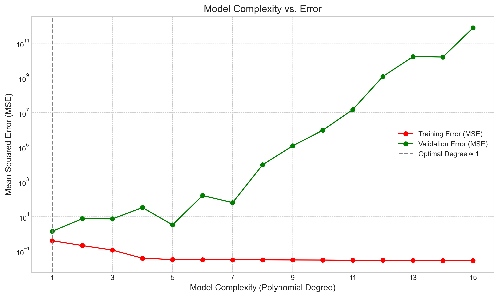
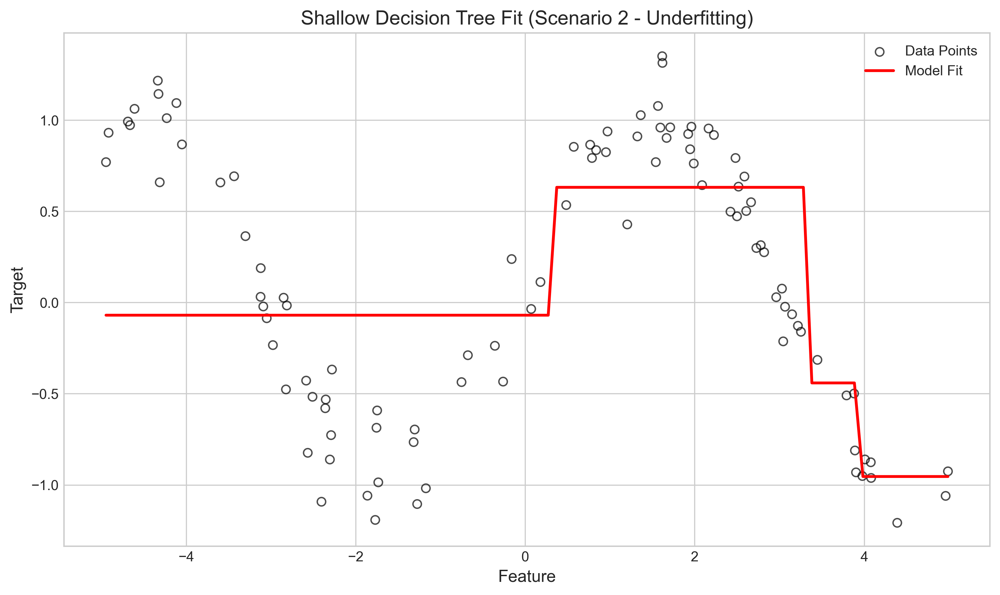
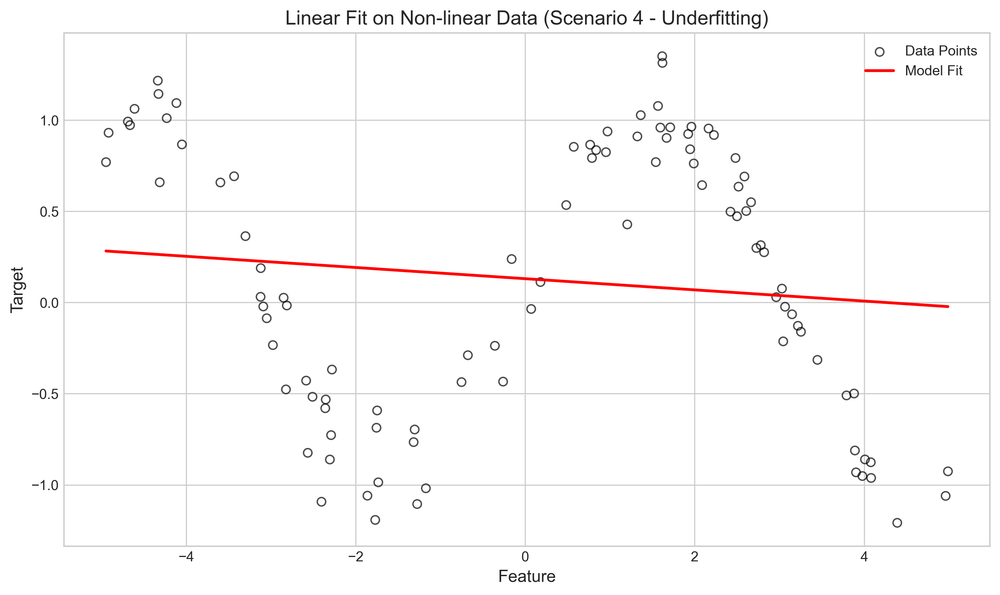
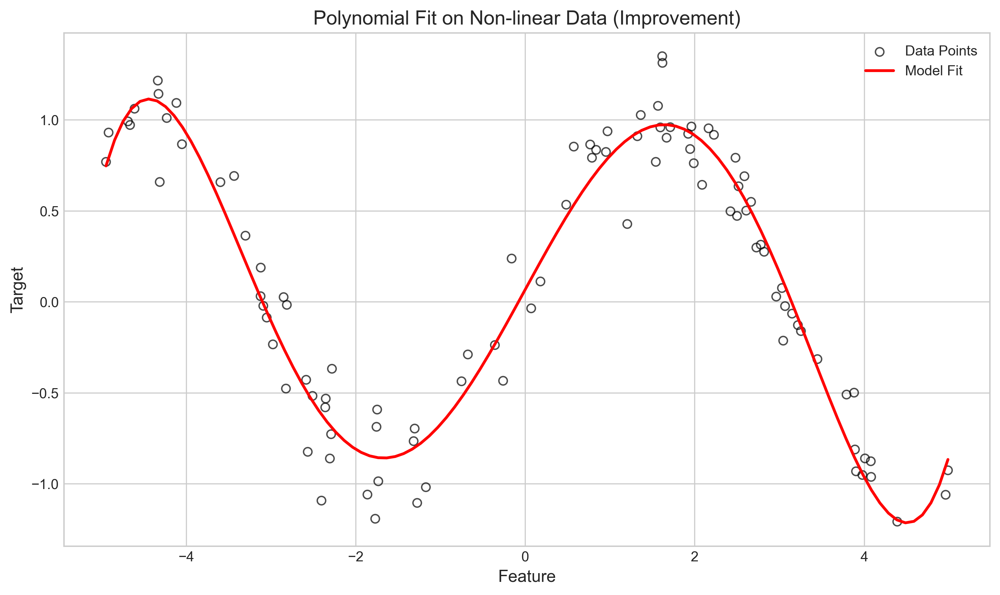
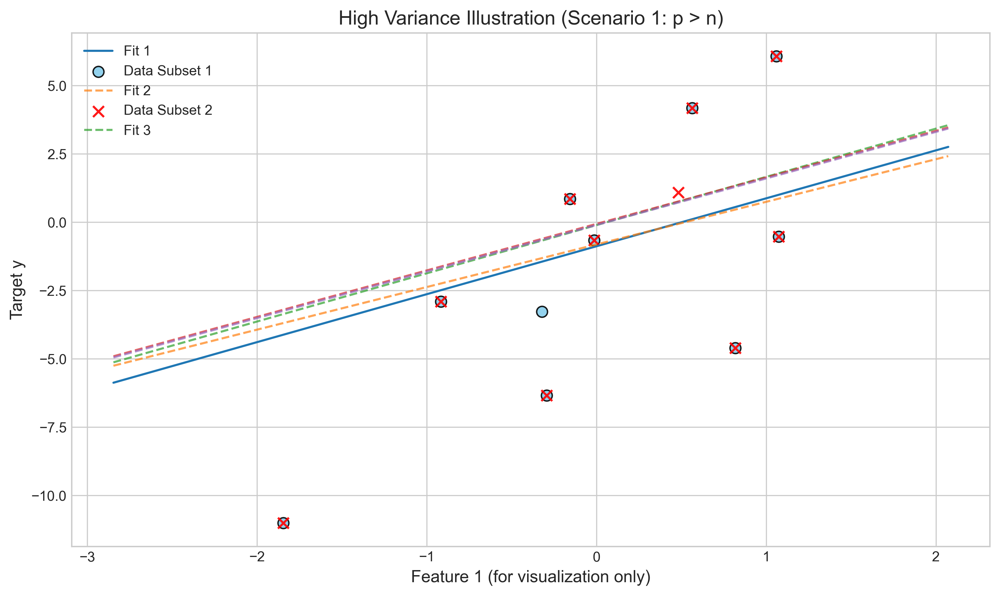
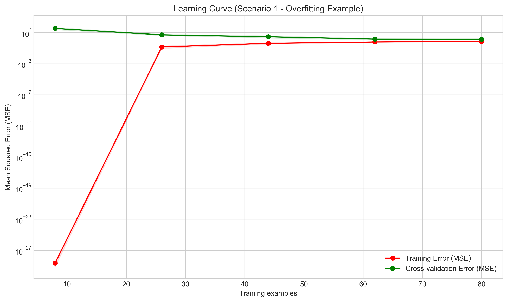
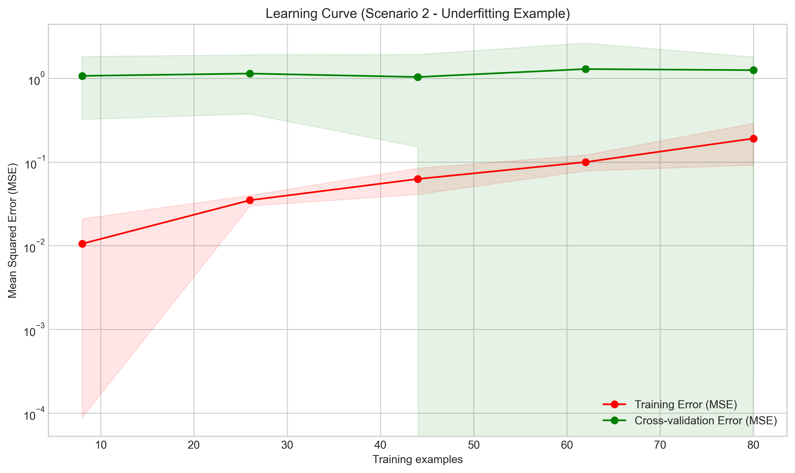
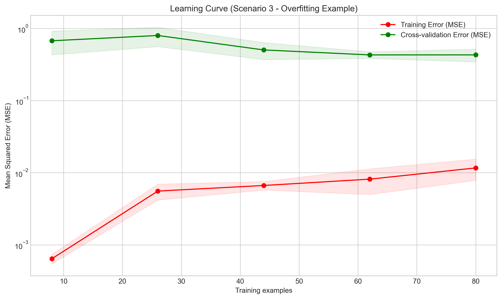
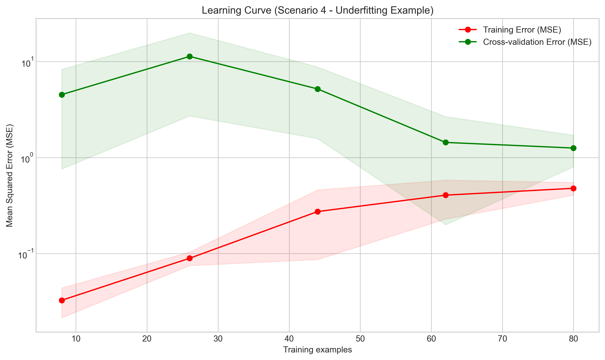

# Question 1: Underfitting vs Overfitting Scenarios

## Problem Statement
Consider the following learning scenarios:

1. A linear regression model used to predict housing prices based on 20 features, trained on 10 data points.
2. A decision tree with maximum depth of 2 used to classify emails as spam or not spam.
3. A neural network with 5 hidden layers and 1000 neurons per layer used to predict stock prices based on 100 data points.
4. A polynomial regression of degree 1 (i.e., linear) used to model a clearly non-linear relationship.

### Task
For each scenario:
1. Identify whether it is more likely to suffer from underfitting or overfitting
2. Explain the reasoning behind your classification
3. Suggest approaches to improve the model's performance

## Understanding the Problem

This question explores two fundamental challenges in machine learning: underfitting and overfitting. These concepts are crucial for:
- Diagnosing model performance issues
- Selecting appropriate model complexity
- Developing effective improvement strategies

### Key Concepts

#### Underfitting (High Bias)
- Definition: Model is too simple to capture data patterns
- Characteristics:
  - Poor performance on training data
  - Poor performance on validation/test data
  - Strong or incorrect model assumptions
- Symptom: High error on both training and validation sets

#### Overfitting (High Variance)
- Definition: Model is too complex relative to data
- Characteristics:
  - Excellent performance on training data
  - Poor performance on validation/test data
  - High sensitivity to training examples
- Symptom: Low training error, high validation error

The ultimate goal is finding the optimal model complexity that balances these extremes for best generalization performance.

## Solution

We will analyze each scenario by considering the model complexity relative to the data characteristics (number of samples $n$, number of features $p$, underlying patterns). The Python script `L1_3_1_underfitting_overfitting.py` simulates these scenarios to provide concrete examples and visualizations.

### Step 1: Analyze Scenario 1 (Linear Regression, $p=20, n=10$)

-   **Analysis:** This situation, where the number of features ($p=20$) exceeds the number of samples ($n=10$), is a classic setup for **Overfitting (High Variance)**.
-   **Reasoning:** A linear model has $p+1$ parameters (coefficients + intercept). With more parameters than data points ($p+1 > n$), the model has enough flexibility to find coefficients that perfectly fit the 10 training data points, essentially memorizing them, including any noise. The simulation confirms a perfect training R² of 1.0.
-   **Improvement Strategies:** Increase $n$ or decrease the effective number of features/parameters.
    -   Get More Data (increase $n$).
    -   Use Regularization (L1/Lasso or L2/Ridge) to penalize large coefficients, effectively reducing model complexity.
    -   Perform Feature Selection to reduce $p$.
    -   Use Dimensionality Reduction (e.g., PCA) to create fewer, combined features.

### Step 2: Analyze Scenario 2 (Shallow Decision Tree, max_depth=2)

-   **Analysis:** Using a very simple model (a decision tree limited to only two levels of splits) for a potentially complex task (like classifying spam emails, which often involves non-linear feature interactions) is likely to lead to **Underfitting (High Bias)**.
-   **Reasoning:** The model lacks the capacity (complexity) to capture the potentially intricate patterns or decision boundaries in the data. Its representational power is too limited. The simulation using a shallow tree on non-linear data confirms this, showing a poor fit and low R² score even on the training data.
-   **Improvement Strategies:** Increase model complexity or improve features.
    -   Increase `max_depth` of the tree.
    -   Use a more complex model (e.g., Random Forest, Gradient Boosting, SVM with non-linear kernel, Neural Network).
    -   Engineer more informative features that might be separable by a simpler model.

### Step 3: Analyze Scenario 3 (Complex Neural Network, $n=100$)

-   **Analysis:** Applying an extremely complex model (5 hidden layers, 1000 neurons each means a vast number of parameters) to a small dataset ($n=100$ samples) is highly likely to cause **Overfitting (High Variance)**.
-   **Reasoning:** The model has far too much capacity (too many parameters) relative to the amount of information in the data. It can easily memorize the 100 data points, fitting noise perfectly, as shown by the near-perfect training R² in the simulation.
-   **Improvement Strategies:** Reduce effective complexity or increase data.
    -   Get More Data (increase $n$).
    -   Simplify the Network (fewer layers/neurons).
    -   Apply Regularization (L1/L2 weight decay, Dropout).
    -   Use Early Stopping (monitor validation error during training and stop when it starts increasing).
    -   Use Data Augmentation (if applicable, e.g., for image data).

### Step 4: Analyze Scenario 4 (Linear Regression for Non-linear Data)

-   **Analysis:** Using a fundamentally linear model (polynomial degree 1) to represent data with a clear non-linear pattern (like the simulated sine wave) results in **Underfitting (High Bias)**.
-   **Reasoning:** The model's core assumption of linearity is incorrect for the data-generating process. It cannot capture the curve, leading to high error even on the training data. The simulation shows a very poor fit and R² close to zero.
-   **Improvement Strategies:** Use a model capable of capturing non-linearity.
    -   Use Polynomial Features with Linear Regression (effectively making it Polynomial Regression).
    -   Switch to inherently non-linear models (Decision Trees, SVM with RBF kernel, Neural Networks).
    -   Apply non-linear basis expansion or feature transformations.

## Visual Explanations

The script generated several plots to illustrate these concepts:

### Underfitting vs. Overfitting vs. Complexity

*Figure 1: Model Complexity vs. Error. This plot uses polynomial regression on the non-linear (sine wave) data from Scenarios 2 & 4. Low complexity (e.g., degree 1, like Scenario 4) results in high training and validation error (underfitting/high bias). As complexity increases, training error decreases. Validation error initially decreases but then increases as the model starts fitting noise (overfitting/high variance). The optimal complexity minimizes validation error (around degree 4-5 here).* 

### Underfitting Examples

*Figure 2: Scenario 2 (Underfitting). A shallow decision tree (max_depth=2) fails to capture the non-linear trend in the data.* 

*Figure 3: Scenario 4 (Underfitting). A simple linear model (degree 1) attempting to fit non-linear sine wave data. The model clearly fails to capture the pattern.* 

### Addressing Underfitting (Scenario 4 Improvement)

*Figure 4: Using a more complex model (degree 5 polynomial) allows capturing the non-linear trend from Figure 3 much better, reducing bias.* 

### Overfitting Example (High Variance)

*Figure 5: Scenario 1 (Overfitting/High Variance). Multiple linear regression fits (using 20 features) on slightly different small data subsets (n=10 samples each). The dramatic changes in the fitted lines (plotted against only the first feature for visualization) illustrate high variance – the model is highly sensitive to the specific training data when $p > n$.* 

### Learning Curves
Learning curves plot model error (e.g., MSE) on training and validation sets as a function of the number of training samples.

*Figure 6: Learning Curve for Overfitting (Scenario 1 type). Training error stays low. Validation error is high and may decrease very slowly with more data. The large gap between the curves indicates high variance.* 

*Figure 7: Learning Curve for Underfitting (Scenario 2/4 type). Both training and validation errors are high and converge relatively quickly. Adding more data doesn't help much because the model is fundamentally too simple (high bias).* 

*Figure 8: Learning Curve for Overfitting (Scenario 3 type - complex model). Similar to Figure 6, shows a large gap between low training error and high validation error, indicating high variance.* 

*Figure 9: Learning Curve for Underfitting (Scenario 4 type - linear model on non-linear data). Both training and validation errors remain high and converge quickly, indicating the model's inability to capture the underlying non-linear pattern (high bias).*

## Key Insights

-   **Bias-Variance Tradeoff:** Model selection involves finding a sweet spot between bias (underfitting) and variance (overfitting). Simple models often have high bias/low variance; complex models often have low bias/high variance.
-   **Complexity is Relative:** Whether a model is "too simple" or "too complex" depends on the data size ($n$), dimensionality ($p$), and the true underlying pattern.
-   **Diagnosis Tools:** Comparing training vs. validation/test performance is crucial. Learning curves and complexity-error curves (like Fig 1) help visualize these tradeoffs.
-   **Mitigation Strategies:** Addressing underfitting usually requires increasing model complexity or improving features. Addressing overfitting usually involves decreasing effective complexity (simplification, regularization) or obtaining more data.

## Conclusion

We analyzed four scenarios illustrating underfitting and overfitting:
-   Scenario 1 ($p > n$): **Overfitting** (High Variance)
-   Scenario 2 (Simple Model, Complex Task): **Underfitting** (High Bias)
-   Scenario 3 (Complex Model, Few Samples): **Overfitting** (High Variance)
-   Scenario 4 (Linear Model, Non-linear Data): **Underfitting** (High Bias)

Recognizing these patterns and applying appropriate corrective strategies (adjusting model complexity, using regularization, acquiring more data) is fundamental to building effective machine learning models that generalize well to unseen data. The relationship between training error, validation error, model complexity, and data size provides the foundation for diagnosing and improving model performance.