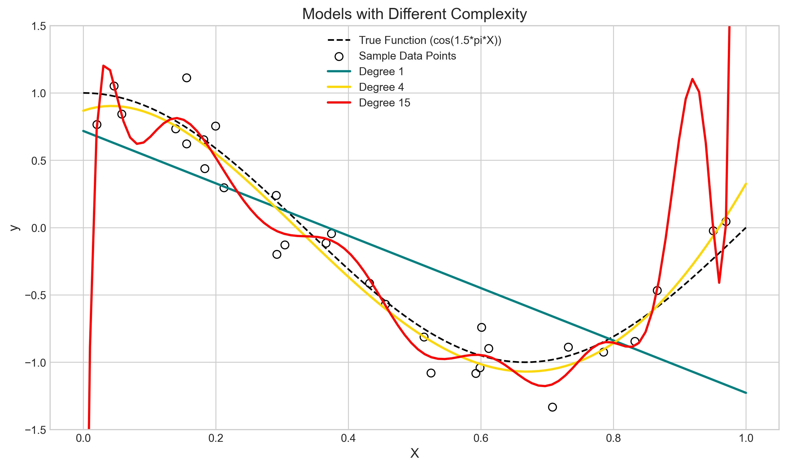
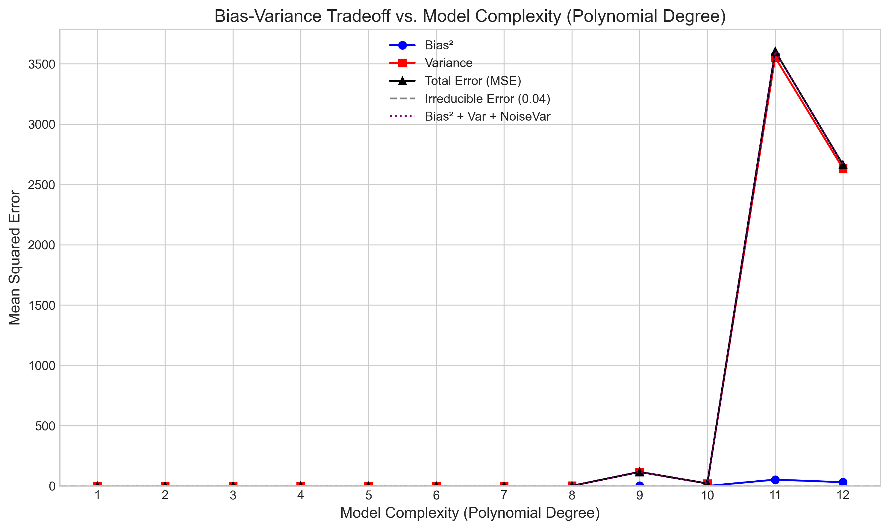

# Question 2: Bias-Variance Tradeoff

## Problem Statement
The bias-variance tradeoff is a fundamental concept in machine learning that describes a key challenge in model building. It represents the balance between a model's ability to capture underlying patterns (bias) and its sensitivity to variations in training data (variance).

### Task
1.  Define bias and variance in the context of machine learning models.
2.  Explain how the bias-variance tradeoff relates to model complexity.
3.  Describe how increasing model complexity typically affects bias and variance.
4.  Classify the following models based on their typical bias/variance characteristics:
    a.  Linear regression
    b.  Decision tree with no maximum depth
    c.  k-nearest neighbors with k=1
    d.  Support vector machine with a linear kernel

## Understanding the Problem
When building a predictive model, our goal is to minimize the error on unseen data (test error). The bias-variance decomposition provides insight into the sources of this error, breaking it down into three components:

-   **Bias:** Error from incorrect assumptions in the learning algorithm. High bias implies the model is too simple and fails to capture the true underlying patterns (underfitting).
-   **Variance:** Error from sensitivity to small fluctuations in the training set. High variance implies the model is too complex and fits the noise in the training data (overfitting).
-   **Irreducible Error:** Noise inherent in the problem itself (e.g., measurement noise, unmodeled factors), which cannot be reduced by any model.

## Solution

The expected test Mean Squared Error (MSE) for a given test point $x_0$ and its true value $y_0 = f(x_0) + \epsilon$ (where $\epsilon$ is noise with mean 0 and variance $\sigma^2_{\epsilon}$) can be decomposed as:

$$ E[(y_0 - \hat{f}(x_0))^2] = \underbrace{(E[\hat{f}(x_0)] - f(x_0))^2}_{\text{Bias}^2[\hat{f}(x_0)]} + \underbrace{E[(\hat{f}(x_0) - E[\hat{f}(x_0)])^2]}_{\text{Variance}[\hat{f}(x_0)]} + \underbrace{\sigma^2_{\epsilon}}_{\text{Irreducible Error}} $$

Where:
-   $\hat{f}(x_0)$ is the model's prediction at $x_0$
-   $E[\cdot]$ denotes the expectation over different possible training datasets
-   $f(x_0)$ is the true underlying function
-   $\text{Bias}^2[\hat{f}(x_0)]$ is the squared difference between average prediction and true function
-   $\text{Variance}[\hat{f}(x_0)]$ is the expected squared deviation of predictions

### Step 1: Formal Definitions

-   **Bias:** Formally, $\text{Bias}[\hat{f}(x_0)] = E[\hat{f}(x_0)] - f(x_0)$
    - Measures how much the *average prediction* differs from the *true value*
    - High bias indicates overly simplistic assumptions leading to underfitting

-   **Variance:** Formally, $\text{Variance}[\hat{f}(x_0)] = E[(\hat{f}(x_0) - E[\hat{f}(x_0)])^2]$
    - Measures prediction sensitivity to training data variations
    - High variance indicates excessive sensitivity leading to overfitting

### Step 2: Model Complexity Analysis

**Simple Models (Low Complexity):**
-   Examples: linear regression, shallow decision trees
-   Characteristics:
    -   High bias: strong assumptions may not match complex data
    -   Low variance: stable predictions across different training sets

**Complex Models (High Complexity):**
-   Examples: deep decision trees, complex neural networks
-   Characteristics:
    -   Low bias: can capture intricate patterns
    -   High variance: sensitive to training data variations

### Step 3: Complexity Effects

As model complexity increases:
-   **Bias²:** Tends to decrease (better pattern capture)
-   **Variance:** Tends to increase (more sensitivity)
-   **Total Error:** U-shaped curve
    -   Initially decreases (bias reduction dominates)
    -   Eventually increases (variance increase dominates)

### Step 4: Model Classification

a.  **Linear Regression:**
    -   High Bias: Assumes linearity
    -   Low Variance: Stable across datasets

b.  **Decision Tree (no depth limit):**
    -   Low Bias: Can fit any pattern
    -   High Variance: Extremely sensitive to data

c.  **k-Nearest Neighbors (k=1):**
    -   Low Bias: Captures local structure
    -   Very High Variance: Extremely noise-sensitive

d.  **Support Vector Machine (Linear Kernel):**
    -   High Bias: Assumes linear separability
    -   Low Variance: Stable decision boundary

## Practical Implementation

The script `L1_3_2_bias_variance.py` simulates the tradeoff:

1.  **Setup:**
    -   True Function: $f(x) = \cos(1.5 \pi x)$
    -   Noise: $\sigma^2_{\epsilon} = 0.2^2 = 0.04$

2.  **Process:**
    -   Generate multiple training sets
    -   Train polynomial models (degrees 1-12)
    -   Compute bias and variance metrics

3.  **Analysis:**
    -   Calculate average predictions
    -   Estimate Bias², Variance, Total MSE
    -   Visualize complexity effects

## Visual Explanations

### Model Complexity Effects

*Figure 1: Example fits showing underfitting (degree 1, teal), good fit (degree 4, gold), and overfitting (degree 15, red).*

### Tradeoff Visualization

*Figure 2: Bias² (blue) decreases while Variance (red) increases with complexity. Total Error (black) minimizes at intermediate complexity.*

## Key Insights

### Theoretical Understanding
-   Error decomposition: Bias² + Variance + Irreducible Error
-   Complexity management is crucial for generalization
-   Optimal complexity balances bias and variance

### Practical Applications
-   Model selection based on bias-variance profiles
-   Hyperparameter tuning strategies
-   Cross-validation importance

### Common Pitfalls
-   Overfitting: excessive variance
-   Underfitting: excessive bias
-   Ignoring noise level in data

## Conclusion

The bias-variance tradeoff fundamentally shapes machine learning model performance:
-   Balances model simplicity against flexibility
-   Guides model selection and tuning
-   Provides framework for understanding generalization

Understanding this tradeoff enables better:
-   Model selection decisions
-   Hyperparameter optimization
-   Performance improvement strategies