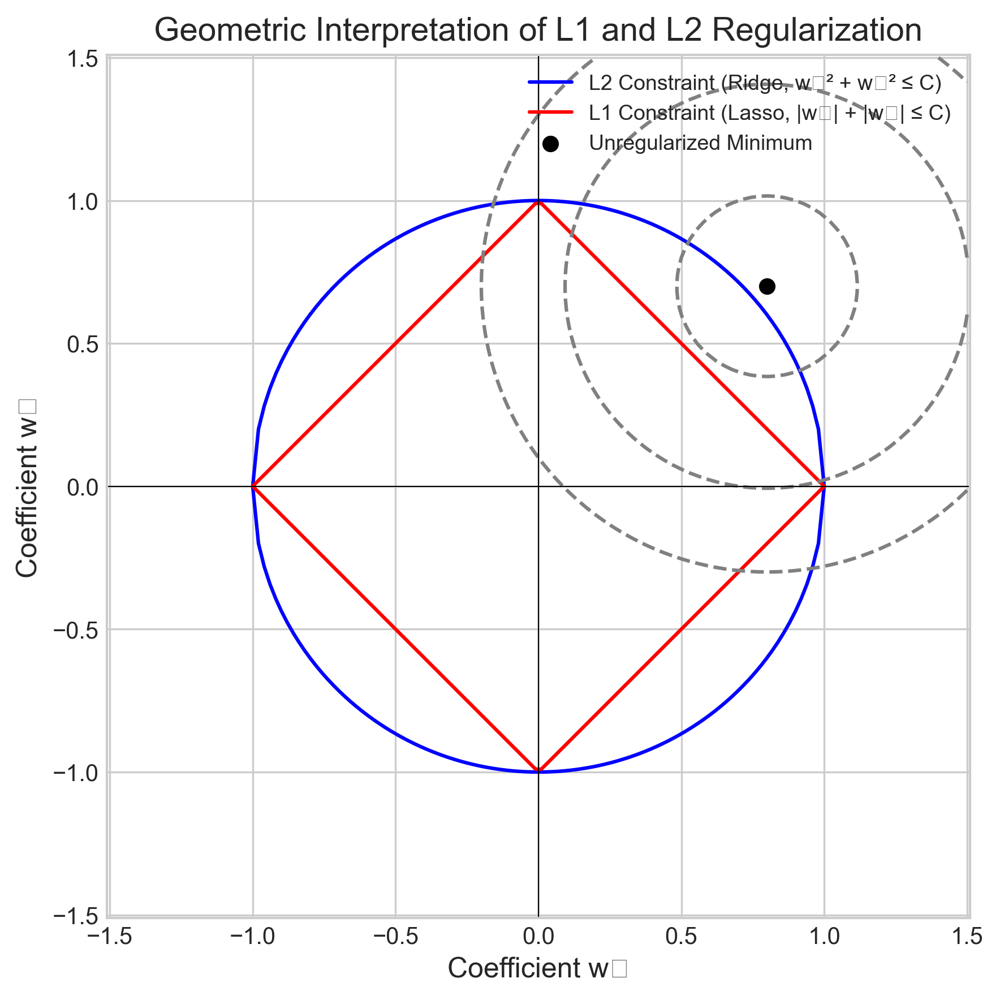
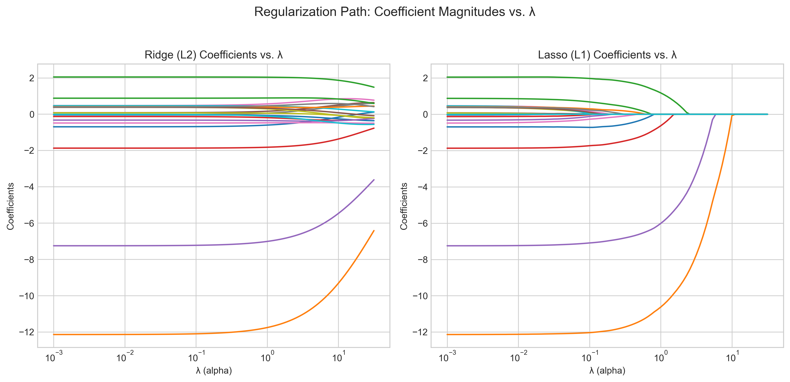
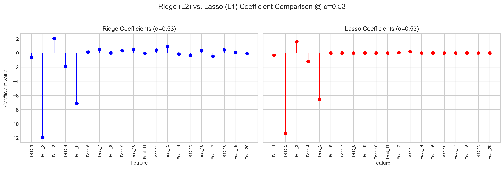
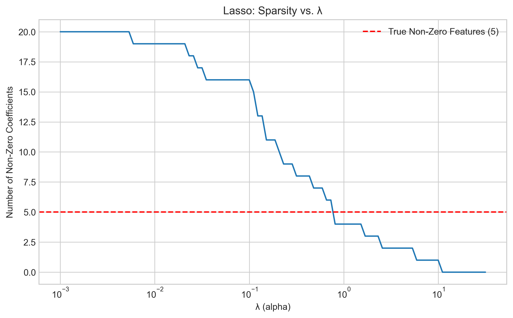
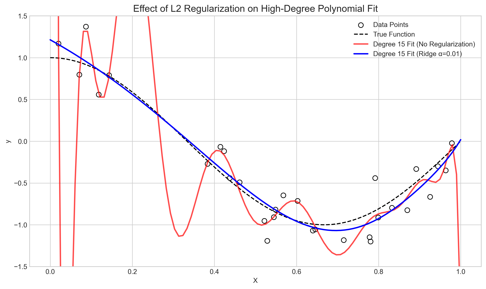

# Question 3: Regularization Techniques

## Problem Statement
Regularization is a key technique to prevent overfitting in machine learning models, especially complex ones that tend to have high variance.

### Task
1.  Explain the purpose of regularization in machine learning.
2.  Compare and contrast L1 (Lasso) and L2 (Ridge) regularization techniques.
3.  Describe how increasing the regularization parameter $\lambda$ (lambda) affects the model's complexity and performance.
4.  For a linear regression model with 100 features where many features are suspected to be irrelevant, would you recommend L1 or L2 regularization? Explain your reasoning.

## Understanding the Problem

Overfitting occurs when a model learns the training data too well, capturing noise and specific fluctuations rather than the underlying generalizable pattern. This leads to poor performance on new, unseen data. Regularization is a primary strategy to combat this.

It works by adding a penalty term to the model's objective function (the function being minimized during training, like Mean Squared Error). This penalty is based on the magnitude of the model parameters (e.g., coefficients $w_i$ in linear regression). By penalizing large parameter values, regularization discourages overly complex models and promotes models that generalize better.

## Solution

The core idea is to modify the standard loss function by adding a penalty term controlled by a hyperparameter $\lambda \ge 0$:

$$ \text{Regularized Loss} = \text{Empirical Loss (e.g., MSE)} + \lambda \times \text{Penalty}(\mathbf{w}) $$

Where $\mathbf{w}$ represents the vector of model coefficients. The strength parameter $\lambda$ controls the impact of the penalty: $\lambda=0$ means no regularization, and larger $\lambda$ means a stronger penalty, leading to simpler models.

The Python script `L1_3_3_regularization.py` provides explanations and visual demonstrations.

### Step 1: Purpose of Regularization

The main goals of regularization are:
-   **Prevent Overfitting:** Reduce model variance and improve generalization to unseen data.
-   **Control Model Complexity:** Penalize large parameter values, effectively limiting the model's capacity to fit noise.
-   **Handle Collinearity:** L2 regularization, in particular, can help stabilize solutions when input features are highly correlated.
-   **Perform Feature Selection (L1 only):** L1 regularization can shrink some coefficients exactly to zero, effectively selecting a subset of features.

### Step 2: L1 (Lasso) vs L2 (Ridge) Regularization

The two most common forms differ in their penalty term:

**L2 Regularization (Ridge Regression):**
-   **Penalty Term:** Uses the squared L2 norm of the coefficient vector: $\text{Penalty}(\mathbf{w}) = ||\mathbf{w}||_2^2 = \sum_{i} w_i^2$.
-   **Loss Function:** $MSE + \lambda \sum_{i} w_i^2$.
-   **Effect:** Shrinks coefficients towards zero. Larger coefficients are penalized more, but they rarely become *exactly* zero.
-   **Use Case:** Good when most features are expected to contribute somewhat; helps with multicollinearity.
-   **Geometric View:** Constrains the solution $\mathbf{w}$ to lie within a hypersphere ($||\mathbf{w}||_2^2 \le C$).

**L1 Regularization (Lasso Regression - Least Absolute Shrinkage and Selection Operator):**
-   **Penalty Term:** Uses the L1 norm of the coefficient vector: $\text{Penalty}(\mathbf{w}) = ||\mathbf{w}||_1 = \sum_{i} |w_i|$.
-   **Loss Function:** $MSE + \lambda \sum_{i} |w_i|$.
-   **Effect:** Also shrinks coefficients, but due to the geometry of the L1 norm, it tends to force some coefficients to become *exactly* zero.
-   **Use Case:** Effective for feature selection, especially in high-dimensional settings where many features might be irrelevant. Leads to *sparse* models.
-   **Geometric View:** Constrains the solution $\mathbf{w}$ to lie within a hyperdiamond ($||\mathbf{w}||_1 \le C$). The sharp corners promote solutions where some $w_i=0$.

### Step 3: Effect of Regularization Parameter (λ)

Increasing the regularization strength $\lambda$ has the following effects:
-   **Increases Penalty:** The regularization term has more influence on the total loss.
-   **Decreases Coefficient Magnitudes:** All coefficients are pushed closer to zero.
-   **Decreases Model Complexity:** The model becomes simpler, less flexible.
-   **Increases Sparsity (Lasso only):** More coefficients are likely to become exactly zero.
-   **Increases Bias:** The model might become too simple and fail to capture the true underlying pattern (underfitting).
-   **Decreases Variance:** The model becomes less sensitive to fluctuations in the training data (reduces overfitting).
-   **Impact on Test Performance:** Test error typically follows a U-shaped curve as $\lambda$ increases. An optimal $\lambda$ (found via techniques like cross-validation) minimizes test error by finding the best balance between bias and variance.

### Step 4: Recommendation for High-Dimensional Data with Irrelevant Features

**Scenario:** Linear regression model with 100 features, many suspected to be irrelevant.

**Recommendation:** **L1 (Lasso) Regularization.**

**Reasoning:**
-   **Feature Selection:** Lasso's primary advantage here is its ability to perform automatic feature selection by setting the coefficients of irrelevant or weakly relevant features to exactly zero.
-   **Sparsity:** This results in a sparse model, which is often more interpretable and computationally efficient, especially in high dimensions ($p=100$ in this case).
-   **Contrast with Ridge:** While Ridge (L2) also shrinks coefficients, it rarely sets them to exactly zero. It keeps all 100 features in the model, merely reducing the impact of less important ones. If many features are truly irrelevant, Lasso provides a cleaner solution by explicitly removing them.

## Visual Explanations

### Geometric Interpretation

*Figure 1: The L2 constraint region (blue circle) and L1 constraint region (red diamond) in 2D coefficient space ($w_1, w_2$). The gray ellipses are contours of the unregularized loss function (e.g., MSE), with the minimum at the black dot. The regularized solution occurs where the smallest loss contour touches the constraint boundary. The sharp corners of the L1 diamond make it likely that this contact point lies on an axis (e.g., $w_1=0$ or $w_2=0$), leading to sparsity.* 

### Regularization Paths

*Figure 2: Coefficient values for Ridge (L2, left) and Lasso (L1, right) as the regularization strength λ (alpha) increases (plotted on a log scale). For Ridge, coefficients shrink smoothly towards zero. For Lasso, coefficients also shrink, but many are forced to exactly zero as λ increases, demonstrating feature selection.* 

### Coefficient Comparison (Specific λ)

*Figure 3: Coefficients learned by Ridge (left) and Lasso (right) for the synthetic dataset (20 features, first 5 relevant) at a specific moderate λ value. Ridge retains all 20 coefficients with reduced magnitude. Lasso sets many coefficients (mostly irrelevant ones beyond Feature 5) exactly to zero, highlighting its sparsity-inducing property.* 

### Lasso Sparsity vs. λ

*Figure 4: Number of non-zero coefficients selected by Lasso as λ increases. Higher regularization strength leads to a sparser model (fewer features selected). The dashed red line indicates the true number of relevant features in the simulation (5).* 

### Effect of Regularization on Model Fit

*Figure 5: A high-degree polynomial (degree 15) fit to noisy data. Without regularization (red line), the model overfits wildly, exhibiting high variance. Adding even mild Ridge (L2) regularization (blue line, α=0.01) significantly dampens the oscillations and produces a much smoother, more generalizable fit, closer to the true underlying function (black dashed line).* 

## Key Insights

-   **Core Idea:** Regularization prevents overfitting by adding a penalty based on parameter magnitudes to the loss function.
-   **L1 vs. L2:** The key difference lies in the penalty norm: L1 ($||\mathbf{w}||_1$) induces sparsity (feature selection), while L2 ($||\mathbf{w}||_2^2$) provides smooth shrinkage.
-   **Sparsity:** Lasso's ability to zero out coefficients is its defining characteristic and makes it suitable for high-dimensional problems or when interpretability via feature selection is desired.
-   **Hyperparameter Tuning:** The regularization strength $\lambda$ is crucial. It controls the bias-variance tradeoff and must be tuned (e.g., via cross-validation) for optimal performance.
-   **Feature Scaling:** Regularization penalizes coefficients based on their magnitude. Therefore, it's generally essential to scale features (e.g., using `StandardScaler`) before applying Ridge or Lasso so that the penalty is applied fairly across features with different units or ranges.

## Conclusion

Regularization is a fundamental technique for building robust machine learning models that generalize well.
-   **L2 (Ridge):** Effective for general shrinkage and improving stability, especially with correlated features.
-   **L1 (Lasso):** Powerful for inducing sparsity and performing automatic feature selection, particularly useful in high-dimensional settings.

Choosing the right type of regularization (L1, L2, or sometimes Elastic Net which combines both) and carefully tuning the strength parameter $\lambda$ are critical steps in the model development process, directly impacting the final model's complexity, interpretability, and predictive performance. 