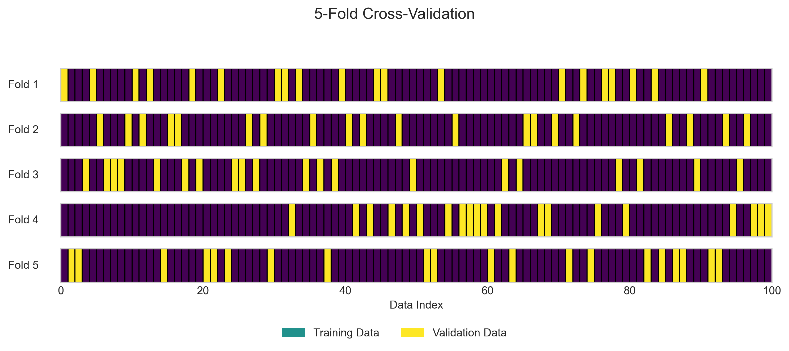
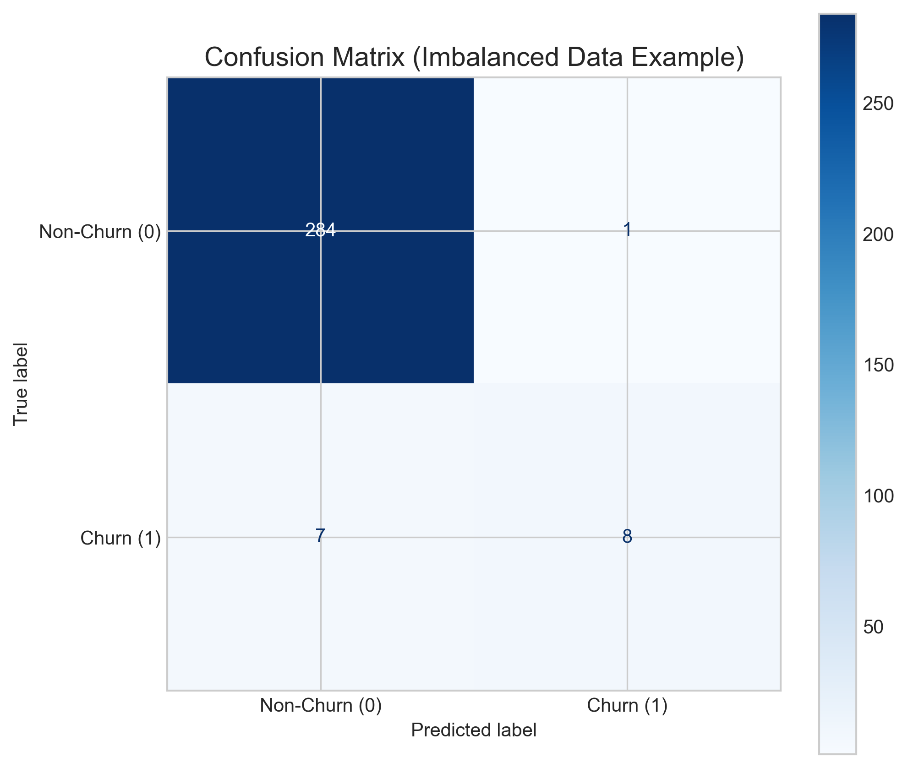
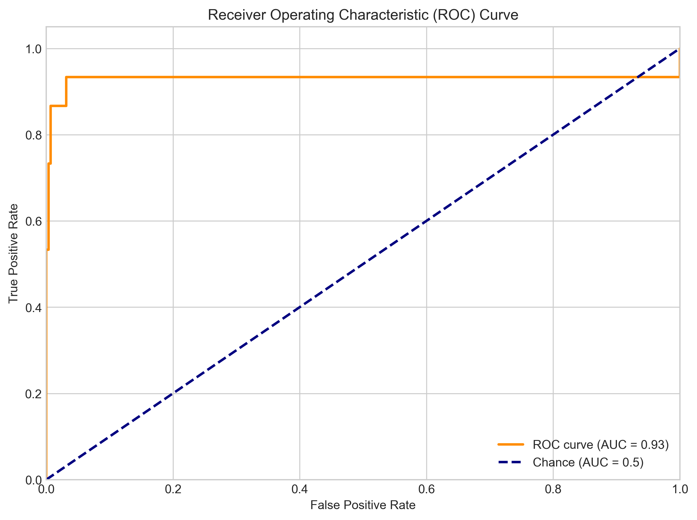
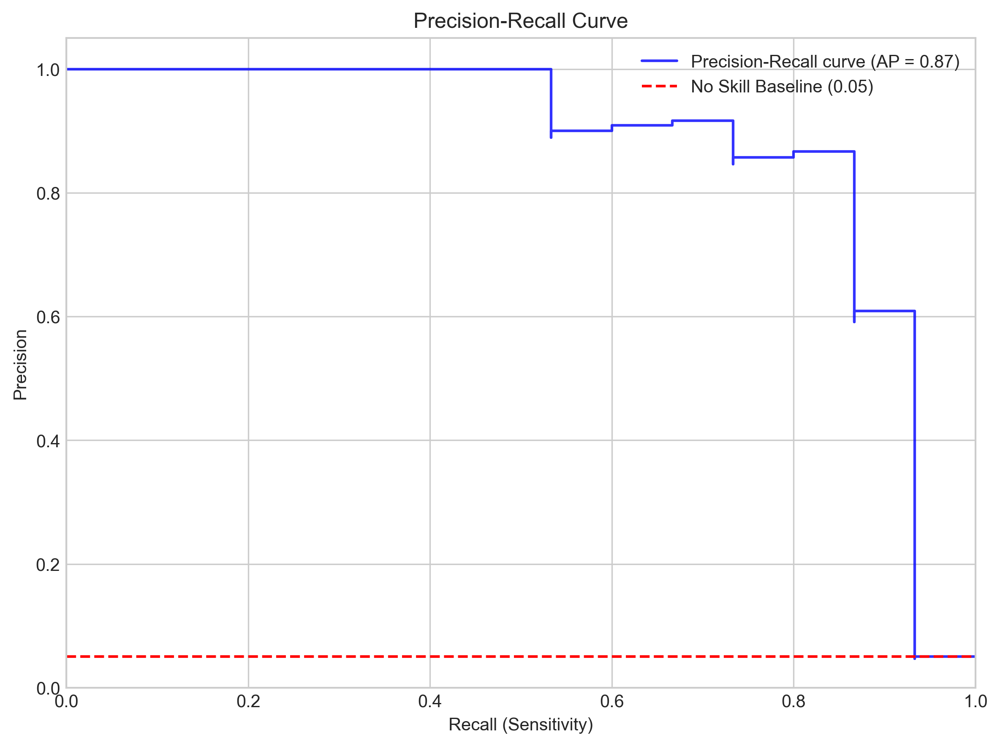
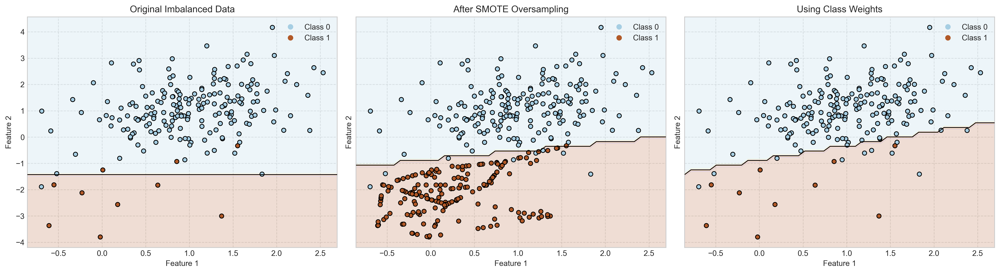

# Question 4: Model Validation and Evaluation

## Problem Statement
Consider a classification problem where you are trying to predict whether a customer will churn (leave) a subscription service. This question explores common practices and challenges in model validation and evaluation.

### Task
1.  Describe the purpose of splitting data into training, validation, and test sets.
2.  Explain k-fold cross-validation and its advantages over a single train-validation split.
3.  Analyze a scenario where training accuracy (95%) is much higher than test accuracy (75%). What is likely happening, and how can it be addressed?
4.  Discuss the challenges of evaluating models on imbalanced datasets (e.g., 5% churn rate) and techniques to handle this imbalance.

## Understanding the Problem
Building a reliable machine learning model requires more than just training it on data. We need robust methods to:
-   Tune model settings (hyperparameters) effectively
-   Estimate how well the model will perform on new, unseen data (generalization performance)
-   Diagnose potential problems like overfitting
-   Fairly evaluate performance, especially when data has unequal class distributions (class imbalance)

This question covers standard techniques like data splitting and cross-validation, interpreting performance discrepancies, and dealing with the common issue of class imbalance.

## Solution

### Step 1: Data Splitting: Train, Validation, Test Sets
To get a reliable estimate of generalization performance and tune hyperparameters without biasing the final evaluation, data is typically split into three distinct sets:

-   **Training Set:** Used to fit the model parameters (e.g., learn weights, find splits). The model learns patterns directly from this data. (Typical size: 60-80%)
-   **Validation (or Development) Set:** Used iteratively during model development to:
    -   Tune hyperparameters (e.g., model complexity like tree depth, learning rate, regularization strength $\lambda$)
    -   Perform model selection (e.g., choose between different algorithms or feature sets)
    -   Provide an unbiased estimate of performance on data *not seen during parameter fitting* to guide development
    (Typical size: 10-20%)
-   **Test Set:** Used *only once* at the very end, after all training and hyperparameter tuning (using the validation set) is complete. Its purpose is to provide a final, unbiased estimate of the chosen, tuned model's performance on completely unseen data.
    -   **Critical Rule:** Must *never* be used for training, hyperparameter tuning, or model selection.
    Re-using the test set makes it implicitly part of the development process, leading to overly optimistic performance estimates.
    (Typical size: 10-20%)

**Why three sets?** Using only train/test means hyperparameters might be overtuned to the specific test set, leading to an inflated sense of the model's real-world performance. The validation set acts as a proxy for unseen data during the *tuning phase*, preserving the test set for a truly final evaluation.

### Step 2: K-Fold Cross-Validation (CV)
K-Fold CV is a resampling technique that provides a more robust estimate of model performance and is particularly useful for hyperparameter tuning, especially when the dataset is not very large.

**Process (e.g., 5-Fold CV):**
1.  **Partition:** Divide the *training data* (the data available *before* setting aside the final test set) into K equal-sized, non-overlapping subsets called "folds" (e.g., K=5)
2.  **Iterate:** Repeat K times:
    -   In iteration $i$ (for $i$ from 1 to K):
        -   Hold out Fold $i$ as the **validation set**
        -   Combine the remaining $K-1$ folds to form the **training set**
        -   Train the model (with a specific set of hyperparameters) on the $K-1$ folds
        -   Evaluate the trained model on Fold $i$ and record the performance metric (e.g., accuracy, F1-score)
3.  **Aggregate:** Calculate the average of the performance metrics obtained across the K folds. This average score provides a more stable estimate of the model's performance for that set of hyperparameters than a single train-validation split

**Advantages over Single Train-Validation Split:**
-   **More Reliable Estimate:** Averaging over K folds reduces the variance associated with a single random split, giving a more trustworthy performance estimate
-   **Better Data Utilization:** Every data point in the original training data is used for validation exactly once

**Usage:** K-Fold CV is commonly used *within* the model development phase (on the initial training data) to select the best hyperparameters. Once the best hyperparameters are identified, the model is typically retrained on the *entire* original training dataset using those optimal hyperparameters, and then evaluated *once* on the final held-out test set.

### Step 3: Diagnosing High Train Accuracy (95%), Low Test Accuracy (75%)
**Diagnosis:** This scenario exhibits a large gap between performance on the data the model was trained on and performance on new, unseen data. This is a classic sign of **Overfitting**.

**Reasoning:**
-   The model has learned the training data extremely well (95% accuracy), likely capturing not only the underlying patterns but also noise and specific artifacts present only in that particular training set
-   It fails to generalize this learning to the test set (only 75% accuracy), indicating that much of what it learned was specific to the training data and not representative of the broader data distribution
-   The model has **high variance** – its performance is highly dependent on the specific training examples it saw

**Strategies to Address Overfitting:**
-   **Increase Training Data:** More diverse examples often help the model learn more generalizable patterns
-   **Reduce Model Complexity:** Use a simpler model (fewer features, shallower trees, fewer layers/neurons, lower polynomial degree)
-   **Regularization:** Apply techniques like L1 (Lasso) or L2 (Ridge) regularization to penalize large parameter values and constrain complexity
-   **Dropout (for Neural Networks):** Randomly deactivate neurons during training to prevent over-reliance on specific units
-   **Early Stopping:** Monitor performance on a validation set during training epochs and stop training when the validation performance starts to degrade, even if training performance is still improving
-   **Feature Engineering/Selection:** Create more robust features or remove noisy/irrelevant ones
-   **Data Augmentation:** Generate synthetic training examples by applying realistic transformations (common for image data)

### Step 4: Handling Imbalanced Datasets (e.g., 5% Churn)
**Challenge:** When one class (e.g., churners, constituting 5%) is much rarer than the other (non-churners, 95%), standard evaluation metrics and model training can be problematic.

-   **Misleading Accuracy:** Accuracy becomes a poor indicator of performance. A naive model that always predicts the majority class ("no churn") would achieve 95% accuracy but would be completely useless for identifying the minority class (churners), which is often the target of the analysis
-   **Model Bias:** Standard algorithms trained on imbalanced data often become biased towards the majority class, as minimizing overall error encourages correctly classifying the abundant examples, potentially at the expense of ignoring the rare ones

**Addressing Imbalance:**

**a) Use Appropriate Evaluation Metrics:** Focus on metrics that provide insight into the performance on *both* classes, especially the minority class:
   -   **Confusion Matrix:** A table showing True Positives (TP), True Negatives (TN), False Positives (FP), and False Negatives (FN). Allows direct calculation of other metrics
   -   **Precision:** $ P = \frac{TP}{TP+FP} $. Of those predicted positive (churn), how many actually were? (Measures prediction correctness when predicting positive)
   -   **Recall (Sensitivity / True Positive Rate):** $ R = \frac{TP}{TP+FN} $. Of all actual positives (churners), how many did the model find? (Measures ability to find all positives)
   -   **F1-Score:** $ F_1 = 2 \times \frac{P \times R}{P + R} $. The harmonic mean of Precision and Recall, providing a single balanced measure
   -   **AUC-ROC (Area Under the ROC Curve):** Plots True Positive Rate (Recall) vs. False Positive Rate ($FPR = \frac{FP}{FP+TN}$) at various classification thresholds. Measures overall ability to discriminate between classes. An AUC of 0.5 is random chance; 1.0 is perfect discrimination
   -   **AUC-PR (Area Under the Precision-Recall Curve):** Plots Precision vs. Recall at various thresholds. Often more informative than ROC for highly imbalanced datasets because it focuses on the performance regarding the minority (positive) class

**b) Apply Specialized Techniques:** Modify the data or the algorithm:
   -   **Resampling Techniques:**
       -   *Oversampling* (e.g., SMOTE - Synthetic Minority Over-sampling Technique): Creates synthetic examples of the minority class in the *training set*
       -   *Undersampling*: Removes examples from the majority class in the *training set* (can lead to information loss if done naively)
       -   *Combination Approaches*
   -   **Algorithmic Approaches:**
       -   *Class Weights / Cost-Sensitive Learning*: Modify the algorithm's loss function to penalize misclassifications of the minority class more heavily
   -   **Use Different Models:** Some algorithms, like tree-based ensembles (Random Forest, Gradient Boosting), can sometimes handle imbalance better inherently or have built-in mechanisms

**Important:** Resampling should typically be applied *only* to the training data after splitting. Validation and test sets should retain the original class distribution to reflect real-world performance evaluation.

## Visual Explanations

### Data Splitting & K-Fold

*Figure 1: Conceptual view of splitting data into Train, Validation, and Test sets.*

*Figure 2: Illustration of the 5-Fold Cross-Validation process on the training data.*

### Evaluating Imbalanced Data

*Figure 3: An example confusion matrix for the churn prediction simulation (5% positive class). While the model correctly identifies many non-churners (TN=282), it misses a significant number of actual churners (FN=7) compared to those it correctly identifies (TP=8). Accuracy ($ \approx 97.3\% $) is high, but Recall ($8/(8+7) \approx 53.3\%$) is low.* 

*Figure 4: ROC curve for the logistic regression model on the imbalanced data. The Area Under the Curve (AUC) is 0.93, significantly better than random chance (0.5), indicating good discrimination ability across thresholds.* 

*Figure 5: Precision-Recall (PR) curve for the same model. The Average Precision (AP, area under the PR curve) is 0.87. The curve shows the tradeoff between precision and recall. The red dashed line indicates the 'no skill' baseline, equivalent to the prevalence of the positive class (0.05). A good model stays well above this baseline.* 

### Conceptual Imbalance Correction

*Figure 6: Conceptual illustration using 2D data and an SVM classifier. Left: The decision boundary on original imbalanced data might be skewed towards the majority class. Middle: After applying SMOTE, synthetic minority points (light blue) are added, potentially shifting the boundary to better capture the minority class. Right: Using class weights gives more importance to minority points during training, achieving a similar boundary shift without adding data.* 

## Key Insights

### Validation and Testing
-   **Validation is Key:** Proper validation (using a validation set or CV) is essential for reliable hyperparameter tuning and model selection, preventing overfitting to the test set
-   **Test Set Integrity:** The test set must remain unseen until the final evaluation to provide an unbiased estimate of real-world performance
-   **Overfitting Signature:** A large gap between training performance and validation/test performance is the primary indicator of overfitting (high variance)

### Handling Imbalanced Data
-   **Imbalance Metrics:** Accuracy is insufficient for imbalanced datasets. Metrics like Precision, Recall, F1-score, and AUC-PR provide a more complete picture, especially regarding the minority class
-   **Imbalance Strategies:** Both data-level (resampling) and algorithm-level (class weights, cost-sensitive learning) techniques can be employed to improve model performance on imbalanced data

## Conclusion
Effective model validation and evaluation form the bedrock of building trustworthy machine learning models:
-   Use **train/validation/test splits** or **cross-validation** for robust hyperparameter tuning and performance estimation
-   Diagnose **overfitting** by monitoring the gap between training and validation/test performance
-   When faced with **imbalanced datasets**, choose **appropriate evaluation metrics** and consider **specialized techniques** to ensure the model effectively addresses the problem

Adhering to these practices helps ensure that the final selected model not only performs well on the data it has seen but also generalizes effectively to new, unseen data encountered in real-world applications.