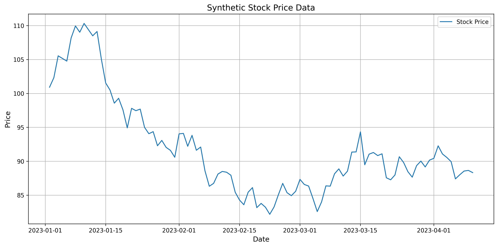
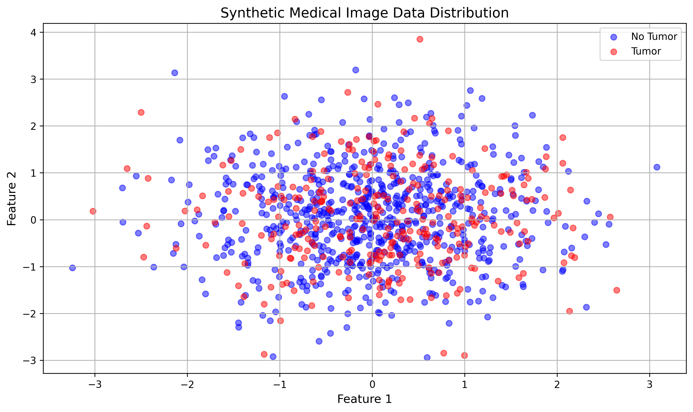
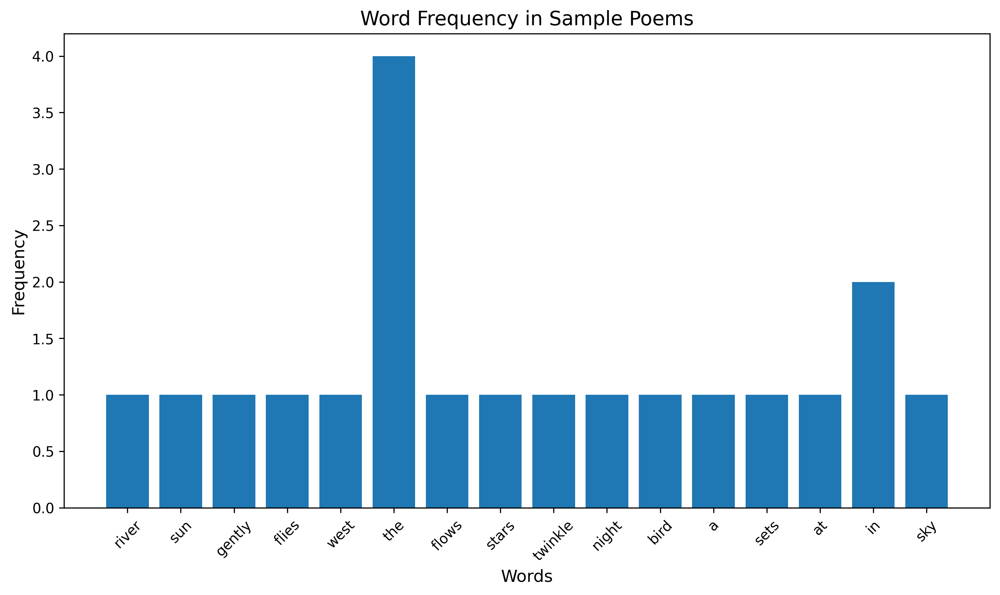
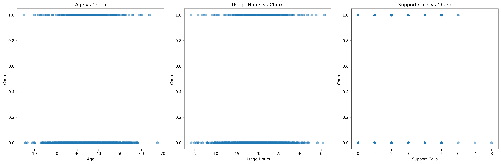

# Question 1: Identifying Well-posed Learning Problems

## Problem Statement
For each of the following scenarios, determine whether it represents a well-posed machine learning problem. If not, explain why and suggest how it could be reformulated to become well-posed.

### Task
1. Predicting tomorrow's stock prices based solely on the previous day's closing prices
2. Determining whether a medical image contains a tumor based on a dataset of labeled images
3. Creating an algorithm to "understand" the meaning of poetry
4. Predicting customer churn based on demographic information, usage patterns, and customer service interactions

## Analysis and Solutions

### 1. Stock Price Prediction

**Current Status**: Not Well-posed
- **Task (T)**: Predict next day's stock price
- **Experience (E)**: Previous day's closing prices
- **Performance (P)**: Prediction error (e.g., MSE)

**Issues**:
1. Insufficient features (using only previous day's price)
2. Market efficiency theory suggests prices follow a random walk
3. Many external factors affect stock prices (news, market sentiment, etc.)

**How to Make it Well-posed**:
1. Expand feature set to include:
   - Technical indicators (moving averages, volatility)
   - Market sentiment from news
   - Trading volume
   - Sector performance
2. Define specific prediction horizons
3. Set clear performance metrics (e.g., directional accuracy, Sharpe ratio)

### 2. Medical Image Classification

**Current Status**: Well-posed
- **Task (T)**: Binary classification of medical images
- **Experience (E)**: Labeled dataset of medical images
- **Performance (P)**: Classification metrics (accuracy, sensitivity, specificity)

**Strengths**:
1. Clear objective (binary classification)
2. Well-defined input (standardized medical images)
3. Ground truth available (labeled data)
4. Measurable performance metrics
5. Direct practical application

### 3. Poetry Understanding

**Current Status**: Not Well-posed
- **Task (T)**: "Understanding" poetry (too vague)
- **Experience (E)**: Collection of poems
- **Performance (P)**: Undefined

**Issues**:
1. Ambiguous objective ("understanding" is subjective)
2. No clear performance measure
3. Subjective interpretation of meaning

**How to Make it Well-posed**:
1. Break down into specific tasks:
   - Sentiment analysis
   - Theme classification
   - Meter/rhythm detection
   - Metaphor identification
2. Define clear metrics for each task
3. Create labeled datasets for training

### 4. Customer Churn Prediction

**Current Status**: Well-posed
- **Task (T)**: Predict customer churn
- **Experience (E)**: Historical customer data
- **Performance (P)**: Classification metrics

**Strengths**:
1. Clear objective (binary classification)
2. Well-defined features:
   - Demographic information
   - Usage patterns
   - Customer service interactions
3. Measurable outcome (churn events)
4. Clear business application

## Key Takeaways

1. **Well-posed Problems Requirements**:
   - Clear, specific task
   - Available, relevant data
   - Measurable performance metrics

2. **Common Issues**:
   - Ambiguous objectives
   - Insufficient features
   - Lack of performance measures
   - Subjective evaluation criteria

3. **Making Problems Well-posed**:
   - Break down vague tasks into specific objectives
   - Define clear success metrics
   - Ensure sufficient, relevant data
   - Consider practical limitations and applications

## Conclusion
Understanding whether a machine learning problem is well-posed is crucial for successful implementation. Problems should have clear objectives, measurable outcomes, and sufficient relevant data. When faced with ill-posed problems, breaking them down into specific, measurable tasks can help make them more tractable. 