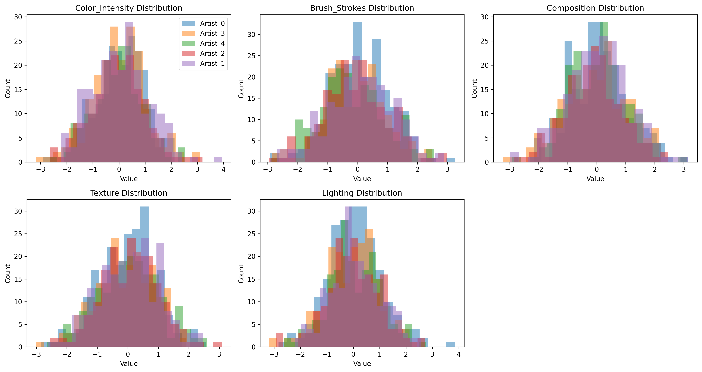
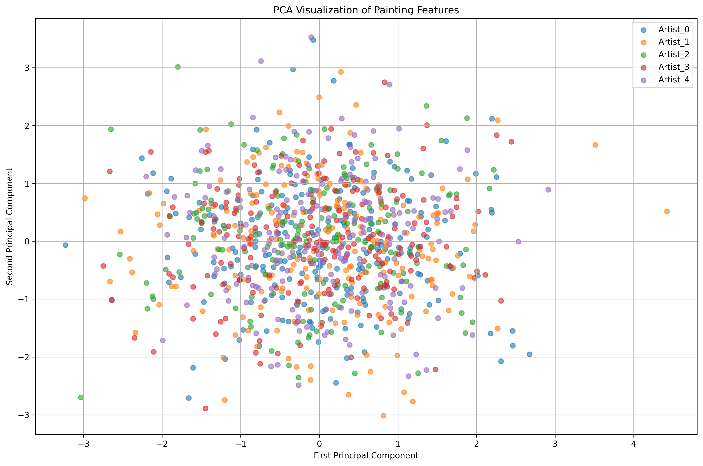
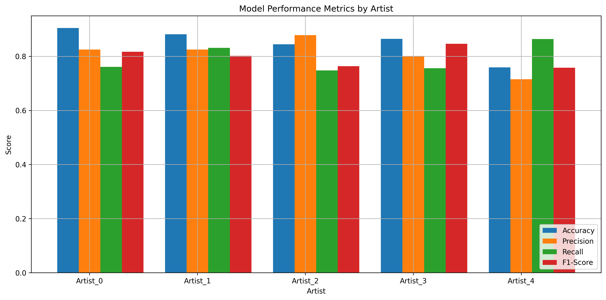
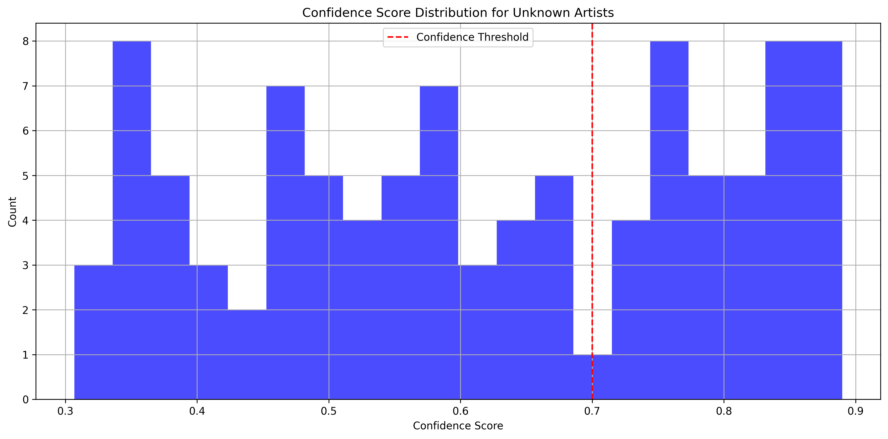

# Question 2: Artist Prediction Problem

## Problem Statement
Consider the following learning problem: Given a dataset of paintings by various artists, develop a model to predict the artist who created each painting.

### Task
1. Identify the key components that make this a well-posed learning problem
2. Discuss potential challenges in the problem formulation
3. Specify what features you would extract from the paintings
4. Explain how you would evaluate the model's performance
5. Discuss how the problem changes if you need to identify works by artists not present in your training data
## Analysis and Solutions

### 1. Key Components Analysis

**Task (T)**:
- Identify the artist of a painting
- Multi-class classification problem
- Input: Digital image of painting
- Output: Artist prediction with confidence score

**Experience (E)**:
- Dataset of labeled paintings
- Features extracted from paintings:
  - Color intensity and distribution
  - Brush stroke characteristics
  - Composition complexity
  - Texture patterns
  - Lighting and shadows

**Performance (P)**:
- Classification accuracy
- Precision and recall per artist
- F1-score for balanced evaluation
- Confidence scores for predictions

### 2. Feature Analysis and Challenges

**Feature Extraction**:
1. Visual Features:
   - Color palette and distribution
   - Brush stroke patterns
   - Texture analysis
   - Composition layout

2. Technical Features:
   - Image resolution and quality
   - Canvas size and proportions
   - Material characteristics
   - Preservation condition

**Challenges**:
1. Data Quality:
   - Image resolution variations
   - Lighting conditions
   - Color accuracy
   - Digital reproduction quality

2. Artist Variability:
   - Style evolution over time
   - Multiple artistic periods
   - Collaborative works
   - Forgeries and imitations

### 3. Performance Evaluation

**Evaluation Strategy**:
1. Cross-validation for robust assessment
2. Stratified sampling by artist and time period
3. Separate test set for final evaluation
4. Confusion matrix analysis

**Metrics Selection**:
1. Overall accuracy for general performance
2. Per-artist precision and recall
3. F1-score for balanced evaluation
4. ROC curves for threshold selection

### 4. Unknown Artists Challenge

**Handling Unknown Artists**:
1. Confidence Thresholding:
   - Set minimum confidence threshold
   - Reject predictions below threshold
   - Calibrate threshold using validation set

2. Open Set Recognition:
   - Train model to recognize "unknown" class
   - Use distance-based metrics
   - Implement novelty detection

3. Style Period Classification:
   - Group artists by period/style
   - Hierarchical classification
   - Style transfer analysis

## Key Takeaways

1. **Well-posed Nature**:
   - Clear classification objective
   - Available labeled data
   - Measurable performance metrics
   - Practical applications

2. **Feature Engineering**:
   - Comprehensive visual analysis
   - Technical metadata inclusion
   - Style-specific characteristics
   - Quality considerations

3. **Evaluation Framework**:
   - Multiple performance metrics
   - Cross-validation importance
   - Unknown artist handling
   - Confidence assessment

4. **Practical Considerations**:
   - Data quality requirements
   - Computational resources
   - Model interpretability
   - Real-world applicability

## Conclusion
The artist prediction problem represents a well-posed machine learning task with clear objectives, measurable outcomes, and practical applications. Success requires careful feature engineering, robust evaluation methods, and special consideration for unknown artists. The problem's complexity makes it an excellent example of real-world machine learning challenges. 