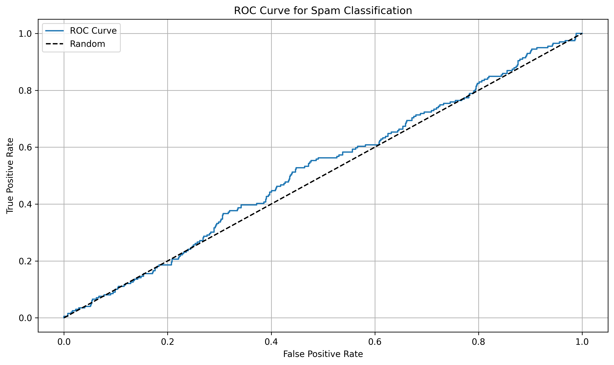

# Question 3: Performance Measures

## Problem Statement
A well-posed learning problem should have a clear performance measure that can be optimized.

### Task
1. For a spam email classification system, discuss appropriate performance metrics and why they are suitable
2. For a recommendation system suggesting products to users, propose suitable performance metrics
3. For a regression problem predicting house prices, discuss which error metrics would be most appropriate and why
4. Explain the limitations of using accuracy as a performance measure for imbalanced classification problems

## Analysis and Solutions

### 1. Spam Email Classification Metrics

**Task (T)**:
- Binary classification of emails as spam or not spam
- Input: Email content and metadata
- Output: Spam probability and classification

**Experience (E)**:
- Labeled dataset of emails
- Features: text content, headers, attachments
- Historical spam patterns

**Performance (P)**:
1. ROC Curve and AUC:
   - Measures model's ability to discriminate between classes
   - Shows trade-off between true positive and false positive rates
   - AUC provides single number for comparison

2. Precision and Recall:
   - Precision: Proportion of true spam among predicted spam
   - Recall: Proportion of spam correctly identified
   - F1-score: Harmonic mean of precision and recall

3. Confusion Matrix:
   - Shows detailed breakdown of predictions
   - Helps identify specific types of errors
   - Useful for cost-sensitive analysis

### 2. Recommendation System Metrics

**Task (T)**:
- Suggest relevant products to users
- Personalize recommendations
- Balance novelty and relevance

**Experience (E)**:
- User-item interaction data
- User preferences and history
- Item features and metadata

**Performance (P)**:
1. Accuracy Metrics:
   - Mean Average Precision (MAP)
   - Normalized Discounted Cumulative Gain (NDCG)
   - Hit Rate

2. Diversity Metrics:
   - Coverage
   - Novelty
   - Serendipity

3. Business Metrics:
   - Click-through rate
   - Conversion rate
   - Revenue per user

### 3. House Price Prediction Metrics

**Task (T)**:
- Predict continuous house prices
- Consider market trends
- Account for property features

**Experience (E)**:
- Historical sales data
- Property characteristics
- Location information
- Market conditions

**Performance (P)**:
1. Absolute Error Metrics:
   - Mean Absolute Error (MAE)
   - Root Mean Squared Error (RMSE)
   - Maximum Error

2. Relative Error Metrics:
   - Mean Absolute Percentage Error (MAPE)
   - Symmetric Mean Absolute Percentage Error (sMAPE)
   - R-squared

3. Business Metrics:
   - Prediction within price range
   - Time on market
   - Sale probability

### 4. Imbalanced Classification Analysis

**Task (T)**:
- Classification with unequal class distribution
- Often in fraud detection, medical diagnosis
- Need to handle rare events

**Experience (E)**:
- Imbalanced dataset
- Possibly augmented data
- Feature engineering for rare cases

**Performance (P)**:
1. Limitations of Accuracy:
   - Can be misleading with imbalanced data
   - May favor majority class
   - Doesn't reflect business impact

2. Better Alternatives:
   - Precision-Recall curve
   - F1-score and variants
   - Area Under PR Curve (AUPRC)

3. Cost-sensitive Metrics:
   - Weighted accuracy
   - Cost matrix analysis
   - Business impact metrics

## Key Takeaways

1. **Metric Selection Principles**:
   - Align with business objectives
   - Consider class distribution
   - Account for error costs
   - Balance multiple metrics

2. **Common Pitfalls**:
   - Over-reliance on single metric
   - Ignoring class imbalance
   - Not considering business impact
   - Neglecting interpretability

3. **Best Practices**:
   - Use multiple complementary metrics
   - Consider domain-specific requirements
   - Validate with business stakeholders
   - Monitor over time

## Conclusion
Selecting appropriate performance metrics is crucial for evaluating machine learning models effectively. The choice of metrics should reflect the specific requirements of the task, consider the data characteristics, and align with business objectives. A well-chosen set of metrics provides meaningful insights into model performance and guides improvement efforts. 