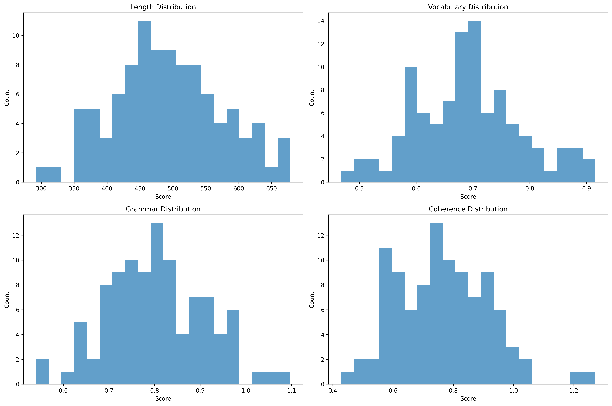
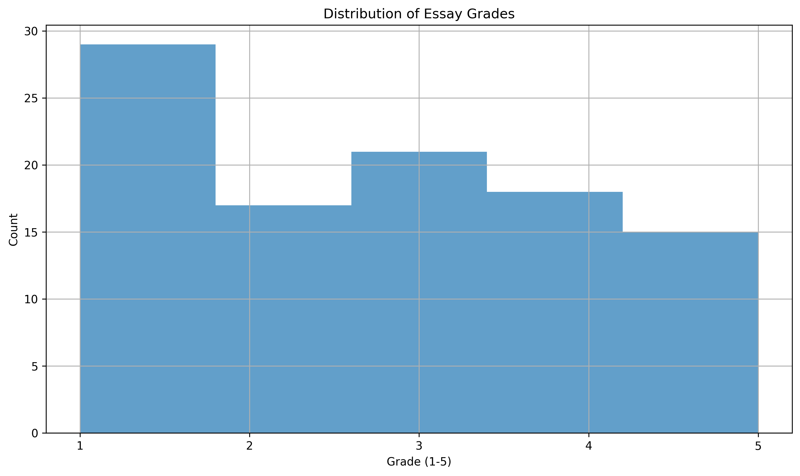
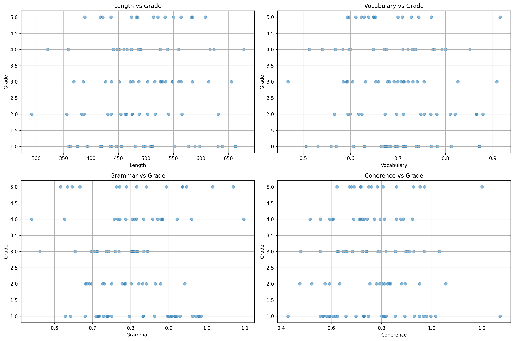
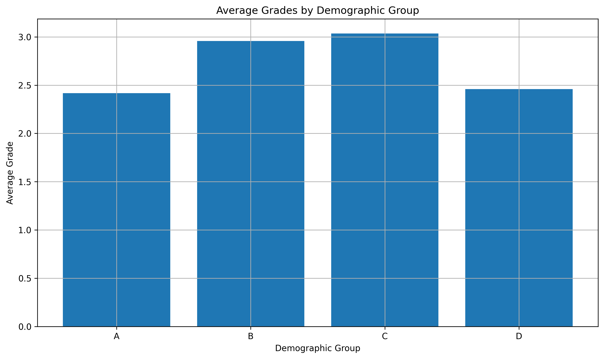

# Question 4: Automated Essay Grading

## Problem Statement
Consider the following machine learning task: Develop a system to automatically grade essays written by students.

### Task
1. Analyze whether this is a well-posed learning problem
2. Identify the key challenges in formulating this as a machine learning problem
3. Describe the input features and output variables you would use
4. Propose a methodology for evaluating the system's performance
5. Discuss the ethical considerations and potential biases in such a system

## Analysis and Solutions

### 1. Problem Formulation Analysis

**Task (T)**:
- Automatically grade student essays
- Provide consistent and objective evaluation
- Generate feedback for improvement
- Scale grading process efficiently

**Experience (E)**:
- Dataset of graded essays
- Expert grading rubrics
- Historical grading patterns
- Student performance data

**Performance (P)**:
1. Grading Accuracy:
   - Agreement with human graders
   - Consistency across essays
   - Reliability of scores

2. Feedback Quality:
   - Relevance of comments
   - Actionable suggestions
   - Constructive criticism

### 2. Feature Analysis

**Input Features**:
1. Content Features:
   - Essay length and structure
   - Vocabulary complexity
   - Argument coherence
   - Topic relevance

2. Language Features:
   - Grammar and syntax
   - Sentence structure
   - Writing style
   - Readability scores

3. Contextual Features:
   - Assignment requirements
   - Subject matter
   - Grade level
   - Previous performance

**Output Variables**:
1. Numerical Grades:
   - Overall score
   - Component scores
   - Improvement metrics

2. Qualitative Feedback:
   - Strengths and weaknesses
   - Specific suggestions
   - Learning resources

### 3. Performance Evaluation

**Evaluation Methodology**:
1. Human Comparison:
   - Inter-rater reliability
   - Expert validation
   - Disagreement analysis

2. Statistical Measures:
   - Correlation coefficients
   - Mean absolute error
   - Grade distribution analysis

3. Educational Impact:
   - Student improvement
   - Learning outcomes
   - Teacher satisfaction

### 4. Ethical Considerations

**Potential Biases**:
1. Cultural Bias:
   - Language variations
   - Cultural references
   - Writing styles
   - Educational background

2. Demographic Bias:
   - Socioeconomic factors
   - Regional differences
   - Educational access
   - Language proficiency

3. Content Bias:
   - Topic familiarity
   - Subject expertise
   - Writing conventions
   - Argument structure

**Mitigation Strategies**:
1. Bias Detection:
   - Regular audits
   - Demographic analysis
   - Performance monitoring
   - Feedback collection

2. Fairness Measures:
   - Equal opportunity scoring
   - Cultural sensitivity
   - Accessibility considerations
   - Transparency in grading

## Key Takeaways

1. **Well-posed Nature**:
   - Clear grading objectives
   - Defined evaluation criteria
   - Measurable outcomes
   - Practical applications

2. **Technical Challenges**:
   - Feature engineering complexity
   - Grading consistency
   - Feedback generation
   - System reliability

3. **Ethical Considerations**:
   - Bias detection and mitigation
   - Fairness in evaluation
   - Transparency requirements
   - Privacy concerns

4. **Implementation Factors**:
   - Teacher involvement
   - Student acceptance
   - System interpretability
   - Continuous improvement

## Conclusion
Automated essay grading represents a complex but well-posed machine learning problem with significant potential benefits. Success requires careful consideration of technical, educational, and ethical aspects. The system should be designed to complement human grading while maintaining fairness, transparency, and educational value. Regular evaluation and improvement are essential for ensuring the system's effectiveness and fairness. 