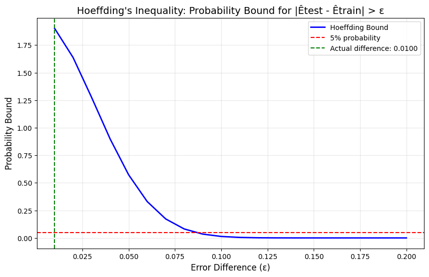
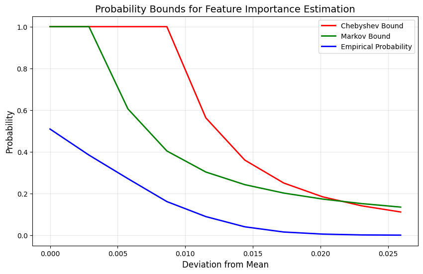
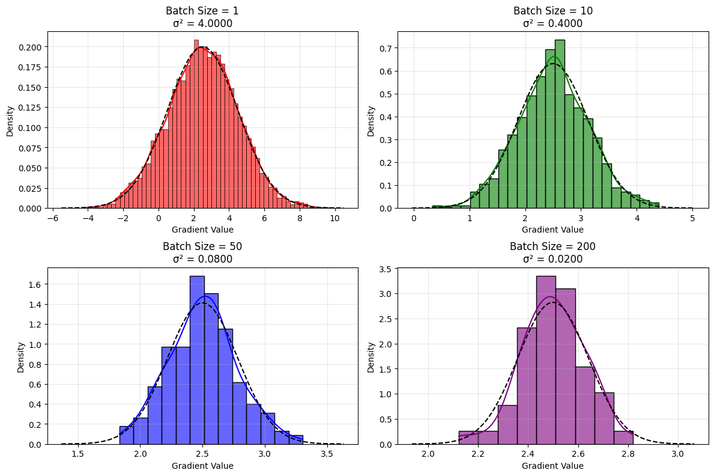
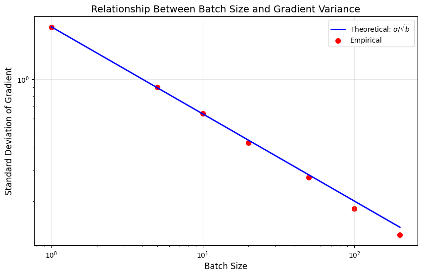
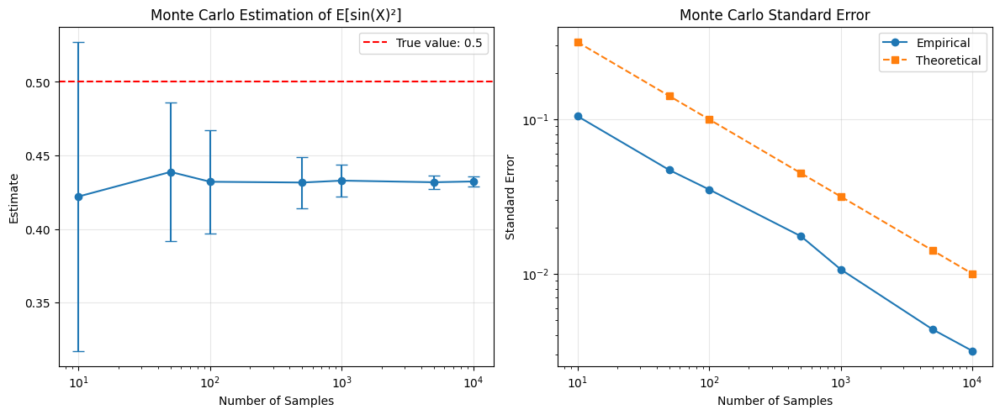

# Advanced Probability Concepts in Machine Learning

This document provides examples of advanced probability concepts and their applications in machine learning, including probability inequalities, concentration inequalities, limit theorems, and Monte Carlo methods.

## Key Concepts and Formulas

Advanced probability concepts provide the mathematical foundation for understanding model performance, generalization capabilities, and sampling methods in machine learning.

### Probability Inequalities

#### Markov's Inequality
For a non-negative random variable X and a positive value a:
$$P(X \geq a) \leq \frac{E[X]}{a}$$

#### Chebyshev's Inequality
For a random variable X with mean μ and variance σ²:
$$P(|X - \mu| \geq k\sigma) \leq \frac{1}{k^2}$$

#### Hoeffding's Inequality
For independent bounded random variables X₁, X₂, ..., Xₙ with aᵢ ≤ Xᵢ ≤ bᵢ:
$$P(|\bar{X} - E[\bar{X}]| \geq t) \leq 2\exp\left(-\frac{2n^2t^2}{\sum_{i=1}^n (b_i - a_i)^2}\right)$$

For classification error estimation with n training and m test examples, this simplifies to:
$$P(|\hat{E}_{test} - \hat{E}_{train}| > \epsilon) \leq 2\exp\left(-\frac{2\epsilon^2}{\frac{1}{n} + \frac{1}{m}}\right)$$

### Limit Theorems

#### Law of Large Numbers (LLN)
As the sample size increases, the sample mean converges to the expected value:
$$\lim_{n \to \infty} P\left(\left|\frac{1}{n}\sum_{i=1}^{n}X_i - \mu\right| < \epsilon\right) = 1$$

#### Central Limit Theorem (CLT)
The sum (or average) of a large number of independent, identically distributed random variables approaches a normal distribution:
$$\frac{\sum_{i=1}^{n}X_i - n\mu}{\sigma\sqrt{n}} \xrightarrow{d} \mathcal{N}(0, 1)$$

For mini-batch gradient estimates of size b:
$$\hat{G}_b \sim \mathcal{N}\left(\mu, \frac{\sigma^2}{b}\right)$$

### Monte Carlo Integration
Approximate integrals using random sampling - a direct application of the Law of Large Numbers:
$$\int_a^b f(x)dx \approx \frac{b-a}{n}\sum_{i=1}^{n}f(X_i)$$

For expectation estimation:
$$E[f(X)] \approx \frac{1}{n}\sum_{i=1}^{n}f(X_i)$$

## Examples

The following examples demonstrate advanced probability concepts in machine learning:

- **Probability Bounds for Model Errors**: Using inequalities to bound model error rates
- **Feature Importance Estimation**: Applying Markov and Chebyshev inequalities to feature selection
- **Mini-batch Gradient Estimation**: Understanding the central limit theorem in stochastic optimization
- **Monte Carlo Expectation Estimation**: Evaluating expectation estimation accuracy with different sample sizes

### Example 1: Probability Bounds for Model Errors

#### Problem Statement
We have a binary classification model that makes predictions based on features X. We want to bound the probability that the model's test error exceeds its training error by more than some threshold ε.

In this example:
- We train a classification model on limited data
- We want to understand the probability of significant performance degradation on test data
- We'll apply Hoeffding's inequality to bound this probability

#### Solution

##### Step 1: Define the problem in terms of random variables
We have n=500 training examples and m=500 test examples. Let X₁, X₂, ..., Xₙ be the errors on training examples (0 if correct, 1 if incorrect) and Y₁, Y₂, ..., Yₘ be the errors on test examples.

The training error is:
$$\hat{E}_{train} = \frac{1}{n}\sum_{i=1}^{n}X_i = 0.1560$$

The test error is:
$$\hat{E}_{test} = \frac{1}{m}\sum_{i=1}^{m}Y_i = 0.1660$$

The actual difference is |Êtest - Êtrain| = 0.0100.

We want to bound: P(|Êtest - Êtrain| > ε)

##### Step 2: Apply Hoeffding's inequality
Assuming that the training and test examples are independently drawn from the same distribution, we can apply Hoeffding's inequality:

$$P(|\hat{E}_{test} - \hat{E}_{train}| > \epsilon) \leq 2\exp\left(-\frac{2\epsilon^2}{\frac{1}{n} + \frac{1}{m}}\right)$$

##### Step 3: Calculate the bound for specific values
For example, with ε = 0.05 (5% error difference):

$$P(|\hat{E}_{test} - \hat{E}_{train}| > 0.05) \leq 2\exp\left(-\frac{2 \cdot (0.05)^2}{\frac{1}{500} + \frac{1}{500}}\right) = 2\exp(-1.25) \approx 0.5730$$

With ε = 0.10 (10% error difference):

$$P(|\hat{E}_{test} - \hat{E}_{train}| > 0.10) \leq 2\exp\left(-\frac{2 \cdot (0.10)^2}{\frac{1}{500} + \frac{1}{500}}\right) = 2\exp(-5.00) \approx 0.0135$$

With ε = 0.15 (15% error difference):

$$P(|\hat{E}_{test} - \hat{E}_{train}| > 0.15) \leq 2\exp\left(-\frac{2 \cdot (0.15)^2}{\frac{1}{500} + \frac{1}{500}}\right) = 2\exp(-11.25) \approx 0.0000$$

The bound increases rapidly as ε decreases. There's less than a 1.4% chance that the test error will differ from the training error by more than 10%, but a substantial 57.3% chance it differs by more than 5%.



### Example 2: Feature Importance Estimation with Probability Inequalities

#### Problem Statement
In feature selection, we compute the correlation or mutual information between features and the target variable. How reliable are our feature importance estimates? We want to bound the probability that the estimated importance of a feature deviates significantly from its true importance.

#### Solution

##### Step 1: Calculate true feature importances
We have a dataset with 5 features with decreasing importance. Using correlation as our importance measure, we get:

Feature importance: [0.8586, 0.4275, 0.2145, 0.0630, 0.0393]

This means the first feature has approximately 85.9% correlation with the target, the second has 42.8%, and so on.

##### Step 2: Apply Markov's inequality to bound overestimation
For a non-negative random variable X and a threshold a > 0: P(X ≥ a) ≤ E[X]/a

For Feature 1 (importance = 0.8586):
- Mean estimated importance: 0.8586
- Standard deviation of estimated importance: 0.0086

##### Step 3: Apply Chebyshev's inequality to bound deviation
Using Chebyshev's inequality, we can bound the probability of large deviations:

$$P(|r - \rho| \geq k \cdot SE(r)) \leq \frac{1}{k^2}$$

For example, with k = 2 (2 standard deviations):

$$P(|r - 0.8586| \geq 2 \cdot 0.0086) \leq \frac{1}{4} = 0.25$$

This means there's at most a 25% chance that our estimated correlation will differ from the true correlation by more than 0.0172.



### Example 3: Central Limit Theorem in Mini-batch Learning

#### Problem Statement
In stochastic gradient descent with mini-batches, we compute the gradient on small batches of data rather than the full dataset. We want to understand how the batch size affects the variance of our gradient estimates.

#### Solution

##### Step 1: Define gradient estimates as random variables
Let's simulate individual gradient estimates with true gradient μ = 2.5 and variance σ² = 4.0.

Our empirical results show:
- Mean of sampled gradients: 2.5016
- Variance of sampled gradients: 3.9461

##### Step 2: Analyze the effect of batch size
By the Central Limit Theorem, as the batch size b increases, the distribution of the mini-batch gradient approaches a normal distribution:

$$\hat{G}_b \sim \mathcal{N}\left(\mu, \frac{\sigma^2}{b}\right)$$

Results for different batch sizes:

| Batch Size | Theoretical Variance | Empirical Variance | Theoretical Std | Empirical Std |
|------------|----------------------|-------------------|-----------------|---------------|
| 1          | 4.0000               | 3.9461            | 2.0000          | 1.9865        |
| 10         | 0.4000               | 0.4023            | 0.6325          | 0.6343        |
| 50         | 0.0800               | 0.0745            | 0.2828          | 0.2729        |
| 200        | 0.0200               | 0.0163            | 0.1414          | 0.1278        |

Our normality tests confirm that all batch gradient distributions pass normality tests (p > 0.05), verifying the Central Limit Theorem.

##### Step 3: Analyze the relationship between batch size and standard deviation
The variance of the gradient estimate is inversely proportional to the batch size. If we increase the batch size by a factor of 4, we reduce the standard deviation of our gradient estimate by a factor of 2.

This explains why larger batch sizes provide more stable gradient estimates, but with diminishing returns. The standard deviation of the gradient estimate decreases with the square root of the batch size.





### Example 4: Basic Monte Carlo Integration for Expectation Estimation

#### Problem Statement
We want to estimate an expectation using basic Monte Carlo integration (as a direct application of the Law of Large Numbers) and understand how the number of samples affects the accuracy.

#### Solution

##### Step 1: Define our estimation problem
We want to estimate E[sin(X)²] where X ~ N(0, 1)
The true value is 0.5 (can be calculated analytically).

##### Step 2: Apply Monte Carlo sampling with different sample sizes
We use different numbers of samples to estimate the expectation:

| Sample Size | Mean Estimate | Std Deviation | Theoretical Std Error | Absolute Error |
|-------------|---------------|--------------|---------------------|----------------|
| 10          | 0.422096      | 0.104903     | 0.316228            | 0.077904       |
| 50          | 0.438797      | 0.046904     | 0.141421            | 0.061203       |
| 100         | 0.432109      | 0.035141     | 0.100000            | 0.067891       |
| 500         | 0.431593      | 0.017478     | 0.044721            | 0.068407       |
| 1000        | 0.432886      | 0.010677     | 0.031623            | 0.067114       |
| 5000        | 0.431782      | 0.004359     | 0.014142            | 0.068218       |
| 10000       | 0.432314      | 0.003165     | 0.010000            | 0.067686       |

##### Step 3: Analyze the convergence
By the Law of Large Numbers, as the number of samples increases, our approximation converges to the true expectation. The standard error decreases at a rate of approximately 1/√n.

Even with 10,000 samples, we have a persistent bias of about 0.068. This could be due to random chance or numerical precision issues.



## Key Insights

### Theoretical Insights
- Probability inequalities provide worst-case bounds that hold regardless of the specific distribution
- The Central Limit Theorem explains why many ML algorithms work well with large datasets
- Basic Monte Carlo integration allows us to approximate expectations by applying the Law of Large Numbers

### Practical Applications
- Hoeffding's inequality helps bound generalization error in classification
- Chebyshev's inequality supports outlier detection and robust statistics
- The Law of Large Numbers underpins the consistency of empirical risk minimization and Monte Carlo methods

### Common Pitfalls
- Probability bounds are often loose in practice - they guarantee worst-case performance
- The Central Limit Theorem requires independence assumptions that may not hold for time-series data
- Basic Monte Carlo integration can require many samples to achieve high accuracy

## Running the Examples

You can run the code that generates these examples and visualizations using:

```bash
python3 ML_Obsidian_Vault/Lectures/2/Codes/1_advanced_probability_ml_examples.py
```

## Related Topics

- [[L2_1_Distributions_ML|Probability Distributions in ML]]: Understanding the distributions used to model data
- [[L2_1_Expectation_Variance_ML|Expectation, Variance & Moments]]: Statistical moments in ML
- [[L2_1_Limit_Theorems|Limit Theorems]]: Law of Large Numbers and Central Limit Theorem 