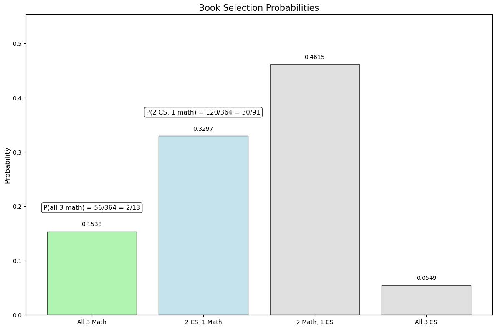
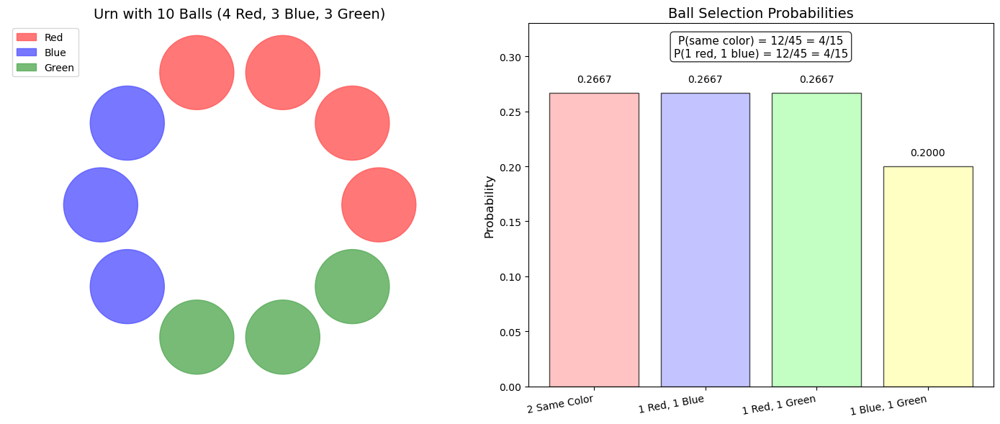
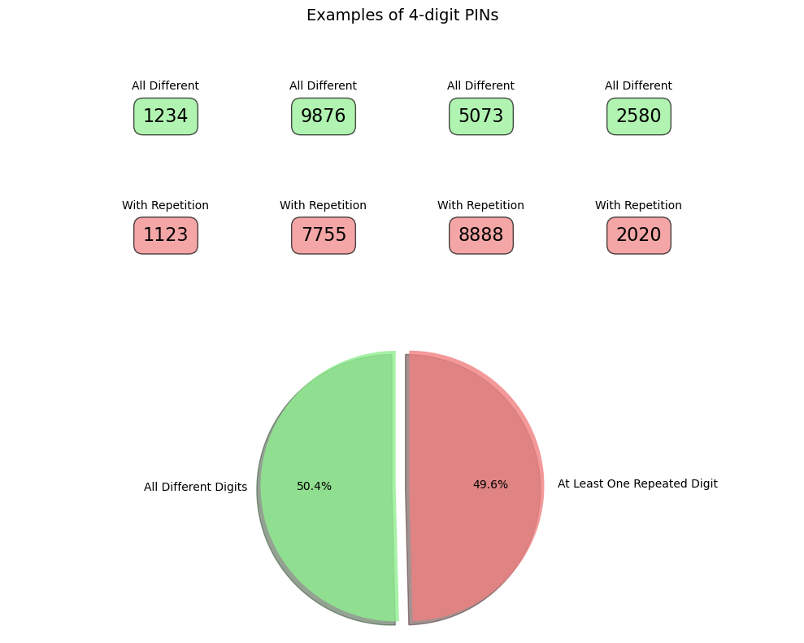
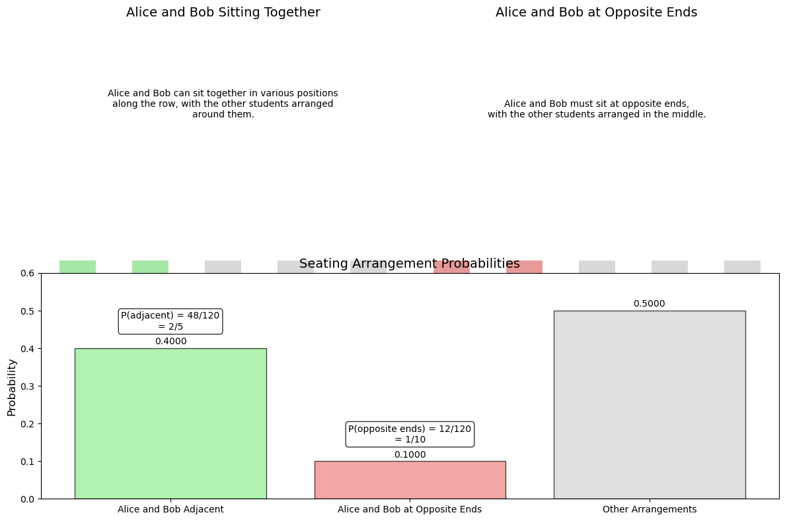
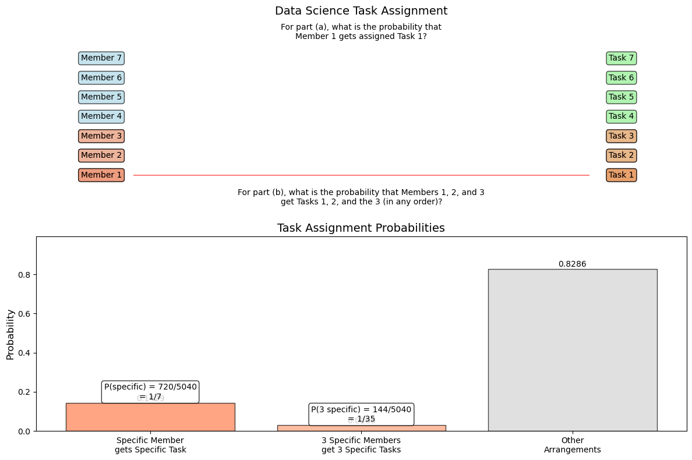

# Basic Combinatorial Probability Examples

This document provides fundamental examples of combinatorial probability that illustrate basic counting principles and their application in calculating probabilities for discrete events.

## Key Concepts and Formulas

Basic combinatorial probability involves calculating probabilities by determining the number of favorable outcomes relative to the total number of possible outcomes. These calculations often require combinatorial techniques such as permutations and combinations.

### Key Counting Formulas

- **Multiplication Principle**: If task 1 can be done in $m$ ways and task 2 can be done in $n$ ways, then the sequence of both tasks can be done in $m \times n$ ways.

- **Permutation** (ordered arrangements): $P(n,r) = \frac{n!}{(n-r)!}$

- **Combination** (unordered selections): $C(n,r) = \binom{n}{r} = \frac{n!}{r!(n-r)!}$

- **Basic Probability Formula**: $P(A) = \frac{\text{Number of favorable outcomes}}{\text{Total number of possible outcomes}}$

## Examples

The following examples demonstrate basic combinatorial probability principles:

- **Simple Selection Problems**: Calculating probabilities when selecting objects randomly
- **Basic Card Problems**: Determining probabilities for simple card draws
- **Student Group Formation**: Applications to classroom settings
- **Job Assignment Problems**: Allocating tasks or roles randomly

### Example 1: Book Selection

#### Problem Statement
A student has 8 math books and 6 computer science books on a shelf. If the student randomly selects 3 books, what is the probability that:
a) All 3 books are math books?
b) Exactly 2 books are computer science books?

#### Solution

##### Step 1: Calculate the total number of possible selections
The total number of ways to select 3 books from 14 books is:
$C(14,3) = \frac{14!}{3!(14-3)!} = \frac{14 \times 13 \times 12}{3 \times 2 \times 1} = 364$

##### Step 2: Calculate the number of favorable outcomes for part (a)
To select 3 math books from 8 math books:
$C(8,3) = \frac{8!}{3!5!} = \frac{8 \times 7 \times 6}{3 \times 2 \times 1} = 56$

##### Step 3: Calculate the probability for part (a)
$P(\text{all 3 are math books}) = \frac{C(8,3)}{C(14,3)} = \frac{56}{364} = \frac{2}{13} \approx 0.1538$ or about $15.38\%$

##### Step 4: Calculate the number of favorable outcomes for part (b)
To select exactly 2 computer science books and 1 math book:
- Select 2 computer science books from 6: $C(6,2) = 15$ ways
- Select 1 math book from 8: $C(8,1) = 8$ ways

By the multiplication principle, the total number of favorable outcomes is:
$C(6,2) \times C(8,1) = 15 \times 8 = 120$

##### Step 5: Calculate the probability for part (b)
$P(\text{exactly 2 CS books}) = \frac{C(6,2) \times C(8,1)}{C(14,3)} = \frac{120}{364} = \frac{30}{91} \approx 0.3297$ or about $32.97\%$

**Note**: The calculation shows that from a total of 14 books (8 math, 6 CS), there are 364 different ways to select 3 books. There are 56 ways to select all 3 books from the math books, and 120 ways to select exactly 2 CS books and 1 math book. The probability of getting all 3 math books is approximately 15.38%, while the probability of getting exactly 2 CS books is approximately 32.97%.



### Example 2: Selecting Balls from an Urn

#### Problem Statement
An urn contains 10 balls: 4 red, 3 blue, and 3 green. If 2 balls are randomly drawn without replacement, what is the probability of getting:
a) 2 balls of the same color?
b) 1 red ball and 1 blue ball?

#### Solution

##### Step 1: Calculate the total number of possible outcomes
The total number of ways to select 2 balls from 10 is:
$C(10,2) = \frac{10!}{2!8!} = \frac{10 \times 9}{2 \times 1} = 45$

##### Step 2: Calculate the number of favorable outcomes for part (a)
For 2 balls of the same color, we need:
- 2 red balls from 4 red balls: $C(4,2) = 6$ ways, OR
- 2 blue balls from 3 blue balls: $C(3,2) = 3$ ways, OR
- 2 green balls from 3 green balls: $C(3,2) = 3$ ways

Total favorable outcomes: $6 + 3 + 3 = 12$

##### Step 3: Calculate the probability for part (a)
$P(\text{2 balls of same color}) = \frac{12}{45} = \frac{4}{15} \approx 0.2667$ or about $26.67\%$

##### Step 4: Calculate the number of favorable outcomes for part (b)
To get 1 red ball and 1 blue ball:
- Select 1 red ball from 4 red balls: $C(4,1) = 4$ ways
- Select 1 blue ball from 3 blue balls: $C(3,1) = 3$ ways

By the multiplication principle, the total number of favorable outcomes is:
$C(4,1) \times C(3,1) = 4 \times 3 = 12$

##### Step 5: Calculate the probability for part (b)
$P(\text{1 red and 1 blue}) = \frac{C(4,1) \times C(3,1)}{C(10,2)} = \frac{12}{45} = \frac{4}{15} \approx 0.2667$ or about $26.67\%$

**Note**: From an urn with 10 balls (4 red, 3 blue, 3 green), there are 45 different ways to select 2 balls. To get 2 balls of the same color, we add the ways to get 2 red balls (6 ways), 2 blue balls (3 ways), and 2 green balls (3 ways), giving 12 favorable outcomes. For getting 1 red and 1 blue ball, we multiply the ways to select 1 red ball (4) and 1 blue ball (3), resulting in 12 favorable outcomes. Both events have the same probability: 4/15 or approximately 26.67%.



### Example 3: Password Creation

#### Problem Statement
A system requires creating a 4-digit PIN code using digits 0-9, where digits can be repeated.

a) What is the probability of creating a PIN with all different digits?
b) What is the probability of creating a PIN with at least one repeated digit?

#### Solution

##### Step 1: Calculate the total number of possible PINs
Using the multiplication principle, the total number of 4-digit PINs (with repetition allowed) is:
$10 \times 10 \times 10 \times 10 = 10^4 = 10,000$ possible PINs

##### Step 2: Calculate the number of favorable outcomes for part (a)
To create a PIN with all different digits:
- First position: 10 choices (0-9)
- Second position: 9 choices (any digit except the first)
- Third position: 8 choices (any digit except the first two)
- Fourth position: 7 choices (any digit except the first three)

Total number of PINs with no repeated digits: $10 \times 9 \times 8 \times 7 = 5,040$

##### Step 3: Calculate the probability for part (a)
$P(\text{all different digits}) = \frac{5,040}{10,000} = \frac{63}{125} \approx 0.5040$ or $50.40\%$

##### Step 4: Calculate the probability for part (b)
Using the complement rule:
$P(\text{at least one repeated digit}) = 1 - P(\text{all different digits}) = 1 - 0.5040 = 0.4960$ or $49.60\%$

**Note**: When creating a 4-digit PIN, there are 10,000 total possible PINs using digits 0-9 with repetition allowed. The number of PINs with all different digits can be calculated using the permutation formula P(10,4) = 10 × 9 × 8 × 7 = 5,040. Therefore, the probability of creating a PIN with all different digits is 5,040/10,000 = 0.504 or 50.4%. For part (b), we use the complement rule to find that the probability of creating a PIN with at least one repeated digit is 1 - 0.504 = 0.496 or 49.6%.



### Example 4: Random Seating Arrangement

#### Problem Statement
5 students (Alice, Bob, Charlie, David, and Emma) need to be randomly seated in a row of 5 chairs.

a) What is the probability that Alice and Bob sit next to each other?
b) What is the probability that Alice sits at one end and Bob at the other end?

#### Solution

##### Step 1: Calculate the total number of possible seating arrangements
The total number of ways to arrange 5 students in 5 chairs is:
$P(5,5) = 5! = 5 \times 4 \times 3 \times 2 \times 1 = 120$

##### Step 2: Calculate the number of favorable outcomes for part (a)
To have Alice and Bob sit together:
- Consider Alice and Bob as one unit, giving us 4 units to arrange (the Alice-Bob unit, and the 3 remaining students)
- Number of ways to arrange 4 units: $4! = 24$
- Alice and Bob can be arranged in 2! = 2 ways within their unit (Alice-Bob or Bob-Alice)

Total favorable outcomes: $24 \times 2 = 48$

##### Step 3: Calculate the probability for part (a)
$P(\text{Alice and Bob sit together}) = \frac{48}{120} = \frac{2}{5} = 0.4$ or $40\%$

##### Step 4: Calculate the number of favorable outcomes for part (b)
For Alice and Bob to sit at opposite ends:
- 2 ways to decide which end Alice sits at (first chair or last chair)
- 1 way to place Bob at the opposite end once Alice's position is fixed
- 3! = 6 ways to arrange the remaining 3 students in the 3 middle positions

Total favorable outcomes: $2 \times 1 \times 6 = 12$

##### Step 5: Calculate the probability for part (b)
$P(\text{Alice and Bob at opposite ends}) = \frac{12}{120} = \frac{1}{10} = 0.1$ or $10\%$

**Note**: For 5 students in a row of 5 chairs, there are 5! = 120 possible seating arrangements. For Alice and Bob to sit together, we first consider them as one unit (giving 4! arrangements for 4 units), then multiply by 2! ways to arrange Alice and Bob within their unit, resulting in 48 favorable outcomes. For Alice and Bob to sit at opposite ends, Alice can sit at either end (2 ways), Bob must sit at the other end (1 way), and the remaining 3 students can be arranged in 3! = 6 ways, giving 12 favorable outcomes. Therefore, the probability of Alice and Bob sitting together is 48/120 = 2/5 = 0.4 or 40%, and the probability of them sitting at opposite ends is 12/120 = 1/10 = 0.1 or 10%.



### Example 5: Random Assignment of Tasks

#### Problem Statement
A data science team needs to assign 7 different tasks to 7 team members. If the tasks are assigned randomly, what is the probability that:

a) A specific team member gets a specific task?
b) Each of 3 specific team members gets one of 3 specific tasks (without regard to which team member gets which of the three tasks)?

#### Solution

##### Step 1: Calculate the total number of possible assignments
The total number of ways to assign 7 tasks to 7 team members is:
$7! = 5,040$ possible assignments

##### Step 2: Calculate the probability for part (a)
For a specific team member to get a specific task, the remaining 6 tasks can be assigned to the remaining 6 team members in 6! ways.

Number of favorable outcomes: $6! = 720$

$P(\text{specific member gets specific task}) = \frac{6!}{7!} = \frac{720}{5,040} = \frac{1}{7} \approx 0.1429$ or about $14.29\%$

##### Step 3: Calculate the probability for part (b)
For 3 specific team members to get 3 specific tasks (without regard to which member gets which of the three tasks):

- Number of ways to assign 3 specific tasks to 3 specific team members: $3! = 6$ ways
- Number of ways to assign the remaining 4 tasks to the remaining 4 team members: $4! = 24$ ways

Total favorable outcomes: $6 \times 24 = 144$

$P(\text{3 specific members get 3 specific tasks}) = \frac{144}{5,040} = \frac{1}{35} \approx 0.0286$ or about $2.86\%$

**Note**: When assigning 7 tasks to 7 team members, there are 7! = 5,040 possible assignments. For a specific member to get a specific task, the remaining 6 tasks can be assigned to the remaining 6 members in 6! = 720 ways, giving a probability of 1/7 or about 14.29%. For 3 specific members to get 3 specific tasks (in any order), we multiply the ways to assign these 3 tasks to these 3 members (3! = 6) by the ways to assign the remaining 4 tasks to the remaining 4 members (4! = 24), resulting in 144 favorable outcomes. Therefore, the probability is 144/5,040 = 1/35 or approximately 2.86%.



## Key Insights

### Theoretical Insights
- For problems involving "at least one" or "at least k," the complement approach often simplifies calculations
- The multiplication principle is fundamental for counting sequential steps or decisions
- Understanding whether order matters (permutation) or doesn't matter (combination) is crucial for correct counting

### Applications in Data Science
- Random sampling: Understanding the probability of selecting specific data points
- Feature selection: Calculating the likelihood of choosing particular feature combinations
- Experimental design: Determining probabilities in randomized trials and A/B testing

### Common Pitfalls
- Confusing permutations and combinations (order matters vs. order doesn't matter)
- Not accounting for the difference between sampling with replacement vs. without replacement
- Overlooking the possibility of applying the complement rule to simplify calculations

## Running the Examples

You can run the code that generates these examples and visualizations using:

```bash
python3 ML_Obsidian_Vault/Lectures/2/Codes/1_basic_combinatorial_probability_examples.py
```

## Related Topics

- [[L2_1_Basic_Probability|Basic Probability]]: Foundation for understanding combinatorial probability
- [[L2_1_Discrete_Probability_Examples|Discrete Probability Examples]]: Examples using discrete probability distributions
- [[L2_1_Conditional_Probability_Examples|Conditional Probability Examples]]: Problems involving conditional probability
