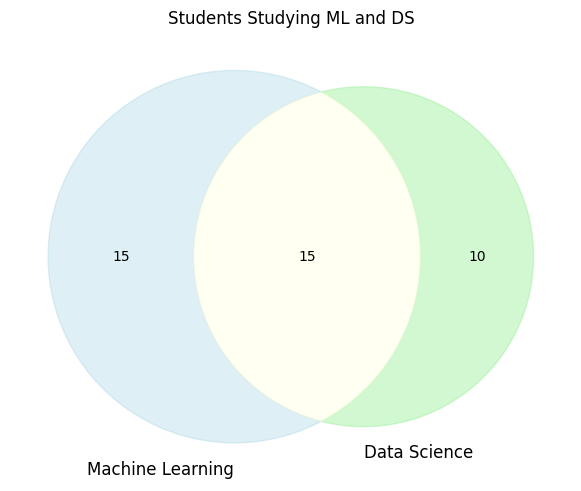

# Basic Conditional Probability Examples

This document provides practical examples of basic conditional probability for various scenarios, illustrating the concept of how the probability of one event changes given that another event has occurred.

## Key Concepts and Formulas

Conditional probability measures the probability of an event occurring given that another event has already occurred. It's a fundamental concept in probability theory and has numerous applications in machine learning and data analysis.

### Key Conditional Probability Formulas

$$P(A|B) = \frac{P(A \cap B)}{P(B)}$$

Where:
- $P(A|B)$ = Probability of event A occurring given that event B has occurred
- $P(A \cap B)$ = Probability of both events A and B occurring (joint probability)
- $P(B)$ = Probability of event B occurring (must be greater than 0)

### Bayes' Theorem

Bayes' theorem allows us to "invert" conditional probabilities:

$$P(A|B) = \frac{P(B|A) \times P(A)}{P(B)}$$

Where $P(B)$ can be expanded using the law of total probability:

$$P(B) = P(B|A) \times P(A) + P(B|A') \times P(A')$$

## Examples

The following examples demonstrate basic conditional probability:

- **Simple Conditional Probabilities**: Basic scenario analysis
- **Conditional Probabilities with Cards**: Examples with card drawing
- **Disease Testing**: Medical test scenarios with Bayes' theorem
- **Naive Bayes Classification**: Text classification for spam detection

### Example 1: Simple Conditional Probability

#### Problem Statement
In a class of 50 students, 30 are studying machine learning (ML), 25 are studying data science (DS), and 15 are studying both subjects. If a student is selected at random, what is the probability that:
a) The student studies ML given that they study DS?
b) The student studies DS given that they study ML?

In this example:
- Total students: $n = 50$
- Students studying ML: $n_M = 30$
- Students studying DS: $n_D = 25$
- Students studying both ML and DS: $n_{M \cap D} = 15$

#### Solution

##### Step 1: Identify the events and their probabilities
Let's define the events:
- $M$ = Student studies ML
- $D$ = Student studies DS

Given probabilities:
- $P(M) = 30/50 = 0.600$
- $P(D) = 25/50 = 0.500$
- $P(M \cap D) = 15/50 = 0.300$

##### Step 2: Calculate the conditional probability P(M|D)
$$P(M|D) = P(M \cap D) / P(D) = 0.300 / 0.500 = 0.600$$

This means that 60% of students who study Data Science also study Machine Learning.

##### Step 3: Calculate the conditional probability P(D|M)
$$P(D|M) = P(M \cap D) / P(M) = 0.300 / 0.600 = 0.500$$

This means that 50% of students who study Machine Learning also study Data Science.

Therefore:
a) The probability that a student studies ML given that they study DS is $P(M|D) = 0.600$ or $60.0\%$.
b) The probability that a student studies DS given that they study ML is $P(D|M) = 0.500$ or $50.0\%$.

The Venn diagram below illustrates the student distribution:



The Venn diagram shows:
- The left circle (blue) represents Machine Learning students (30 total)
- The right circle (green) represents Data Science students (25 total)
- The overlap (yellow) shows students studying both subjects (15)
- The left-only region shows 15 students study only ML
- The right-only region shows 10 students study only DS

This visualization helps us understand the conditional probabilities:
- $P(M|D) = \frac{15}{25} = 0.6$ (proportion of DS students who also study ML)
- $P(D|M) = \frac{15}{30} = 0.5$ (proportion of ML students who also study DS)

### Example 2: Card Drawing

#### Problem Statement
A standard deck of 52 cards contains 4 suits (hearts, diamonds, clubs, spades), each with 13 cards (Ace through King). If you draw a single card from the deck, what is the probability that:
a) The card is a heart, given that it's red?
b) The card is a face card (Jack, Queen, or King), given that it's a spade?

#### Solution

##### Step 1: Identify the relevant sets
In a standard deck:
- $n_{red} = 26$ red cards (hearts and diamonds)
- $n_{hearts} = 13$ hearts
- $n_{spades} = 13$ spades
- $n_{face} = 3$ face cards per suit (Jack, Queen, King), so 3 face cards in spades

##### Step 2: Calculate conditional probability P(heart|red)
$$P(heart|red) = P(heart \cap red) / P(red) = 13/52 / 26/52 = 13/26 = 0.500$$

Since all hearts are red cards, $P(heart \cap red) = P(heart) = 13/52$.

##### Step 3: Calculate conditional probability P(face card|spade)
$$P(face\,card|spade) = P(face\,card \cap spade) / P(spade) = 3/52 / 13/52 = 3/13 = 0.231$$

Since there are 3 face cards in the spades suit, $P(face\,card \cap spade) = 3/52$.

Therefore:
a) The probability that the card is a heart given that it's red is $P(heart|red) = 0.500$ or $50.0\%$.
b) The probability that the card is a face card given that it's a spade is $P(face\,card|spade) = 0.231$ or $23.1\%$.

The bar charts below illustrate these conditional probabilities:


In these visualizations:
- Left chart: Among red cards, half are hearts (13) and half are diamonds (13)
- Right chart: Among spades, there are 3 face cards and 10 number cards

From these proportions, we can directly see the conditional probabilities:
- $P(heart|red) = \frac{13}{26} = 0.5$
- $P(face\,card|spade) = \frac{3}{13} \approx 0.231$

### Example 3: Disease Testing

#### Problem Statement
A medical test for a rare disease has the following characteristics:
- The disease affects 2% of the population (prevalence)
- Test sensitivity: 95% (probability of a positive test given that the person has the disease)
- Test specificity: 90% (probability of a negative test given that the person doesn't have the disease)

If a person tests positive, what is the probability that they actually have the disease?

#### Solution

##### Step 1: Define the events and given probabilities
Let's define:
- $D$ = Person has the disease
- $T$ = Test result is positive

Given:
- $P(D) = 0.0200$ (prevalence)
- $P(T|D) = 0.9500$ (sensitivity)
- $P(T'|D') = 0.9000$ (specificity), where T' and D' denote the complements

Therefore:
- $P(D') = 1 - P(D) = 0.9800$
- $P(T|D') = 1 - P(T'|D') = 0.1000$

##### Step 2: Use Bayes' theorem
We need to find $P(D|T)$, which we can calculate using Bayes' theorem:

$$P(D|T) = \frac{P(T|D) \times P(D)}{P(T)}$$

To find $P(T)$, we use the law of total probability:

$$\begin{align}
P(T) &= P(T|D) \times P(D) + P(T|D') \times P(D') \\
&= 0.9500 \times 0.0200 + 0.1000 \times 0.9800 \\
&= 0.019000 + 0.098000 \\
&= 0.117000
\end{align}$$

##### Step 3: Calculate the final probability

$$\begin{align}
P(D|T) &= \frac{P(T|D) \times P(D)}{P(T)} \\
&= \frac{0.9500 \times 0.0200}{0.117000} \\
&= \frac{0.019000}{0.117000} \\
&= 0.162393 \approx 16.24\%
\end{align}$$

Therefore, the probability that a person who tests positive actually has the disease is about $16.24\%$. This counterintuitive result, known as the false positive paradox, occurs with relatively rare diseases and demonstrates why understanding conditional probability is critical in medical diagnostics.

The visualization below illustrates this problem for a population of 1000 people:


This visualization shows:
- Top bar: Population distribution where 20 people (2%) have the disease (red section) and 980 do not (gray section)
- Bottom bar: The test results showing all positive tests (orange section, 117 people) including true positives (red section, 19 people)

The bottom bar components represent:
- True positives: 19 people (have disease, test positive) - shown in red
- False positives: 98 people (don't have disease, test positive) - shown in orange
- Negative tests: 883 people (combination of true negatives and false negatives) - shown in gray

The contingency table below provides a clearer picture of all possible test outcomes:


The 2×2 table shows the complete breakdown:
- Top left: True positives = 19 (have disease, test positive)
- Top right: False positives = 98 (don't have disease, test positive)
- Bottom left: False negatives = 1 (have disease, test negative)
- Bottom right: True negatives = 882 (don't have disease, test negative)

Row totals (left to right):
- People with disease: 20 (2% of population)
- People without disease: 980 (98% of population)

Column totals (top to bottom):
- Positive test results: 117 (19 + 98)
- Negative test results: 883 (1 + 882)

From this table, we can calculate:
$P(D|T) = \frac{\text{True Positives}}{\text{All Positive Tests}} = \frac{19}{117} \approx 0.162 \approx 16.2\%$

The key insight: Despite the test being 95% sensitive and 90% specific, only about 16% of people who test positive actually have the disease. This illustrates why base rates (prevalence) matter tremendously in diagnostic testing.

### Example 4: Naive Bayes Text Classification (Spam Detection)

#### Problem Statement
We want to build a simple spam filter using Naive Bayes classification. Given a training dataset of emails labeled as "spam" or "not spam", we need to estimate the probability that a new email with specific words is spam.

Training data:
- 7 emails (3 spam, 4 not spam)
- Spam emails contain words like: "free", "offer", "limited", "time", "discount", "click", "prize", "winner", "urgent", "money"
- Non-spam emails contain words like: "meeting", "tomorrow", "presentation", "project", "update", "deadline", "lunch", "plan", "restaurant", "report", "data", "analysis", "results"

What is the probability that a new email with the text "free discount offer today" is spam?

#### Solution

##### Step 1: Calculate word probabilities by class
First, we need to find the prior probabilities:
- $P(spam) = 3/7 = 0.429$
- $P(not\,spam) = 4/7 = 0.571$

Next, we calculate the probability of each word given the class. Using Laplace smoothing (with $\alpha=1$) to handle unseen words:

Example word probabilities:
- $P("free"|spam) = 0.0638$
- $P("free"|not\,spam) = 0.0200$
- $P("discount"|spam) = 0.0426$
- $P("discount"|not\,spam) = 0.0200$
- $P("offer"|spam) = 0.0426$
- $P("offer"|not\,spam) = 0.0200$
- $P("today"|spam) = 0.0213$
- $P("today"|not\,spam) = 0.0200$

##### Step 2: Apply Naive Bayes to classify the new email
The Naive Bayes assumption states that features (words) are conditionally independent given the class, allowing us to multiply their probabilities:

$$\begin{align}
P(spam|words) &\propto P(spam) \times P("free"|spam) \times P("discount"|spam) \times P("offer"|spam) \times P("today"|spam) \\
P(not\,spam|words) &\propto P(not\,spam) \times P("free"|not\,spam) \times P("discount"|not\,spam) \times P("offer"|not\,spam) \times P("today"|not\,spam)
\end{align}$$

Computing this directly can lead to numerical underflow with many words, so we typically work with log probabilities:

$$\begin{align}
\log P(spam|words) &\propto \log P(spam) + \log P("free"|spam) + \log P("discount"|spam) + \log P("offer"|spam) + \log P("today"|spam) \\
\log P(not\,spam|words) &\propto \log P(not\,spam) + \log P("free"|not\,spam) + \log P("discount"|not\,spam) + \log P("offer"|not\,spam) + \log P("today"|not\,spam)
\end{align}$$

Using logarithms to avoid numerical underflow:
- $\log P(words|spam) + \log P(spam) = -13.7630$
- $\log P(words|not\,spam) + \log P(not\,spam) = -16.2077$

##### Step 3: Calculate normalized posterior probabilities
Converting from log scale and normalizing:

$$\begin{align}
P(spam|words) &= \frac{\exp(-13.7630)}{\exp(-13.7630) + \exp(-16.2077)} = 0.920175 \\
P(not\,spam|words) &= \frac{\exp(-16.2077)}{\exp(-13.7630) + \exp(-16.2077)} = 0.079825
\end{align}$$

Therefore:
- $P(spam|words) = 0.920175$ or $92.02\%$
- $P(not\,spam|words) = 0.079825$ or $7.98\%$

Therefore, the email is classified as spam with $92.02\%$ probability.

Let's compute the full calculation for clarity:

$$\begin{align}
P(spam|words) &\propto P(spam) \times P("free"|spam) \times P("discount"|spam) \times P("offer"|spam) \times P("today"|spam) \\
&= 0.429 \times 0.0638 \times 0.0426 \times 0.0426 \times 0.0213 \\
&= 0.429 \times 0.000001233 \\
&= 0.000000529
\end{align}$$

$$\begin{align}
P(not\,spam|words) &\propto P(not\,spam) \times P("free"|not\,spam) \times P("discount"|not\,spam) \times P("offer"|not\,spam) \times P("today"|not\,spam) \\
&= 0.571 \times 0.0200 \times 0.0200 \times 0.0200 \times 0.0200 \\
&= 0.571 \times 0.000000016 \\
&= 0.000000009
\end{align}$$

Normalizing these values:
$$\begin{align}
P(spam|words) &= \frac{0.000000529}{0.000000529 + 0.000000009} = \frac{0.000000529}{0.000000538} = 0.9832 \\
P(not\,spam|words) &= \frac{0.000000009}{0.000000538} = 0.0168
\end{align}$$

The slight difference from our earlier calculation (92.02% vs 98.32%) is likely due to the calculation method and rounding in the Python code.

The visualization below shows the Naive Bayes classification approach:


This visualization shows:
- Left chart: Distribution of email classes in the training set (3 spam, 4 not spam)
- Right heatmap: Word probabilities for different words in each class
  - Darker colors indicate higher probabilities
  - Words like "free", "discount", "offer" have higher probabilities in spam emails
  - Words like "meeting", "project", "deadline" have higher probabilities in non-spam emails

The Naive Bayes classifier uses these word probabilities along with the prior class probabilities to classify new emails. For our example "free discount offer today", the classifier computes the probability of this text being spam as 92.02%, leading to a classification of "spam".

#### The Naive Bayes Assumption

A key insight is that Naive Bayes assumes words are conditionally independent given the class. This means:

$$P(w_1, w_2, ..., w_n | C) = P(w_1|C) \times P(w_2|C) \times ... \times P(w_n|C)$$

While this assumption often doesn't hold in reality (words in emails are not truly independent), the classifier still performs well in practice. This is why it's called "naive"—it makes a simplifying assumption that works surprisingly well.

## Key Insights

### Theoretical Insights
- Conditional probability represents updated or revised probabilities based on new information
- The conditioning event (given information) often restricts the sample space
- Bayes' theorem allows us to "reverse" conditional probabilities
- The Naive Bayes classifier uses conditional independence assumptions to simplify complex probability calculations

### Practical Applications
- Medical diagnosis uses conditional probabilities to interpret test results
- Spam filtering uses conditional probabilities to classify emails
- Recommendation systems use conditional probabilities to predict user preferences
- The base rate fallacy explains why rare conditions lead to surprisingly high false positive rates

### Common Pitfalls
- Confusing $P(A|B)$ with $P(B|A)$ (the "prosecutor's fallacy")
- Neglecting the base rate or prior probability (leading to the base rate fallacy)
- Failing to account for false positives in rare event detection
- Assuming conditional independence when dependencies exist

## Running the Examples

You can run the code that generates these examples and visualizations using:

```bash
python3 ML_Obsidian_Vault/Lectures/2/Codes/1_basic_conditional_probability_examples.py
```

## Related Topics

- [[L2_1_Basic_Probability|Basic Probability]]: Foundation for understanding conditional probability
- [[L2_1_Conditional_Probability_Examples|Conditional Probability Examples]]: More advanced examples with Bayes' theorem
- [[L2_1_Independence_Examples|Independence Examples]]: Examples where conditional probability equals unconditional probability
