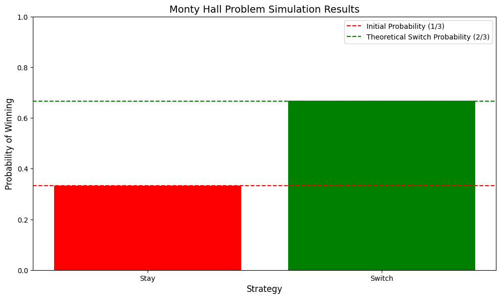

# Basic Probability Examples

This document provides practical examples of basic probability concepts, illustrating fundamental principles through real-world scenarios.

## Key Concepts and Formulas

### Basic Probability Axioms
1. $P(A) \geq 0$ for any event $A$
2. $P(\Omega) = 1$ where $\Omega$ is the sample space
3. If $A$ and $B$ are mutually exclusive events, then $P(A \cup B) = P(A) + P(B)$

### Important Formulas
- **Complement Rule**: $P(A^c) = 1 - P(A)$
- **Inclusion-Exclusion**: $P(A \cup B) = P(A) + P(B) - P(A \cap B)$
- **Probability of Union**: $P(A \cup B \cup C) = P(A) + P(B) + P(C) - P(A \cap B) - P(A \cap C) - P(B \cap C) + P(A \cap B \cap C)$

## Examples

### Example 1: Coin Toss Probability

#### Problem Statement
What is the probability of getting exactly 2 heads when tossing a fair coin 3 times?

#### Solution
The sample space for 3 coin tosses has $2^3 = 8$ possible outcomes:
- HHH, HHT, HTH, THH, HTT, THT, TTH, TTT

Number of favorable outcomes (exactly 2 heads): 3 (HHT, HTH, THH)

$$P(\text{exactly 2 heads}) = \frac{\text{Number of favorable outcomes}}{\text{Total number of outcomes}} = \frac{3}{8} = 0.375$$


### Example 2: Class Imbalance in ML Dataset

#### Problem Statement
In a machine learning dataset with 1000 samples, there are two classes:
- Class A: 800 samples
- Class B: 200 samples

What is the probability of randomly selecting a sample from each class? What is the probability of selecting two samples from the same class?

#### Solution
Total number of samples: 1000

Probability of selecting Class A:
$$P(\text{Class A}) = \frac{800}{1000} = 0.8$$

Probability of selecting Class B:
$$P(\text{Class B}) = \frac{200}{1000} = 0.2$$

Probability of selecting two samples from the same class:
$$P(\text{same class}) = P(\text{both Class A}) + P(\text{both Class B})$$
$$= \left(\frac{800}{1000}\right)^2 + \left(\frac{200}{1000}\right)^2$$
$$= 0.64 + 0.04 = 0.68$$

Therefore:
- The probability of selecting a sample from Class A is 80%
- The probability of selecting a sample from Class B is 20%
- The probability of selecting two samples from the same class is 68%


### Example 3: Card Drawing Probability

#### Problem Statement
What is the probability of drawing a heart or a king from a standard deck of 52 cards?

#### Solution
Using the inclusion-exclusion principle:

- Number of hearts: 13
- Number of kings: 4
- Number of cards that are both hearts and kings: 1 (King of Hearts)

$$P(\text{Heart or King}) = P(\text{Heart}) + P(\text{King}) - P(\text{Heart and King})$$
$$= \frac{13}{52} + \frac{4}{52} - \frac{1}{52} = \frac{16}{52} = \frac{4}{13} \approx 0.3077$$


### Example 4: Birthday Problem

#### Problem Statement
What is the probability that in a group of 23 people, at least two people share the same birthday?

#### Solution
We'll use the complement rule to calculate this probability.

Probability that all birthdays are different:
$$P(\text{all different}) = \frac{365}{365} \times \frac{364}{365} \times \frac{363}{365} \times \cdots \times \frac{343}{365} \approx 0.4927$$

$$P(\text{at least 2 same}) = 1 - P(\text{all different}) \approx 0.5073$$


### Example 5: Monty Hall Problem

#### Problem Statement
In the Monty Hall problem, you pick one of three doors. The host, who knows what's behind each door, opens one of the remaining doors, revealing a goat. Should you switch your choice to the other unopened door?

#### Solution
Simulation results (10,000 trials):
- Probability of winning by staying: 0.3347
- Probability of winning by switching: 0.6653

Theoretical probabilities:
- Initial probability of choosing the car: $\frac{1}{3} \approx 0.3333$
- Probability of winning by switching: $\frac{2}{3} \approx 0.6667$



## Key Insights

### Theoretical Insights
- Probability is fundamentally about counting and ratios
- The complement rule is often useful for calculating probabilities of "at least" or "at most" events
- The inclusion-exclusion principle helps avoid double-counting in union probabilities

### Practical Applications
- Probability theory forms the foundation of statistical inference
- Understanding basic probability is crucial for machine learning algorithms
- Many real-world problems can be modeled using basic probability concepts

### Common Pitfalls
- Confusing mutually exclusive events with independent events
- Forgetting to account for all possible outcomes in the sample space
- Misapplying the inclusion-exclusion principle

## Running the Examples

You can run the code that generates these examples and visualizations using:

```bash
python3 ML_Obsidian_Vault/Lectures/2/Codes/1_basic_probability_examples.py
``` 

## Related Topics
- [[L2_1_Combinatorial_Probability|Combinatorial Probability]]: Counting principles and arrangements
- [[L2_1_Conditional_Probability|Conditional Probability]]: Probability of events given other events
- [[L2_1_Probability_Distributions|Probability Distributions]]: Common probability distribution families 