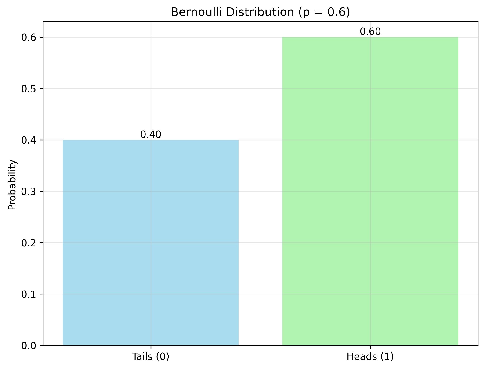
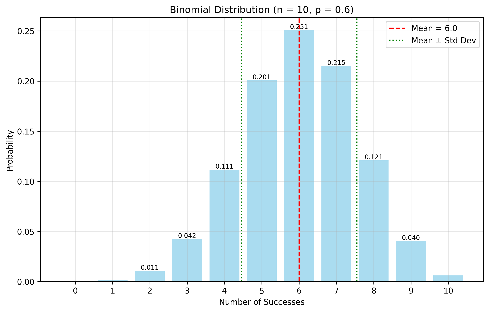
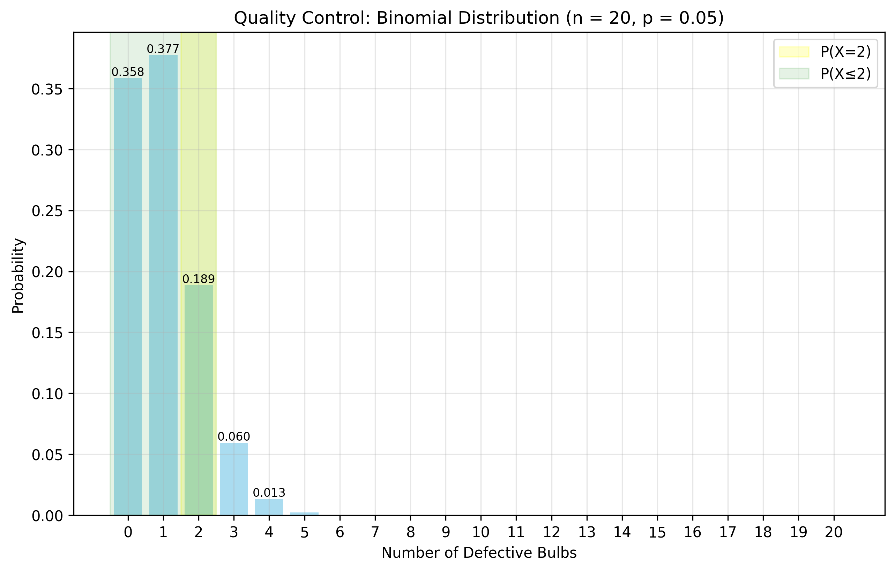

# Bernoulli and Binomial Distribution Examples

This document provides practical examples of Bernoulli and Binomial distributions, which are fundamental for modeling binary outcomes and trials in machine learning.

## Key Concepts and Formulas

### Bernoulli Distribution
- Models a single binary outcome (success/failure, 0/1)
- Single parameter: probability of success $p$ $(0 \leq p \leq 1)$
- PMF: $P(X = x) = p^x \cdot (1-p)^{(1-x)}$ for $x \in \{0, 1\}$
- Mean: $E[X] = p$
- Variance: $\text{Var}(X) = p(1-p)$

### Binomial Distribution
- Models number of successes in $n$ independent Bernoulli trials
- Parameters: $n$ (number of trials) and $p$ (probability of success)
- PMF: $P(X = k) = \binom{n}{k} p^k (1-p)^{(n-k)}$ for $k \in \{0, 1, 2, \ldots, n\}$
- Mean: $E[X] = np$
- Variance: $\text{Var}(X) = np(1-p)$

## Examples

### Example 1: Bernoulli Distribution - Coin Toss

#### Problem Statement
Consider a biased coin with probability of heads $p = 0.6$. Let $X$ be a random variable representing the outcome of a single toss (1 for heads, 0 for tails).

#### Solution

##### Step 1: Define the Bernoulli Distribution
- $X \sim \text{Bernoulli}(p=0.6)$
- $P(X=1) = p = 0.6$
- $P(X=0) = 1-p = 0.4$

##### Step 2: Calculate Expected Value
$E[X] = p = 0.6$

##### Step 3: Calculate Variance
$\text{Var}(X) = p(1-p) = 0.6 \times 0.4 = 0.24$

##### Step 4: Visualize the Distribution


### Example 2: Binomial Distribution - Multiple Coin Tosses

#### Problem Statement
Consider tossing the same biased coin ($p=0.6$) 10 times. Let $X$ be the number of heads obtained.

#### Solution

##### Step 1: Define the Binomial Distribution
- $X \sim \text{Binomial}(n=10, p=0.6)$
- Number of possible outcomes: $2^{10} = 1024$

##### Step 2: Calculate Probabilities for Different Outcomes
- $P(X=0) = \binom{10}{0} (0.6)^0 (0.4)^{10} = 0.0001048576$
- $P(X=5) = \binom{10}{5} (0.6)^5 (0.4)^5 = 0.2006581248$
- $P(X=10) = \binom{10}{10} (0.6)^{10} (0.4)^0 = 0.0060466176$

##### Step 3: Calculate Expected Value
$E[X] = np = 10 \times 0.6 = 6.0$

##### Step 4: Calculate Variance
$\text{Var}(X) = np(1-p) = 10 \times 0.6 \times 0.4 = 2.40$

##### Step 5: Visualize the Distribution


### Example 3: Binomial Distribution - Quality Control

#### Problem Statement
A factory produces light bulbs with a 5% defect rate. In a sample of 20 bulbs, what is the probability that:
1. Exactly 2 bulbs are defective?
2. At most 2 bulbs are defective?
3. At least 2 bulbs are defective?

#### Solution

##### Step 1: Define the Binomial Distribution
- $X \sim \text{Binomial}(n=20, p=0.05)$
- $X$ represents number of defective bulbs

##### Step 2: Calculate Exact Probability
$P(X=2) = \binom{20}{2} (0.05)^2 (0.95)^{18} = 0.1886768013$

##### Step 3: Calculate Cumulative Probabilities
- $P(X \leq 2) = P(X=0) + P(X=1) + P(X=2) = 0.9245163262$
- $P(X \geq 2) = 1 - P(X=0) - P(X=1) = 0.2641604751$

##### Step 4: Visualize the Distribution


## Key Insights

### Theoretical Insights
- Bernoulli distribution is the building block for many other distributions
- Binomial distribution is the sum of independent Bernoulli trials
- As $n$ increases, binomial distribution approaches normal distribution (Central Limit Theorem)

### Practical Applications
- Binary classification problems
- Quality control and defect detection
- A/B testing in machine learning
- Modeling success/failure scenarios

### Common Pitfalls
- Assuming independence when trials are not independent
- Using binomial distribution for non-binary outcomes
- Not considering the sample size when approximating with normal distribution

## Running the Examples

You can run the code that generates these examples and visualizations using:

```bash
python3 ML_Obsidian_Vault/Lectures/2/Codes/1_bernoulli_binomial_examples.py
``` 

## Related Topics
- [[L2_1_Basic_Probability|Basic Probability]]
- [[L2_1_Probability_Distributions|Probability Distributions]]
- [[L2_1_Multinomial_Distribution|Multinomial Distribution]] 