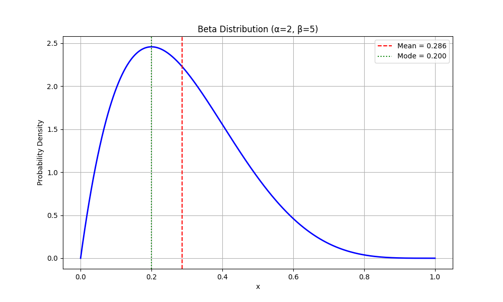
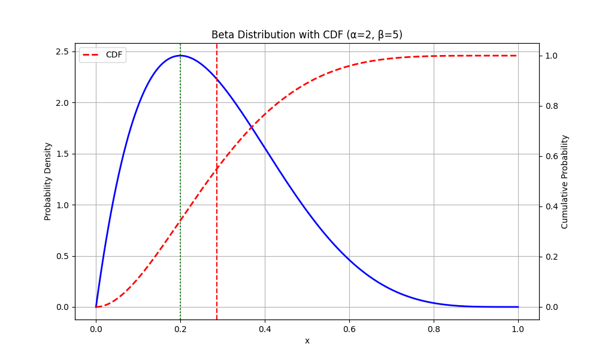
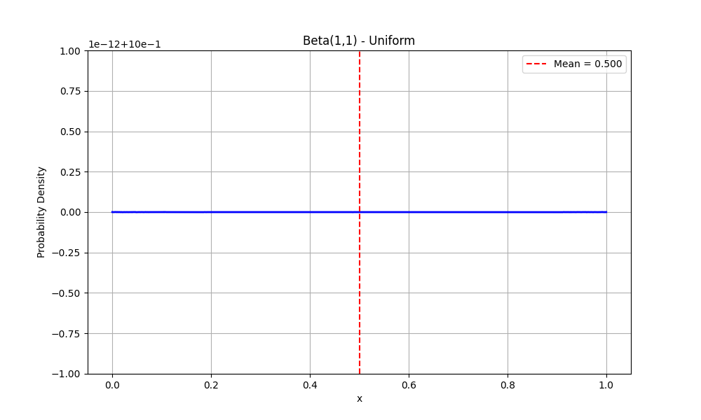
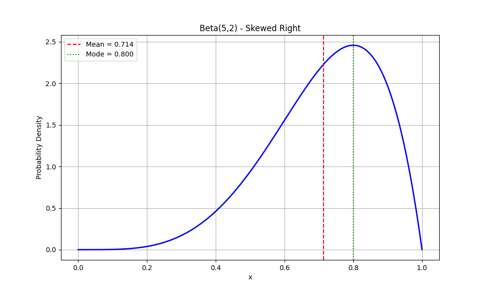
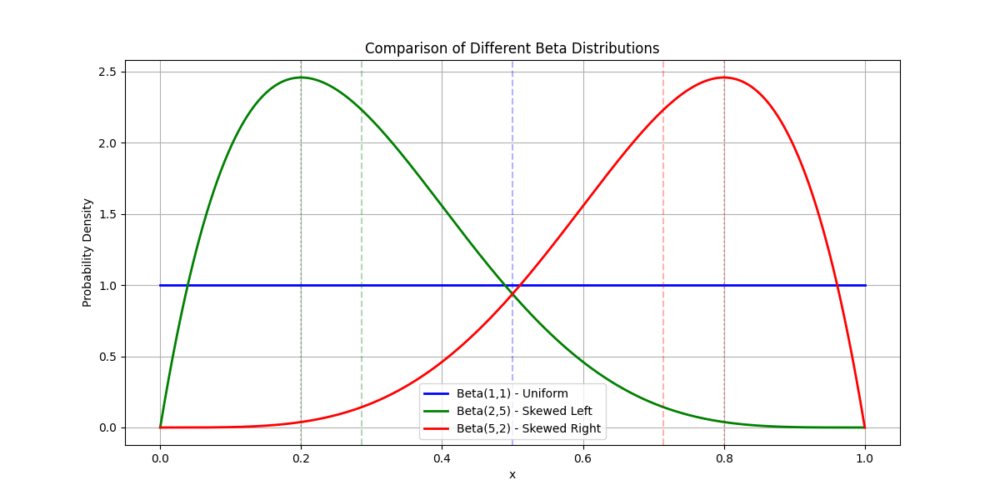

# Beta Distribution Examples

This document provides practical examples of the Beta distribution, which is particularly useful for modeling probabilities and proportions in machine learning.

## Key Concepts and Formulas

The Beta distribution is defined on the interval [0,1] and is characterized by two shape parameters α and β:

### Probability Density Function (PDF)

$$f(x; \alpha, \beta) = \frac{x^{\alpha-1}(1-x)^{\beta-1}}{B(\alpha, \beta)}$$

Where:
- $x \in [0,1]$ is the random variable
- $\alpha > 0$ and $\beta > 0$ are shape parameters
- $B(\alpha, \beta)$ is the Beta function, defined as:
  $$B(\alpha, \beta) = \int_0^1 t^{\alpha-1}(1-t)^{\beta-1} dt = \frac{\Gamma(\alpha)\Gamma(\beta)}{\Gamma(\alpha+\beta)}$$

### Key Properties

- **Mean**: $\mu = \frac{\alpha}{\alpha + \beta}$
- **Mode**: $m = \frac{\alpha - 1}{\alpha + \beta - 2}$ (when $\alpha, \beta > 1$)
- **Variance**: $\sigma^2 = \frac{\alpha\beta}{(\alpha+\beta)^2(\alpha+\beta+1)}$
- **Skewness**: $\frac{2(\beta-\alpha)\sqrt{\alpha+\beta+1}}{(\alpha+\beta+2)\sqrt{\alpha\beta}}$
- **Kurtosis**: $\frac{6[(\alpha-\beta)^2(\alpha+\beta+1)-\alpha\beta(\alpha+\beta+2)]}{\alpha\beta(\alpha+\beta+2)(\alpha+\beta+3)}$

## Examples

### Example 1: Basic Beta Distribution Properties

#### Problem Statement
Consider a Beta distribution with parameters α = 2 and β = 5. Calculate and visualize:
1. The probability density function
2. The mean, mode, and variance
3. The probability that x < 0.3

#### Solution

##### Step 1: Calculate Key Statistics
- **Mean**: $\mu = \frac{\alpha}{\alpha+\beta} = \frac{2}{2+5} = \frac{2}{7} \approx 0.286$
- **Mode**: $m = \frac{\alpha-1}{\alpha+\beta-2} = \frac{2-1}{2+5-2} = \frac{1}{5} = 0.200$
- **Variance**: $\sigma^2 = \frac{\alpha\beta}{(\alpha+\beta)^2(\alpha+\beta+1)} = \frac{2 \times 5}{(2+5)^2(2+5+1)} = \frac{10}{49 \times 8} \approx 0.026$

##### Step 2: Calculate P(X < 0.3)
Using the cumulative distribution function:
$$P(X < 0.3) = \int_0^{0.3} f(x; 2, 5) dx \approx 0.580$$





### Example 2: Comparing Different Beta Distributions

#### Problem Statement
Compare three different Beta distributions:
1. Beta(1,1) - Uniform distribution
2. Beta(2,5) - Skewed left
3. Beta(5,2) - Skewed right

Calculate and visualize their properties.

#### Solution

##### Step 1: Calculate Properties for Each Distribution

1. Beta(1,1):
   - PDF: $f(x; 1, 1) = 1$ (uniform)
   - Mean: $\mu = \frac{1}{1+1} = 0.5$
   - Mode: undefined (uniform)
   - Variance: $\sigma^2 = \frac{1 \times 1}{(1+1)^2(1+1+1)} = \frac{1}{12} \approx 0.0833$



2. Beta(2,5):
   - PDF: $f(x; 2, 5) = \frac{x^{2-1}(1-x)^{5-1}}{B(2,5)}$
   - Mean: $\mu = \frac{2}{2+5} = \frac{2}{7} \approx 0.286$
   - Mode: $m = \frac{2-1}{2+5-2} = \frac{1}{5} = 0.2$
   - Variance: $\sigma^2 = \frac{2 \times 5}{(2+5)^2(2+5+1)} = \frac{10}{49 \times 8} \approx 0.0255$


3. Beta(5,2):
   - PDF: $f(x; 5, 2) = \frac{x^{5-1}(1-x)^{2-1}}{B(5,2)}$
   - Mean: $\mu = \frac{5}{5+2} = \frac{5}{7} \approx 0.714$
   - Mode: $m = \frac{5-1}{5+2-2} = \frac{4}{5} = 0.8$
   - Variance: $\sigma^2 = \frac{5 \times 2}{(5+2)^2(5+2+1)} = \frac{10}{49 \times 8} \approx 0.0255$





## Key Insights

### Theoretical Insights
- The Beta distribution is defined on the interval [0,1] making it ideal for modeling probabilities
- The shape parameters α and β control the distribution's shape, location, and dispersion
- The distribution becomes more concentrated as α + β increases
- The Beta function B(α,β) normalizes the distribution to ensure it integrates to 1

### Practical Applications
- Modeling random probabilities and proportions
- Representing uncertainty in continuous values between 0 and 1
- Analyzing distributions of rates and percentages
- Modeling variability in proportions across different scenarios

### Common Pitfalls
- Using improper parameters (α ≤ 0 or β ≤ 0)
- Interpreting the mode when α or β ≤ 1
- Confusing the Beta distribution with the Binomial distribution
- Not considering the full shape of the distribution when working with probabilities

## Running the Examples

You can run the code that generates these examples and visualizations using:

```bash
python3 ML_Obsidian_Vault/Lectures/2/Codes/1_beta_examples.py
```

## Related Topics

- [[L2_1_Continuous_Distributions|Continuous Distributions]]: Other important continuous probability distributions
- [[L2_1_PMF_PDF_CDF|PMF, PDF, and CDF]]: Fundamental concepts for working with probability distributions
- [[L2_1_Expectation|Expectation]]: Expected values and moments of probability distributions
- [[L2_1_Variance|Variance and Moments]]: Measures of dispersion and higher moments 