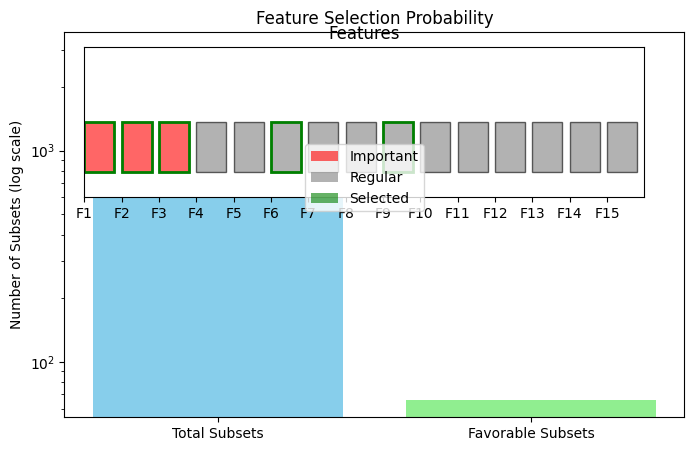
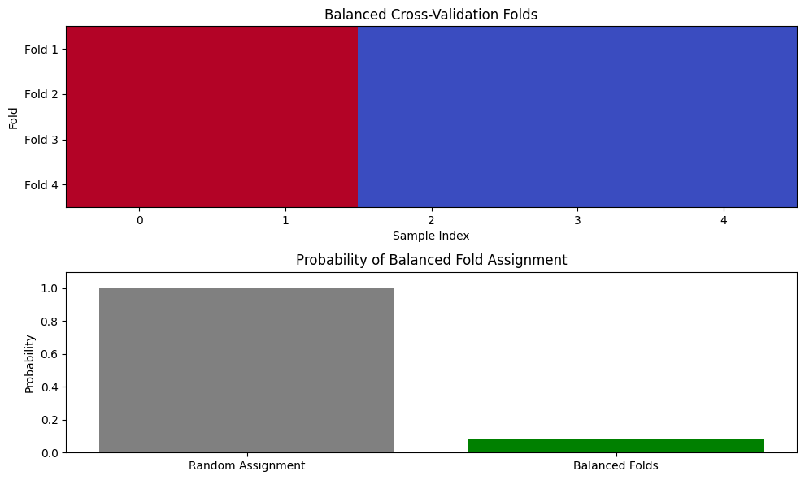
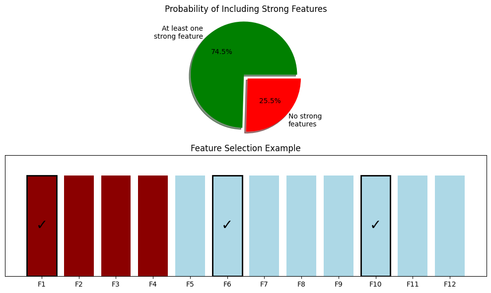
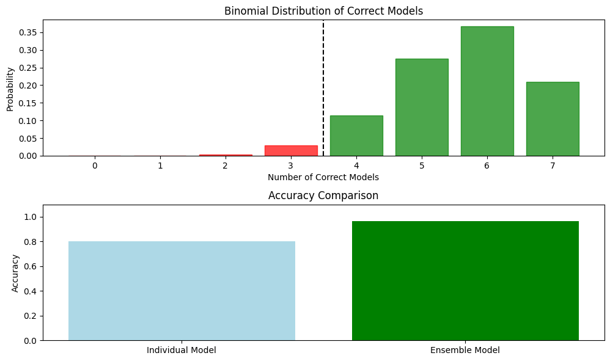
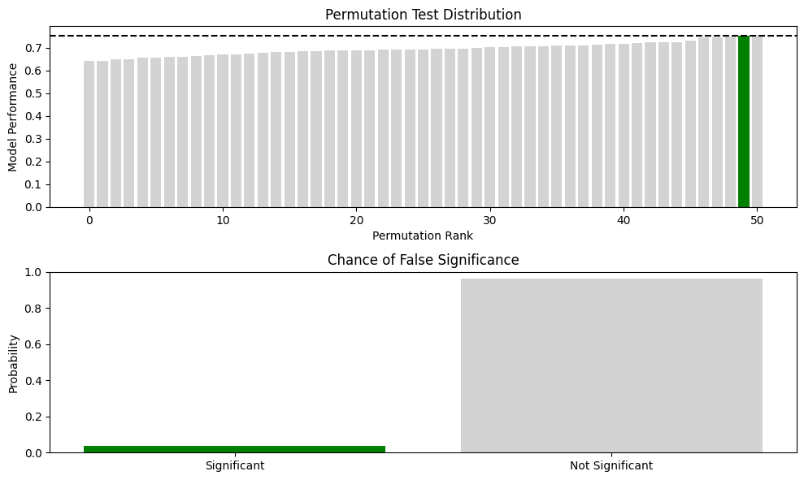

# Combinatorial Probability Examples

This document provides practical examples of combinatorial probability for various scenarios, illustrating the concept of counting outcomes systematically and applying probability principles to combinatorial problems.

## Key Concepts and Formulas

Combinatorial probability combines principles of counting with probability theory to solve problems involving large sets of possible outcomes. It's essential for understanding many machine learning concepts, especially in areas like random sampling, model ensembles, and permutation tests.

### Key Counting Principles

1. **Multiplication Principle**: If there are $m$ ways to perform task 1 and $n$ ways to perform task 2, then there are $m \times n$ ways to perform both tasks in sequence.

2. **Addition Principle**: If task A can be performed in $m$ ways and task B can be performed in $n$ ways, and the tasks cannot be performed simultaneously, then performing either task A or task B can be done in $m + n$ ways.

### Important Combinatorial Formulas

- **Permutations** (ordered arrangements without repetition):
  $$P(n,k) = \frac{n!}{(n-k)!}$$
  
- **Combinations** (unordered selections without repetition):
  $$C(n,k) = {n \choose k} = \frac{n!}{k!(n-k)!}$$
  
- **Permutations with repetition** allowed:
  $$n^k$$
  
- **Combinations with repetition** allowed:
  $${n+k-1 \choose k}$$

- **Multinomial coefficient** (arrangements with specified counts):
  $${n \choose n_1, n_2, \ldots, n_k} = \frac{n!}{n_1! \times n_2! \times \ldots \times n_k!}$$

## Examples

The following examples demonstrate combinatorial probability:

- **Basic Counting Principles**: Simple permutation and combination scenarios
- **Feature Selection Problems**: Combinatorial aspects of feature selection in ML
- **Data Sampling**: Probability calculations in various sampling schemes
- **Model Ensemble Scenarios**: Combinatorial aspects of ensemble methods
- **Permutation Tests**: Applications to statistical significance testing

### Example 1: Basic Feature Selection

#### Problem Statement
A data scientist is working with a dataset containing 15 features. They want to select a subset of 5 features for a simpler model. 

a) How many different possible feature subsets could they choose?
b) If 3 of the features are known to be highly predictive, what is the probability that a randomly selected 5-feature subset contains all of these important features?

#### Solution

##### Step 1: Calculate the total number of possible 5-feature subsets
This is a combination problem since the order of features doesn't matter. We need to calculate $C(15,5)$.

$$C(15,5) = {15 \choose 5} = \frac{15!}{5!(15-5)!} = \frac{15!}{5!10!} = \frac{15 \times 14 \times 13 \times 12 \times 11}{5 \times 4 \times 3 \times 2 \times 1} = 3003$$

There are 3,003 possible ways to select 5 features from the 15 available features.

##### Step 2: Calculate the number of subsets containing all 3 important features
If we must include the 3 important features, then we only need to select 2 more features from the remaining 12 features. This can be done in $C(12,2)$ ways.

$$C(12,2) = {12 \choose 2} = \frac{12!}{2!(12-2)!} = \frac{12!}{2!10!} = \frac{12 \times 11}{2 \times 1} = 66$$

##### Step 3: Calculate the probability
The probability of randomly selecting a subset that contains all 3 important features is:

$$P(\text{subset contains all 3 important features}) = \frac{\text{Number of favorable subsets}}{\text{Total number of possible subsets}} = \frac{C(12,2)}{C(15,5)} = \frac{66}{3003} = 0.022$$

Therefore, the probability that a randomly selected 5-feature subset contains all 3 important features is approximately 0.022 or 2.2%.



**Key Results:**
- Total possible feature subsets: 3,003
- Subsets containing all 3 important features: 66
- Probability of selecting all important features: 0.022 (2.2%)

The visualization shows a log-scale bar chart comparing the total number of possible subsets to the number of favorable subsets, along with a feature representation where red indicates important features, gray indicates regular features, and green outlines show an example selection that includes all important features plus 2 additional ones.

### Example 2: Cross-Validation Fold Assignment

#### Problem Statement
In k-fold cross-validation, a dataset of n samples is partitioned into k equal-sized folds. Consider a dataset with 20 samples that needs to be divided into 4 folds of 5 samples each.

a) How many different ways can the samples be divided into 4 equal-sized folds?
b) If we have 8 positive samples and 12 negative samples, what is the probability that a random fold assignment will result in each fold having exactly 2 positive and 3 negative samples?

#### Solution

##### Step 1: Calculate the total number of possible fold assignments
This is equivalent to partitioning 20 samples into 4 groups of 5 each. We can use the multinomial coefficient:

$${20 \choose 5,5,5,5} = \frac{20!}{5! \times 5! \times 5! \times 5!}$$

Let's calculate:
$$\frac{20!}{5! \times 5! \times 5! \times 5!} = \frac{20!}{(5!)^4} \approx 1.17 \times 10^{10}$$

This is approximately 11.7 billion different possible fold assignments.

##### Step 2: Calculate the number of fold assignments with balanced class distribution
For each fold to have exactly 2 positive and 3 negative samples:

For positive samples distribution:
$${8 \choose 2,2,2,2} = \frac{8!}{2! \times 2! \times 2! \times 2!} = 2,520$$

For negative samples distribution:
$${12 \choose 3,3,3,3} = \frac{12!}{3! \times 3! \times 3! \times 3!} = 369,600$$

The total number of favorable assignments is:
$$2,520 \times 369,600 = 931,392,000$$

##### Step 3: Calculate the probability
The probability of a random fold assignment having exactly 2 positive and 3 negative samples in each fold is:

$$P(\text{balanced folds}) = \frac{\text{Number of favorable assignments}}{\text{Total number of possible assignments}} = \frac{931,392,000}{1.17 \times 10^{10}} \approx 0.0794$$

Therefore, the probability is approximately 0.0794 or 7.94%.



**Key Results:**
- Total possible fold assignments: 1.17 × 10^10
- Favorable balanced fold assignments: 931,392,000
- Probability of getting perfectly balanced folds: 0.0794 (7.94%)
- Each balanced fold contains 2 positive samples and 3 negative samples

The visualization shows a grid representation of the balanced cross-validation folds, with each fold containing 2 positive samples (shown in red/warm colors) and 3 negative samples (shown in blue/cool colors). The bottom part shows the probability of getting balanced folds by random assignment (7.94%) compared to random assignment (100%).

### Example 3: Random Forest Feature Sampling

#### Problem Statement
In a Random Forest algorithm, each decision tree is trained on a bootstrap sample of the data, and at each split, only a random subset of features is considered. For a dataset with 12 features, each decision tree considers $\sqrt{12} \approx 3$ features at each split.

a) How many different feature subsets could be considered at each split?
b) If 4 of the features are strongly predictive and the rest are weakly predictive, what is the probability that at least one strongly predictive feature is included in a random subset of 3 features?

#### Solution

##### Step 1: Calculate the total number of possible feature subsets
This is a combination problem since the order of features doesn't matter. We need to calculate $C(12,3)$.

$$C(12,3) = {12 \choose 3} = \frac{12!}{3!(12-3)!} = \frac{12!}{3!9!} = \frac{12 \times 11 \times 10}{3 \times 2 \times 1} = 220$$

There are 220 possible ways to select 3 features from the 12 available features.

##### Step 2: Calculate the number of subsets with at least one strongly predictive feature
We can solve this by calculating the complement: the number of subsets that contain none of the strongly predictive features.

If we exclude all 4 strongly predictive features, we're selecting 3 features from the remaining 8 weakly predictive features. This can be done in $C(8,3)$ ways.

$$C(8,3) = {8 \choose 3} = \frac{8!}{3!(8-3)!} = \frac{8!}{3!5!} = \frac{8 \times 7 \times 6}{3 \times 2 \times 1} = 56$$

Therefore, the number of subsets with at least one strongly predictive feature is:
$$220 - 56 = 164$$

##### Step 3: Calculate the probability
The probability of randomly selecting a subset that includes at least one strongly predictive feature is:

$$P(\text{at least one strongly predictive feature}) = \frac{\text{Number of favorable subsets}}{\text{Total number of possible subsets}} = \frac{164}{220} = 0.7455$$

Therefore, the probability that a randomly selected subset of 3 features contains at least one strongly predictive feature is approximately 0.7455 or 74.55%.



**Key Results:**
- Total possible feature subsets: 220
- Subsets with no strong features: 56
- Subsets with at least one strong feature: 164
- Probability of including at least one strong feature: 0.7455 (74.55%)

The visualization includes a pie chart showing that 74.55% of possible feature subsets include at least one strong predictive feature, with the remaining 25.45% containing only weak features. Below is a bar representation of all 12 features, with the 4 strongly predictive features shown in dark red and the weakly predictive features in light blue. An example selection of 3 features (marked with ✓) shows one strong feature and two weak features.

### Example 4: Ensemble Model Majority Voting

#### Problem Statement
An ensemble consists of 7 base models, each with 80% accuracy on a binary classification task. Assuming the models make independent errors, what is the probability that the ensemble will make the correct prediction when using majority voting?

#### Solution

##### Step 1: Define the problem in terms of combinations
For the ensemble to make a correct prediction with majority voting, at least 4 out of the 7 models must make correct predictions.

##### Step 2: Calculate the probability for each successful case
We need to find the probability of exactly k models being correct, where k = 4, 5, 6, or 7.

For k correct models (and 7-k incorrect models), we use the binomial probability formula:
$$P(k \text{ models correct}) = {7 \choose k} \times (0.8)^k \times (0.2)^{7-k}$$

Let's calculate each case:

For k = 4:
$$P(4 \text{ models correct}) = {7 \choose 4} \times (0.8)^4 \times (0.2)^3 = 35 \times 0.4096 \times 0.008 = 0.1147$$

For k = 5:
$$P(5 \text{ models correct}) = {7 \choose 5} \times (0.8)^5 \times (0.2)^2 = 21 \times 0.32768 \times 0.04 = 0.2753$$

For k = 6:
$$P(6 \text{ models correct}) = {7 \choose 6} \times (0.8)^6 \times (0.2)^1 = 7 \times 0.262144 \times 0.2 = 0.3670$$

For k = 7:
$$P(7 \text{ models correct}) = {7 \choose 7} \times (0.8)^7 \times (0.2)^0 = 1 \times 0.2097152 \times 1 = 0.2097$$

##### Step 3: Calculate the total probability
The probability that the ensemble makes a correct prediction is the sum of all these individual probabilities:

$$P(\text{ensemble correct}) = P(4 \text{ correct}) + P(5 \text{ correct}) + P(6 \text{ correct}) + P(7 \text{ correct})$$
$$P(\text{ensemble correct}) = 0.1147 + 0.2753 + 0.3670 + 0.2097 = 0.9667$$

Therefore, the probability that the ensemble will make the correct prediction using majority voting is approximately 0.9667 or 96.67%, which is significantly higher than the 80% accuracy of each individual model.



**Key Results:**
- Individual model accuracy: 80%
- Ensemble model accuracy: 96.67%
- Improvement: 20.8% over individual models
- Majority threshold: 4 out of 7 models must be correct

The visualization shows two parts:
1. The top graph displays the binomial distribution of the number of correct models, with green bars indicating configurations that lead to a correct ensemble prediction (≥ 4 correct models) and red bars showing incorrect predictions (≤ 3 correct models).
2. The bottom graph compares the individual model accuracy (80%) with the ensemble model accuracy (96.67%), demonstrating the significant improvement achieved through majority voting.

### Example 5: Permutation Test for Feature Importance

#### Problem Statement
A data scientist wants to assess the importance of a feature in a machine learning model. They decide to use a permutation test with 50 permutations. In each permutation, the values of the feature are randomly shuffled, and the model performance is evaluated. 

If the feature truly has no predictive power, what is the probability that the original unpermuted feature will appear to be significant at the α = 0.05 level based on the permutation test?

#### Solution

##### Step 1: Understand the permutation test
In a permutation test, if the null hypothesis is true (the feature has no predictive power), then any permutation of the feature values should be equally likely to produce any particular model performance.

##### Step 2: Define the significance criteria
For the feature to appear significant at the α = 0.05 level, the performance with the original unpermuted feature must be in the top 5% of all performances (including the original and the 50 permutations).

The total number of test cases is 51 (the original feature plus 50 permutations). The top 5% of 51 is 51 × 0.05 = 2.55, which means the original feature must rank 1st or 2nd to be considered significant.

##### Step 3: Calculate the probability
Under the null hypothesis, the rank of the original feature's performance is equally likely to be any value from 1 to 51 (original + 50 permutations).

The probability of the original feature ranking 1st or 2nd out of 51 equally likely positions is:
$$P(\text{significant at } \alpha = 0.05) = \frac{2}{51} \approx 0.0392$$

Therefore, even if the feature truly has no predictive power, there is approximately a 3.92% chance that it will appear significant at the α = 0.05 level based on the permutation test. This is slightly less than the nominal significance level of 5% because we have a discrete number of permutations.



**Key Results:**
- Number of permutations: 50
- Total test cases (including original): 51
- Significance threshold: top 2 performances (approximately 5%)
- Probability of false significance: 0.0392 (3.92%)

The visualization shows two parts:
1. The top graph displays the distribution of model performances across all permutations, with a significance threshold line. The colored bar highlights where the original feature's performance might fall.
2. The bottom graph shows the probability of getting a significant result by chance (3.92%) versus a non-significant result (96.08%) when the feature has no real predictive power.

## Key Insights

### Theoretical Insights
- Combinatorial probability provides a systematic approach to calculating probabilities for complex scenarios with many possible outcomes
- The choice between permutations and combinations depends on whether order matters in the problem
- The inclusion-exclusion principle is essential for calculating probabilities involving overlapping sets

### Machine Learning Applications
- Feature selection often involves combinatorial problems (choosing k features from n total features)
- Cross-validation involves partitioning data into training and testing sets, which is a combinatorial problem
- Ensemble methods rely on combinatorial aspects when combining multiple models
- Permutation tests use random shuffling to assess statistical significance
- Bootstrap sampling involves random sampling with replacement, which has combinatorial properties

### Common Pitfalls
- Confusing permutations (order matters) with combinations (order doesn't matter)
- Overlooking the difference between sampling with and without replacement
- Assuming independence when calculating probabilities in machine learning contexts
- Neglecting the effect of the "curse of dimensionality" in high-dimensional feature spaces

## Running the Examples

You can run the code that generates these examples and visualizations using:

```bash
python3 ML_Obsidian_Vault/Lectures/2/Codes/1_combinatorial_probability_examples.py
``` 

## Related Topics

- [[L2_1_Basic_Probability|Basic Probability]]: Foundation for understanding combinatorial probability
- [[L2_1_Discrete_Probability_Examples|Discrete Probability Examples]]: Related examples for discrete probability spaces
- [[L2_1_Machine_Learning_Probability_Examples|Machine Learning Probability Examples]]: Further examples of probability in ML contexts
