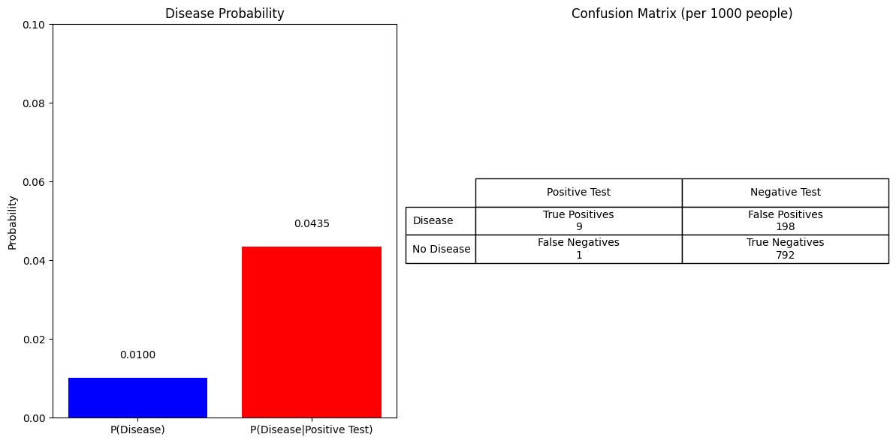
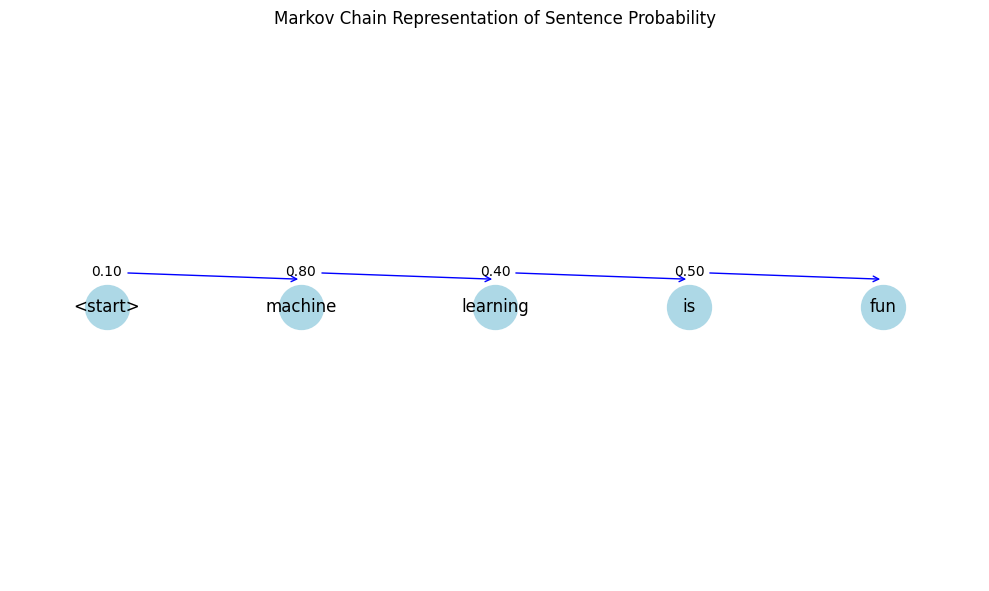
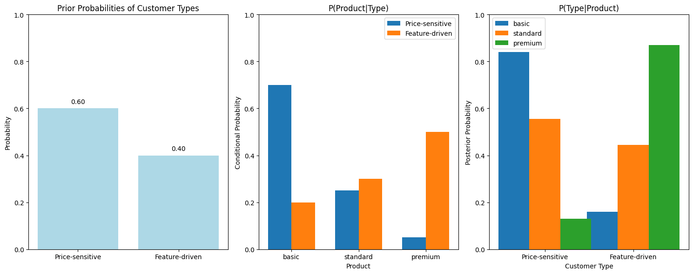

# Conditional Probability & Bayes' Theorem: ML Applications

This document provides practical examples of conditional probability and Bayes' theorem applied to machine learning tasks, illustrating how these fundamental concepts underpin various ML algorithms and techniques.

## Key Concepts and Formulas

Conditional probability and Bayes' theorem provide the mathematical foundation for many classification algorithms, probabilistic models, and inference techniques in machine learning.

### Conditional Probability

$$P(A|B) = \frac{P(A \cap B)}{P(B)}$$

Where:
- $P(A|B)$ = Probability of event A given that event B has occurred
- $P(A \cap B)$ = Probability of both events A and B occurring (joint probability)
- $P(B)$ = Probability of event B

### Bayes' Theorem

$$P(A|B) = \frac{P(B|A) \times P(A)}{P(B)}$$

Where:
- $P(A|B)$ = Posterior probability (what we want to calculate)
- $P(B|A)$ = Likelihood (probability of the evidence given the hypothesis)
- $P(A)$ = Prior probability (initial belief about A)
- $P(B)$ = Evidence (marginal likelihood, acts as a normalizing constant)

### Chain Rule of Probability

$$P(A_1, A_2, ..., A_n) = P(A_1) \times P(A_2|A_1) \times P(A_3|A_1,A_2) \times ... \times P(A_n|A_1,A_2,...,A_{n-1})$$

### Law of Total Probability

$$P(B) = \sum_{i} P(B|A_i)P(A_i)$$

Where:
- $A_i$ forms a partition of the sample space (mutually exclusive and collectively exhaustive)

## Examples

The following examples demonstrate the application of conditional probability and Bayes' theorem in machine learning:

- **Email Spam Classification**: Using Naive Bayes for text classification
- **Medical Diagnosis**: Interpreting test results for rare diseases
- **Sequential Data Modeling**: Applying the chain rule in language models
- **Latent Variable Models**: Handling hidden variables with marginalization

### Example 1: Email Spam Classification with Naive Bayes

#### Problem Statement

In this example, we'll demonstrate how Naive Bayes classifiers work for spam detection, using a simplified dataset of 10 emails with features extracted from the text.

Naive Bayes classifiers apply Bayes' theorem with a "naive" independence assumption between features:

$$P(y|x_1, x_2, ..., x_n) = \frac{P(y) \times P(x_1, x_2, ..., x_n|y)}{P(x_1, x_2, ..., x_n)}$$

With the naive independence assumption, this becomes:

$$P(y|x_1, x_2, ..., x_n) = \frac{P(y) \times \prod_{i=1}^{n} P(x_i|y)}{P(x_1, x_2, ..., x_n)}$$

Since the denominator is constant for a given input, we can simplify to:

$$P(y|x_1, x_2, ..., x_n) \propto P(y) \times \prod_{i=1}^{n} P(x_i|y)$$

#### Solution

##### Step 1: Feature Extraction
For spam detection, we convert email text into word frequency features (bag-of-words approach).

Example emails:
```
Spam: "Get discount now buy limited offer"
Ham: "Meeting scheduled for tomorrow"
Spam: "Free money claim your prize now"
...
```

After vectorization, each email is represented as a vector of word counts with features like 'discount', 'free', 'meeting', etc.

##### Step 2: Calculate Prior Probabilities

$$P(\text{spam}) = \frac{\text{number of spam emails}}{\text{total number of emails}} = \frac{5}{10} = 0.50$$

$$P(\text{ham}) = \frac{\text{number of ham emails}}{\text{total number of emails}} = \frac{5}{10} = 0.50$$

##### Step 3: Calculate Likelihoods

For each word, we calculate the probability of it appearing in spam and ham emails (with Laplace smoothing):

| Word     | Count in Spam | Count in Ham | $P(\text{Word}\|\text{Spam})$ | $P(\text{Word}\|\text{Ham})$ |
|----------|---------------|--------------|---------------|--------------|
| discount | 2             | 0            | 0.0600        | 0.0222       |
| free     | 2             | 0            | 0.0600        | 0.0222       |
| meeting  | 0             | 2            | 0.0200        | 0.0667       |
| report   | 0             | 1            | 0.0200        | 0.0444       |

##### Step 4: Classification Using Bayes' Theorem

For a new email "Free discount offer for you", we calculate:

$$P(\text{spam}|\text{email}) \propto P(\text{spam}) \times P(\text{free}|\text{spam}) \times P(\text{discount}|\text{spam}) \times P(\text{offer}|\text{spam})$$

$$P(\text{ham}|\text{email}) \propto P(\text{ham}) \times P(\text{free}|\text{ham}) \times P(\text{discount}|\text{ham}) \times P(\text{offer}|\text{ham})$$

To avoid numerical underflow, we use logarithms:

$$\log P(\text{spam}|\text{email}) = \log P(\text{spam}) + \log P(\text{free}|\text{spam}) + \log P(\text{discount}|\text{spam}) + \log P(\text{offer}|\text{spam})$$

The calculations show:
- Initial $\log P(\text{spam}) = -0.6931$
- After 'free': $\log P(\text{spam}) = -3.5066$
- After 'discount': $\log P(\text{spam}) = -6.3200$
- After 'offer': $\log P(\text{spam}) = -9.5388$

- Initial $\log P(\text{ham}) = -0.6931$
- After 'free': $\log P(\text{ham}) = -4.4998$
- After 'discount': $\log P(\text{ham}) = -8.3065$  
- After 'offer': $\log P(\text{ham}) = -12.1131$

After normalizing:
- $P(\text{spam}|\text{email}) = 0.9292$
- $P(\text{ham}|\text{email}) = 0.0708$

Therefore, the email is classified as spam with 92.92% confidence.

##### Step 5: Using scikit-learn's Implementation

When implemented with scikit-learn's MultinomialNB, we get similar results:
- Predicted class: spam
- Probability of spam: 0.9404
- Probability of ham: 0.0596

### Example 2: Medical Diagnosis with Bayes' Theorem

#### Problem Statement

A disease affects 1% of the population. There is a test that is 90% sensitive ($P(+|D) = 0.9$) and 80% specific ($P(-|{\sim}D) = 0.8$). If a person tests positive, what is the probability they have the disease?

#### Solution

##### Step 1: Define the Probabilities
- $P(D) = 0.01$ (prior probability of disease)
- $P({\sim}D) = 0.99$ (prior probability of no disease)
- $P(+|D) = 0.9$ (sensitivity: probability of positive test given disease)
- $P(-|{\sim}D) = 0.8$ (specificity: probability of negative test given no disease)
- $P(+|{\sim}D) = 0.2$ (probability of positive test given no disease)

##### Step 2: Calculate Total Probability of a Positive Test

$$P(+) = P(+|D) \times P(D) + P(+|{\sim}D) \times P({\sim}D)$$
$$P(+) = 0.9 \times 0.01 + 0.2 \times 0.99 = 0.009 + 0.198 = 0.207$$

##### Step 3: Apply Bayes' Theorem

$$P(D|+) = \frac{P(+|D) \times P(D)}{P(+)}$$
$$P(D|+) = \frac{0.9 \times 0.01}{0.207} = \frac{0.009}{0.207} = 0.0435$$

Therefore, if a person tests positive, the probability they actually have the disease is only about 4.35%, despite the high test sensitivity.

This example illustrates the "base rate fallacy" – the tendency to ignore base rate information (the disease prevalence) and focus too much on specific information (the test result).



### Example 3: Chain Rule Application in Sequential Data

#### Problem Statement

Calculate the probability of a sentence "machine learning is fun" using a Markov model and the chain rule of probability.

#### Solution

In language modeling, we use the chain rule to calculate the probability of a sequence:

$$P(w_1, w_2, ..., w_n) = P(w_1) \times P(w_2|w_1) \times P(w_3|w_1,w_2) \times ... \times P(w_n|w_1,...,w_{n-1})$$

For a first-order Markov model, we simplify this to:

$$P(w_1, w_2, ..., w_n) \approx P(w_1) \times P(w_2|w_1) \times P(w_3|w_2) \times ... \times P(w_n|w_{n-1})$$

Given the conditional probabilities:

- $P(\text{machine}|{\langle}\text{start}{\rangle}) = 0.1$
- $P(\text{learning}|\text{machine}) = 0.8$
- $P(\text{is}|\text{learning}) = 0.4$
- $P(\text{fun}|\text{is}) = 0.5$

We calculate:

$$P(\text{"machine learning is fun"}) = P(\text{machine}) \times P(\text{learning}|\text{machine}) \times P(\text{is}|\text{learning}) \times P(\text{fun}|\text{is})$$
$$P(\text{"machine learning is fun"}) = 0.1 \times 0.8 \times 0.4 \times 0.5 = 0.016$$

This chain rule approach forms the foundation of many NLP models, including n-gram models, Hidden Markov Models, and even more complex models like RNNs and Transformers.



### Example 4: Marginalization and Hidden Variables

#### Problem Statement

Customer purchase data analysis with hidden customer types. We want to model the probability of purchase behavior, taking into account unobserved (latent) customer types: price-sensitive (Type 0) and feature-driven (Type 1).

#### Solution

##### Step 1: Define the Model
- Prior probabilities of customer types:
  - $P(\text{Type}=0) = 0.6$ (price-sensitive)
  - $P(\text{Type}=1) = 0.4$ (feature-driven)

- Conditional probabilities of product purchases given customer type:
  - For basic product: $P(\text{basic}|\text{Type}=0) = 0.7$, $P(\text{basic}|\text{Type}=1) = 0.2$
  - For standard product: $P(\text{standard}|\text{Type}=0) = 0.25$, $P(\text{standard}|\text{Type}=1) = 0.3$
  - For premium product: $P(\text{premium}|\text{Type}=0) = 0.05$, $P(\text{premium}|\text{Type}=1) = 0.5$

##### Step 2: Calculate Marginal Probabilities Using the Law of Total Probability

$$P(\text{Product}) = \sum_{\text{type}} P(\text{Product}|\text{Type}) \times P(\text{Type})$$

For basic product:
$$P(\text{basic}) = P(\text{basic}|\text{Type}=0) \times P(\text{Type}=0) + P(\text{basic}|\text{Type}=1) \times P(\text{Type}=1)$$
$$P(\text{basic}) = 0.7 \times 0.6 + 0.2 \times 0.4 = 0.42 + 0.08 = 0.5$$

Similarly:
- $P(\text{standard}) = 0.25 \times 0.6 + 0.3 \times 0.4 = 0.15 + 0.12 = 0.27$
- $P(\text{premium}) = 0.05 \times 0.6 + 0.5 \times 0.4 = 0.03 + 0.2 = 0.23$

##### Step 3: Calculate Posterior Probabilities Using Bayes' Theorem

$$P(\text{Type}|\text{Product}) = \frac{P(\text{Product}|\text{Type}) \times P(\text{Type})}{P(\text{Product})}$$

For price-sensitive customers (Type=0) given they purchased a basic product:
$$P(\text{Type}=0|\text{basic}) = \frac{P(\text{basic}|\text{Type}=0) \times P(\text{Type}=0)}{P(\text{basic})}$$
$$P(\text{Type}=0|\text{basic}) = \frac{0.7 \times 0.6}{0.5} = \frac{0.42}{0.5} = 0.84$$

Similarly:
- $P(\text{Type}=1|\text{basic}) = \frac{0.2 \times 0.4}{0.5} = \frac{0.08}{0.5} = 0.16$
- $P(\text{Type}=0|\text{standard}) = \frac{0.25 \times 0.6}{0.27} = \frac{0.15}{0.27} = 0.5556$
- $P(\text{Type}=1|\text{standard}) = \frac{0.3 \times 0.4}{0.27} = \frac{0.12}{0.27} = 0.4444$
- $P(\text{Type}=0|\text{premium}) = \frac{0.05 \times 0.6}{0.23} = \frac{0.03}{0.23} = 0.1304$
- $P(\text{Type}=1|\text{premium}) = \frac{0.5 \times 0.4}{0.23} = \frac{0.2}{0.23} = 0.8696$

This example demonstrates how marginalization allows us to handle unobserved variables in probabilistic models, which is fundamental to many ML techniques including mixture models, hidden Markov models, and latent Dirichlet allocation.



## Key Insights

### Theoretical Insights
- Bayes' theorem allows us to invert conditional probabilities, calculating $P(\text{hypothesis}|\text{data})$ from $P(\text{data}|\text{hypothesis})$
- The naive independence assumption in Naive Bayes is often violated in practice, but the algorithm can still perform well
- Base rates significantly impact posterior probabilities in diagnostic applications
- The chain rule enables decomposition of joint probabilities into more manageable conditional probabilities

### Practical Applications
- Text classification, spam filtering, and document categorization
- Medical diagnosis, risk assessment, and anomaly detection
- Sequential data modeling (NLP, time series)
- Recommendation systems and customer segmentation
- Handling missing data and latent variables

### Common Pitfalls
- Base rate fallacy: ignoring prior probabilities, especially with rare events
- Independence assumption violations: correlated features can impact model performance
- Probability calibration: raw probabilities from Naive Bayes are often poorly calibrated
- Zero probabilities: need smoothing techniques to handle unseen features

## Practical Implementation

You can run the code that generates these examples and visualizations using:

```bash
python3 ML_Obsidian_Vault/Lectures/2/Codes/1_conditional_bayes_ml_examples.py
```

## Related Topics

- [[L2_1_Independence|Independence]]: Understanding when events don't influence each other's probabilities
- [[L2_1_Joint_Probability|Joint Probability]]: Working with multiple random variables simultaneously  
- [[L2_1_Basic_Conditional_Probability_Examples|Basic Conditional Probability Examples]]: Simpler examples of conditional probability