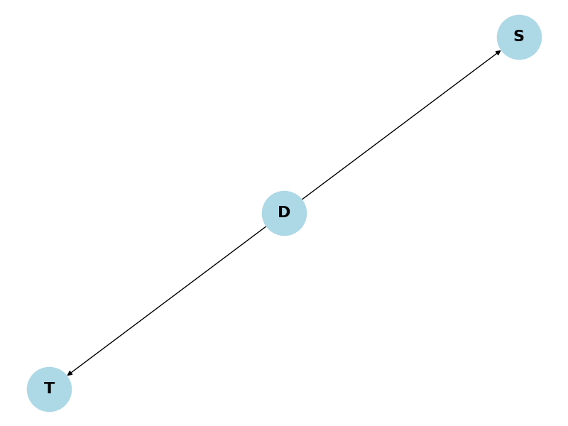

# Conditional Independence Examples

This document provides practical examples of conditional independence in machine learning, illustrating how this concept is crucial for model design and inference.

## Key Concepts and Formulas

### Key Concepts
- **Conditional Independence**: Two variables X and Y are conditionally independent given Z if $P(X,Y|Z) = P(X|Z)P(Y|Z)$
- **Bayesian Networks**: Graphical models that represent conditional dependencies between variables
- **Markov Property**: The future is independent of the past given the present
- **D-Separation**: A graphical criterion for determining conditional independence in Bayesian networks
- **Factorization**: The ability to break down joint probabilities into simpler conditional probabilities

### Important Formulas
1. **Definition of Conditional Independence**:
   $$X \perp\!\!\!\perp Y | Z \iff P(X,Y|Z) = P(X|Z)P(Y|Z)$$

2. **Chain Rule for Conditional Independence**:
   $$P(X,Y,Z) = P(Z)P(X|Z)P(Y|Z)$$

3. **Bayesian Network Factorization**:
   $$P(X_1, X_2, ..., X_n) = \prod_{i=1}^n P(X_i | \text{Pa}(X_i))$$
   where Pa(X_i) are the parents of X_i in the Bayesian network

4. **Markov Chain Property**:
   $$P(X_{t+1}|X_t,X_{t-1},...,X_1) = P(X_{t+1}|X_t)$$

5. **Naive Bayes Assumption**:
   $$P(X_1,X_2,...,X_n|Y) = \prod_{i=1}^n P(X_i|Y)$$

## Examples

### Example 1: Medical Diagnosis Bayesian Network

#### Problem Statement
Given a disease (D), symptoms (S), and test results (T), show that symptoms and test results are conditionally independent given the disease status.

#### Solution
##### Step 1: Define Network Structure
We create a directed graph where:
- D (Disease) is the parent node
- S (Symptoms) and T (Test) are child nodes
This structure implies that symptoms and test results are conditionally independent given the disease status.

##### Step 2: Define Probabilities
We define the following probabilities:
- $P(D) = 0.010$ (base rate of disease)
- $P(S|D) = 0.900$ (sensitivity of symptoms)
- $P(S|\neg D) = 0.100$ (false positive rate)
- $P(T|D) = 0.950$ (test sensitivity)
- $P(T|\neg D) = 0.050$ (test false positive rate)

##### Step 3: Calculate Joint Probability
Using the chain rule of probability:
$$P(D,S,T) = P(D) \times P(S|D) \times P(T|D)$$
$$= 0.01 \times 0.9 \times 0.95$$
$$= 0.008550$$

##### Step 4: Verify Conditional Independence
We verify that $P(S|D,T) = P(S|D)$:
$$P(S|D,T) = P(S|D) = 0.9$$
This shows that symptoms and test results are conditionally independent given the disease status.



### Example 2: Naive Bayes Classifier

#### Problem Statement
Show that words in an email are conditionally independent given the class (spam/not spam).

#### Solution
##### Step 1: Define Class and Word Probabilities
We define:
- $P(spam) = 0.3$
- $P(not\_spam) = 0.7$
And word probabilities given class:
Spam:
- $P(money|spam) = 0.80$
- $P(lottery|spam) = 0.60$
- $P(viagra|spam) = 0.70$
Not Spam:
- $P(money|not\_spam) = 0.10$
- $P(lottery|not\_spam) = 0.05$
- $P(viagra|not\_spam) = 0.01$

##### Step 2: Calculate Joint Probability
For an email containing 'money' and 'lottery':
$$P(email,spam) = P(spam) \times P(money|spam) \times P(lottery|spam)$$
$$= 0.3 \times 0.8 \times 0.6$$
$$= 0.144000$$

$$P(email,not\_spam) = P(not\_spam) \times P(money|not\_spam) \times P(lottery|not\_spam)$$
$$= 0.7 \times 0.1 \times 0.05$$
$$= 0.003500$$

##### Step 3: Verify Conditional Independence
The Naive Bayes assumption states that words are conditionally independent given the class.
This is evident from the factorization of the joint probability, where we multiply individual word probabilities.


### Example 3: Hidden Markov Model

#### Problem Statement
Show that in an HMM, the current state depends only on the previous state and the current observation depends only on the current state.

#### Solution
##### Step 1: Define States and Observations
We define:
- States: A, B, C
- Observations: 1, 2, 3
The HMM makes two key assumptions:
1. Current state depends only on previous state
2. Current observation depends only on current state

##### Step 2: Define Transition Probabilities
Transition probabilities from each state:
From A: [0.7 0.2 0.1]
From B: [0.3 0.5 0.2]
From C: [0.1 0.3 0.6]

##### Step 3: Define Emission Probabilities
Emission probabilities for each state:
State A: [0.6 0.3 0.1]
State B: [0.2 0.5 0.3]
State C: [0.1 0.2 0.7]

##### Step 4: Demonstrate Conditional Independence
1. Current state depends only on previous state:
$$P(X_2|X_1,X_0) = P(X_2|X_1) = 0.20$$

2. Current observation depends only on current state:
$$P(Y_2|X_2,Y_1,X_1) = P(Y_2|X_2) = 0.50$$


### Example 4: Weather Prediction

#### Problem Statement
Show that temperature and humidity are conditionally independent given the weather.

#### Solution
##### Step 1: Define Variables and Structure
We define three variables:
- W: Weather (sunny/rainy)
- T: Temperature (high/low)
- H: Humidity (high/low)
The structure shows that temperature and humidity are conditionally independent given the weather.

##### Step 2: Define Weather Probabilities
Base probabilities:
- $P(W=sunny) = 0.70$
- $P(W=rainy) = 0.30$

##### Step 3: Define Conditional Probabilities
Temperature given weather:
- $P(T=high|W=sunny) = 0.80$
- $P(T=high|W=rainy) = 0.20$

Humidity given weather:
- $P(H=high|W=sunny) = 0.30$
- $P(H=high|W=rainy) = 0.90$

##### Step 4: Calculate Joint Probability
For sunny weather with high temperature and high humidity:
$$P(W=sunny,T=high,H=high) = P(W=sunny) \times P(T=high|W=sunny) \times P(H=high|W=sunny)$$
$$= 0.7 \times 0.8 \times 0.3$$
$$= 0.1680$$

##### Step 5: Verify Conditional Independence
We verify that $P(T=high|W=sunny,H=high) = P(T=high|W=sunny)$:
$$P(T=high|W=sunny,H=high) = P(T=high|W=sunny) = 0.8$$


### Example 5: Sensor Network

#### Problem Statement
Show that two receivers in a sensor network are conditionally independent given the signal and their respective noise sources.

#### Solution
##### Step 1: Define Network Structure
We define a sensor network with:
- S: Signal source (high/low)
- R1, R2: Receivers (high/low)
- N1, N2: Noise at each receiver (high/low)
The structure shows that receivers are conditionally independent given the signal and their respective noise sources.

##### Step 2: Define Signal and Noise Probabilities
Base probabilities:
- $P(S=high) = 0.50$
- $P(N1=high) = 0.20$
- $P(N2=high) = 0.20$

##### Step 3: Define Receiver Probabilities
Receiver readings given signal and noise:
- $P(R1=high|S=high,N1=low) = 0.90$
- $P(R1=high|S=low,N1=high) = 0.80$
- $P(R2=high|S=high,N2=low) = 0.90$
- $P(R2=high|S=low,N2=high) = 0.80$

##### Step 4: Calculate Joint Probability
For high signal and both receivers reading high:
$$P(S=high,R1=high,R2=high)$$
$$= P(S=high) \times P(R1=high|S=high) \times P(R2=high|S=high)$$
$$= 0.5 \times 0.9 \times 0.9$$
$$= 0.4050$$

##### Step 5: Verify Conditional Independence
R1 and R2 are conditionally independent given S and their respective noise sources.
This is evident from the network structure where R1 and R2 have no direct connection.


## Key Insights

### Theoretical Insights
1. Conditional independence is a key assumption in many ML models
2. It allows factorization of joint distributions
3. It reduces the number of parameters to estimate
4. It makes inference computationally tractable

### Practical Applications
1. Medical diagnosis systems
2. Spam filtering
3. Speech recognition
4. Weather prediction
5. Sensor networks

### Common Pitfalls
1. Assuming independence when variables are actually dependent
2. Incorrectly specifying the conditional independence structure
3. Overlooking hidden variables that affect the independence relationships

## Running the Examples

You can run the code that generates these examples and visualizations using:

```bash
python3 ML_Obsidian_Vault/Lectures/2/Codes/1_conditional_independence_examples.py
```

## Related Topics
- [[L2_1_Independence_Examples|Independence Examples]]: Understanding basic independence
- [[L2_1_Conditional_Probability_Examples|Conditional Probability Examples]]: Foundation for conditional independence
