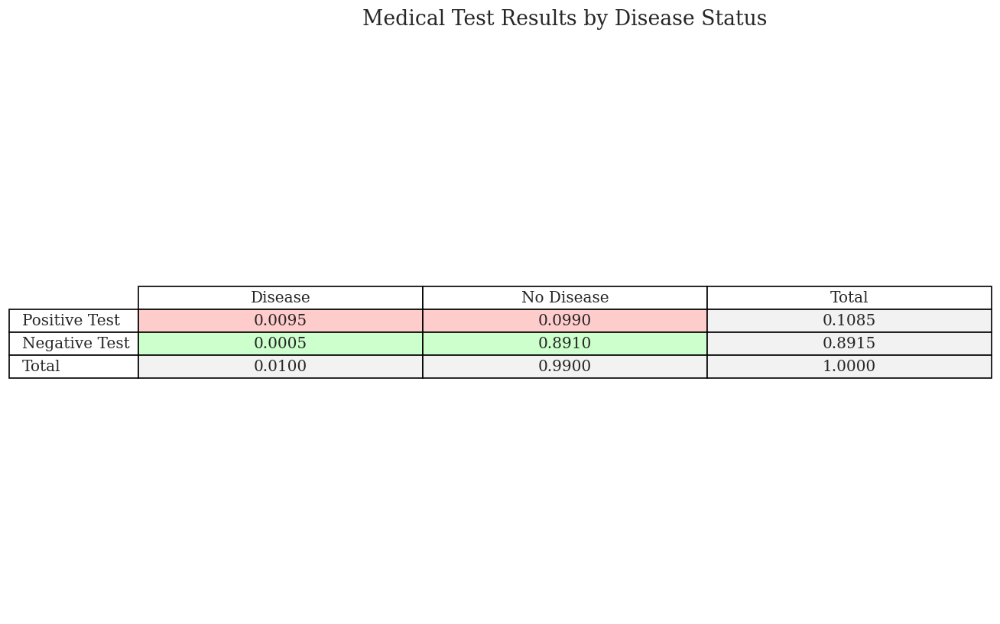
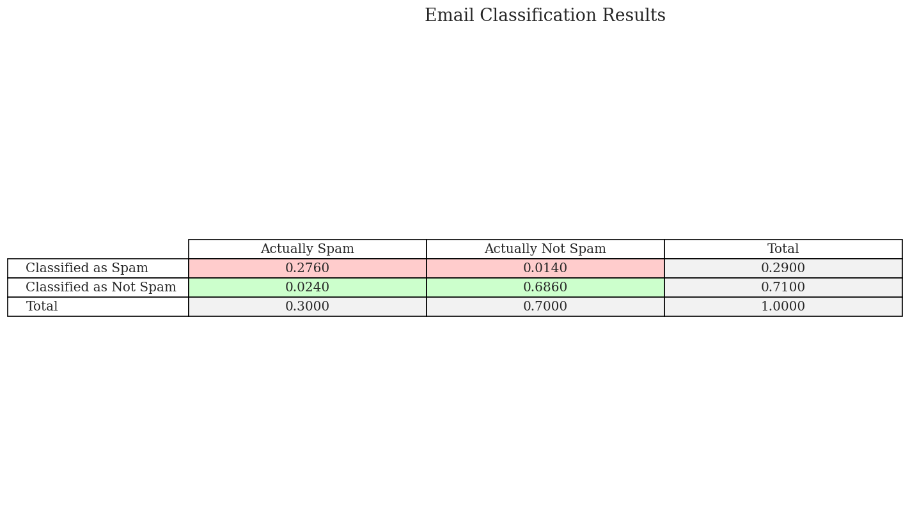
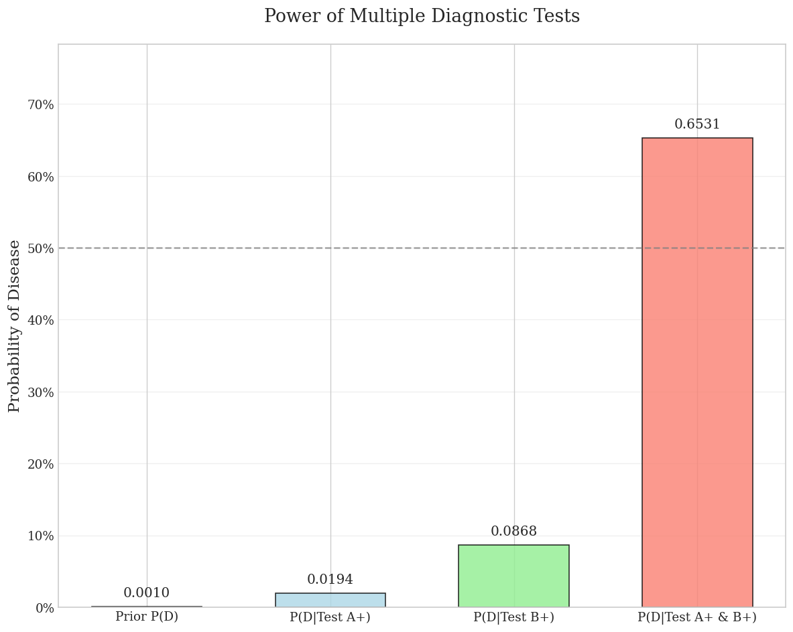

# Conditional Probability Examples

This document provides practical examples of conditional probability calculations, illustrating how to compute probabilities when additional information is available.

## Key Concepts and Formulas

Conditional probability measures the likelihood of an event occurring given that another event has already occurred. This concept is fundamental to many machine learning algorithms, especially Bayesian methods.

### Key Formulas

- **Conditional Probability**: $P(A|B) = \frac{P(A \cap B)}{P(B)}$
- **Bayes' Theorem**: $P(A|B) = \frac{P(B|A) \times P(A)}{P(B)}$
- **Law of Total Probability**: $P(B) = P(B|A) \times P(A) + P(B|\neg A) \times P(\neg A)$
- **Precision**: $\text{Precision} = \frac{\text{True Positives}}{\text{True Positives} + \text{False Positives}} = \frac{TP}{TP + FP}$
- **Recall (Sensitivity)**: $\text{Recall} = \frac{\text{True Positives}}{\text{True Positives} + \text{False Negatives}} = \frac{TP}{TP + FN}$
- **Specificity**: $\text{Specificity} = \frac{\text{True Negatives}}{\text{True Negatives} + \text{False Positives}} = \frac{TN}{TN + FP}$

## Examples

The following examples demonstrate conditional probability calculations:

- **Medical Testing**: Disease diagnosis using test results
- **Email Classification**: Spam filtering using Bayesian methods
- **Multiple Tests**: Using multiple diagnostic tests to increase certainty

### Example 1: Medical Testing

#### Problem Statement
A medical test for a disease has the following characteristics:
- The disease affects 1% of the population (prevalence)
- The test is 95% sensitive (true positive rate)
- The test is 90% specific (true negative rate)

If a person tests positive, what is the probability they actually have the disease?

#### Solution

##### Step 1: Define events and given probabilities
Let's define:
- $D$ = having the disease
- $T$ = testing positive
- $P(D) = 0.01$ (prevalence)
- $P(T|D) = 0.95$ (sensitivity)
- $P(T|\neg D) = 0.10$ (1 - specificity)

##### Step 2: Calculate P(T) using the law of total probability
$$P(T) = P(T|D) \times P(D) + P(T|\neg D) \times P(\neg D)$$
$$P(T) = 0.95 \times 0.01 + 0.10 \times 0.99 = 0.0095 + 0.0990 = 0.1085$$

##### Step 3: Calculate P(D|T) using Bayes' theorem
$$P(D|T) = \frac{P(T|D) \times P(D)}{P(T)} = \frac{0.95 \times 0.01}{0.1085} = \frac{0.0095}{0.1085} = 0.0876$$

Therefore, if a person tests positive, there's only an 8.8% chance they actually have the disease. This counterintuitive result is an example of the base rate fallacy, where the low prevalence of the disease dominates the calculation.



**Figure 1**: Visualization of medical test results by disease status. The red bars represent positive test results, while green bars represent negative test results. The table shows:
- True Positives (TP): Disease + Test Positive = 0.95 × 0.01 = 0.0095
- False Negatives (FN): Disease + Test Negative = 0.05 × 0.01 = 0.0005
- False Positives (FP): No Disease + Test Positive = 0.10 × 0.99 = 0.0990
- True Negatives (TN): No Disease + Test Negative = 0.90 × 0.99 = 0.8910

### Example 2: Email Classification

#### Problem Statement
An email system classifies messages as spam or not spam:
- 30% of all emails are spam
- The classifier correctly identifies spam with 92% accuracy
- The classifier correctly identifies non-spam with 98% accuracy

If an email is classified as spam, what's the probability it actually is spam?

#### Solution

##### Step 1: Define events and given probabilities
Let's define:
- $S$ = the email is spam
- $C$ = classified as spam
- $P(S) = 0.30$ (prior probability)
- $P(C|S) = 0.92$ (true positive rate)
- $P(C|\neg S) = 0.02$ (false positive rate)

##### Step 2: Calculate P(C) using the law of total probability
$$P(C) = P(C|S) \times P(S) + P(C|\neg S) \times P(\neg S)$$
$$P(C) = 0.92 \times 0.30 + 0.02 \times 0.70 = 0.2760 + 0.0140 = 0.2900$$

##### Step 3: Calculate P(S|C) using Bayes' theorem
$$P(S|C) = \frac{P(C|S) \times P(S)}{P(C)} = \frac{0.92 \times 0.30}{0.2900} = \frac{0.2760}{0.2900} = 0.9517$$

Therefore, if an email is classified as spam, there's a 95.2% chance it actually is spam. This high precision is due to the combination of a good classifier and a relatively high base rate of spam emails.



**Figure 2**: Email classification results visualized as proportion of emails. The red bars represent emails classified as spam, while green bars represent emails classified as not spam. The table shows:
- True Positives (TP): Spam + Classified as Spam = 0.92 × 0.30 = 0.2760
- False Negatives (FN): Spam + Classified as Not Spam = 0.08 × 0.30 = 0.0240
- False Positives (FP): Not Spam + Classified as Spam = 0.02 × 0.70 = 0.0140
- True Negatives (TN): Not Spam + Classified as Not Spam = 0.98 × 0.70 = 0.6860

Performance metrics:
- Precision = TP/(TP+FP) = 0.2760/(0.2760 + 0.0140) = 0.9517
- Recall = TP/(TP+FN) = 0.2760/(0.2760 + 0.0240) = 0.9200

### Example 3: Disease Diagnosis with Multiple Tests

#### Problem Statement
A rare disease affects 0.1% of the population. There are two different tests for this disease:
- Test A has a sensitivity of 99% and a specificity of 95%
- Test B has a sensitivity of 95% and a specificity of 99%

A patient tests positive on both tests. What is the probability that the patient actually has the disease?

#### Solution

##### Step 1: Define events and given probabilities
Let's define:
- $D$ = having the disease
- $A$ = testing positive on Test A
- $B$ = testing positive on Test B
- $P(D) = 0.001$ (prevalence)
- $P(A|D) = 0.99$ (Test A sensitivity)
- $P(A|\neg D) = 0.05$ (1 - Test A specificity)
- $P(B|D) = 0.95$ (Test B sensitivity)
- $P(B|\neg D) = 0.01$ (1 - Test B specificity)

##### Step 2: Calculate joint probabilities assuming conditional independence
If we assume the tests are conditionally independent given disease status:

$$P(A \cap B|D) = P(A|D) \times P(B|D) = 0.99 \times 0.95 = 0.9405$$
$$P(A \cap B|\neg D) = P(A|\neg D) \times P(B|\neg D) = 0.05 \times 0.01 = 0.0005$$

##### Step 3: Calculate P(A∩B) using the law of total probability
$$P(A \cap B) = P(A \cap B|D) \times P(D) + P(A \cap B|\neg D) \times P(\neg D)$$
$$P(A \cap B) = 0.9405 \times 0.001 + 0.0005 \times 0.999 = 0.000941 + 0.000500 = 0.001440$$

##### Step 4: Calculate P(D|A∩B) using Bayes' theorem
$$P(D|A \cap B) = \frac{P(A \cap B|D) \times P(D)}{P(A \cap B)} = \frac{0.9405 \times 0.001}{0.001440} = \frac{0.000941}{0.001440} = 0.6531$$

Therefore, if a patient tests positive on both tests, there's approximately a 65.3% probability they have the disease. This demonstrates how multiple independent tests can significantly increase diagnostic certainty even for rare diseases.



**Figure 3**: Diagnostic power of multiple tests. The bar chart shows the progression of probability from prior to posterior:
- Prior P(D) = 0.001 (0.1%)
- P(D|Test A+) = 0.019 (1.9%)
- P(D|Test B+) = 0.087 (8.7%)
- P(D|Test A+ & B+) = 0.653 (65.3%)

The dramatic improvement from 0.1% to 65.3% demonstrates the power of combining multiple independent tests. The 50% probability line is shown as a reference point.

## The Power of Multiple Independent Tests

The dramatic increase in diagnostic certainty with multiple tests demonstrates an important principle in Bayesian reasoning: when we combine independent sources of evidence that point to the same conclusion, our confidence in that conclusion increases significantly. This principle underlies many machine learning ensemble methods.

The multiplication of probabilities in the independence assumption:
$$P(A \cap B|D) = P(A|D) \times P(B|D)$$
$$P(A \cap B|\neg D) = P(A|\neg D) \times P(B|\neg D)$$

creates a strong filtering effect. For the disease case, both tests have high sensitivity, so their combined positive likelihood remains high (0.9405). But for the non-disease case, both tests have low false positive rates, so their combined false positive rate becomes extremely low (0.0005).

## Key Insights

### Theoretical Insights
- Conditional probability alters the sample space based on known information
- Bayes' theorem allows us to reverse the direction of conditioning
- Multiple conditionally independent pieces of evidence can dramatically shift probabilities

### Practical Applications
- Medical diagnosis requires accounting for disease prevalence
- Machine learning classifiers often incorporate prior probabilities
- Naive Bayes classifiers assume conditional independence of features

### Common Pitfalls
- The base rate fallacy: ignoring the prior probability when interpreting test results
- Assuming independence when variables are actually dependent
- Confusing the direction of conditional probability ($P(A|B)$ vs. $P(B|A)$)


## Running the Examples

You can run the code that generates these examples and visualizations using:

```bash
python3 ML_Obsidian_Vault/Lectures/2/Codes/1_conditional_probability_examples.py
```

## Related Topics

- [[L2_1_Basic_Probability|Basic Probability]]: Theoretical foundations of probability theory
- [[L2_5_Bayesian_Inference|Bayesian_Inference]]: Using probability for updating beliefs
- [[L2_1_Discrete_Probability_Examples|Discrete Probability Examples]]: Examples with discrete random variables
- [[L2_1_Continuous_Probability_Examples|Continuous Probability Examples]]: Examples with continuous random variables 