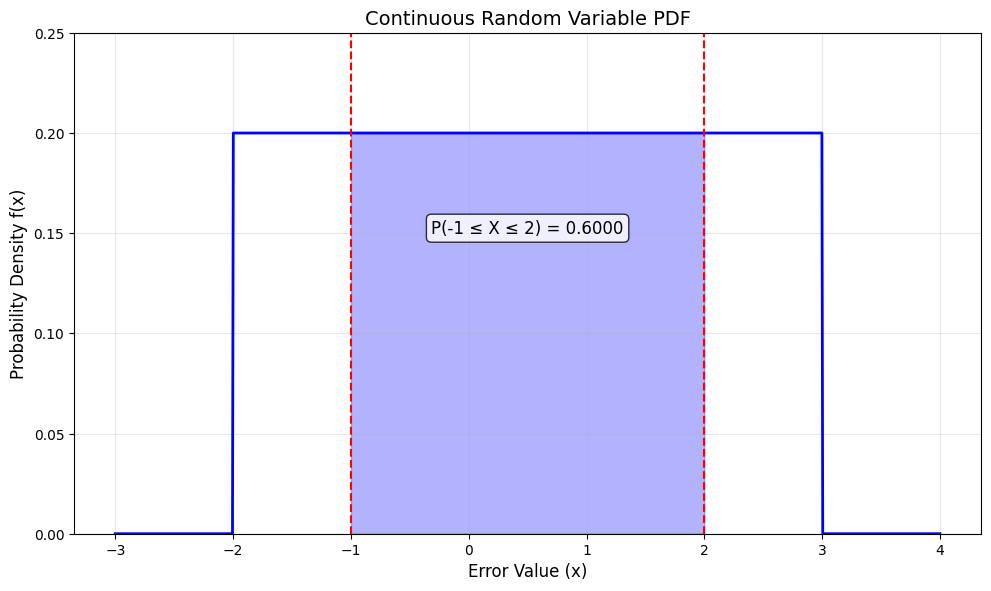
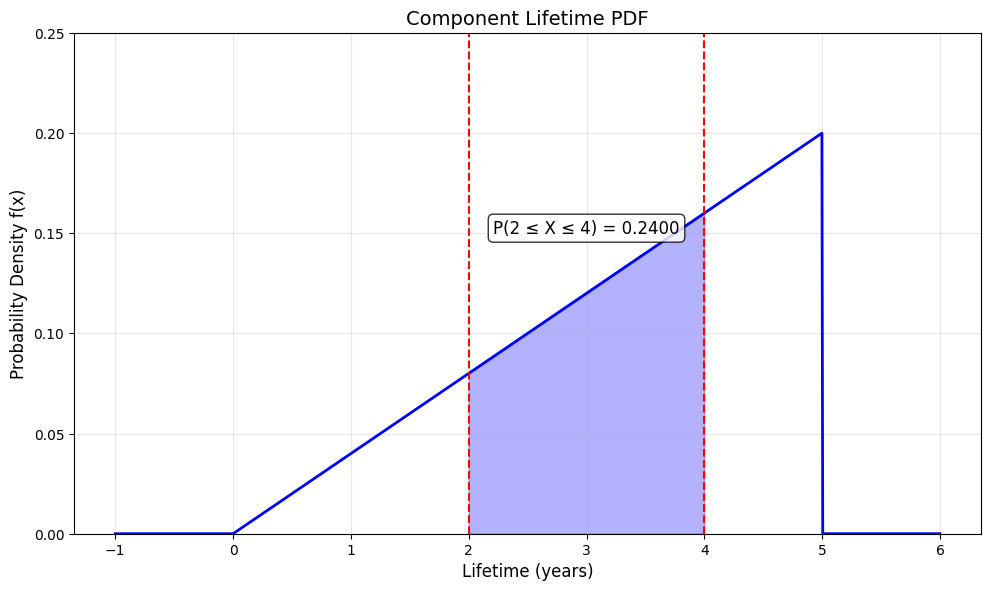
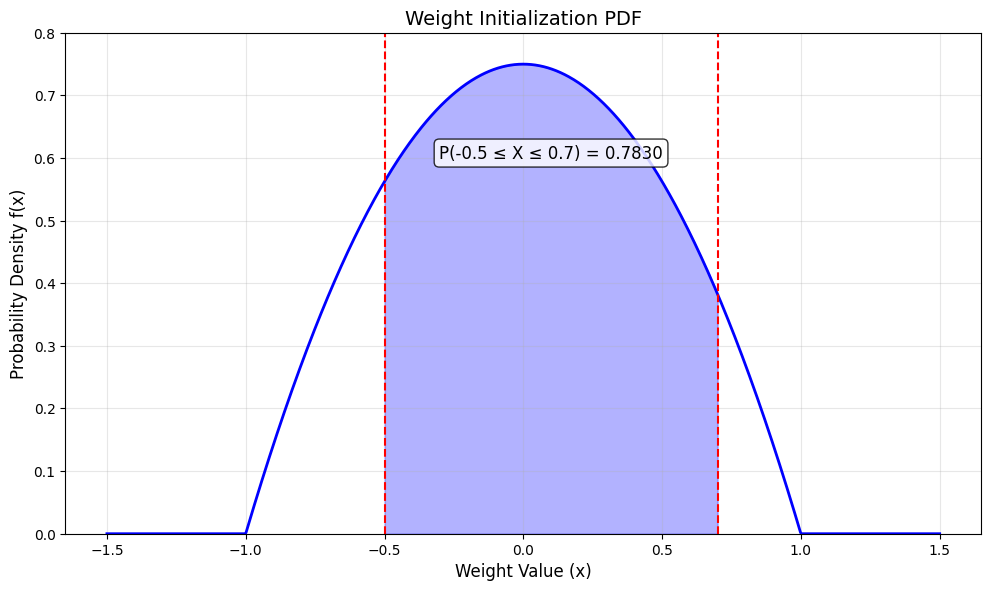
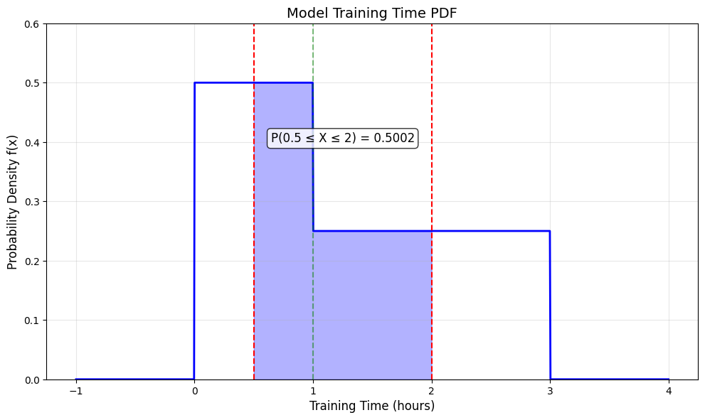

# Continuous Probability Examples

This document provides practical examples of continuous probability for various scenarios, illustrating the concept of probability density functions and their significance in machine learning and data analysis contexts.

## Key Concepts and Formulas

Continuous probability deals with random variables that can take on an uncountable number of possible values. For a continuous random variable X, we define a probability density function (PDF) rather than a probability mass function.

### Key Continuous Probability Formulas

$$f(x) \geq 0 \text{ for all } x$$

$$\int_{-\infty}^{\infty} f(x) dx = 1$$

$$P(a \leq X \leq b) = \int_{a}^{b} f(x) dx$$

Where:
- $f(x)$ = Probability density function at point x
- The probability of X taking any exact value is zero
- Probabilities are calculated as areas under the density curve

## Examples

The following examples demonstrate continuous probability:

- **Constant PDF**: Working with a uniform-like continuous distribution
- **Linear PDF**: Modeling increasing probability density
- **Quadratic PDF**: Working with a bell-shaped-like distribution
- **Piecewise PDF**: Handling different probability densities in different regions

### Example 1: Constant PDF

#### Problem Statement
A machine learning algorithm produces prediction errors with the following probability density function:
$$f(x) = 0.2 \text{ for } -2 \leq x \leq 3, \text{ and } 0 \text{ otherwise}$$

What is the probability that a randomly selected prediction has an error between -1 and 2?

In this example:
- The errors follow a constant PDF in the interval [-2, 3]
- We need to find P(-1 ≤ X ≤ 2)

#### Solution

We'll use the properties of continuous probability to solve this problem.

##### Step 1: Identify the PDF
The error X follows a constant PDF with value 0.2 in the interval [-2, 3].

##### Step 2: Calculate the probability
For a constant PDF, the probability is the area under the PDF between the specified bounds:

$$P(-1 \leq X \leq 2) = \text{Area} = \text{Height} \times \text{Width}$$

Where:
- Height = 0.2 (the value of the PDF)
- Width = 2 - (-1) = 3 (the length of the interval)

Therefore:
$$P(-1 \leq X \leq 2) = 0.2 \times 3 = 0.6$$

The probability that a randomly selected prediction has an error between -1 and 2 is 0.6 or 60%.



### Example 2: Linear PDF

#### Problem Statement
The lifetime of a certain electronic component has the following probability density function:
$$f(x) = 0.04x \text{ for } 0 \leq x \leq 5, \text{ and } 0 \text{ otherwise}$$

What is the probability that a randomly selected component will last between 2 and 4 years?

#### Solution

##### Step 1: Identify the PDF
The component lifetime X follows a linear PDF with value 0.04x in the interval [0, 5].

##### Step 2: Calculate the probability
For a linear PDF, the probability is the area under the PDF between the specified bounds:

$$P(2 \leq X \leq 4) = \int_{2}^{4} 0.04x \, dx$$

##### Step 3: Integrate the PDF
$$\int 0.04x \, dx = 0.02x^2 + C$$

Therefore:
$$P(2 \leq X \leq 4) = 0.02(4^2) - 0.02(2^2) = 0.32 - 0.08 = 0.24$$

The probability that a randomly selected component will last between 2 and 4 years is 0.24 or 24%.



### Example 3: Quadratic PDF

#### Problem Statement
A machine learning algorithm randomly initializes weights with the following probability density function:
$$f(x) = 0.75(1-x^2) \text{ for } -1 \leq x \leq 1, \text{ and } 0 \text{ otherwise}$$

What is the probability that a randomly selected weight is between -0.5 and 0.7?

#### Solution

##### Step 1: Identify the PDF
The weight X follows a quadratic PDF with value 0.75(1-x²) in the interval [-1, 1].

##### Step 2: Calculate the probability
For a quadratic PDF, the probability is the area under the PDF between the specified bounds:

$$P(-0.5 \leq X \leq 0.7) = \int_{-0.5}^{0.7} 0.75(1-x^2) \, dx$$

##### Step 3: Integrate the PDF
$$\int 0.75(1-x^2) \, dx = 0.75(x - \frac{x^3}{3}) + C$$

Therefore:
$$P(-0.5 \leq X \leq 0.7) = 0.75(0.7 - \frac{0.7^3}{3}) - 0.75(-0.5 - \frac{(-0.5)^3}{3})$$
$$= 0.75(0.7 - 0.1143) - 0.75(-0.5 - (-0.0417))$$
$$= 0.75(0.5857) - 0.75(-0.4583)$$
$$= 0.4393 + 0.3437 = 0.783$$

The probability that a randomly selected weight is between -0.5 and 0.7 is 0.783 or 78.3%.



### Example 4: Piecewise PDF

#### Problem Statement
A data scientist is analyzing the time it takes to train a model. The training time has the following probability density function:
$$f(x) = 0.5 \text{ for } 0 \leq x \leq 1$$
$$f(x) = 0.25 \text{ for } 1 < x \leq 3$$
$$f(x) = 0 \text{ otherwise}$$

What is the probability that a randomly selected training takes between 0.5 and 2 hours?

#### Solution

##### Step 1: Identify the PDF
The training time X follows a piecewise constant PDF with different values in different intervals.

##### Step 2: Calculate the probability
For a piecewise PDF, we need to split the calculation at the points where the PDF changes:

$$P(0.5 \leq X \leq 2) = P(0.5 \leq X \leq 1) + P(1 < X \leq 2)$$

##### Step 3: Calculate each part separately
For the first interval:
$$P(0.5 \leq X \leq 1) = 0.5 \times (1 - 0.5) = 0.25$$

For the second interval:
$$P(1 < X \leq 2) = 0.25 \times (2 - 1) = 0.25$$

Therefore:
$$P(0.5 \leq X \leq 2) = 0.25 + 0.25 = 0.5$$

The probability that a randomly selected training takes between 0.5 and 2 hours is 0.5 or 50%.



## Key Insights

### Theoretical Insights
- In continuous distributions, probabilities are areas under the density curve
- The probability of a continuous random variable taking any exact value is zero
- The total area under a valid PDF must equal 1

### Practical Applications
- Constant PDFs model uniform-like continuous random variables
- Linear PDFs model increasing probability density scenarios
- Quadratic PDFs model bell-shaped-like distributions
- Piecewise PDFs model scenarios with different probability densities in different regions

### Common Pitfalls
- Confusing PDF values with probabilities (PDF values can exceed 1)
- Forgetting to split calculations at points where the PDF changes
- Applying continuous methods to discrete data or vice versa

## Running the Examples

You can run the code that generates the probability examples and visualizations using:

```bash
python3 ML_Obsidian_Vault/Lectures/2/Codes/1_continuous_probability_examples.py
```

## Related Topics

- [[L2_1_Basic_Probability|Basic Probability]]: Foundation concepts for probability theory
- [[L2_1_Discrete_Probability_Examples|Discrete Probability Examples]]: Contrasting examples for discrete distributions 