# Contour Plot Examples

This document provides practical, pen-and-paper examples of contour plots for various scenarios, illustrating their utility in visualizing multivariate distributions and functions.

## Key Concepts and Formulas

Contour plots visualize 3D surfaces on a 2D plane by connecting points of equal value. For a function $f(x,y)$, contour lines represent the sets:
$$\{(x,y) : f(x,y) = c\}$$
where $c$ is a constant value.

## Examples

The following examples demonstrate contour plots in different contexts:

- **Example 1**: Simple Quadratic Function
- **Example 2**: Linear Function
- **Example 3**: Manhattan Distance Function
- **Example 4**: Product Function
- **Example 5**: Circle Plus Linear Term
- **Example 6**: Saddle Function
- **Example 7**: Finding Local Extrema
- **Example 8**: Maximum Function
- **Example 9**: Circular Crater Function
- **Example 10**: Simple Rotation Function
- **Example 11**: Absolute Value Function
- **Example 12**: Simple Sum Function

---

### Example 1: Simple Quadratic Function

#### Problem Statement
Sketch the contour plot for the function $f(x,y) = x^2 + y^2$ for the contour levels $c = 1, 4, 9$.

#### Solution

This function represents the squared distance from the origin.

##### Step 1: Identify the shape of each contour
For any constant value $c$:
$$x^2 + y^2 = c$$

This is the equation of a circle centered at the origin with radius $\sqrt{c}$.

##### Step 2: Draw the contours
- For $c = 1$: Circle with radius 1
- For $c = 4$: Circle with radius 2
- For $c = 9$: Circle with radius 3

The contour plot consists of concentric circles around the origin, with larger circles corresponding to higher values of the function.

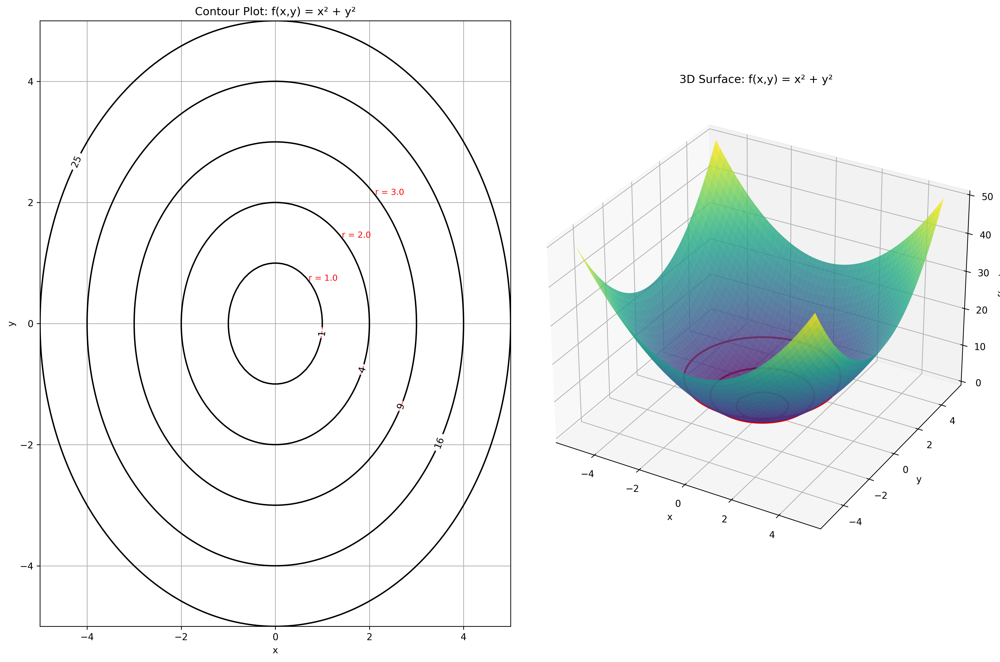

---

### Example 2: Linear Function

#### Problem Statement
Sketch the contour plot for the function $f(x,y) = 2x + 3y$ for the contour levels $c = -3, 0, 3, 6$.

#### Solution

##### Step 1: Identify the equation of each contour
For a constant value $c$:
$$2x + 3y = c$$

Rearranging for $y$:
$$y = \frac{c - 2x}{3}$$

This is the equation of a straight line with slope $-\frac{2}{3}$ and y-intercept $\frac{c}{3}$.

##### Step 2: Find key points for each contour line
For each value of $c$, we can find where the line crosses the axes:
- x-axis (y = 0): $x = \frac{c}{2}$
- y-axis (x = 0): $y = \frac{c}{3}$

##### Step 3: Draw the contours
- For $c = -3$: Line through $(-1.5, 0)$ and $(0, -1)$
- For $c = 0$: Line through $(0, 0)$
- For $c = 3$: Line through $(1.5, 0)$ and $(0, 1)$
- For $c = 6$: Line through $(3, 0)$ and $(0, 2)$

The contour plot consists of parallel lines with slope $-\frac{2}{3}$. Higher contours appear toward the top-right of the plot.

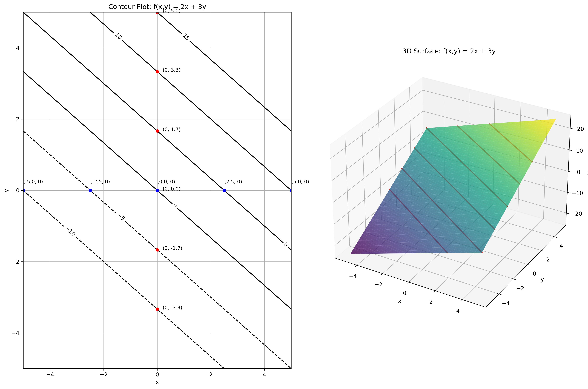

---

### Example 3: Manhattan Distance Function

#### Problem Statement
Sketch the contour plot for the function $f(x,y) = |x| + |y|$ for the contour levels $c = 1, 2, 3$.

#### Solution

##### Step 1: Analyze the function
This function represents the Manhattan (or L1) distance from the origin.

##### Step 2: For each constant $c$, find points where $|x| + |y| = c$
When $x,y \geq 0$: $x + y = c$
When $x \geq 0, y \leq 0$: $x - y = c$
When $x \leq 0, y \geq 0$: $-x + y = c$
When $x,y \leq 0$: $-x - y = c$

##### Step 3: Draw the contours
Each contour forms a diamond (or square rotated 45°) centered at the origin:
- For $c = 1$: Diamond with vertices at $(0,1)$, $(1,0)$, $(0,-1)$, $(-1,0)$
- For $c = 2$: Diamond with vertices at $(0,2)$, $(2,0)$, $(0,-2)$, $(-2,0)$
- For $c = 3$: Diamond with vertices at $(0,3)$, $(3,0)$, $(0,-3)$, $(-3,0)$

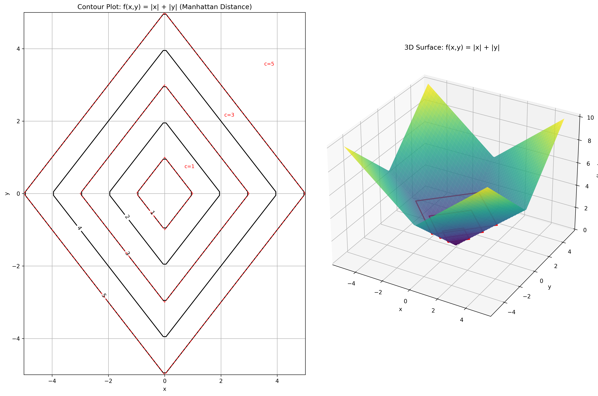

---

### Example 4: Product Function

#### Problem Statement
Sketch the contour plot for $f(x,y) = xy$ for the contour levels $c = -2, -1, 0, 1, 2$.

#### Solution

##### Step 1: Set up the contour equation
For each constant $c$:
$$xy = c$$

##### Step 2: Rewrite in a form easier to plot
$$y = \frac{c}{x}$$

This is a hyperbola for any non-zero value of $c$.

##### Step 3: Draw the contours
- For $c = 0$: The contour consists of the two axes ($x = 0$ and $y = 0$)
- For $c = 1$: A hyperbola in the first and third quadrants
- For $c = 2$: Another hyperbola in the first and third quadrants, further from the origin
- For $c = -1$: A hyperbola in the second and fourth quadrants
- For $c = -2$: Another hyperbola in the second and fourth quadrants, further from the origin

The contours form a family of hyperbolas, with the axes serving as asymptotes.

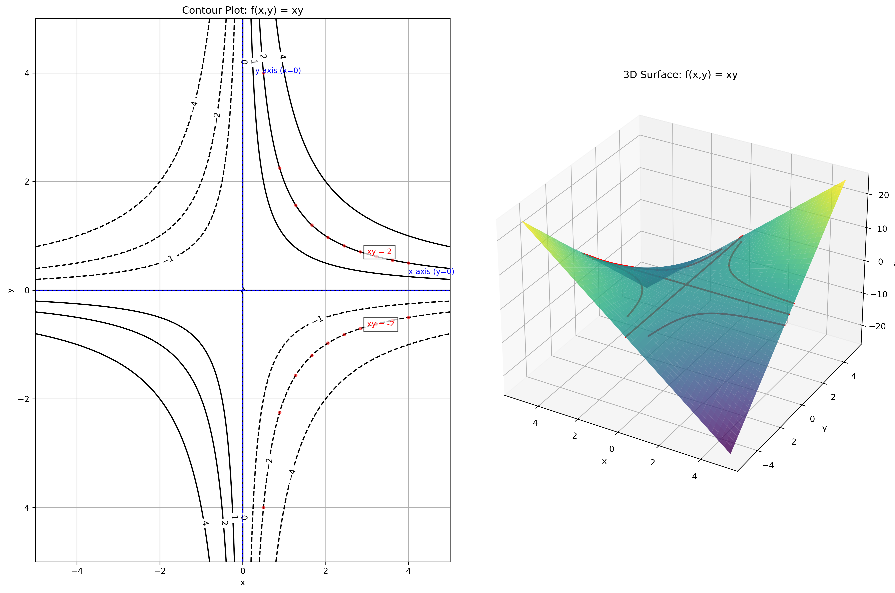

---

### Example 5: Circle Plus Linear Term

#### Problem Statement
Sketch the contour plot for the function $f(x,y) = x^2 + y^2 + y$ for the contour levels $c = 0, 1, 4, 9$.

#### Solution

##### Step 1: Complete the square for the y term
$$f(x,y) = x^2 + y^2 + y$$
$$f(x,y) = x^2 + (y^2 + y)$$
$$f(x,y) = x^2 + (y^2 + y + \frac{1}{4} - \frac{1}{4})$$
$$f(x,y) = x^2 + (y + \frac{1}{2})^2 - \frac{1}{4}$$

##### Step 2: Rearrange for contour lines
For a constant value $c$:
$$x^2 + (y + \frac{1}{2})^2 = c + \frac{1}{4}$$

##### Step 3: Draw the contours
Each contour is a circle centered at $(0, -\frac{1}{2})$ with radius $\sqrt{c + \frac{1}{4}}$:
- For $c = 0$: Circle with radius $\frac{1}{2}$ centered at $(0, -\frac{1}{2})$
- For $c = 1$: Circle with radius $\sqrt{1.25} \approx 1.12$ centered at $(0, -\frac{1}{2})$
- For $c = 4$: Circle with radius $\sqrt{4.25} \approx 2.06$ centered at $(0, -\frac{1}{2})$
- For $c = 9$: Circle with radius $\sqrt{9.25} \approx 3.04$ centered at $(0, -\frac{1}{2})$

The contour plot consists of concentric circles, but the center is shifted to $(0, -\frac{1}{2})$ rather than being at the origin.

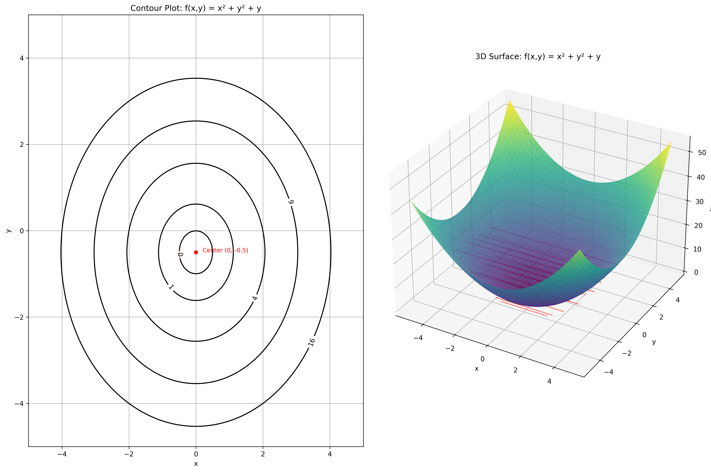

---

### Example 6: Saddle Function

#### Problem Statement
Sketch the contour plot for the function $f(x,y) = x^2 - y^2$ for the contour levels $c = -4, -1, 0, 1, 4$.

#### Solution

##### Step 1: Analyze the function
This is a saddle function, with the shape of a horse saddle near the origin.

##### Step 2: Rearrange for contour lines
For a constant value $c$:
$$x^2 - y^2 = c$$

This can be rewritten in different ways depending on the value of $c$:

If $c = 0$:
$$x^2 = y^2$$
$$x = \pm y$$

These are the lines $y = x$ and $y = -x$, which form an "X" shape through the origin.

If $c \neq 0$:
$$\frac{x^2}{c} - \frac{y^2}{c} = 1$$ (when $c > 0$)
$$\frac{y^2}{-c} - \frac{x^2}{-c} = 1$$ (when $c < 0$)

These are hyperbolas. When $c > 0$, the hyperbolas open along the x-axis. When $c < 0$, they open along the y-axis.

##### Step 3: Draw the contours
- For $c = 0$: Lines $y = x$ and $y = -x$
- For $c = 1$: Hyperbola with transverse axis along the x-axis
- For $c = 4$: Wider hyperbola with transverse axis along the x-axis
- For $c = -1$: Hyperbola with transverse axis along the y-axis
- For $c = -4$: Wider hyperbola with transverse axis along the y-axis

The contour plot shows a saddle point at the origin, where the function changes from increasing to decreasing in different directions.

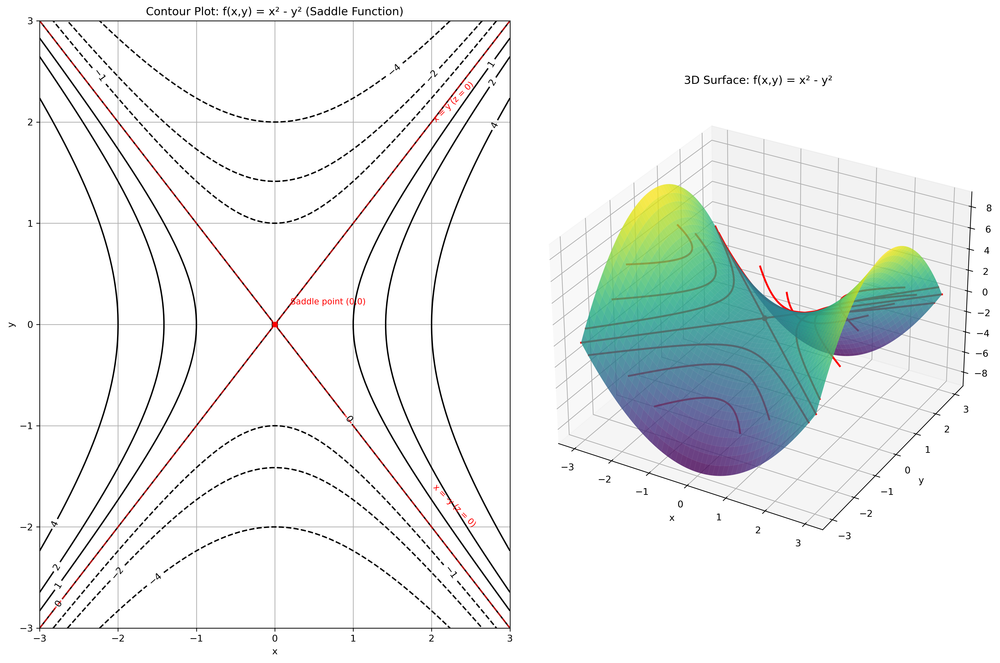

---

### Example 7: Finding Local Extrema

#### Problem Statement
Use contour plot analysis to identify the critical points of the function $f(x,y) = x^2 + y^2 - 4x - 6y + 13$ and determine their nature.

#### Solution

##### Step 1: Complete the square to rewrite the function
$$f(x,y) = x^2 - 4x + y^2 - 6y + 13$$
$$f(x,y) = (x^2 - 4x + 4) + (y^2 - 6y + 9) + 13 - 4 - 9$$
$$f(x,y) = (x-2)^2 + (y-3)^2 + 0$$

##### Step 2: Analyze the contours
The contours are circles centered at the point $(2,3)$.

##### Step 3: Identify the critical point
Since the function is in the form of squared terms plus a constant, it has a unique critical point at $(2,3)$.

##### Step 4: Determine the nature of the critical point
Because the contours are circles centered at the critical point and the function increases as we move away from this point, $(2,3)$ is a local minimum with value $f(2,3) = 0$.

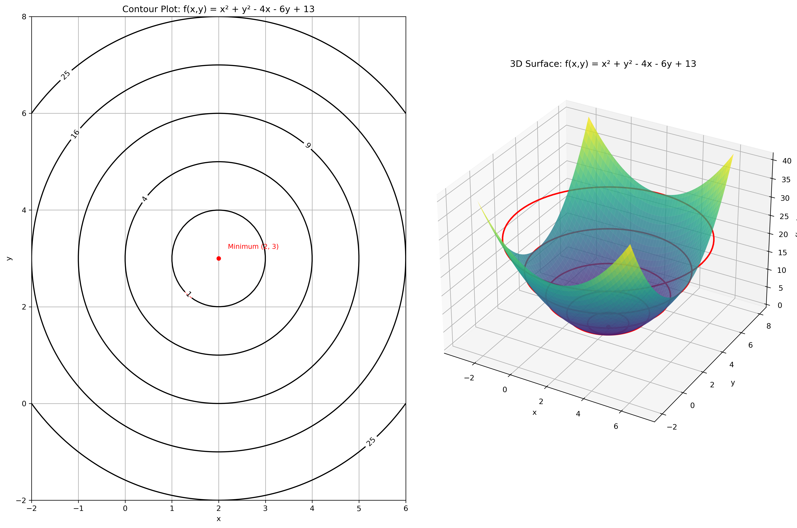

---

### Example 8: Maximum Function

#### Problem Statement
Sketch the contour plot for the function $f(x,y) = \max(x, y)$ for the contour levels $c = -1, 0, 1, 2$.

#### Solution

##### Step 1: Understand the function
The function $f(x,y) = \max(x, y)$ returns the larger of the two values $x$ and $y$.

##### Step 2: Identify regions where each variable dominates
- When $x > y$: $f(x,y) = x$
- When $y > x$: $f(x,y) = y$
- When $x = y$: $f(x,y) = x = y$

##### Step 3: Draw the contours
For each contour level $c$:
- In the region where $x > y$: The contour is a vertical line $x = c$
- In the region where $y > x$: The contour is a horizontal line $y = c$
- These lines meet at the point $(c, c)$, which lies on the line $y = x$

So each contour forms an "L" shape:
- For $c = -1$: Vertical line $x = -1$ (when $x > y$) and horizontal line $y = -1$ (when $y > x$), meeting at $(-1,-1)$
- For $c = 0$: Vertical line $x = 0$ (when $x > y$) and horizontal line $y = 0$ (when $y > x$), meeting at $(0,0)$
- For $c = 1$: Vertical line $x = 1$ (when $x > y$) and horizontal line $y = 1$ (when $y > x$), meeting at $(1,1)$
- For $c = 2$: Vertical line $x = 2$ (when $x > y$) and horizontal line $y = 2$ (when $y > x$), meeting at $(2,2)$

The complete contour plot shows a series of L-shaped contours, all bending at the line $y = x$, which divides the plane into two regions.

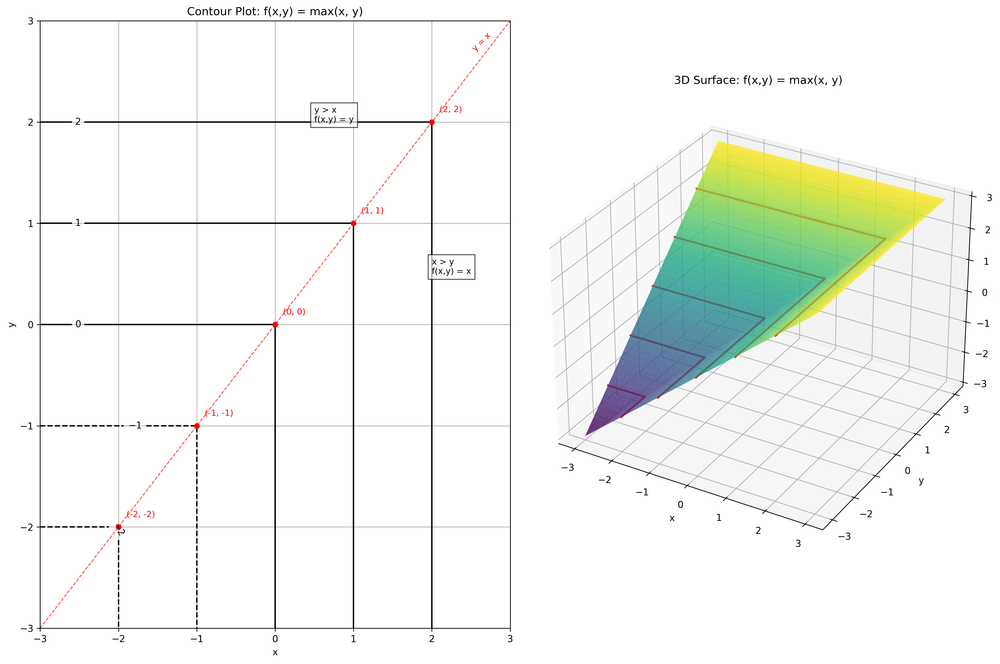

---

### Example 9: Circular Crater Function

#### Problem Statement
Sketch the contour plot for the function $f(x,y) = (x^2 + y^2 - 4)^2$ for the contour levels $c = 0, 1, 4, 9$.

#### Solution

##### Step 1: Analyze the function structure
This function squares the expression $(x^2 + y^2 - 4)$, which is the equation of a circle with radius 2 centered at the origin, minus the constant 4.

##### Step 2: Find where the function equals each contour value
For $c = 0$:
$$(x^2 + y^2 - 4)^2 = 0$$
$$x^2 + y^2 - 4 = 0$$
$$x^2 + y^2 = 4$$

This is a circle with radius 2 centered at the origin.

For $c > 0$:
$$(x^2 + y^2 - 4)^2 = c$$
$$x^2 + y^2 - 4 = \pm\sqrt{c}$$
$$x^2 + y^2 = 4 \pm\sqrt{c}$$

This gives two circles: one with radius $\sqrt{4 + \sqrt{c}}$ and another with radius $\sqrt{4 - \sqrt{c}}$ (when $c < 16$).

##### Step 3: Draw the contours
- For $c = 0$: A single circle with radius 2
- For $c = 1$: Two circles - one with radius $\sqrt{4 + 1} \approx 2.2$ and one with radius $\sqrt{4 - 1} \approx 1.7$
- For $c = 4$: Two circles - one with radius $\sqrt{4 + 2} \approx 2.4$ and one with radius $\sqrt{4 - 2} \approx 1.4$
- For $c = 9$: Two circles - one with radius $\sqrt{4 + 3} \approx 2.6$ and one with radius $\sqrt{4 - 3} = 1$

This creates a "crater" or "valley" pattern where the function is zero on the circle with radius 2, and increases as you move either inward or outward from this circle.

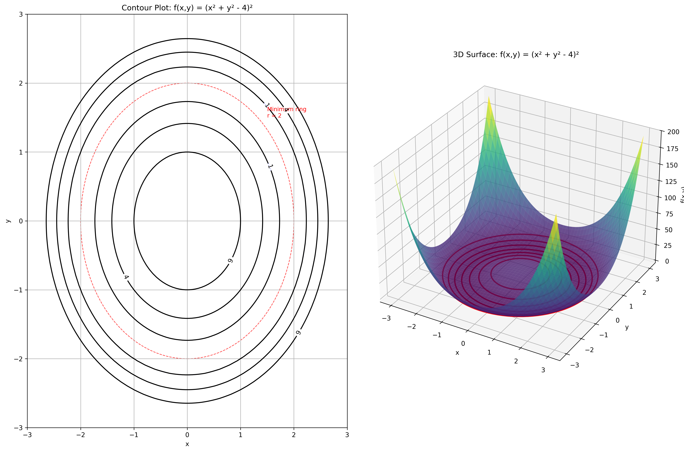

---

### Example 10: Simple Rotation Function

#### Problem Statement
Sketch the contour plot for the function $f(x,y) = xy + x - y$ for the contour levels $c = -2, -1, 0, 1, 2$.

#### Solution

##### Step 1: Rearrange the function for easier analysis
$$f(x,y) = xy + x - y = x(y + 1) - y = x(y + 1) - 1 \cdot y$$

##### Step 2: For each contour value $c$, find the equation
$$x(y + 1) - y = c$$
$$x(y + 1) = c + y$$
$$x = \frac{c + y}{y + 1}$$

This is a family of hyperbolas and lines.

##### Step 3: Find key features of each contour
For $c = 0$:
$$x = \frac{y}{y + 1}$$

For $c = -1$:
$$x = \frac{-1 + y}{y + 1} = 1 - \frac{2}{y + 1}$$

For $c = 1$:
$$x = \frac{1 + y}{y + 1} = 1 + \frac{0}{y + 1} = 1$$

For $c = -2$:
$$x = \frac{-2 + y}{y + 1} = 1 - \frac{3}{y + 1}$$

For $c = 2$:
$$x = \frac{2 + y}{y + 1} = 1 + \frac{1}{y + 1}$$

##### Step 4: Interpret and draw the contours
- For $c = 0$: A curve approaching the line $x = 1$ as $y \to \infty$ and approaching $x = 0$ as $y \to 0$
- For $c = 1$: The vertical line $x = 1$
- For $c = -1$: A curve approaching the line $x = 1$ as $y \to \infty$ with a vertical asymptote at $y = -1$
- For $c = 2$: A curve approaching the line $x = 1$ as $y \to \infty$ with a vertical asymptote at $y = -1$
- For $c = -2$: A curve approaching the line $x = 1$ as $y \to \infty$ with a vertical asymptote at $y = -1$

The contour plot shows a family of curves with interesting behavior around the line $y = -1$.

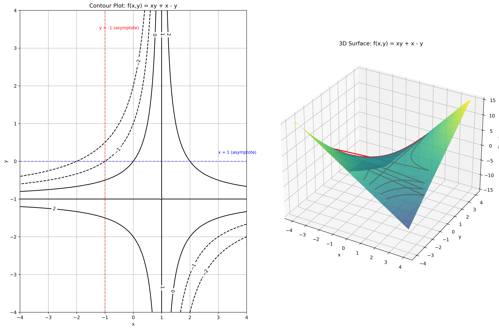

---

### Example 11: Absolute Value Function

#### Problem Statement
Sketch the contour plot for the function $f(x,y) = |x| - |y|$ for the contour levels $c = -2, -1, 0, 1, 2$.

#### Solution

##### Step 1: Analyze the function in different quadrants
The function $f(x,y) = |x| - |y|$ has different forms in different quadrants:
- When $x \geq 0, y \geq 0$: $f(x,y) = x - y$
- When $x \geq 0, y < 0$: $f(x,y) = x + y$
- When $x < 0, y \geq 0$: $f(x,y) = -x - y$
- When $x < 0, y < 0$: $f(x,y) = -x + y$

##### Step 2: Find the contour equations in each quadrant
For each contour level $c$:

1. In quadrant 1 (x ≥ 0, y ≥ 0):
   $x - y = c$
   $y = x - c$

2. In quadrant 2 (x < 0, y ≥ 0):
   $-x - y = c$
   $y = -x - c$

3. In quadrant 3 (x < 0, y < 0):
   $-x + y = c$
   $y = c + x$

4. In quadrant 4 (x ≥ 0, y < 0):
   $x + y = c$
   $y = c - x$

##### Step 3: Draw the contours
For $c = 0$:
- In quadrants 1 and 3: Lines with slope 1 ($y = x$ and $y = x$)
- In quadrants 2 and 4: Lines with slope -1 ($y = -x$ and $y = -x$)
This forms an "asterisk" or "bowtie" pattern.

For $c = 1$:
- In quadrant 1: Line $y = x - 1$ (shifted down by 1)
- In quadrant 2: Line $y = -x - 1$ (shifted down by 1)
- In quadrant 3: Line $y = 1 + x$ (shifted up by 1)
- In quadrant 4: Line $y = 1 - x$ (shifted up by 1)

Similar patterns apply for $c = 2$, $c = -1$, and $c = -2$.

The complete contour plot shows a distinctive "bowtie" pattern around the origin that shifts up or down based on the contour level.

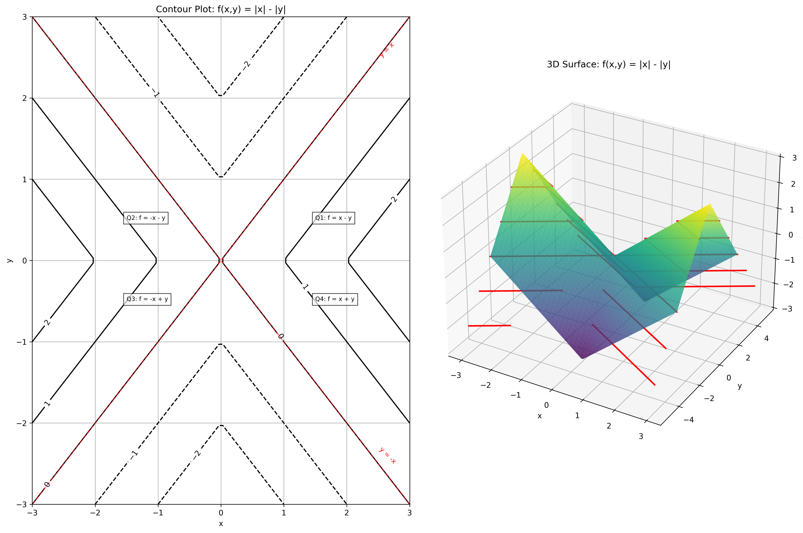

---

### Example 12: Simple Sum Function

#### Problem Statement
Sketch the contour plot for the function $f(x,y) = x + y$ for the contour levels $c = 0, 1, 2, 3$.

#### Solution

##### Step 1: Set up the contour equation
For each constant value $c$:
$$x + y = c$$

##### Step 2: Identify the type of curve this represents
Rewriting the equation as:
$$y = c - x$$

This is a straight line with slope $-1$ and y-intercept $c$.

##### Step 3: Find intercepts for easy plotting
For each contour value $c$:
- x-axis intercept (y = 0): $x = c$
- y-axis intercept (x = 0): $y = c$

##### Step 4: Draw the contours
- For $c = 0$: Line passing through the origin (0,0)
- For $c = 1$: Line passing through (1,0) and (0,1)
- For $c = 2$: Line passing through (2,0) and (0,2)
- For $c = 3$: Line passing through (3,0) and (0,3)

The contour plot consists of parallel lines with slope $-1$. Higher contours appear toward the top-right of the plot, and the spacing between contours is uniform.

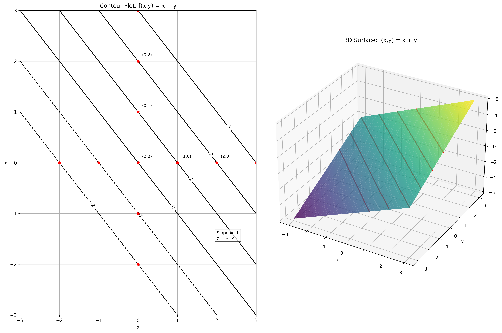

## Key Insights from Contour Plots

### Shape Identification
- **Circles**: Indicate functions like $x^2 + y^2 + C$ (possibly shifted)
- **Straight Lines**: Indicate linear functions like $ax + by + c$
- **Diamonds**: Indicate functions with Manhattan distance ($|x| + |y|$)
- **Hyperbolas**: Indicate functions with products ($xy$) or differences of squares ($x^2 - y^2$)
- **L-Shapes**: Indicate functions with $\max$ or $\min$ operations
- **Bowties**: Indicate functions with differences of absolute values ($|x| - |y|$)
- **Ellipses**: Indicate quadratic functions, often from multivariate Gaussians with the orientation revealing correlation

### Critical Points
- **Concentric circles**: Indicate a local minimum or maximum
- **Hyperbolic patterns**: Indicate a saddle point
- **Parallel lines**: Indicate no critical points (constantly sloped plane)
- **Intersecting L-shapes**: Indicate non-differentiable points in piecewise functions

### Covariance Matrix Effects
- **Diagonal covariance matrices**: Produce axis-aligned elliptical contours
  - Equal variances (scaled identity): Circular contours
  - Different variances: Ellipses stretched along the coordinate axes
- **Non-diagonal covariance matrices**: Produce rotated elliptical contours
  - Positive correlation: Ellipses tilted along $y = x$ direction
  - Negative correlation: Ellipses tilted along $y = -x$ direction
  - The eigenvectors of the covariance matrix determine the directions of the principal axes

### Practical Applications
- Identifying the nature of critical points without calculus
- Understanding the behavior of multivariate functions at a glance
- Visualizing probability densities in statistics
- Analyzing optimization landscapes in machine learning
- Identifying regions of rapid vs. gradual change in a function
- Visualizing correlation structure in multivariate data

## Related Topics

- [[L2_1_Contour_Plots|Contour Plots]]: Core principles and interpretations
- [[L2_1_Multivariate_Distributions|Multivariate Distributions]]: Theoretical foundation
- [[L2_1_Covariance_Correlation|Covariance and Correlation]]: Related concepts for understanding distribution shapes
- [[L2_1_Covariance_Matrix_Contours|Covariance Matrix Contours]]: How covariance matrices affect contour shapes in multivariate distributions
- [[L2_1_Visual_Examples|Visual Examples]]: Additional visual examples of contour plots in various applications
