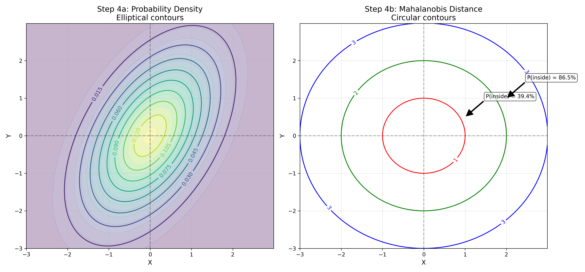

# Contour Plots: Visual Examples

This document provides visual examples of contour plots for multivariate probability distributions, explaining their interpretation and applications in data analysis and machine learning.

## Key Concepts and Formulas

Contour plots represent multivariate probability density functions (PDFs) by showing lines or regions of equal probability density. For a bivariate distribution with PDF $f(x,y)$, a contour line connects all points $(x,y)$ where $f(x,y) = c$ for some constant $c$.

### Bivariate Normal Distribution

The bivariate normal distribution is defined by the PDF:

$$f(x,y) = \frac{1}{2\pi\sigma_X\sigma_Y\sqrt{1-\rho^2}}\exp\left(-\frac{1}{2(1-\rho^2)}\left[\frac{(x-\mu_X)^2}{\sigma_X^2}+\frac{(y-\mu_Y)^2}{\sigma_Y^2}-\frac{2\rho(x-\mu_X)(y-\mu_Y)}{\sigma_X\sigma_Y}\right]\right)$$

Where:
- $\mu_X, \mu_Y$ = Means of $X$ and $Y$
- $\sigma_X, \sigma_Y$ = Standard deviations of $X$ and $Y$
- $\rho$ = Correlation coefficient between $X$ and $Y$

## Visual Examples

The following examples demonstrate contour plots for various probability distributions:

- **Different Covariance Structures**: Visualizing correlation and variance in bivariate normals
- **Non-Normal Distributions**: Contour plots of multimodal and non-Gaussian distributions
- **Probability Regions**: Understanding confidence regions in multivariate space
- **Conditional Distributions**: Visualizing how one variable depends on another
- **Marginal Distributions**: Relationship between joint and marginal distributions
- **3D vs 2D Representation**: Comparing contour plots with 3D surface plots

### Example 1: Bivariate Normal with Different Covariance Structures

This example shows how different correlation values and variances affect the shape of bivariate normal distributions.

**Key observations:**
- The standard bivariate normal (top left) shows circular contours, indicating independence between variables
- Positive correlation (top right) produces ellipses tilted upward, showing that as X increases, Y tends to increase
- Negative correlation (bottom left) produces ellipses tilted downward, showing that as X increases, Y tends to decrease
- Different variances (bottom right) produce ellipses stretched along the axis with higher variance

#### How Correlation Changes Contour Shapes

As correlation increases, the bivariate normal contours become more elongated and tilted:

The pink ellipses show the 95% probability regions. Notice how they become more elliptical as correlation increases from 0 to 0.9, with the major axis aligning with the direction of positive correlation.

### Example 2: Non-Gaussian Probability Distributions

Contour plots can represent any bivariate distribution, not just normal distributions. Here we show contours for several non-Gaussian distributions.

**Key observations:**
- The mixture of two normals (top left) shows two separate peaks, indicating a bimodal distribution
- The ring-shaped distribution (top right) has probability concentrated in a circular band
- The multimodal distribution (bottom left) shows three separate peaks at different locations
- The valley-shaped distribution (bottom right) has higher probability density near the origin

### Example 3: Probability Regions in Multivariate Space

Contour plots can effectively show probability regions, which are particularly useful for hypothesis testing and confidence intervals in multivariate settings.

**Key insights:**
- The innermost contour (red) represents the 39.4% probability region (equivalent to 1σ in univariate normal)
- The middle contour (green) represents the 86.5% probability region (equivalent to 2σ)
- The outermost contour (blue) represents the 98.9% probability region (equivalent to 3σ)
- The elliptical shape is due to correlation between variables (ρ = 0.5)

#### The Connection to Mahalanobis Distance

Probability regions in multivariate normal distributions are directly related to the Mahalanobis distance, which accounts for correlation between variables.

**Left**: Probability density contours of a bivariate normal distribution.
**Right**: The same distribution represented as Mahalanobis distance contours, which form perfect circles in the normalized space.

### Example 4: Conditional Distributions

Conditional distributions show the probability distribution of one variable given a specific value of another variable. Contour plots help visualize these relationships.

**Key insights:**
- The contour plot shows the joint distribution of X and Y with correlation ρ = 0.7
- The colored curves show the conditional distributions of Y given X = -1.5, 0, and 1.5
- Each conditional distribution is a normal distribution with mean μY|X = ρ·X
- The width of each conditional distribution is the same, reflecting constant conditional variance σ²Y|X = σ²Y(1-ρ²)

Here's an animation frame showing a conditional distribution for X = 0:

The red curve shows the normal distribution of Y conditional on X = 0. The mean of this conditional distribution is at the point where the red vertical line intersects the joint distribution's contours.

### Example 5: Joint and Marginal Distributions

This example illustrates the relationship between joint and marginal distributions.

**Key insights:**
- The main panel shows the joint distribution as a contour plot
- The top panel shows the marginal distribution of X (integrating out Y)
- The right panel shows the marginal distribution of Y (integrating out X)
- Both marginals are normal distributions even with correlation in the joint distribution
- This illustrates that marginal distributions lose information about relationships between variables

### Example 6: Contour Plots vs. 3D Surface Plots

Contour plots are 2D representations of 3D surfaces. This example compares the two visualization methods.

**Key insights:**
- Contour plots (left) show lines of equal probability density, like a topographic map
- 3D surface plots (right) show the actual probability density function in three dimensions
- Contour plots are often easier to read precise values from, while 3D plots give a better intuitive feel for the shape
- Both representations show the same underlying bivariate normal distribution with correlation ρ = 0.5

#### Geometric Interpretation

This visualization helps understand the relationship between the 3D probability density surface and its 2D contour representation:

The colored horizontal planes intersect the probability density surface, creating the contour lines that are projected onto the XY plane below.

## Applications of Contour Plots

Contour plots for multivariate distributions have numerous applications in machine learning and statistics:

**Clockwise from top left:**
1. **Bayesian Inference**: Visualizing posterior distributions over multiple parameters, with the MAP (maximum a posteriori) estimate and 95% credible region.
2. **Clustering Analysis**: Density-based clustering with contours showing the estimated distribution for each cluster.
3. **Error Ellipses**: Representing uncertainty in correlated measurements with nested confidence regions.
4. **Optimization Landscapes**: Visualizing objective functions to understand algorithm convergence, with optimization path shown in red.

## Questions and Solutions

### Question 1
**How would the contour plot of a bivariate normal distribution change if the correlation increased from 0.5 to 0.9?**

**Solution:** As the correlation increases from 0.5 to 0.9, the contour ellipses become more elongated and narrower, aligning more closely with the diagonal line y = x. The stronger correlation means that the probability concentrates more tightly around this diagonal, reflecting the stronger linear relationship between the variables. The ellipses' eccentricity increases significantly, with the major axis getting longer relative to the minor axis.

### Question 2
**Why are contour plots useful for visualizing multivariate probability distributions compared to other visualization methods?**

**Solution:** Contour plots are particularly effective for multivariate distributions because they:
1. Represent a 3D surface in an easily interpretable 2D format
2. Clearly show the shape, orientation, and spread of the distribution
3. Make it easy to identify regions of high probability density
4. Allow visualization of complex relationships between variables
5. Enable direct comparison of multiple distributions
6. Support quantitative analysis through labeled contour levels
7. Remain interpretable even for non-Gaussian distributions with multiple modes or unusual shapes

### Question 3
**Given the contour plot of a bivariate normal distribution, how can you determine if the variables are: a) Independent, b) Positively correlated, c) Negatively correlated?**

**Solution:**
- **Independent variables**: The contours form perfect circles centered at the mean, with axes aligned with the coordinate axes.
- **Positively correlated variables**: The contours form ellipses tilted upward (from lower left to upper right), indicating that both variables tend to increase or decrease together.
- **Negatively correlated variables**: The contours form ellipses tilted downward (from upper left to lower right), indicating that when one variable increases, the other tends to decrease.

### Question 4
**What does it mean when contour lines are close together in some regions and far apart in others?**

**Solution:** The spacing between contour lines indicates how rapidly the probability density is changing. When contour lines are close together, the probability density is changing rapidly over a short distance, indicating a steep "slope" in the distribution. When contour lines are far apart, the probability density is changing more gradually. This pattern often appears in non-Gaussian distributions, particularly multimodal ones, where contours are close together at the "shoulders" of peaks and far apart at the plateaus or valleys.

### Question 5
**How does the concept of probability regions in multivariate space extend what you know about confidence intervals for a single variable?**

**Solution:** Probability regions in multivariate space extend the concept of univariate confidence intervals by:
1. Accounting for relationships (correlations) between variables
2. Forming regions in multiple dimensions rather than intervals on a line
3. Using Mahalanobis distance instead of standard deviation to determine region boundaries
4. Requiring matrix algebra (covariance matrices) rather than simple variances
5. Producing ellipses (or ellipsoids) rather than line segments as confidence regions
6. Maintaining the same probabilistic interpretation (e.g., 95% confidence)
7. Allowing for testing multivariate hypotheses and constructing multivariate prediction regions

### Question 6
**What information is preserved in a contour plot that might be lost in separate univariate visualizations of each variable?**

**Solution:** Contour plots preserve critical information that would be lost in separate univariate visualizations:
1. Correlation and dependence structure between variables
2. The joint probability distribution's shape and orientation
3. Conditional relationships (how one variable behaves given a value of another)
4. Multimodality patterns that may not be apparent in marginal distributions
5. Regions of high joint probability that might not correspond to high marginal probabilities
6. Interaction effects between variables
7. The complete covariance structure of the data

## Visual Exploration Questions

In this section, we explore contour plots more interactively through visual questions. Each question requires analyzing and interpreting properties of multivariate distributions through their contour representations.

### Visual Question 1: Interpreting Correlation Patterns

Below is a visualization showing how different correlation values affect the shape of bivariate normal distributions:

**Question**: How does the shape of the 95% probability region (shown in pink) change as the correlation coefficient increases from 0 to 0.9? What does this tell us about the relationship between variables?

#### Solution

As the correlation coefficient increases from 0 to 0.9, we can observe several key changes in the 95% probability regions:

1. **From circle to ellipse**: At ρ = 0, the probability region is a perfect circle, indicating that the variables are independent. As correlation increases, the region becomes increasingly elliptical.

2. **Increased elongation**: The ellipse becomes more elongated along the diagonal line y = x, with the ratio of major to minor axes increasing.

3. **Rotation alignment**: The major axis of the ellipse aligns with the direction of positive correlation (from lower left to upper right).

4. **Decreased area**: Though containing the same probability (95%), the area of the region decreases with higher correlation, showing that the uncertainty is concentrated in a narrower region along the correlation direction.

**Step-by-step transformation:**

This transformation visually demonstrates that as correlation increases:
- The variables become more predictable from each other
- A change in one variable is more likely to be accompanied by a proportional change in the other
- The relationship becomes more linear and more deterministic
- The uncertainty is increasingly concentrated along a specific direction rather than being uniformly distributed

The narrowing of the ellipse along the perpendicular to the correlation direction quantifies the reduction in conditional variance - when we know one variable, our uncertainty about the other is reduced more significantly at higher correlation values.

### Visual Question 2: Mahalanobis Distance and Probability Regions

Study the following visualization showing the relationship between probability density contours and Mahalanobis distance:

**Question**: Why do the Mahalanobis distance contours (right) appear as circles while the probability density contours (left) appear as ellipses? What is the practical significance of this transformation?

#### Solution

The contrast between the elliptical probability density contours (left) and circular Mahalanobis distance contours (right) reveals a fundamental property of multivariate statistical analysis.

The key insights:

1. **Standardization effect**: Mahalanobis distance performs an implicit transformation of the data that accounts for both the variance in each direction and the correlation between variables. It essentially "standardizes" the distribution by equalizing and decorrelating the variables.

2. **Mathematical relationship**: For a point $(x,y)$, the Mahalanobis distance is calculated as:
   
   $$d_M = \sqrt{(x-\mu)^T \Sigma^{-1} (x-\mu)}$$
   
   where $\mu$ is the mean vector and $\Sigma$ is the covariance matrix. This formula transforms the elliptical contours into circular ones.

3. **Statistical significance**: Points at the same Mahalanobis distance from the center have the same statistical significance or "unusualness," regardless of direction. This means that, properly normalized:
   - The 1-unit Mahalanobis distance contour contains 39.4% of the probability
   - The 2-unit contour contains 86.5% of the probability
   - The 3-unit contour contains 98.9% of the probability

**Step-by-step understanding:**

Step 1: The original probability density contours are elliptical due to correlation between variables.

Step 2: The covariance matrix (left) encodes the correlation and variances, while its inverse (right) is used in the Mahalanobis distance calculation.

Step 3: Mahalanobis distance contours are circular, with each circle representing a specific probability content.

Step 4: Comparison showing how the same distribution can be represented both as elliptical probability contours (left) and circular Mahalanobis distance contours (right).

4. **Practical applications**: This transformation is crucial for:
   - **Outlier detection**: Identifying unusual observations consistently regardless of correlation structure
   - **Hypothesis testing**: Constructing proper statistical tests for multivariate data
   - **Classification**: Creating decision boundaries that account for correlation between features
   - **Clustering**: Measuring distances between observations in ways that respect the data's covariance structure

The Mahalanobis distance essentially creates a "statistical lens" through which the correlated, differently scaled variables can be viewed as uncorrelated, equally scaled variables - making statistical inference and pattern recognition more principled and effective.

### Visual Question 3: Understanding Conditional Distributions

Examine this visualization of conditional distributions in a bivariate normal:

**Question**: What information does this visualization provide about conditional distributions? Specifically, how would the conditional distribution P(Y|X) change if we looked at X = 1.0 instead of X = 0?

#### Solution

This visualization illustrates the concept of conditional probability in bivariate distributions. Let's analyze what we're seeing and answer the question about how the conditional distribution would change at X = 1.0:

1. **Current visualization (X = 0)**: The red curve shows P(Y|X=0), which is the probability distribution of Y given that X equals 0. This conditional distribution:
   - Is centered at the mean value E[Y|X=0] = 0 (since ρ × 0 = 0)
   - Has the shape of a normal distribution with variance σ²ⱼₚ = σ²ᵧ(1-ρ²)
   - Is represented as a vertical slice through the joint distribution at X = 0

2. **For X = 1.0**: If we were to examine P(Y|X=1.0), the conditional distribution would:
   - Shift upward with its mean at E[Y|X=1.0] = ρ × 1.0 = 0.8 (since ρ = 0.8 in this example)
   - Maintain the same shape and width/variance as the current conditional distribution (conditional variance doesn't depend on the X value)
   - Appear as a vertical slice through the joint distribution at X = 1.0, but shifted upward

3. **Key principles illustrated**:
   - For bivariate normal distributions, all conditional distributions are normal
   - The mean of P(Y|X=x) follows the regression line: E[Y|X=x] = μᵧ + ρ(σᵧ/σₓ)(x-μₓ)
   - For standardized variables (as in this case), this simplifies to E[Y|X=x] = ρx
   - The variance of the conditional distribution is constant: Var(Y|X) = σ²ᵧ(1-ρ²)
   - As correlation ρ increases, the conditional variance decreases, reflecting greater predictive power

**Step-by-step understanding:**

Step 1: The joint distribution of X and Y, showing contours of equal probability density.

Step 2: Conditioning on X = 0 creates a vertical slice through the joint distribution.

Step 3: The conditional distribution P(Y|X=0) follows a normal distribution with mean 0 and reduced variance.

Step 4: Comparing conditional distributions at different X values shows how the mean shifts along the regression line while the variance remains constant.

This visualization elegantly demonstrates how conditioning on one variable "slices" through the joint distribution, producing a normal distribution whose mean depends on the conditioning value and whose variance is reduced compared to the marginal variance of Y.

### Visual Question 4: Geometric Interpretation of Contour Plots

Observe the following 3D visualization showing how contour plots relate to the probability density surface:

**Question**: Explain how this visualization helps understand the relationship between the 3D probability density function and its 2D contour representation. What are the colored horizontal planes, and what do the contour lines represent geometrically?

#### Solution

This visualization powerfully illustrates the geometric relationship between a 3D probability density function (PDF) and its 2D contour representation. Here's the explanation:

1. **The 3D surface**: The mesh surface represents the probability density function of a bivariate normal distribution, with height at any point (x,y) corresponding to the probability density f(x,y).

2. **Colored horizontal planes**: These planes intersect the PDF at specific height values:
   - The red plane (lowest) intersects at density level 0.05
   - The green plane (middle) intersects at density level 0.10
   - The blue plane (highest) intersects at density level 0.15

3. **Intersection curves**: Where each horizontal plane meets the PDF surface, it creates a 3D curve of constant probability density.

4. **Contour lines**: The colored lines on the xy-plane (at z=0) are the projections of these intersection curves - these are precisely the contour lines we see in a traditional contour plot.

5. **Vertical projection lines**: The dashed vertical lines show how points from the 3D intersection curves map down to the 2D contour lines.

**Step-by-step understanding:**

Step 1: The 3D probability density surface, with height representing the density at each point (x,y).

Step 2: A horizontal plane (red) intersects the surface at a constant density level.

Step 3: The intersection forms a curve of constant probability density.

Step 4: Projecting this curve to the xy-plane creates a contour line.

Step 5: Multiple intersections at different heights create multiple contour lines, forming a complete contour plot.

This visualization helps us understand that:

- Contour lines are just "slices" of the probability density surface at constant height levels
- Each contour line connects all points with exactly the same probability density
- Areas with tightly packed contour lines represent regions where the probability density changes rapidly
- The contour plot is essentially a "top-down view" of the probability landscape, with colors or labels indicating the height

This geometric interpretation explains why contour plots are so useful: they compress a 3D surface into a 2D representation while preserving critical information about the shape and structure of the distribution. This is analogous to how topographic maps represent elevation using contour lines.

### Visual Question 5: Applications of Contour Plots in Machine Learning

Study the following figure showing different applications of contour plots in machine learning:

**Question**: Compare and contrast the four applications shown. How does each application leverage contour plots to provide insight, and what specific properties of the underlying distributions or functions are being visualized?

#### Solution

This figure demonstrates how contour plots serve as powerful visualization tools across diverse machine learning applications. Let's analyze each application:

1. **Bayesian Inference** (top left):
   - **What's shown**: Posterior distribution over two parameters (θ₁ and θ₂), with the MAP (maximum a posteriori) estimate marked as a red dot and a 95% credible region outlined in red.
   - **Key insights**: The contours visualize the joint probability density of the posterior, showing the most likely parameter values and the uncertainty around them. The elliptical shape indicates correlation between parameters.
   - **Unique property**: The contour density reflects posterior probability, incorporating both prior knowledge and likelihood from data.

2. **Clustering Analysis** (top right):
   - **What's shown**: Data points assigned to three clusters, with contour lines showing the estimated probability density for each cluster.
   - **Key insights**: The contours reveal the shape and overlap of clusters, helping to identify boundary cases and assess cluster separation. The density model for each cluster captures its shape, orientation, and spread.
   - **Unique property**: Multiple sets of contours representing different components in a mixture model, where each component corresponds to a cluster.

3. **Error Ellipses** (bottom right):
   - **What's shown**: Measurements with correlated errors around a true value, with nested confidence regions shown as ellipses.
   - **Key insights**: The ellipses visualize the uncertainty in measurements, accounting for correlation between measurement errors. Larger ellipses represent higher confidence levels.
   - **Unique property**: Nested contours showing different probability containment levels (likely 68%, 95%, and 99.7%), illustrating how confidence changes with distance from the mean.

4. **Optimization Landscapes** (bottom left):
   - **What's shown**: Contour map of an objective function with a global minimum, and a path showing an optimization algorithm's trajectory.
   - **Key insights**: The contours reveal the structure of the loss surface, including valleys, ridges, and minima. The path shows how the optimization algorithm navigates this landscape.
   - **Unique property**: Contours represent level sets of the objective function rather than probability density, with the optimization path showing the sequence of parameter updates.

**Cross-cutting comparisons**:

- **Probabilistic vs. deterministic**: Applications 1-3 visualize probability distributions, while application 4 shows a deterministic objective function.
- **Estimation vs. trajectory**: Applications 1-3 focus on estimating distributions or regions, while application 4 shows a dynamic process.
- **Uncertainty visualization**: All four applications use contours to visualize uncertainty or sensitivity, but in different contexts (parameter uncertainty, cluster membership, measurement error, loss landscape).

Each application demonstrates how contour plots can transform complex multidimensional relationships into intuitive visual patterns, highlighting the versatility of this visualization technique across statistical and machine learning tasks.

## Related Topics

- [[L2_1_Multivariate_Distributions|Multivariate Distributions]]: The mathematical foundations of distributions in multiple dimensions
- [[L2_1_Joint_Probability|Joint Probability]]: How to work with probabilities involving multiple random variables
- [[L2_1_Covariance_Correlation|Covariance and Correlation]]: Quantifying relationships between random variables
- [[L2_1_Continuous_Distributions|Continuous Distributions]]: Background on univariate continuous distributions 