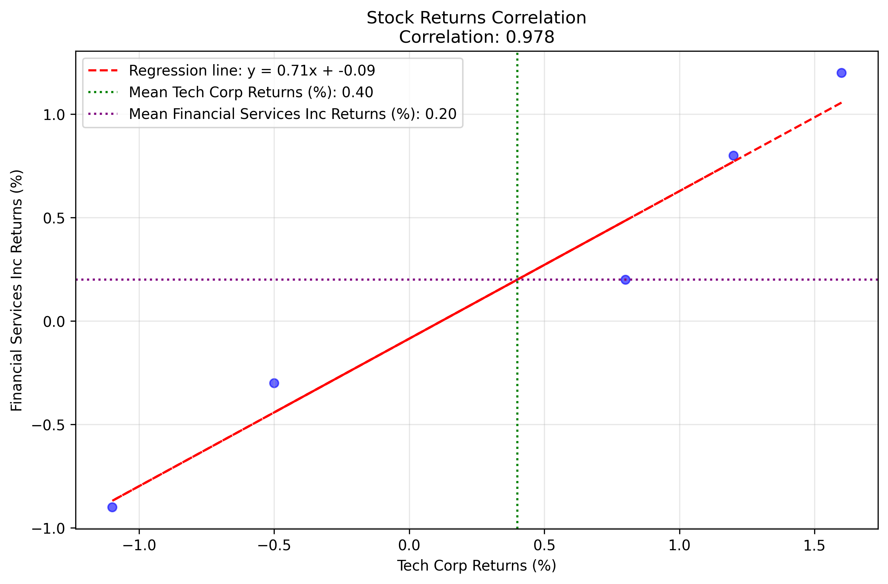
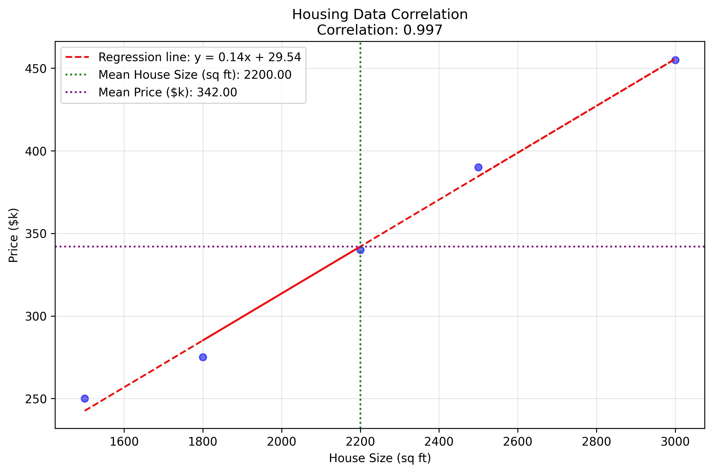
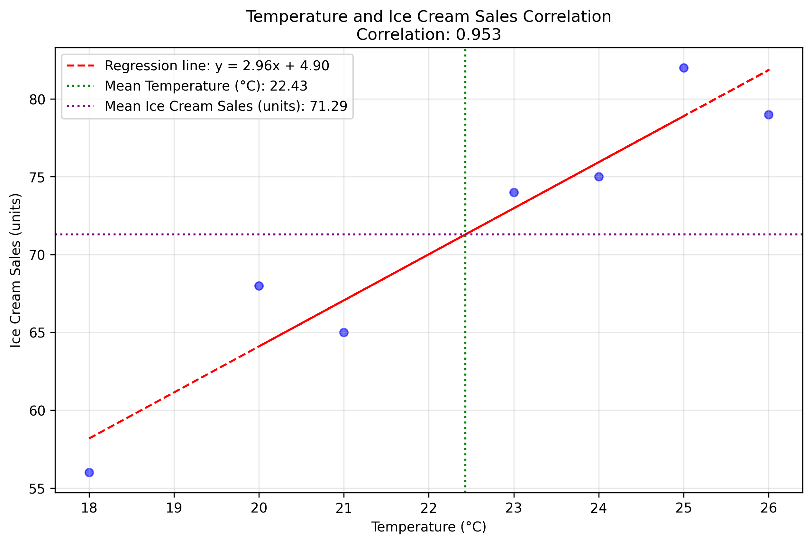
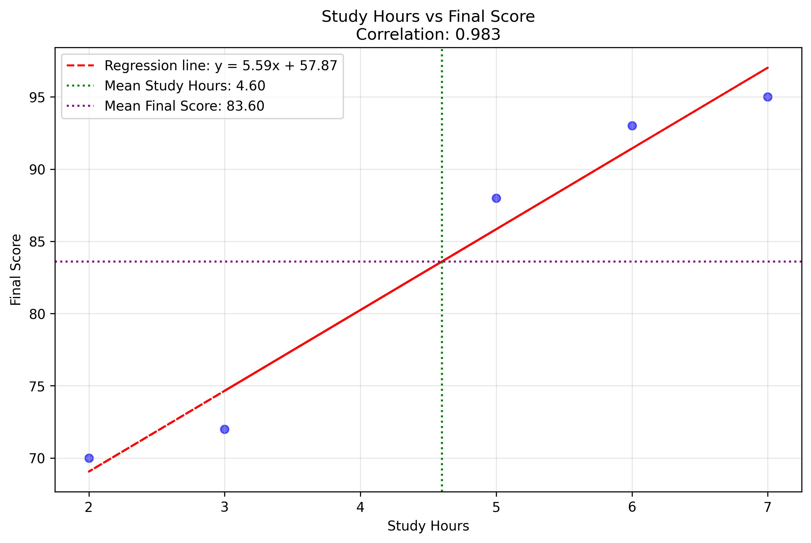
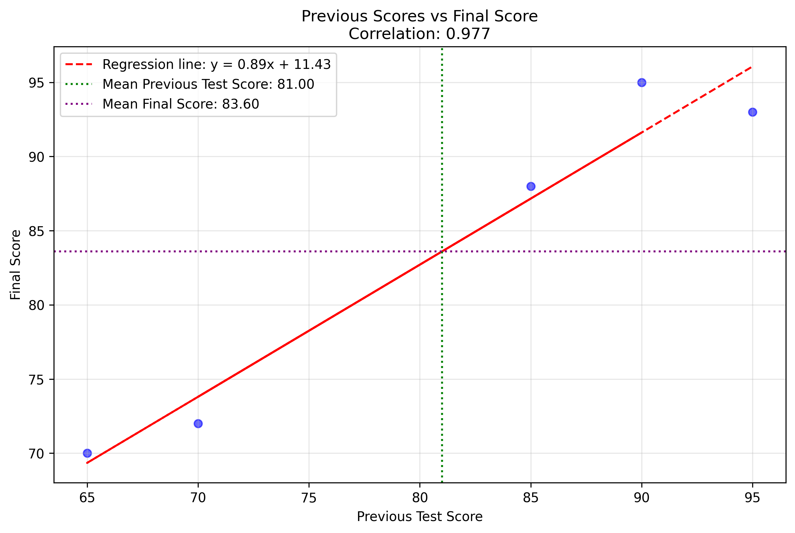
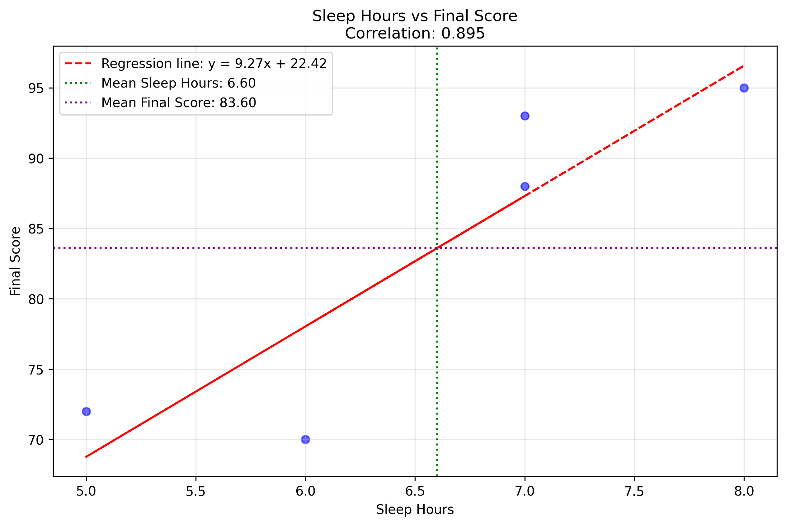
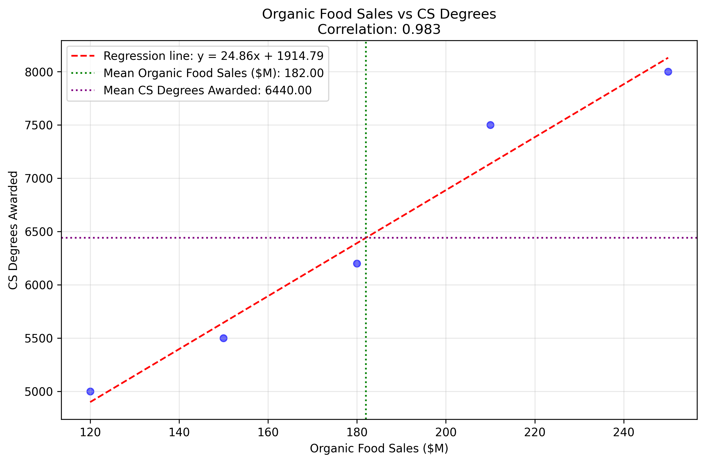

# Correlation Examples

This document provides practical examples of correlation analysis, demonstrating how to calculate and interpret the Pearson correlation coefficient in various real-world scenarios. Correlation is a fundamental concept in statistics and machine learning that measures the strength and direction of the linear relationship between two variables.

## Key Concepts and Formulas

The Pearson correlation coefficient (ρ) measures the linear relationship between two variables X and Y:

$$\rho(X,Y) = \frac{\text{Cov}(X,Y)}{\sigma_X \sigma_Y}$$

Where:
- $\text{Cov}(X,Y)$ is the covariance between X and Y
- $\sigma_X$ and $\sigma_Y$ are the standard deviations of X and Y

The correlation coefficient ranges from -1 to 1:
- 1 indicates a perfect positive linear relationship
- -1 indicates a perfect negative linear relationship
- 0 indicates no linear relationship

### Calculation Steps

For each example, we follow these detailed steps:

1. **Calculate Means**: Find the average of each variable
2. **Calculate Deviations**: Subtract the mean from each value
3. **Calculate Product of Deviations**: Multiply corresponding deviations
4. **Calculate Sum of Products**: Sum all products of deviations
5. **Calculate Covariance**: Divide sum of products by (n-1)
6. **Calculate Squared Deviations**: Square each deviation
7. **Calculate Sum of Squared Deviations**: Sum all squared deviations
8. **Calculate Standard Deviations**: Take square root of (sum of squared deviations / (n-1))
9. **Calculate Correlation**: Divide covariance by product of standard deviations

## Examples

The following examples demonstrate correlation analysis in different contexts:

- **Stock Market Returns**: Analyzing the relationship between two stock returns
- **Housing Data Analysis**: Examining the relationship between house size and price
- **Temperature and Ice Cream Sales**: Investigating the relationship between temperature and sales
- **Student Performance Analysis**: Evaluating multiple factors affecting student performance
- **Spurious Correlation**: Understanding misleading correlations

### Example 1: Stock Market Returns

#### Problem Statement
Calculate the correlation between the daily returns of Tech Corp (TC) and Financial Services Inc (FSI) stocks over a 5-day period.

In this example:
- We have daily percentage returns for two stocks
- The data represents a short-term trading period
- We want to understand if the stocks move together
- This analysis helps in portfolio diversification

#### Data
- TC Returns (%): [1.2, -0.5, 0.8, -1.1, 1.6]
- FSI Returns (%): [0.8, -0.3, 0.2, -0.9, 1.2]

#### Solution

##### Step 1: Calculate Means
- Mean of TC returns: 0.40%
- Mean of FSI returns: 0.20%

##### Step 2: Calculate Deviations
- TC deviations: [0.8, -0.9, 0.4, -1.5, 1.2]
- FSI deviations: [0.6, -0.5, 0.0, -1.1, 1.0]

##### Step 3: Calculate Product of Deviations
- Products: [0.48, 0.45, 0.00, 1.65, 1.20]

##### Step 4: Calculate Sum of Products
- Sum: 3.78

##### Step 5: Calculate Covariance
- Covariance: 0.95

##### Step 6: Calculate Squared Deviations
- TC squared: [0.64, 0.81, 0.16, 2.25, 1.44]
- FSI squared: [0.36, 0.25, 0.00, 1.21, 1.00]

##### Step 7: Calculate Sum of Squared Deviations
- TC sum: 5.30
- FSI sum: 2.82

##### Step 8: Calculate Standard Deviations
- TC standard deviation: 1.15
- FSI standard deviation: 0.84

##### Step 9: Calculate Correlation
- Correlation coefficient: 0.978

#### Interpretation
The correlation coefficient of 0.978 indicates a very strong positive linear relationship between the returns of Tech Corp and Financial Services Inc stocks. This suggests that the stocks tend to move in the same direction, which is important for portfolio management and risk assessment.



### Example 2: Housing Data Analysis

#### Problem Statement
Analyze the relationship between house size and price for a sample of 5 houses.

#### Data
- House Sizes (sq ft): [1500, 2200, 1800, 3000, 2500]
- Prices ($k): [250, 340, 275, 455, 390]

#### Detailed Solution

##### Step 1: Calculate Means
- Mean size: 2200.00 sq ft
- Mean price: 342.00 $k

##### Step 2: Calculate Deviations
- Size deviations: [-700, 0, -400, 800, 300]
- Price deviations: [-92, -2, -67, 113, 48]

##### Step 3: Calculate Product of Deviations
- Products: [64400, 0, 26800, 90400, 14400]

##### Step 4: Calculate Sum of Products
- Sum: 196000.00

##### Step 5: Calculate Covariance
- Covariance: 49000.00

##### Step 6: Calculate Squared Deviations
- Size squared: [490000, 0, 160000, 640000, 90000]
- Price squared: [8464, 4, 4489, 12769, 2304]

##### Step 7: Calculate Sum of Squared Deviations
- Size sum: 1380000.00
- Price sum: 28030.00

##### Step 8: Calculate Standard Deviations
- Size standard deviation: 587.37
- Price standard deviation: 83.71

##### Step 9: Calculate Correlation
- Correlation coefficient: 0.997

#### Interpretation
The correlation coefficient of 0.997 indicates an extremely strong positive linear relationship between house size and price. This suggests that larger houses tend to be more expensive.



### Example 3: Temperature and Ice Cream Sales

#### Problem Statement
Analyze the relationship between daily temperature and ice cream sales for a week.

#### Data
- Temperatures (°C): [18, 23, 25, 21, 20, 26, 24]
- Sales (units): [56, 74, 82, 65, 68, 79, 75]

#### Detailed Solution

##### Step 1: Calculate Means
- Mean temperature: 22.43°C
- Mean sales: 71.29 units

##### Step 2: Calculate Deviations
- Temperature deviations: [-4.43, 0.57, 2.57, -1.43, -2.43, 3.57, 1.57]
- Sales deviations: [-15.29, 2.71, 10.71, -6.29, -3.29, 7.71, 3.71]

##### Step 3: Calculate Product of Deviations
- Products: [67.69, 1.55, 27.55, 8.98, 7.98, 27.55, 5.84]

##### Step 4: Calculate Sum of Products
- Sum: 147.14

##### Step 5: Calculate Covariance
- Covariance: 24.52

##### Step 6: Calculate Squared Deviations
- Temperature squared: [19.61, 0.33, 6.61, 2.04, 5.90, 12.76, 2.47]
- Sales squared: [233.65, 7.37, 114.80, 39.51, 10.80, 59.51, 13.80]

##### Step 7: Calculate Sum of Squared Deviations
- Temperature sum: 49.71
- Sales sum: 479.43

##### Step 8: Calculate Standard Deviations
- Temperature standard deviation: 2.88
- Sales standard deviation: 8.94

##### Step 9: Calculate Correlation
- Correlation coefficient: 0.953

#### Interpretation
The correlation coefficient of 0.953 indicates a very strong positive linear relationship between temperature and ice cream sales. This suggests that higher temperatures are associated with increased ice cream sales.



### Example 4: Feature Selection for Student Performance

#### Problem Statement
A data scientist is building a machine learning model to predict student performance. They've collected data for 5 students including study hours, previous test scores, sleep hours, and final scores.

#### Data
- Study Hours: [5, 3, 7, 2, 6]
- Previous Test Scores: [85, 70, 90, 65, 95]
- Sleep Hours: [7, 5, 8, 6, 7]
- Final Scores: [88, 72, 95, 70, 93]

#### Detailed Solution

##### Study Hours vs Final Scores

###### Step 1: Calculate Means
- Mean study hours: 4.60
- Mean final scores: 83.60

###### Step 2: Calculate Deviations
- Study hours deviations: [0.4, -1.6, 2.4, -2.6, 1.4]
- Final scores deviations: [4.4, -11.6, 11.4, -13.6, 9.4]

###### Step 3: Calculate Product of Deviations
- Products: [1.76, 18.56, 27.36, 35.36, 13.16]

###### Step 4: Calculate Sum of Products
- Sum: 96.20

###### Step 5: Calculate Covariance
- Covariance: 24.05

###### Step 6: Calculate Squared Deviations
- Study hours squared: [0.16, 2.56, 5.76, 6.76, 1.96]
- Final scores squared: [19.36, 134.56, 129.96, 184.96, 88.36]

###### Step 7: Calculate Sum of Squared Deviations
- Study hours sum: 17.20
- Final scores sum: 557.20

###### Step 8: Calculate Standard Deviations
- Study hours standard deviation: 2.07
- Final scores standard deviation: 11.80

###### Step 9: Calculate Correlation
- Correlation coefficient: 0.983

##### Previous Scores vs Final Scores

###### Step 1: Calculate Means
- Mean previous scores: 81.00
- Mean final scores: 83.60

###### Step 2: Calculate Deviations
- Previous scores deviations: [4, -11, 9, -16, 14]
- Final scores deviations: [4.4, -11.6, 11.4, -13.6, 9.4]

###### Step 3: Calculate Product of Deviations
- Products: [17.6, 127.6, 102.6, 217.6, 131.6]

###### Step 4: Calculate Sum of Products
- Sum: 597.00

###### Step 5: Calculate Covariance
- Covariance: 149.25

###### Step 6: Calculate Squared Deviations
- Previous scores squared: [16, 121, 81, 256, 196]
- Final scores squared: [19.36, 134.56, 129.96, 184.96, 88.36]

###### Step 7: Calculate Sum of Squared Deviations
- Previous scores sum: 670.00
- Final scores sum: 557.20

###### Step 8: Calculate Standard Deviations
- Previous scores standard deviation: 12.94
- Final scores standard deviation: 11.80

###### Step 9: Calculate Correlation
- Correlation coefficient: 0.977

##### Sleep Hours vs Final Scores

###### Step 1: Calculate Means
- Mean sleep hours: 6.60
- Mean final scores: 83.60

###### Step 2: Calculate Deviations
- Sleep hours deviations: [0.4, -1.6, 1.4, -0.6, 0.4]
- Final scores deviations: [4.4, -11.6, 11.4, -13.6, 9.4]

###### Step 3: Calculate Product of Deviations
- Products: [1.76, 18.56, 15.96, 8.16, 3.76]

###### Step 4: Calculate Sum of Products
- Sum: 48.20

###### Step 5: Calculate Covariance
- Covariance: 12.05

###### Step 6: Calculate Squared Deviations
- Sleep hours squared: [0.16, 2.56, 1.96, 0.36, 0.16]
- Final scores squared: [19.36, 134.56, 129.96, 184.96, 88.36]

###### Step 7: Calculate Sum of Squared Deviations
- Sleep hours sum: 5.20
- Final scores sum: 557.20

###### Step 8: Calculate Standard Deviations
- Sleep hours standard deviation: 1.14
- Final scores standard deviation: 11.80

###### Step 9: Calculate Correlation
- Correlation coefficient: 0.895

#### Interpretation
All features show strong positive correlations with final scores:
1. Study hours (0.983) - strongest correlation
2. Previous test scores (0.977) - very strong correlation
3. Sleep hours (0.895) - strong correlation

This suggests that all three features are good predictors of final scores, with study hours being the most predictive.





### Example 5: Spurious Correlation Analysis

#### Problem Statement
Analyze the relationship between organic food sales and computer science degrees awarded over a 5-year period.

#### Data
- Organic Food Sales ($M): [120, 150, 180, 210, 250]
- CS Degrees Awarded: [5000, 5500, 6200, 7500, 8000]

#### Detailed Solution

##### Step 1: Calculate Means
- Mean food sales: 182.00 $M
- Mean CS degrees: 6440.00

##### Step 2: Calculate Deviations
- Food sales deviations: [-62, -32, -2, 28, 68]
- CS degrees deviations: [-1440, -940, -240, 1060, 1560]

##### Step 3: Calculate Product of Deviations
- Products: [89280, 30080, 480, 29680, 106080]

##### Step 4: Calculate Sum of Products
- Sum: 255600.00

##### Step 5: Calculate Covariance
- Covariance: 63900.00

##### Step 6: Calculate Squared Deviations
- Food sales squared: [3844, 1024, 4, 784, 4624]
- CS degrees squared: [2073600, 883600, 57600, 1123600, 2433600]

##### Step 7: Calculate Sum of Squared Deviations
- Food sales sum: 10280.00
- CS degrees sum: 6572000.00

##### Step 8: Calculate Standard Deviations
- Food sales standard deviation: 50.70
- CS degrees standard deviation: 1281.80

##### Step 9: Calculate Correlation
- Correlation coefficient: 0.983

#### Interpretation
The correlation coefficient of 0.983 suggests an extremely strong positive correlation between organic food sales and computer science degrees. However, this is a classic example of a spurious correlation. Both variables are likely increasing over time due to other factors (like overall economic growth, increasing population, or growing interest in both fields) rather than having a direct causal relationship with each other.

This example illustrates that correlation does not imply causation. High correlation coefficients can appear between variables that have no direct relationship but share common trends or influences.



## Alternative Approaches

### Using NumPy's Built-in Functions
While we've shown the manual calculation steps for educational purposes, in practice, you can use NumPy's built-in functions:

```python
import numpy as np

# Calculate correlation directly
correlation = np.corrcoef(x, y)[0, 1]

# Calculate covariance directly
covariance = np.cov(x, y, ddof=1)[0, 1]
```

### Using Pandas for DataFrames
For data in pandas DataFrames:

```python
import pandas as pd

# Calculate correlation matrix
correlation_matrix = df.corr()

# Get specific correlation
correlation = df['column1'].corr(df['column2'])
```

## Key Insights

### Theoretical Insights
- Correlation measures linear relationships but may miss nonlinear patterns
- The strength of correlation is indicated by how close the coefficient is to ±1
- Correlation is sensitive to outliers in the data
- The calculation process involves multiple steps that build upon each other
- Understanding each step helps in interpreting the final correlation coefficient

### Practical Applications
- Stock market analysis for portfolio diversification
- Real estate market analysis
- Business analytics for sales and weather patterns
- Feature selection in machine learning
- Identifying potential spurious relationships
- Understanding the step-by-step calculation process helps in debugging and validation

### Common Pitfalls
- Correlation does not imply causation
- Outliers can significantly affect correlation coefficients
- Correlation only measures linear relationships
- Sample size affects the reliability of correlation estimates
- Spurious correlations can be misleading
- Missing intermediate calculation steps can lead to errors in interpretation

## Practical Implementation

The examples in this document are implemented in Python using NumPy and Matplotlib. The code demonstrates:
1. Manual calculation of correlation with detailed steps
2. Visualization of relationships using scatter plots
3. Generation of regression lines and mean indicators
4. Proper handling of data formatting and visualization

## Running the Examples

You can run the code that generates these examples and visualizations using:

```bash
python3 ML_Obsidian_Vault/Lectures/2/Codes/1_correlation_examples.py
```

The script will:
1. Calculate detailed steps for each correlation example
2. Generate visualizations for each relationship
3. Save the plots in the appropriate directory
4. Print detailed calculation steps for verification

## Related Topics

- [[L2_1_Covariance_Correlation|Covariance and Correlation]]: Theoretical foundations
- [[L2_1_Expectation|Expectation]]: Understanding means and expected values
- [[L2_1_Variance|Variance]]: Understanding data dispersion
- [[L2_1_ML_Questions|ML Probability Examples]]: Applications in machine learning 