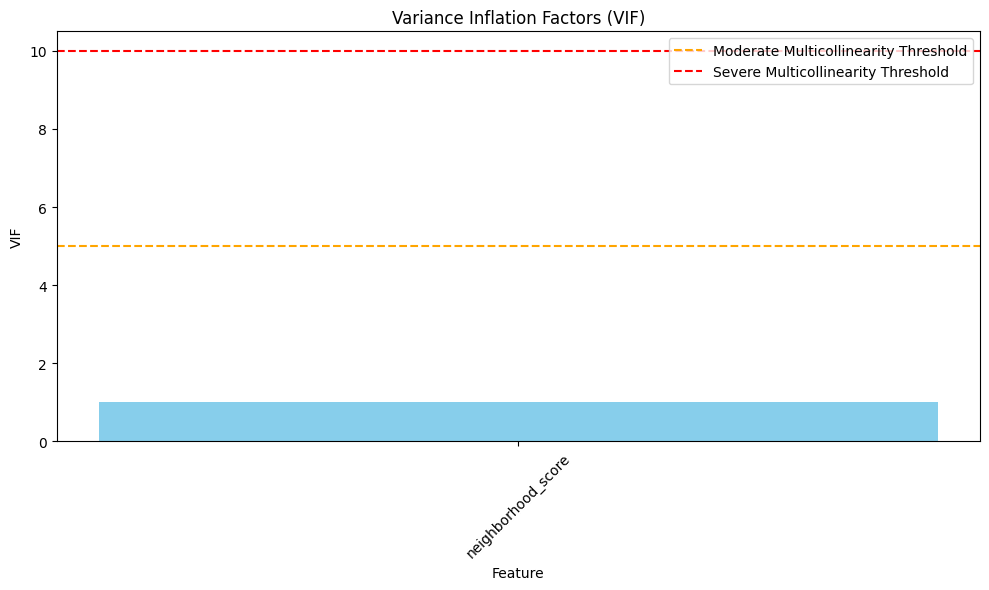

# Covariance, Correlation & Independence in ML Examples

This document provides practical examples of covariance, correlation, and independence for machine learning applications, illustrating how these statistical concepts help in understanding feature relationships and their impact on model performance.

## Key Concepts and Formulas

Covariance and correlation are fundamental statistical measures that quantify the relationship between variables, which is crucial for feature selection, dimensionality reduction, and understanding model behavior in machine learning.

### Covariance Formula

$$\text{Cov}(X,Y) = \frac{1}{n} \sum_{i=1}^{n} (x_i - \mu_X)(y_i - \mu_Y)$$

### Correlation Coefficient Formula

$$\rho_{X,Y} = \frac{\text{Cov}(X,Y)}{\sigma_X \sigma_Y} = \frac{\text{Cov}(X,Y)}{\sqrt{\text{Var}(X) \text{Var}(Y)}}$$

### Variance Inflation Factor (VIF)

$$\text{VIF}_i = \frac{1}{1-R_i^2}$$

Where:
- $\text{Cov}(X,Y)$ = Covariance between variables X and Y
- $\mu_X, \mu_Y$ = Mean values of X and Y
- $\sigma_X, \sigma_Y$ = Standard deviations of X and Y
- $\rho_{X,Y}$ = Pearson correlation coefficient (between -1 and 1)
- $\text{VIF}_i$ = Variance Inflation Factor for feature i
- $R_i^2$ = R-squared value from regressing feature i against all other features

## Examples

The following examples demonstrate covariance, correlation, and independence in ML:

- **Feature Relationships in Housing Price Prediction**: Analyzing correlations between housing features and price
- **Dimensionality Reduction with PCA**: Using correlation structure to reduce feature space
- **Feature Importance vs. Correlation**: Comparing correlation coefficients with model-based feature importance
- **Independence vs. Correlation**: Distinguishing statistical independence from correlation

### Example 1: Feature Relationships in Housing Price Prediction

#### Problem Statement
Understanding how different housing features relate to house prices and to each other is crucial for building accurate prediction models and avoiding issues like multicollinearity.

In this example:
- We have data on square footage, number of bedrooms, and neighborhood scores
- We need to analyze how these features correlate with house prices
- We want to detect potential multicollinearity issues
- We'll visualize relationships to gain better intuition

#### Solution

We'll calculate covariance and correlation matrices to understand feature relationships, then detect multicollinearity using Variance Inflation Factors (VIF).

##### Step 1: Calculate Covariance and Correlation Matrices
First, we compute the covariance matrix to see how features vary together:

$$\text{Cov}(X,Y) = \frac{1}{n} \sum_{i=1}^{n} (x_i - \mu_X)(y_i - \mu_Y)$$

The correlation matrix normalizes these values to make them comparable across features with different scales:

$$\rho_{X,Y} = \frac{\text{Cov}(X,Y)}{\sigma_X \sigma_Y}$$

Sample correlation matrix from our housing data:

| Feature | sq_footage | num_bedrooms | neighborhood_score | price |
|---------|------------|--------------|-------------------|-------|
| sq_footage | 1.0000 | 0.6602 | -0.0350 | 0.7194 |
| num_bedrooms | 0.6602 | 1.0000 | 0.0028 | 0.6912 |
| neighborhood_score | -0.0350 | 0.0028 | 1.0000 | 0.2894 |
| price | 0.7194 | 0.6912 | 0.2894 | 1.0000 |

This shows that square footage has the strongest correlation with price (0.719), followed by number of bedrooms (0.691) and neighborhood score (0.289).

##### Step 2: Visualize Feature Relationships
We create scatter plots with regression lines to visualize these relationships:


The correlation heatmap provides an overview of all pairwise relationships:


##### Step 3: Detect Multicollinearity
We introduce a new feature 'weighted_size' that is a linear combination of square footage and bedrooms to demonstrate multicollinearity detection.

To quantify multicollinearity, we calculate Variance Inflation Factors (VIF):

$$\text{VIF}_i = \frac{1}{1-R_i^2}$$

VIF values:
- sq_footage: infinity
- num_bedrooms: infinity
- neighborhood_score: 1.002
- weighted_size: infinity

VIF interpretation:
- VIF = 1: No correlation with other features
- VIF < 5: Moderate correlation, usually acceptable
- VIF ≥ 5: High correlation, potential multicollinearity issue
- VIF ≥ 10: Severe multicollinearity



This indicates that 'sq_footage', 'num_bedrooms', and 'weighted_size' show significant multicollinearity, which could cause issues in regression models.

### Example 2: Dimensionality Reduction with PCA

#### Problem Statement
When working with high-dimensional data like the breast cancer dataset with 30 features, we need to reduce dimensions while preserving important information. Principal Component Analysis (PCA) uses the correlation structure of the data to achieve this.

In this example:
- We have a dataset with 30 features describing breast cancer tumor characteristics
- We need to reduce dimensionality while preserving maximum variance
- We want to understand which original features contribute most to the principal components
- We need to determine how many components to retain

#### Solution

We'll use PCA, which leverages the covariance/correlation structure of the data to find new orthogonal dimensions (principal components) that capture maximum variance.

##### Step 1: Compute Feature Correlations
First, we analyze the correlation matrix to understand relationships between features:


The complex correlation structure shows many strong relationships between features, suggesting dimensionality reduction should be effective.

##### Step 2: Apply PCA for Dimensionality Reduction
After standardizing the features, we apply PCA and analyze the explained variance by each component:

| Principal Component | Explained Variance | Cumulative Variance |
|---------------------|-------------------|---------------------|
| PC1 | 0.4427 | 0.4427 |
| PC2 | 0.1897 | 0.6324 |
| PC3 | 0.0939 | 0.7264 |
| PC4 | 0.0660 | 0.7924 |
| PC5 | 0.0550 | 0.8473 |

Our analysis shows 10 components are needed to explain 95% of the variance, compared to the original 30 features:


##### Step 3: Visualize Data in Reduced Dimensions
We can visualize the data in the space of the first two principal components, which together explain about 63% of the variance:


This shows good separation between malignant and benign tumors using just two principal components.

##### Step 4: Analyze Component Loadings
We examine which original features contribute most to each principal component:

Top features contributing to PC1:
- mean concave points (0.261)
- mean concavity (0.258) 
- worst concave points (0.251)
- mean compactness (0.239)
- worst perimeter (0.237)

Top features contributing to PC2:
- mean fractal dimension (0.367)
- fractal dimension error (0.280)
- worst fractal dimension (0.275)
- mean radius (-0.234)
- compactness error (0.233)

The component loadings plot shows how features relate to the first two principal components:


This analysis helps interpret what each principal component represents in terms of the original features.

### Example 3: Feature Importance vs. Correlation in ML

#### Problem Statement
In machine learning, features with the highest correlation to the target aren't necessarily the most important for prediction. We need to understand how correlation compares to model-based feature importance metrics.

In this example:
- We have a synthetic dataset with features having various relationships with the target
- Some features directly influence the target, while others are correlated with influential features
- We need to compare different feature ranking methods:
  - Correlation coefficients
  - Random Forest importance
  - F-statistics from linear regression

#### Solution

We'll compare correlation coefficients with model-based importance metrics to understand how they differ.

##### Step 1: Calculate Correlation with Target
First, we compute the absolute correlation of each feature with the target:

Top 5 features by correlation with target:
1. X0: 0.729
2. X10: 0.702
3. X1: 0.580
4. X11: 0.536
5. X2: 0.333

##### Step 2: Calculate Feature Importance with Random Forest
Then we train a Random Forest model and extract its feature importance scores:

Top 5 features by Random Forest importance:
1. X0: 0.220
2. X10: 0.163
3. X1: 0.129
4. X11: 0.091
5. X2: 0.074

##### Step 3: Compare Correlation vs. Importance
We compare these different ranking methods side by side:


Key observations:
- X0 has the highest correlation and the highest Random Forest importance
- X10 has the second highest in both metrics
- The Random Forest assigns more balanced importance across features
- Some features with low correlation have significant importance in the model
- F-statistics generally align with correlation but with different scaling

This demonstrates why correlation alone shouldn't be used for feature selection in machine learning models.

### Example 4: Independence vs. Correlation in ML

#### Problem Statement
Machine learning practitioners often confuse zero correlation with statistical independence. This example demonstrates that uncorrelated variables can still be dependent, which has important implications for feature selection and model evaluation.

In this example:
- We create two variables with a non-linear relationship: y = x² + noise
- These variables have near-zero linear correlation
- Despite low correlation, they have a clear dependence structure
- We compare with truly independent variables

#### Solution

We'll demonstrate the difference between correlation (a measure of linear relationship) and independence (no relationship of any kind).

##### Step 1: Generate Uncorrelated but Dependent Data
We create data where y = x² + noise, resulting in:
- A parabolic relationship between x and y
- Near-zero linear correlation
- Strong statistical dependence

##### Step 2: Calculate Correlation Coefficient
The Pearson correlation coefficient between x and y is approximately 0.003, suggesting no linear relationship.

##### Step 3: Demonstrate Dependence Between Variables
To show dependence, we segment x into bins and calculate the mean of y in each segment:

| X Segment | Mean of y |
|-----------|-----------|
| 1 | 20.054 |
| 2 | 12.663 |
| 3 | 6.425 |
| 4 | 1.925 |
| 5 | 0.144 |
| 6 | 0.460 |
| 7 | 2.202 |
| 8 | 6.753 |
| 9 | 12.516 |
| 10 | 20.415 |

If x and y were independent, the mean of y would be approximately the same in each segment, but they clearly differ (overall mean: 8.356).


This example shows why testing for correlation is insufficient to detect all types of relationships in data, and why non-linear methods like Random Forest may outperform linear models even when linear correlations are weak.

## Key Insights

### Theoretical Insights
- Correlation measures linear relationships only; it misses non-linear dependencies
- PCA works best when relationships between features are linear
- Zero correlation doesn't imply independence, but independence does imply zero correlation
- Multicollinearity detection is essential for linear models but less important for tree-based methods

### Practical Applications
- Feature selection should consider both correlation with target and multicollinearity among features
- VIF > 5 suggests potentially problematic multicollinearity in linear models
- PCA can reduce dimensions by 70-90% while preserving most variance in many ML problems
- Random Forest importance often provides better feature ranking than correlation coefficients
- Uncorrelated features can still have predictive power through non-linear relationships

### Common Pitfalls
- Using correlation as the only feature selection metric
- Assuming uncorrelated variables are independent
- Treating all correlated features as redundant
- Not standardizing features before computing Pearson correlation or applying PCA
- Overinterpreting small differences in correlation coefficients

## Running the Examples

You can run the code that generates these examples and visualizations using:

```bash
python3 ML_Obsidian_Vault/Lectures/2/Codes/1_covariance_correlation_ml_examples.py
```

## Related Topics

- [[L2_1_Distributions_ML|Probability Distributions in ML]]: How different distributions affect the interpretation of correlations
- [[L2_1_Expectation_Variance_ML|Expectation, Variance & Moments]]: Statistical foundations for correlation and covariance
