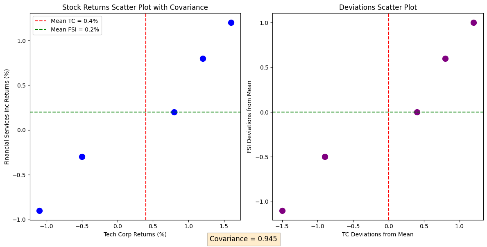
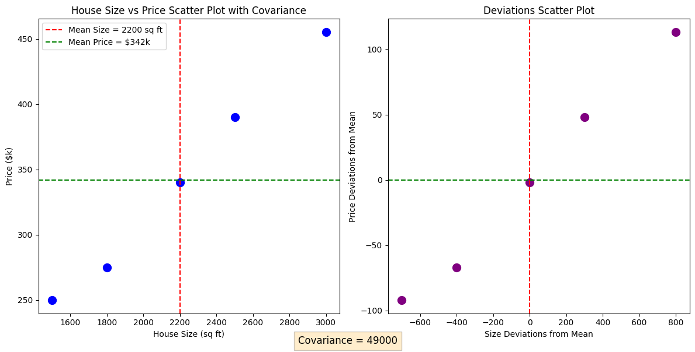
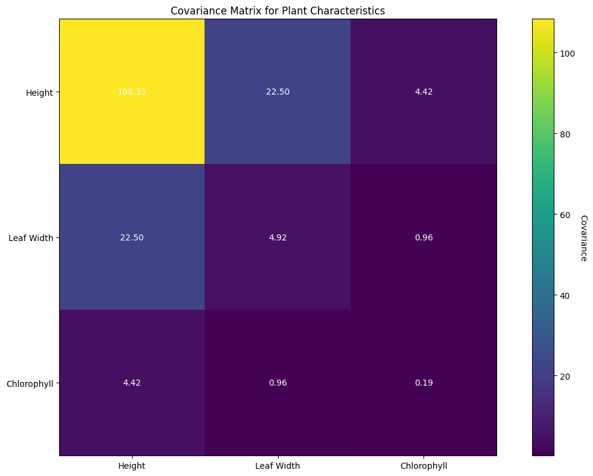

# Covariance Examples

This document provides practical examples of covariance calculations and their applications in machine learning and data analysis contexts. Covariance is a fundamental statistical measure that quantifies how two random variables vary together, which is crucial for understanding relationships between features in machine learning models.

## Key Concepts and Formulas

### The Covariance Formula

The covariance between two random variables $X$ and $Y$ is defined as:

$$
\text{Cov}(X,Y) = \frac{1}{n-1}\sum_{i=1}^{n}(x_i - \bar{x})(y_i - \bar{y})
$$

Where:
- $X, Y$ = Random variables
- $x_i, y_i$ = Individual observations
- $\bar{x}, \bar{y}$ = Sample means
- $n$ = Number of observations

### Population vs Sample Covariance
- Population covariance: $\sigma_{XY} = \frac{1}{N}\sum_{i=1}^{N}(x_i - \mu_X)(y_i - \mu_Y)$
- Sample covariance: $s_{XY} = \frac{1}{n-1}\sum_{i=1}^{n}(x_i - \bar{x})(y_i - \bar{y})$

### Understanding Deviations from the Mean

The calculation of deviations from the mean is a crucial step in computing covariance. For each data point, the deviation represents how far that point is from the mean of its distribution:

$$
\text{deviation} = x_i - \bar{x}
$$

Where:
- $x_i$ = Individual data point
- $\bar{x}$ = Mean of the distribution

The product of deviations for each pair of variables is then calculated as:

$$
\text{product of deviations} = (x_i - \bar{x}) \times (y_i - \bar{y})
$$

These products are then averaged (using n-1 for sample covariance) to obtain the final covariance value.

## Examples

The following examples demonstrate covariance calculations in different contexts:

- **Stock Market Returns**: Analyzing the relationship between two stock returns
- **Housing Data Analysis**: Understanding the relationship between house size and price
- **Multivariate Covariance Matrix**: Analyzing relationships between multiple plant characteristics

### Example 1: Stock Market Returns Analysis

#### Problem Statement
An investor wants to understand the relationship between the daily returns of two stocks: Tech Corp (TC) and Financial Services Inc (FSI). The returns for the past 5 trading days are as follows:

| Day | TC Return (%) | FSI Return (%) |
|-----|---------------|----------------|
| 1   | 1.2           | 0.8            |
| 2   | -0.5          | -0.3           |
| 3   | 0.8           | 0.2            |
| 4   | -1.1          | -0.9           |
| 5   | 1.6           | 1.2            |

Calculate the covariance between these stock returns.

#### Solution

##### Step 1: Calculate the means
$$
\bar{x}_{TC} = \frac{1.2 - 0.5 + 0.8 - 1.1 + 1.6}{5} = 0.4\%
$$

$$
\bar{x}_{FSI} = \frac{0.8 - 0.3 + 0.2 - 0.9 + 1.2}{5} = 0.2\%
$$

##### Step 2: Calculate deviations from the mean
For each data point, we calculate its deviation from the mean:

For TC returns:
$$
\begin{align*}
\text{Day 1: } &1.2\% - 0.4\% = 0.8\% \\
\text{Day 2: } &-0.5\% - 0.4\% = -0.9\% \\
\text{Day 3: } &0.8\% - 0.4\% = 0.4\% \\
\text{Day 4: } &-1.1\% - 0.4\% = -1.5\% \\
\text{Day 5: } &1.6\% - 0.4\% = 1.2\%
\end{align*}
$$

For FSI returns:
$$
\begin{align*}
\text{Day 1: } &0.8\% - 0.2\% = 0.6\% \\
\text{Day 2: } &-0.3\% - 0.2\% = -0.5\% \\
\text{Day 3: } &0.2\% - 0.2\% = 0.0\% \\
\text{Day 4: } &-0.9\% - 0.2\% = -1.1\% \\
\text{Day 5: } &1.2\% - 0.2\% = 1.0\%
\end{align*}
$$

##### Step 3: Calculate products of deviations
For each day, we multiply the deviations of TC and FSI returns:

$$
\begin{align*}
\text{Day 1: } &(0.8) \times (0.6) = 0.48 \\
\text{Day 2: } &(-0.9) \times (-0.5) = 0.45 \\
\text{Day 3: } &(0.4) \times (0.0) = 0.00 \\
\text{Day 4: } &(-1.5) \times (-1.1) = 1.65 \\
\text{Day 5: } &(1.2) \times (1.0) = 1.20
\end{align*}
$$

##### Step 4: Calculate covariance
$$
\text{Cov}(TC, FSI) = \frac{0.48 + 0.45 + 0.0 + 1.65 + 1.2}{4} = 0.945
$$

##### Detailed Calculation Table
| Day | TC Return | FSI Return | TC Deviation | FSI Deviation | Product |
|-----|-----------|------------|--------------|---------------|---------|
| 1   | 1.20      | 0.80       | 0.80         | 0.60          | 0.48    |
| 2   | -0.50     | -0.30      | -0.90        | -0.50         | 0.45    |
| 3   | 0.80      | 0.20       | 0.40         | 0.00          | 0.00    |
| 4   | -1.10     | -0.90      | -1.50        | -1.10         | 1.65    |
| 5   | 1.60      | 1.20       | 1.20         | 1.00          | 1.20    |

Therefore, the positive covariance of 0.945 indicates that the two stocks tend to move in the same direction. When TC stock rises or falls, FSI stock tends to move in the same direction.



### Example 2: Housing Data Analysis

#### Problem Statement
A real estate analyst has collected data on houses, including their size (square feet) and price (thousands of dollars):

| House | Size (sq ft) | Price ($k) |
|-------|--------------|------------|
| 1     | 1500         | 250        |
| 2     | 2200         | 340        |
| 3     | 1800         | 275        |
| 4     | 3000         | 455        |
| 5     | 2500         | 390        |

Calculate the covariance between house size and price.

#### Solution

##### Step 1: Calculate the means
$$
\bar{x}_{\text{size}} = \frac{1500 + 2200 + 1800 + 3000 + 2500}{5} = 2200 \text{ sq ft}
$$

$$
\bar{x}_{\text{price}} = \frac{250 + 340 + 275 + 455 + 390}{5} = 342 \text{ \$k}
$$

##### Step 2: Calculate deviations from the mean
For each house, we calculate its deviation from the mean:

For house sizes:
$$
\begin{align*}
\text{House 1: } &1500 - 2200 = -700 \text{ sq ft} \\
\text{House 2: } &2200 - 2200 = 0 \text{ sq ft} \\
\text{House 3: } &1800 - 2200 = -400 \text{ sq ft} \\
\text{House 4: } &3000 - 2200 = 800 \text{ sq ft} \\
\text{House 5: } &2500 - 2200 = 300 \text{ sq ft}
\end{align*}
$$

For house prices:
$$
\begin{align*}
\text{House 1: } &250 - 342 = -92 \text{ \$k} \\
\text{House 2: } &340 - 342 = -2 \text{ \$k} \\
\text{House 3: } &275 - 342 = -67 \text{ \$k} \\
\text{House 4: } &455 - 342 = 113 \text{ \$k} \\
\text{House 5: } &390 - 342 = 48 \text{ \$k}
\end{align*}
$$

##### Step 3: Calculate products of deviations
For each house, we multiply the deviations of size and price:

$$
\begin{align*}
\text{House 1: } &(-700) \times (-92) = 64400 \\
\text{House 2: } &(0) \times (-2) = 0 \\
\text{House 3: } &(-400) \times (-67) = 26800 \\
\text{House 4: } &(800) \times (113) = 90400 \\
\text{House 5: } &(300) \times (48) = 14400
\end{align*}
$$

##### Step 4: Calculate covariance
$$
\text{Cov}(\text{Size}, \text{Price}) = \frac{64400 + 0 + 26800 + 90400 + 14400}{4} = 49000
$$

##### Detailed Calculation Table
| House | Size (sq ft) | Price ($k) | Size Deviation | Price Deviation | Product |
|-------|--------------|------------|----------------|-----------------|---------|
| 1     | 1500         | 250        | -700           | -92             | 64400   |
| 2     | 2200         | 340        | 0              | -2              | 0       |
| 3     | 1800         | 275        | -400           | -67             | 26800   |
| 4     | 3000         | 455        | 800            | 113             | 90400   |
| 5     | 2500         | 390        | 300            | 48              | 14400   |

Therefore, the positive covariance of 49000 indicates that larger houses tend to have higher prices.



### Example 3: Multivariate Covariance Matrix

#### Problem Statement
A biologist is studying the relationship between three characteristics of a plant species: height (cm), leaf width (mm), and chlorophyll content (mg/g). Data for 4 plant samples:

| Plant | Height (cm) | Leaf Width (mm) | Chlorophyll (mg/g) |
|-------|-------------|-----------------|-------------------|
| 1     | 45          | 12              | 2.5               |
| 2     | 60          | 15              | 3.0               |
| 3     | 35          | 10              | 2.0               |
| 4     | 50          | 14              | 2.8               |

Construct the covariance matrix for these variables.

#### Solution

##### Step 1: Calculate the means for each variable
$$
\begin{align*}
\bar{x}_{\text{height}} &= \frac{45 + 60 + 35 + 50}{4} = 47.5 \text{ cm} \\
\bar{x}_{\text{leaf}} &= \frac{12 + 15 + 10 + 14}{4} = 12.8 \text{ mm} \\
\bar{x}_{\text{chlorophyll}} &= \frac{2.5 + 3.0 + 2.0 + 2.8}{4} = 2.58 \text{ mg/g}
\end{align*}
$$

##### Step 2: Calculate deviations from means
For each plant and variable, we calculate the deviations from their respective means:

Plant 1:
$$
\begin{align*}
\text{Height: } &45 - 47.5 = -2.5 \text{ cm} \\
\text{Leaf width: } &12 - 12.8 = -0.8 \text{ mm} \\
\text{Chlorophyll: } &2.5 - 2.58 = -0.08 \text{ mg/g}
\end{align*}
$$

Plant 2:
$$
\begin{align*}
\text{Height: } &60 - 47.5 = 12.5 \text{ cm} \\
\text{Leaf width: } &15 - 12.8 = 2.2 \text{ mm} \\
\text{Chlorophyll: } &3.0 - 2.58 = 0.42 \text{ mg/g}
\end{align*}
$$

Plant 3:
$$
\begin{align*}
\text{Height: } &35 - 47.5 = -12.5 \text{ cm} \\
\text{Leaf width: } &10 - 12.8 = -2.8 \text{ mm} \\
\text{Chlorophyll: } &2.0 - 2.58 = -0.58 \text{ mg/g}
\end{align*}
$$

Plant 4:
$$
\begin{align*}
\text{Height: } &50 - 47.5 = 2.5 \text{ cm} \\
\text{Leaf width: } &14 - 12.8 = 1.2 \text{ mm} \\
\text{Chlorophyll: } &2.8 - 2.58 = 0.22 \text{ mg/g}
\end{align*}
$$

The deviation matrix is:
$$
\begin{bmatrix}
-2.5 & -0.75 & -0.075 \\
12.5 & 2.25 & 0.425 \\
-12.5 & -2.75 & -0.575 \\
2.5 & 1.25 & 0.225
\end{bmatrix}
$$

##### Step 3: Calculate covariance matrix
The covariance matrix is calculated using the formula:
$$
\Sigma = \frac{1}{n-1} D^T D
$$
where $D$ is the deviation matrix.

Resulting covariance matrix:
$$
\begin{bmatrix}
108.33 & 22.50 & 4.42 \\
22.50 & 4.92 & 0.96 \\
4.42 & 0.96 & 0.19
\end{bmatrix}
$$

##### Detailed Calculation Table
| Plant | Height (cm) | Leaf Width (mm) | Chlorophyll (mg/g) | Height Deviation | Leaf Width Deviation | Chlorophyll Deviation |
|-------|-------------|-----------------|-------------------|------------------|----------------------|----------------------|
| 1     | 45.00       | 12.00           | 2.50              | -2.50            | -0.75                | -0.08                |
| 2     | 60.00       | 15.00           | 3.00              | 12.50            | 2.25                 | 0.42                 |
| 3     | 35.00       | 10.00           | 2.00              | -12.50           | -2.75                | -0.58                |
| 4     | 50.00       | 14.00           | 2.80              | 2.50             | 1.25                 | 0.22                 |

Therefore, this covariance matrix shows:
- The variances of each variable along the diagonal
- The covariances between pairs of variables in the off-diagonal elements
- The matrix is symmetric (the covariance between height and leaf width is the same as between leaf width and height)

The positive covariances indicate that all variables tend to increase together, with the strongest relationship between height and leaf width (22.50).



## Key Insights

### Theoretical Insights
- Covariance quantifies the joint variability between two variables
- Positive covariance indicates variables tend to move in the same direction
- Negative covariance indicates variables tend to move in opposite directions
- Zero covariance indicates no linear relationship between variables
- Covariance is affected by the scale of the variables

### Practical Applications
- **Portfolio Management**: Covariance helps in understanding how different assets move together
- **Feature Engineering**: Covariance matrices are used in dimensionality reduction techniques like PCA
- **Multivariate Analysis**: Covariance matrices are fundamental in multivariate statistical methods
- **Gaussian Processes**: Covariance functions define similarity between data points

### Common Pitfalls
- **Scale Sensitivity**: Covariance values are affected by the units of measurement
- **Limited to Linear Relationships**: Covariance only captures linear dependencies
- **Sensitive to Outliers**: Extreme values can significantly impact covariance calculations
- **Not Normalized**: Unlike correlation, covariance values can be any real number

## How to Run the Examples
To run these examples and generate the visualizations, use:
```bash
python3 ML_Obsidian_Vault/Lectures/2/Codes/1_covariance_examples.py
```

## Related Topics
- [[L2_2_Correlation_Examples|Correlation Examples]]: Understanding standardized covariance
- [[L2_3_Variance_Examples|Variance Examples]]: Special case of covariance
- [[L2_4_Multivariate_Analysis|Multivariate Analysis]]: Advanced analysis involving multiple random variables 