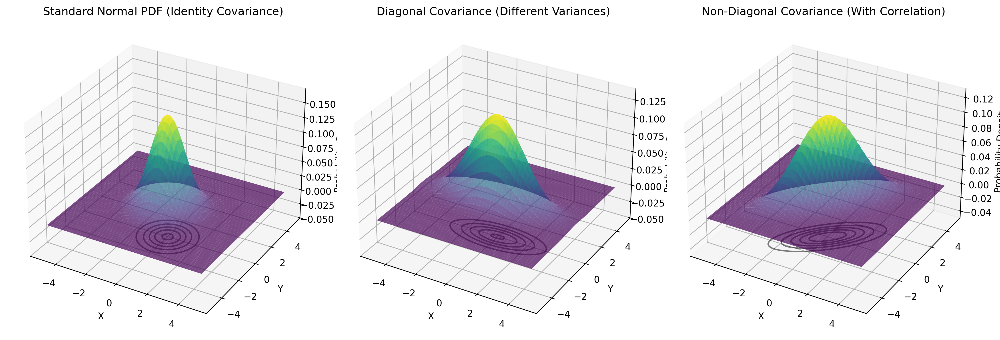
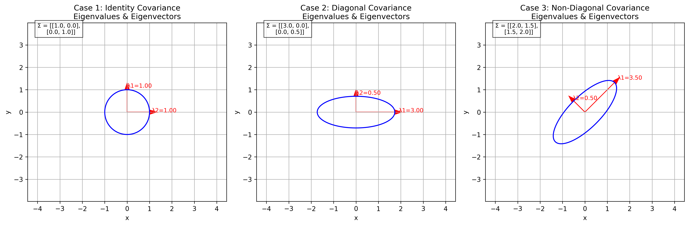
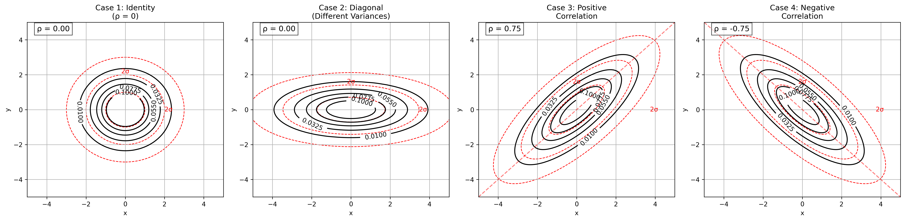
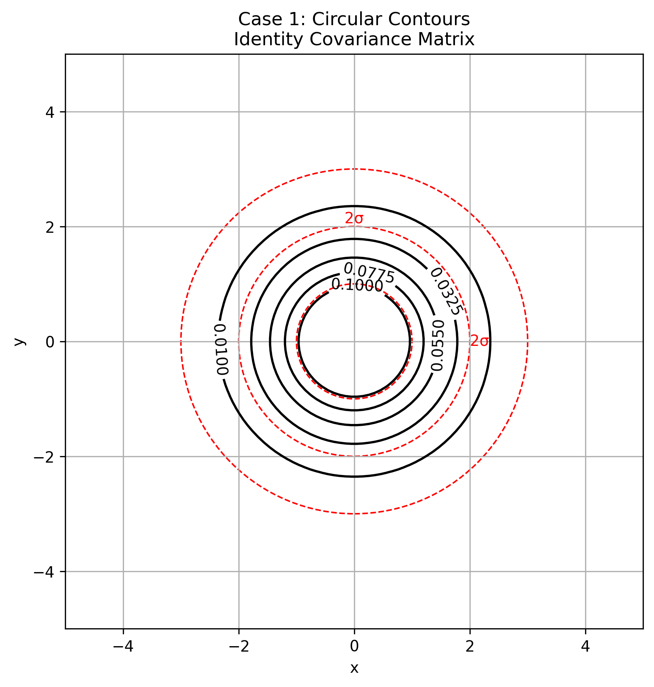

# Example 1: Basic Normal Distributions

## Problem Statement
How do variance changes affect 1D normal distributions, and what happens when we extend to 2D with independent variables? How do different covariance matrices affect the shape, orientation, and probability surfaces of multivariate normal distributions?

We'll examine different covariance matrices:
- Identity covariance matrix: $\Sigma = \begin{bmatrix} 1.0 & 0.0 \\ 0.0 & 1.0 \end{bmatrix}$
- Diagonal with different variances: $\Sigma = \begin{bmatrix} 2.0 & 0.0 \\ 0.0 & 0.5 \end{bmatrix}$
- Non-diagonal with positive correlation: $\Sigma = \begin{bmatrix} 2.0 & 1.5 \\ 1.5 & 2.0 \end{bmatrix}$
- Non-diagonal with negative correlation: $\Sigma = \begin{bmatrix} 2.0 & -1.5 \\ -1.5 & 2.0 \end{bmatrix}$

For all cases, we'll use mean vector $\mu = [0, 0]$.

## Understanding the Problem
The covariance matrix is a square matrix that captures how variables in a multivariate distribution vary with respect to each other. For a bivariate normal distribution, the shape and orientation of its probability density contours are directly determined by the covariance matrix.

### The Multivariate Gaussian Formula

The probability density function (PDF) of a multivariate Gaussian distribution is given by:

$$f(\mathbf{x}) = \frac{1}{(2\pi)^{n/2}|\boldsymbol{\Sigma}|^{1/2}} \exp\left(-\frac{1}{2}(\mathbf{x}-\boldsymbol{\mu})^T \boldsymbol{\Sigma}^{-1} (\mathbf{x}-\boldsymbol{\mu})\right)$$

For a bivariate case ($n = 2$), this becomes:

$$f(x,y) = \frac{1}{2\pi\sqrt{|\Sigma|}} \exp\left(-\frac{1}{2}(X-\mu)^T \Sigma^{-1} (X-\mu)\right)$$

Where:
- $X = (x, y)$ = Vector of variables
- $\mu = (\mu_x, \mu_y)$ = Mean vector
- $\Sigma$ = Covariance matrix $\begin{bmatrix} \sigma_x^2 & \sigma_{xy} \\ \sigma_{xy} & \sigma_y^2 \end{bmatrix}$
- $|\Sigma|$ = Determinant of the covariance matrix = $\sigma_x^2\sigma_y^2 - \sigma_{xy}^2$
- $\Sigma^{-1}$ = Inverse of the covariance matrix

The contour plots of this distribution form ellipses described by:

$$(X-\mu)^T \Sigma^{-1} (X-\mu) = c$$

Where $c$ is a constant value. These ellipses represent points of equal probability density.

## Solution

### Step 1: Understanding 1D Normal Distributions with Different Variances
The probability density function of a 1D normal distribution is:

$$f(x) = \frac{1}{\sqrt{2\pi\sigma^2}} \exp\left(-\frac{x^2}{2\sigma^2}\right)$$

Where $\sigma^2$ is the variance parameter. We'll visualize three cases:

1. **Standard normal ($\sigma^2 = 1$)**: 
   $$f(x) = \frac{1}{\sqrt{2\pi}} \exp\left(-\frac{x^2}{2}\right)$$

2. **Narrow normal ($\sigma^2 = 0.5$)**:
   $$f(x) = \frac{1}{\sqrt{\pi}} \exp(-x^2)$$
   - This has a taller peak (larger maximum value)
   - It decreases more rapidly as x moves away from the mean

3. **Wide normal ($\sigma^2 = 2$)**:
   $$f(x) = \frac{1}{\sqrt{4\pi}} \exp\left(-\frac{x^2}{4}\right)$$
   - This has a shorter peak (smaller maximum value)
   - It decreases more slowly as x moves away from the mean

The key insight: The total area under each curve equals 1 (probability axiom). Therefore, curves with higher peaks must be narrower, and those with lower peaks must be wider to maintain the same total area.

### Step 2: Extending to 2D - Understanding Covariance Matrices and Their Eigenstructure

The covariance matrix has a direct relationship with the shape of the probability distribution. The eigenvalues and eigenvectors of the covariance matrix determine the principal axes and their lengths.

For a 2D standard normal distribution (with identity covariance matrix), the PDF is:

$$f(x,y) = \frac{1}{2\pi} \exp\left(-\frac{x^2 + y^2}{2}\right)$$

Key properties:
- Equal variance in both dimensions ($\sigma_1^2 = \sigma_2^2 = 1$)
- Zero correlation between x and y ($\rho = 0$)
- Contours form perfect circles centered at the origin
- The equation for the contours is $x^2 + y^2 = \text{constant}$
- The contour value $c$ corresponds to the constant: $-2\ln(2\pi c)$
- 1σ, 2σ, and 3σ circles have radii of 1, 2, and 3 respectively
- The 1σ circle contains approximately 39% of the probability mass
- The 2σ circle contains approximately 86% of the probability mass
- The 3σ circle contains approximately 99% of the probability mass

### Step 3: Comparing Different Types of Covariance Matrices

Different covariance matrices produce distinctly different contour shapes:

1. **Identity covariance matrix**: Circular contours showing equal spread in all directions
2. **Diagonal covariance matrix with different variances**: Axis-aligned elliptical contours showing different spread along coordinate axes
3. **Non-diagonal covariance matrix with positive correlation**: Elliptical contours tilted along the y=x direction
4. **Non-diagonal covariance matrix with negative correlation**: Elliptical contours tilted along the y=-x direction

### Step 4: 2D Normal with Different Variances (Diagonal Covariance Matrix)
Now we examine a bivariate normal where the variances are different:

$$f(x,y) = \frac{1}{2\pi\sqrt{|\Sigma|}} \exp\left(-\frac{1}{2}\left(\frac{x^2}{\sigma_1^2} + \frac{y^2}{\sigma_2^2}\right)\right)$$

Where $\sigma_1^2 = 2$ and $\sigma_2^2 = 0.5$

Key properties:
- Covariance matrix $\Sigma = \begin{bmatrix} 2 & 0 \\ 0 & 0.5 \end{bmatrix}$
- Determinant $|\Sigma| = 2 \cdot 0.5 = 1$
- Different variances in x and y directions
- Still zero correlation between variables ($\rho = 0$)
- Contours form axis-aligned ellipses
- The equation for the contours is $\frac{x^2}{2} + \frac{y^2}{0.5} = \text{constant}$
- The semi-axes of the ellipses are in the ratio $\sqrt{2} : \sqrt{0.5} \approx 1.41 : 0.71$
- The ellipses are stretched along the x-axis and compressed along the y-axis
- This reflects greater variance in the x direction than in the y direction

### Step 5: Key Insights from the Comparison
1. 1D normal distributions: As variance increases, the peak height decreases and the spread increases, but the total area remains constant (= 1)
2. 2D standard normal (equal variances): Circular contours indicating equal spread in all directions. This is the simplest case.
3. 2D normal with different variances: Elliptical contours indicating different spread in different directions. The direction of greater variance corresponds to the longer axis of the ellipse.
4. 2D normal with correlation: Rotated elliptical contours where the tilt direction indicates the direction of correlation.

The mathematical relationship: The shape of the contours directly reflects the structure of the covariance matrix. The principal axes of the ellipses align with the eigenvectors of the covariance matrix, and their lengths are proportional to the square roots of the eigenvalues.

## Visual Explanations

### 3D Probability Density Functions for Different Covariance Matrices

*3D visualization of probability density functions for different covariance matrices, showing how the surface shape relates to the contour shapes below.*

### Eigenvalues and Eigenvectors for Different Covariance Matrices

*Visualization of eigenvalues and eigenvectors for different covariance matrices. The red arrows show the principal directions (eigenvectors) and their lengths are proportional to the square roots of the eigenvalues.*

### Comparison of Different Covariance Matrices and Their Contours

*Comparison of different covariance matrices and their resulting contours. From left to right: identity covariance (circular contours), diagonal with different variances (axis-aligned ellipses), positive correlation (ellipses tilted along y=x), and negative correlation (ellipses tilted along y=-x).*

### Detailed Contour Plots for Different Covariance Matrices

*Detailed contour plots for four different covariance matrices. Red dashed lines show 1σ, 2σ, and 3σ boundaries.*

## Key Insights

### Theoretical Foundations
- The covariance matrix directly determines the shape and orientation of probability density contours in multivariate normal distributions
- Eigenvalues and eigenvectors of the covariance matrix determine the principal axes and their lengths for the elliptical contours
- The determinant of the covariance matrix affects the "volume" of the probability distribution

### Types of Covariance Matrices
- **Diagonal Covariance Matrix with Equal Variances (Identity Matrix)**:
   $$\Sigma = \begin{bmatrix} \sigma^2 & 0 \\ 0 & \sigma^2 \end{bmatrix} = \sigma^2 I$$
   - Produces circular contours
   - Equal spread in all directions
   - Contour equation: $(x-\mu_x)^2 + (y-\mu_y)^2 = c\sigma^2$

- **Diagonal Covariance Matrix with Different Variances**:
   $$\Sigma = \begin{bmatrix} \sigma_1^2 & 0 \\ 0 & \sigma_2^2 \end{bmatrix}$$
   - Produces axis-aligned elliptical contours
   - Different spread along x and y axes
   - Contour equation: $\frac{(x-\mu_x)^2}{\sigma_1^2} + \frac{(y-\mu_y)^2}{\sigma_2^2} = c$

- **Non-Diagonal Covariance Matrix (With Correlation)**:
   $$\Sigma = \begin{bmatrix} \sigma_1^2 & \rho\sigma_1\sigma_2 \\ \rho\sigma_1\sigma_2 & \sigma_2^2 \end{bmatrix}$$
   - Produces rotated elliptical contours
   - Correlation coefficient $\rho$ determines the rotation angle
   - Contour equation involves cross-terms: $ax^2 + 2bxy + cy^2 = k$ (where $a$, $b$, $c$ depend on $\Sigma^{-1}$)

### Eigendecomposition of Covariance Matrix
- The covariance matrix can be decomposed as: $\Sigma = V\Lambda V^T$
- $V$ = Matrix of eigenvectors (columns are the eigenvectors)
- $\Lambda$ = Diagonal matrix of eigenvalues
- The eigenvectors define the principal axes of the elliptical contours
- The eigenvalues determine the length of each principal axis (proportional to $\sqrt{\lambda_i}$)

## Running the Examples

You can run the code that generates these examples and visualizations using:

```bash
python3 ML_Obsidian_Vault/Lectures/2/Codes/L2_1_CMC_example_1_covariance_matrix_contours.py
```