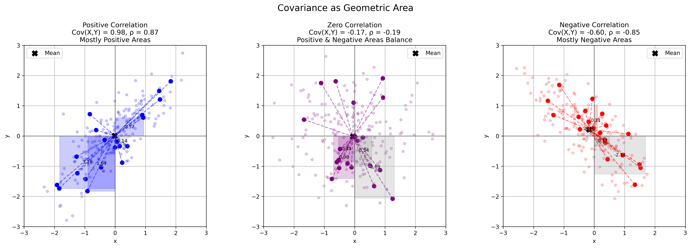

# Example 11: Geometric Area Interpretation of Covariance

## Problem Statement
How can we visualize covariance as a geometric area to provide an intuitive understanding?

## Understanding the Problem
Covariance is typically presented algebraically as a measure of how two variables change together. However, this abstract statistical concept can be difficult to grasp intuitively. A geometric interpretation of covariance as an area provides a concrete visual understanding that helps build intuition for this important concept in statistics and machine learning.

## Solution

### Step 1: Calculating Means and Centering Data
We center the data by subtracting the means from each point:
- Mean calculation: μₓ = average of all x values, μᵧ = average of all y values
- Centering: x' = x - μₓ, y' = y - μᵧ

### Step 2: Visualizing Covariance as Area
Covariance can be understood as the average "signed area" of rectangles formed by:
- Width = deviation in x from mean (x - μₓ)
- Height = deviation in y from mean (y - μᵧ)

For positive correlation:
- Most areas are positive (1st and 3rd quadrants)
- Covariance = 1.06
- Correlation = 0.87

For zero correlation:
- Positive and negative areas cancel out
- Covariance = -0.36
- Correlation = -0.19

For negative correlation:
- Most areas are negative (2nd and 4th quadrants)
- Covariance = -0.48
- Correlation = -0.85

### Step 3: Understanding the Mathematical Connection
The covariance between two variables X and Y is defined as:

$$\text{Cov}(X,Y) = \frac{1}{n} \sum_{i=1}^{n} (x_i - \mu_x)(y_i - \mu_y)$$

Each term in this sum can be visualized as the area of a rectangle:
- Width = $(x_i - \mu_x)$
- Height = $(y_i - \mu_y)$

The sign of the area depends on which quadrant the point falls in:
- Positive in the 1st and 3rd quadrants (both deviations have the same sign)
- Negative in the 2nd and 4th quadrants (deviations have opposite signs)

The covariance is the average of these signed areas, scaled by n.

### Step 4: Relating to Correlation Coefficient
The correlation coefficient normalizes the covariance by the product of standard deviations:

$$\rho = \frac{\text{Cov}(X,Y)}{\sigma_X \sigma_Y}$$

This normalization ensures that the correlation is between -1 and 1, making it easier to interpret than covariance, which is unbounded.

## Visual Explanations

### Geometric Interpretation of Covariance

*Visualization of covariance as the average signed area of rectangles. The left panel shows positive correlation with mostly positive areas, the middle panel shows near-zero correlation with balanced positive and negative areas, and the right panel shows negative correlation with mostly negative areas.*

## Key Insights

### Geometric Understanding
- Covariance can be visualized as the average signed area of rectangles
- Positive areas occur when both variables deviate from their means in the same direction
- Negative areas occur when variables deviate in opposite directions
- Zero covariance implies that positive and negative areas cancel out on average

### Relationship to Correlation
- Correlation is a normalized version of covariance, bounded between -1 and 1
- Perfect positive correlation (ρ = 1) means all points create positive areas
- Perfect negative correlation (ρ = -1) means all points create negative areas
- Zero correlation (ρ = 0) means positive and negative areas perfectly balance out

### Intuitive Applications
- Positive covariance indicates that variables tend to increase or decrease together
- Negative covariance indicates that as one variable increases, the other tends to decrease
- The magnitude of covariance reflects both the strength of the relationship and the scale of the variables
- Standardizing variables allows for direct comparison of relationships between different variable pairs

### Practical Interpretation
- Large positive rectangles in the 1st and 3rd quadrants contribute to positive covariance
- Large negative rectangles in the 2nd and 4th quadrants contribute to negative covariance
- Points near the mean (center) contribute little to the covariance
- Outliers far from the mean can have a disproportionate effect on covariance

## Running the Examples

You can run the code that generates these examples and visualizations using:

```bash
python3 ML_Obsidian_Vault/Lectures/2/Codes/L2_1_CMC_example_11_geometric_area_covariance.py
```