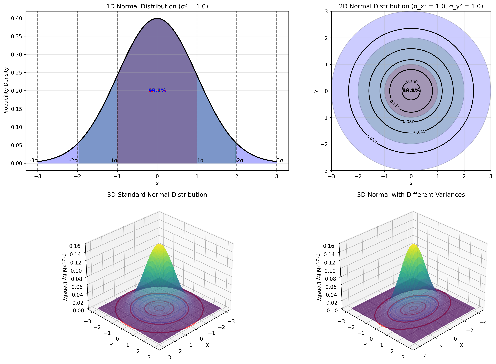
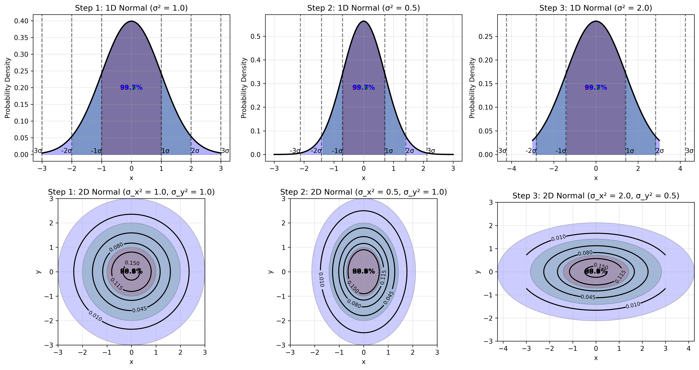
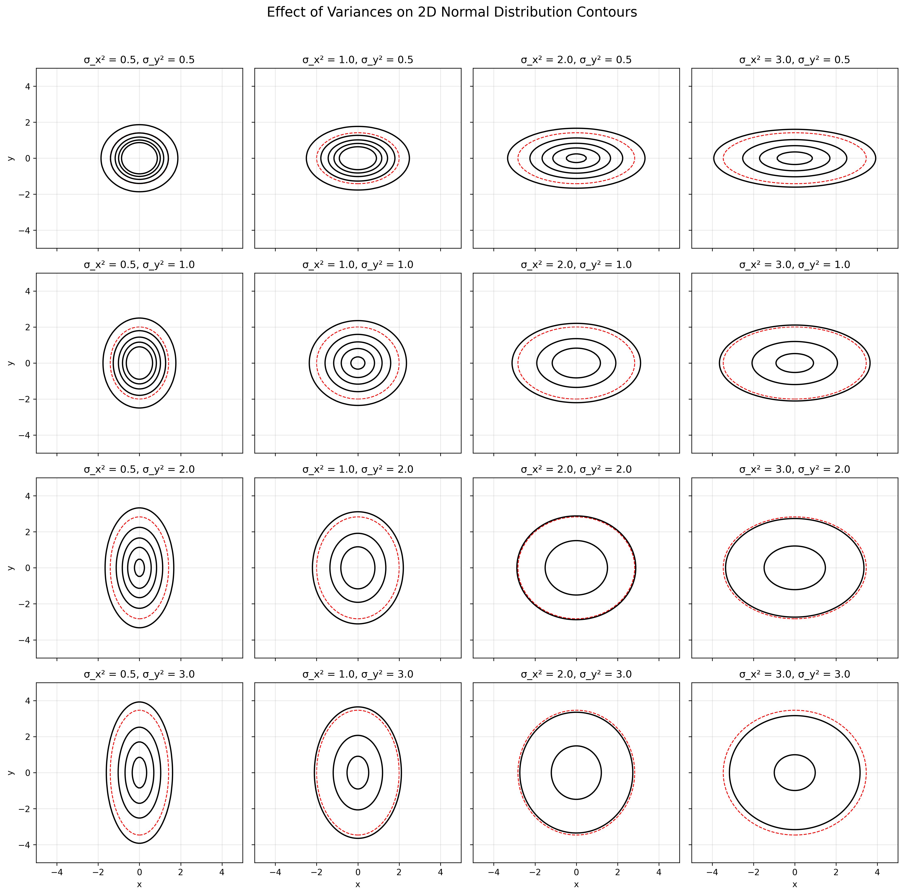

# Example 2: Covariance Matrix Types and Their Effects

## Problem Statement
How do different types of covariance matrices affect the shape, size, and orientation of probability density contours? How does the probability mass distribute within different sigma regions for both 1D and 2D normal distributions?

We will examine four covariance matrices:
1. Identity covariance: $\Sigma = \begin{bmatrix} 1.0 & 0.0 \\ 0.0 & 1.0 \end{bmatrix}$
2. Diagonal with different variances: $\Sigma = \begin{bmatrix} 3.0 & 0.0 \\ 0.0 & 0.5 \end{bmatrix}$
3. Non-diagonal with positive correlation: $\Sigma = \begin{bmatrix} 2.0 & 1.5 \\ 1.5 & 2.0 \end{bmatrix}$
4. Non-diagonal with negative correlation: $\Sigma = \begin{bmatrix} 2.0 & -1.5 \\ -1.5 & 2.0 \end{bmatrix}$

## Understanding the Problem
The covariance matrix determines the shape and orientation of probability density contours in multivariate normal distributions. Different structures in the covariance matrix (diagonal vs. non-diagonal) lead to different geometrical properties of the resulting probability distributions. The distribution of probability mass within regions bounded by contours also follows specific patterns that differ between 1D and higher-dimensional cases.

## Solution

### Step 1: Understanding Normal Distribution Probability Regions
For a 1D normal distribution:
- 68.27% of the probability mass falls within 1σ (±1 standard deviation) of the mean
- 95.45% of the probability mass falls within 2σ (±2 standard deviations) of the mean
- 99.73% of the probability mass falls within 3σ (±3 standard deviations) of the mean

For a 2D normal distribution with equal variances:
- 39.35% of the probability mass falls within the 1σ circle
- 86.47% of the probability mass falls within the 2σ circle
- 98.89% of the probability mass falls within the 3σ circle

Note that the percentages are different between 1D and 2D cases due to the increased dimensionality.

### Step 2: Transitioning from 1D to 2D Normal Distributions
As we extend from 1D to 2D distributions, the probability structure changes. The transition sequence demonstrates:
1. Standard normal in both dimensions (equal variances)
2. Narrow distribution in x, standard in y (different variances)
3. Wide distribution in x, narrow in y (highly different variances in opposite directions)

This progression helps build an intuitive understanding of how the covariance matrix shapes the probability density.

### Step 3: The Effect of Variance Parameters on Contour Shapes
The shape of contours is directly determined by the variance parameters.

Key observations:
- When σ²ₓ = σ²ᵧ (diagonal from top-left to bottom-right), contours are circular
- As σ²ₓ increases horizontally across the grid, ellipses stretch in the x-direction
- As σ²ᵧ increases vertically down the grid, ellipses stretch in the y-direction
- The ratio σ²ₓ/σ²ᵧ determines the aspect ratio of the ellipses

### Step 4: Diagonal Covariance with Equal Variances (Identity Matrix)
When the covariance matrix is a scaled identity matrix:

$$\Sigma = \begin{bmatrix} 1.0 & 0.0 \\ 0.0 & 1.0 \end{bmatrix} = I$$

Properties:
- Equal variances ($\sigma_1^2 = \sigma_2^2 = 1$)
- Zero correlation ($\rho = 0$)
- Determinant $|\Sigma| = 1$
- Eigenvalues: $\lambda_1 = \lambda_2 = 1$
- The resulting contours form perfect circles
- The equation for these contours is $x^2 + y^2 = \text{constant}$
- This is the standard bivariate normal distribution
- The PDF simplifies to: $f(x,y) = \frac{1}{2\pi} \exp\left(-\frac{x^2 + y^2}{2}\right)$

### Step 5: Diagonal Covariance with Different Variances
When the covariance matrix has different variances but no correlation:

$$\Sigma = \begin{bmatrix} 3.0 & 0.0 \\ 0.0 & 0.5 \end{bmatrix}$$

Properties:
- Different variances ($\sigma_1^2 = 3$, $\sigma_2^2 = 0.5$)
- Zero correlation ($\rho = 0$)
- Determinant $|\Sigma| = 1.5$
- Eigenvalues: $\lambda_1 = 3$, $\lambda_2 = 0.5$ (same as variances since matrix is diagonal)
- The resulting contours form axis-aligned ellipses
- The equation for these contours is $\frac{x^2}{3} + \frac{y^2}{0.5} = \text{constant}$
- The ellipses are stretched along the x-axis and compressed along the y-axis
- The PDF is: $f(x,y) = \frac{1}{2\pi\sqrt{1.5}} \exp\left(-\frac{1}{2} \left(\frac{x^2}{3} + \frac{y^2}{0.5}\right)\right)$
- The semi-axes of the ellipses are in the ratio $\sqrt{3} : \sqrt{0.5} \approx 1.73 : 0.71$

### Step 6: Non-Diagonal Covariance with Positive Correlation
When the covariance matrix has non-zero off-diagonal elements with positive correlation:

$$\Sigma = \begin{bmatrix} 2.0 & 1.5 \\ 1.5 & 2.0 \end{bmatrix}$$

Properties:
- Equal variances ($\sigma_1^2 = \sigma_2^2 = 2$)
- Positive correlation ($\rho = 0.75$)
- Determinant $|\Sigma| = 1.75$
- Eigenvalues: $\lambda_1 = 3.50$, $\lambda_2 = 0.50$
- Eigenvectors: $v_1 = [0.71, 0.71]$, $v_2 = [-0.71, 0.71]$
- The resulting contours form rotated ellipses
- The ellipses are tilted along the $y = x$ direction (positive correlation)
- The principal axes align with the eigenvectors of the covariance matrix
- The semi-axes lengths are proportional to $\sqrt{3.5}$ and $\sqrt{0.5}$
- The quadratic form in the exponent is:
  $(x,y)^T \Sigma^{-1} (x,y) = \begin{bmatrix} x & y \end{bmatrix} \begin{bmatrix} a & b \\ b & c \end{bmatrix} \begin{bmatrix} x \\ y \end{bmatrix} = a \cdot x^2 + 2b \cdot xy + c \cdot y^2$
  where $\Sigma^{-1} = \begin{bmatrix} a & b \\ b & c \end{bmatrix}$ is the inverse of the covariance matrix

### Step 7: Non-Diagonal Covariance with Negative Correlation
When the covariance matrix has non-zero off-diagonal elements with negative correlation:

$$\Sigma = \begin{bmatrix} 2.0 & -1.5 \\ -1.5 & 2.0 \end{bmatrix}$$

Properties:
- Equal variances ($\sigma_1^2 = \sigma_2^2 = 2$)
- Negative correlation ($\rho = -0.75$)
- Determinant $|\Sigma| = 1.75$
- Eigenvalues: $\lambda_1 = 3.50$, $\lambda_2 = 0.50$
- Eigenvectors: $v_1 = [0.71, -0.71]$, $v_2 = [0.71, 0.71]$
- The resulting contours form rotated ellipses
- The ellipses are tilted along the $y = -x$ direction (negative correlation)
- The principal axes align with the eigenvectors of the covariance matrix
- The semi-axes lengths are proportional to $\sqrt{3.5}$ and $\sqrt{0.5}$
- The negative correlation means that as one variable increases, the other tends to decrease, creating the rotation in the opposite direction

### Step 8: Key Insights from Comparison
1. Diagonal covariance matrices produce axis-aligned ellipses or circles:
   - Equal variances (Case 1): Perfect circles
   - Different variances (Case 2): Axis-aligned ellipses
2. Non-diagonal covariance matrices produce rotated ellipses:
   - Positive correlation (Case 3): Ellipses tilted along $y = x$
   - Negative correlation (Case 4): Ellipses tilted along $y = -x$
3. The shape and orientation of the ellipses directly reflect the covariance structure:
   - The principal axes of the ellipses align with the eigenvectors of the covariance matrix
   - The length of each principal axis is proportional to the square root of the corresponding eigenvalue
4. The density contours connect points of equal probability density
5. Mathematical relationship between correlation and geometry:
   - As correlation increases in magnitude, ellipses become more elongated
   - The angle of the principal axis is $\tan^{-1}(\rho\sigma_2/\sigma_1)$ for positive correlation
   - The eccentricity of the ellipses increases with stronger correlation

## Visual Explanations

### Probability Mass Distribution in 1D and 2D Normal Distributions

*Visualization of probability mass contained within different sigma regions for 1D and 2D normal distributions. Top row shows the probability regions with exact percentages, bottom row shows 3D surfaces.*

### Transition from 1D to 2D Normal Distributions

*Visualization of the transition from 1D to 2D normal distributions with different variance parameters, showing how the probability regions extend into the second dimension.*

### Effect of Different Variance Parameters on Contour Shapes

*Grid visualization showing how different combinations of variance parameters affect the shape and orientation of contours. The figure displays 16 different combinations of variances for x and y coordinates.*

## Key Insights

### Theoretical Foundations
- The covariance matrix completely determines the shape and orientation of density contours
- As dimensionality increases, the probability mass contained within fixed-sigma regions decreases
- The determinant of the covariance matrix is proportional to the "volume" of the probability density

### Probability Distribution Properties
- 1D normal distribution has well-known probability masses within sigma regions (68-95-99.7 rule)
- 2D normal distribution has different probability masses within sigma regions (39-86-99 rule)
- The transition from 1D to 2D distributions changes how probability mass is distributed

### Geometric Interpretations
- The shape of contours directly reflects the covariance structure of the distribution
- The principal axes of the ellipses align with the eigenvectors of the covariance matrix
- The length of each principal axis is proportional to the square root of the corresponding eigenvalue
- The correlation coefficient determines the orientation angle of the principal axes

### Practical Applications
- Understanding the geometry of multivariate normal distributions helps in visualizing high-dimensional data
- The covariance matrix provides a compact representation of the relationship between variables
- The eigendecomposition of the covariance matrix reveals the underlying structure of the data
- The probability regions defined by contours are important for statistical inference and hypothesis testing

## Running the Examples

You can run the code that generates these examples and visualizations using:

```bash
python3 ML_Obsidian_Vault/Lectures/2/Codes/L2_1_CMC_example_2_basic_2d_normal.py
```