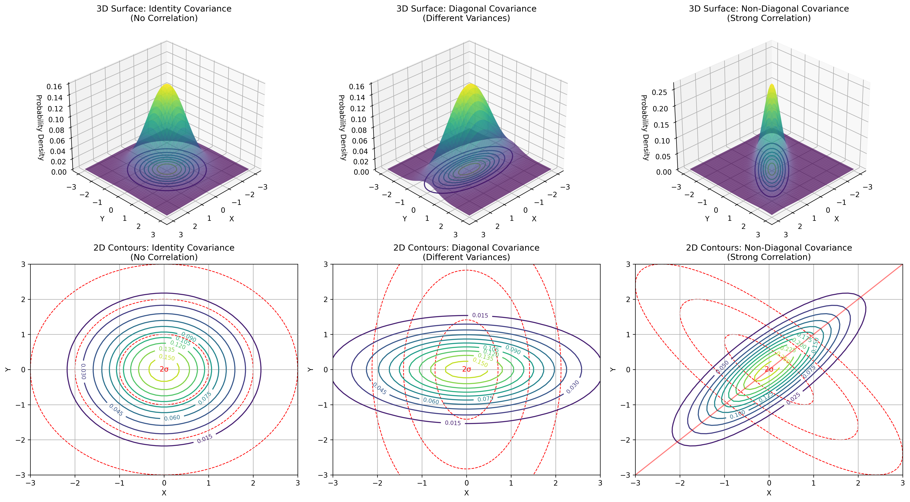
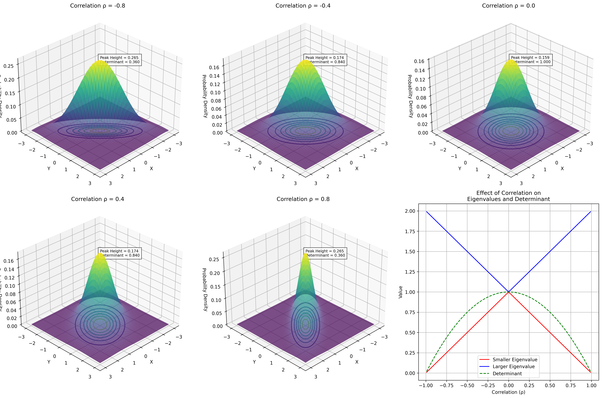
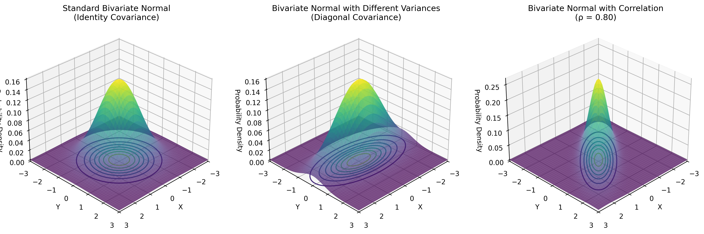

# Example 3: 3D Visualization of Probability Density Functions

## Problem Statement
How does the probability density function of a bivariate normal distribution look in 3D space, and how does the covariance matrix affect this surface? How does correlation impact the shape and cross-sections of the probability density surface?

We will visualize the 3D surfaces for three covariance matrices:
1. Standard normal (identity covariance): $\Sigma = \begin{bmatrix} 1.0 & 0.0 \\ 0.0 & 1.0 \end{bmatrix}$
2. Diagonal with different variances: $\Sigma = \begin{bmatrix} 2.0 & 0.0 \\ 0.0 & 0.5 \end{bmatrix}$
3. Non-diagonal with correlation: $\Sigma = \begin{bmatrix} 1.0 & 0.8 \\ 0.8 & 1.0 \end{bmatrix}$

Mean vector for all cases: $\mu = [0, 0]$

## Understanding the Problem
A bivariate normal distribution can be visualized as a 3D surface where the height at any point (x,y) represents the probability density at that point. The shape of this surface is determined by the covariance matrix. Understanding this 3D representation helps build intuition for how variance and correlation affect probability distributions, which is essential for many machine learning algorithms that assume multivariate normality.

## Solution

### Step 1: Setting Up the Visualization Framework
To visualize bivariate normal distributions in 3D, we need to:
- Create a 2D grid of (x,y) points where we'll evaluate the PDF
- Calculate the PDF value at each point, giving us a 3D surface z = f(x,y)
- Plot this surface in 3D space, with contours projected on the xy-plane

This gives us a comprehensive view of both the probability density surface and its contour lines, helping us understand the distribution's shape.

### Step 2: Effect of Correlation on 3D Gaussian Surface
As the correlation parameter changes, the 3D probability density surface undergoes significant transformations:

Key observations:
- Negative correlation ($\rho = -0.8$): The surface stretches along the $y = -x$ direction
- No correlation ($\rho = 0$): The surface is symmetric with circular contours
- Positive correlation ($\rho = 0.8$): The surface stretches along the $y = x$ direction
- As $|\rho|$ approaches 1, the determinant approaches 0, causing the peak height to increase
- The larger eigenvalue increases and the smaller eigenvalue decreases as $|\rho|$ increases
- The determinant $(1-\rho^2)$ decreases with increasing $|\rho|$, affecting the overall volume

### Step 3: Cross-Sections of Probability Density Functions
Different slices through the PDF reveal important properties about correlation:

These cross-sections show:
- With no correlation ($\rho = 0$), all directional cross-sections have the same shape
- With positive correlation ($\rho > 0$), the cross-section along $y = x$ becomes wider and flatter
- With strong correlation ($\rho \to 1$), the cross-section along $y = -x$ becomes sharply peaked
- As correlation increases, the overall peak height increases due to decreasing determinant

### Step 4: Standard Bivariate Normal (Identity Covariance)
For a standard bivariate normal distribution:
- Mean vector: $\mu = [0, 0]$ (centered at the origin)
- Covariance matrix: $\Sigma = \begin{bmatrix} 1 & 0 \\ 0 & 1 \end{bmatrix}$ (identity matrix)
- PDF: $f(x,y) = \frac{1}{2\pi} \exp\left(-\frac{x^2 + y^2}{2}\right)$

Key properties of the 3D surface:
- The peak occurs at (0,0) with a value of $\frac{1}{2\pi} \approx 0.159$
- The surface has perfect radial symmetry around the z-axis
- The contours projected onto the xy-plane form perfect circles
- The surface falls off equally in all directions from the peak
- The volume under the entire surface equals 1 (probability axiom)

### Step 5: Bivariate Normal with Different Variances (Diagonal Covariance)
For a bivariate normal with different variances:
- Mean vector: $\mu = [0, 0]$ (still centered at the origin)
- Covariance matrix: $\Sigma = \begin{bmatrix} 2.0 & 0 \\ 0 & 0.5 \end{bmatrix}$ (diagonal but unequal)
- PDF: $f(x,y) = \frac{1}{2\pi\sqrt{|\Sigma|}} \exp\left(-\frac{1}{2} \left(\frac{x^2}{2} + \frac{y^2}{0.5}\right)\right)$
- Determinant $|\Sigma| = 2.0 \cdot 0.5 = 1.0$

Key properties of the 3D surface:
- The peak still occurs at (0,0) with the same height as Case 1
- The surface is stretched along the x-axis and compressed along the y-axis
- The contours projected onto the xy-plane form axis-aligned ellipses
- The surface falls off more slowly in the x-direction (larger variance)
- The surface falls off more quickly in the y-direction (smaller variance)
- The volume under the surface still equals 1

### Step 6: Bivariate Normal with Correlation (Non-Diagonal Covariance)
For a bivariate normal with correlation:
- Mean vector: $\mu = [0, 0]$
- Covariance matrix: $\Sigma = \begin{bmatrix} 1.0 & 0.8 \\ 0.8 & 1.0 \end{bmatrix}$ (non-diagonal)
- Correlation coefficient: $\rho = 0.80$ (strong positive correlation)
- PDF: $f(x,y) = \frac{1}{2\pi\sqrt{|\Sigma|}} \exp\left(-\frac{1}{2} (x,y)^T \Sigma^{-1} (x,y)\right)$
- Determinant $|\Sigma| = 1.0^2 - 0.8^2 = 0.36$

Key properties of the 3D surface:
- The peak still occurs at (0,0), but its height is different due to the determinant
- The surface is tilted, with its principal axes rotated from the coordinate axes
- The contours projected onto the xy-plane form rotated ellipses
- The primary direction of spread is along the $y = x$ line (reflecting positive correlation)
- The surface shows that x and y tend to increase or decrease together
- The correlation creates a 'ridge' along the $y = x$ direction
- The volume under the surface still equals 1

### Step 7: Key Insights from Comparing All Three 3D Visualizations
1. The covariance matrix directly determines the shape and orientation of the PDF surface
2. Identity covariance (Case 1): Symmetric bell shape with circular contours
3. Diagonal covariance with different variances (Case 2): Stretched bell shape with axis-aligned elliptical contours
4. Non-diagonal covariance with correlation (Case 3): Tilted bell shape with rotated elliptical contours

Mathematical relationships:
- The exponent term in the PDF formula: $-\frac{1}{2} (x,y)^T \Sigma^{-1} (x,y)$ creates the shape
- The determinant term in the denominator: $\sqrt{|\Sigma|}$ adjusts the height of the peak
- Together they ensure that the volume under the surface equals 1

## Visual Explanations

### Relationship Between 3D Surfaces and 2D Contours

*Visualization showing the relationship between 3D probability density surfaces and their corresponding 2D contour plots for three different covariance matrices. The top row shows the 3D surfaces, and the bottom row shows the corresponding contour plots.*

### Effect of Correlation on Surface Shape

*Sequence of 3D probability density surfaces showing how correlation affects shape and orientation. The bottom right plot shows how correlation affects eigenvalues and determinant of the covariance matrix.*

### Cross-Sections of Probability Density Functions

*Cross-sections of probability density functions along different directions for various correlation values. The red line shows the cross-section along the $y=x$ direction, blue along the x-axis, and green along the $y=-x$ direction.*

### Detailed 3D Visualizations

*3D visualizations of Gaussian probability density functions with three different covariance matrices: identity covariance (left), diagonal with different variances (middle), and positive correlation (right).*

## Key Insights

### 3D Surface Properties
- The height of the surface at any point (x,y) represents the probability density at that point
- The peak of the surface always occurs at the mean vector position
- The total volume under the surface always equals 1 (probability axiom)
- The peak height is inversely proportional to the square root of the determinant of the covariance matrix

### Correlation Effects
- Zero correlation: Surface has principal axes aligned with the coordinate axes
- Positive correlation: Surface is elongated along the $y = x$ direction
- Negative correlation: Surface is elongated along the $y = -x$ direction
- As correlation magnitude increases, the surface becomes more ridge-like
- Strong correlation causes the peak to become higher and sharper due to decreasing determinant

### Mathematical Connections
- The covariance matrix's eigenstructure directly determines the principal axes of the 3D surface
- The eigenvalues determine how quickly the surface decreases along each principal axis
- The contours of constant probability density are ellipses in the xy-plane
- The 3D surface shows why probability mass concentrates along the directions of correlation

### Practical Applications
- Understanding 3D surfaces helps visualize how data tends to be distributed in multivariate settings
- The shape of the surface reveals inherent tendencies in the data generation process
- Cross-sections along different directions reveal different aspects of the correlation structure
- These visualizations provide intuition for more complex high-dimensional distributions

## Running the Examples

You can run the code that generates these examples and visualizations using:

```bash
python3 ML_Obsidian_Vault/Lectures/2/Codes/L2_1_CMC_example_3_gaussian_3d_visualization.py
```