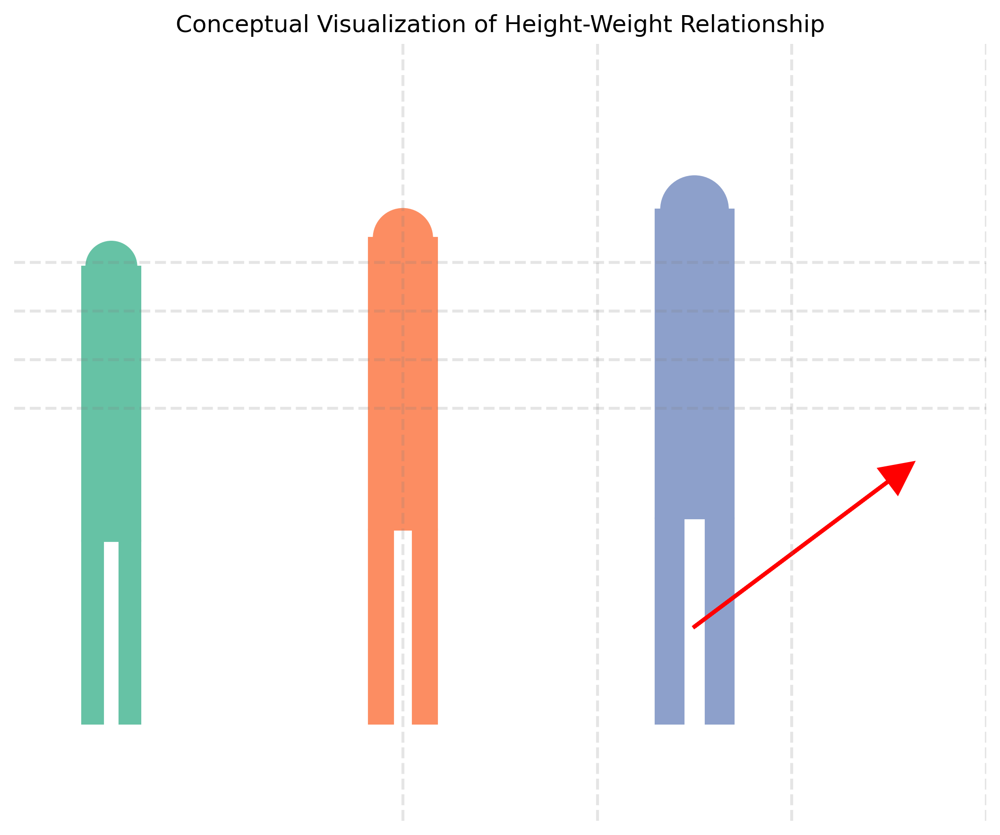

# Example 5: Height-Weight Relationship - Real-World Covariance

## Problem Statement
How does natural covariance appear in the real world, and how can it be visualized using height and weight data? How can we apply our theoretical understanding of covariance to real-world biometric relationships?

For this example, we'll use the following assumptions for height-weight relationships:
- Height (cm): Normally distributed with mean 170cm and standard deviation 7cm
- Weight (kg): Related to height by the model $w = 0.5h + \varepsilon$, where $\varepsilon \sim \mathcal{N}(0, 5^2)$
- This creates a natural positive correlation between height and weight

## Understanding the Problem
Covariance matrices in real-world data help us understand natural relationships between variables. Human height and weight provide an excellent example of naturally correlated variables that can be modeled using multivariate normal distributions. The relationship between these variables reflects underlying biological principles and demonstrates how abstract mathematical concepts manifest in natural phenomena.

## Solution

### Step 1: Understanding the Natural Relationship
Height and weight are naturally correlated variables in human populations:
- Taller people tend to weigh more (positive correlation)
- This relationship is not deterministic but statistical
- The covariance structure can be visualized as an elliptical pattern in a scatter plot
- The direction of maximum variance typically aligns with the "growth trajectory"

Mathematical model:
- Height (cm): $h \sim \mathcal{N}(170, 7^2)$ (mean 170cm, standard deviation 7cm)
- Weight (kg): $w = 0.5h + \varepsilon$, where $\varepsilon \sim \mathcal{N}(0, 5^2)$
- This creates a positive correlation between height and weight

This relationship exists because of underlying biological and physiological factors: as a person grows taller, their skeletal frame and body volume increase, typically requiring more mass to support the larger structure.

### Step 2: Calculating the Covariance Matrix
For our simulated data, we compute the covariance matrix:

$$\Sigma = \begin{bmatrix} \sigma_h^2 & \sigma_{hw} \\ \sigma_{hw} & \sigma_w^2 \end{bmatrix} = \begin{bmatrix} 40.41 & 16.07 \\ 16.07 & 28.71 \end{bmatrix}$$

Where:
- $\sigma_h^2 = 40.41$ is the variance of height (cm²)
- $\sigma_w^2 = 28.71$ is the variance of weight (kg²)
- $\sigma_{hw} = 16.07$ is the covariance between height and weight (cm·kg)

The correlation coefficient is calculated as:

$$\rho = \frac{\sigma_{hw}}{\sigma_h \sigma_w} = \frac{16.07}{\sqrt{40.41} \cdot \sqrt{28.71}} \approx 0.47$$

This moderate positive correlation indicates that height and weight tend to increase together, though the relationship is not extremely strong due to individual variations in body composition.

### Step 3: Eigendecomposition of the Covariance Matrix
We compute the eigenvalues and eigenvectors of the covariance matrix:

$$\Sigma = V \Lambda V^T$$

Eigenvalues:
- $\lambda_1 = 51.66$ (variance along the first principal component)
- $\lambda_2 = 17.45$ (variance along the second principal component)

Eigenvectors (columns of $V$):
- $v_1 = [0.82, 0.57]^T$ (direction of maximum variance)
- $v_2 = [-0.57, 0.82]^T$ (direction perpendicular to $v_1$)

The first principal component ($v_1$) represents the "growth direction" where both height and weight increase together. The second principal component ($v_2$) represents variations in body type (more or less weight relative to height).

### Step 4: Visualizing with Confidence Ellipses
We draw confidence ellipses to represent regions containing approximately:
- 68% of the data (1σ ellipse)
- 95% of the data (2σ ellipse)

These ellipses are centered at the mean $(μ_h, μ_w)$ with:
- Principal axes aligned with the eigenvectors of the covariance matrix
- Semi-axis lengths proportional to the square roots of the eigenvalues
- Rotation determined by the orientation of the first eigenvector

The principal components shown as arrows indicate:
- PC1 (larger arrow): The main "growth direction" explaining most of the variance
- PC2 (smaller arrow): The secondary dimension of variation, representing body type differences

The best-fit regression line shows the expected weight based on height, following the formula:
$\text{weight} \approx 0.40 \times \text{height} + \text{constant}$

This line provides a simple linear model for the relationship, though the elliptical confidence regions provide a more complete picture of the bivariate distribution.

### Step 5: 3D Probability Density and Marginal Distributions
The 3D visualization shows:
- The probability density surface of the bivariate normal distribution
- Higher density (peak) at the mean of height and weight
- The elliptical contours projected onto the height-weight plane
- The elongation of the density surface along the direction of maximum variance

The marginal distributions show:
- The height distribution follows a normal distribution with mean ≈ 170cm
- The weight distribution follows a normal distribution with mean ≈ 85kg
- These are the "slices" of the bivariate distribution along each axis

### Step 6: Covariance Matrix Visualization
The covariance matrix can be visualized to help understand the variance-covariance structure.

### Step 7: Interpreting the Results
The visualization reveals key insights:
- The data cloud forms an elongated elliptical pattern
- The first principal component points along the "growth direction" where both height and weight increase together
- The second principal component represents variations in body type (more weight relative to height or vice versa)
- The angle of the first principal component indicates the rate of weight change relative to height
- The eccentricity of the ellipse reflects the strength of the correlation

This real-world example demonstrates how the abstract mathematical concept of covariance manifests in natural data, helping us understand and model relationships between variables.

## Visual Explanations

### Conceptual Relationship

*Conceptual visualization of the height-weight relationship showing how taller individuals tend to be heavier, illustrating natural correlation in human biometrics.*

### Height-Weight Data with Principal Components

*Height-weight relationship showing scatter plot with principal components and confidence ellipses.*

### 3D Probability Density Surface

*3D probability density surface of the height-weight relationship.*

### Marginal Distributions

*Marginal distributions of height and weight.*

### Covariance Matrix Visualization

*Covariance matrix visualization.*

## Key Insights

### Real-World Applications of Covariance
- Covariance matrices describe natural relationships between variables in real-world phenomena
- Height and weight represent a classic example of naturally correlated biometric variables
- The elliptical pattern in the data reflects the underlying statistical relationship
- The direction of maximum variance often has meaningful physical or biological interpretation

### Data Analysis Techniques
- Principal Component Analysis (PCA) identifies the main directions of variation in multivariate data
- Confidence ellipses provide a visual representation of probability regions
- The 3D probability density surface shows how probability mass is distributed in bivariate distributions
- Marginal distributions show the individual behavior of each variable when considered separately

### Statistical Modeling
- Real-world relationships can often be modeled as multivariate normal distributions
- The covariance matrix captures essential information about relationships between variables
- Linear regression provides a simplified model for the relationship but doesn't capture the full structure
- The eigendecomposition of the covariance matrix reveals the natural coordinate system of the data

### Practical Interpretations
- The first principal component often represents size or growth (general scaling)
- The second principal component often represents shape or composition differences
- The correlation coefficient quantifies the strength of the linear relationship
- Understanding covariance helps with developing more accurate prediction models

## Running the Examples

You can run the code that generates these examples and visualizations using:

```bash
python3 ML_Obsidian_Vault/Lectures/2/Codes/L2_1_CMC_example_5_real_world_covariance.py
```