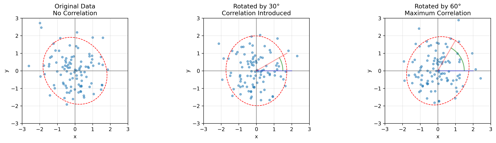
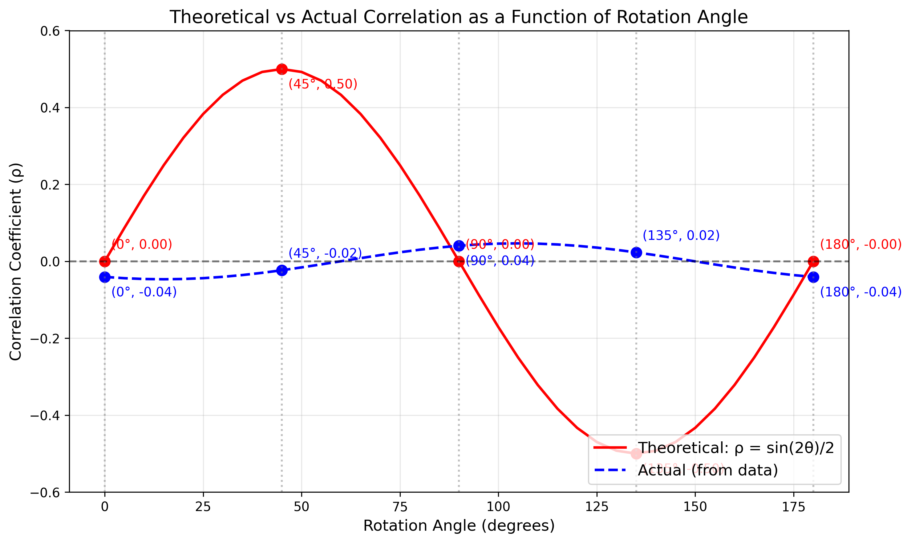
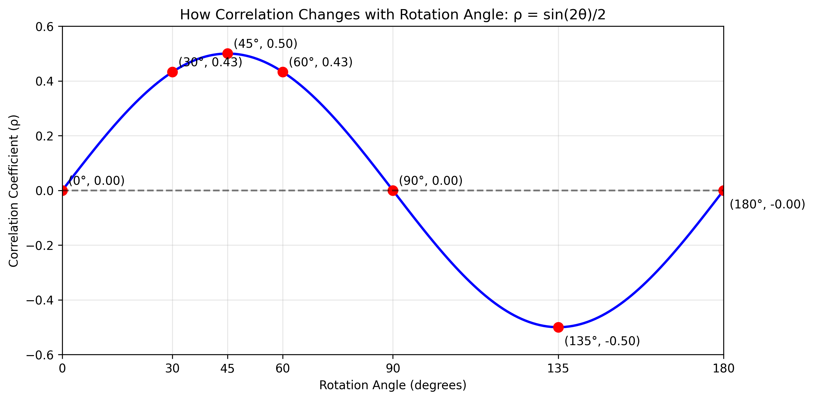
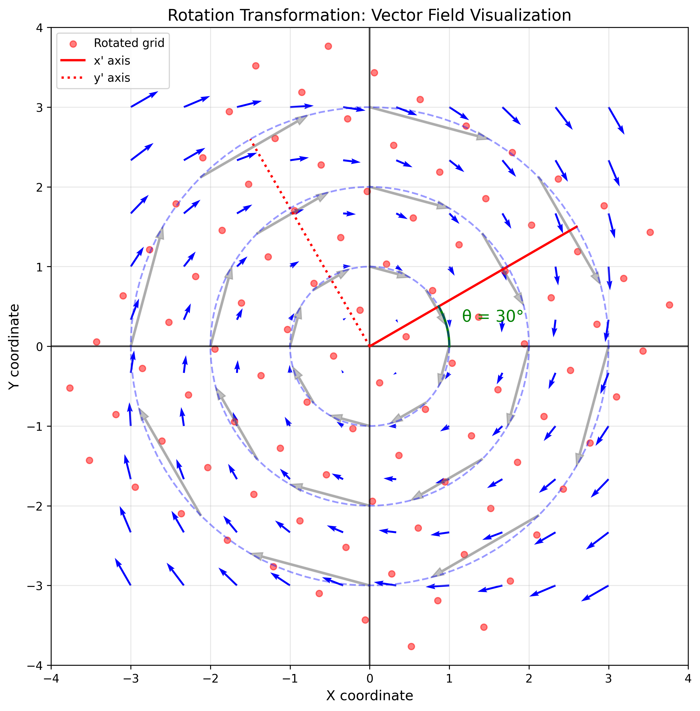
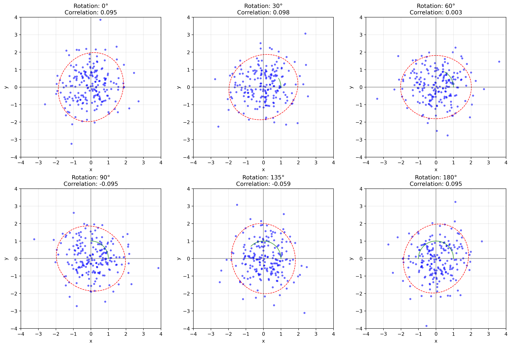
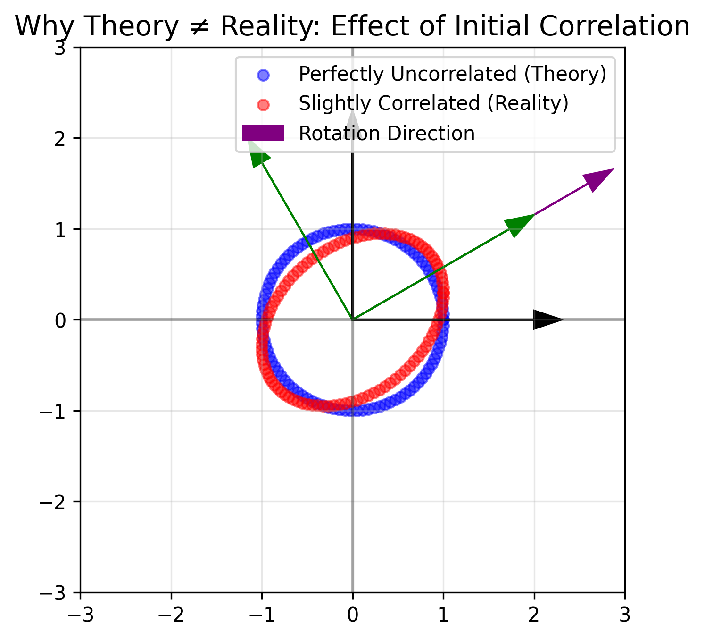

# Example 6: Effects of Rotation on Covariance Structure

## Problem Statement
What happens to the covariance matrix when we rotate a dataset, and why is this important? How does a change in coordinate system affect the correlation structure of data?

For this example, we'll start with uncorrelated 2D data having equal variances and observe how rotation by various angles (0°, 30°, 60°) changes the correlation structure.

## Understanding the Problem
The covariance matrix describes relationships between variables in a specific coordinate system. When we rotate our frame of reference, the statistical relationships between variables can appear to change, even though the underlying data distribution remains the same. Understanding these transformations is crucial for interpreting multivariate data correctly and for techniques like principal component analysis.

## Solution

### Step 1: Mathematical Foundation
When we rotate a dataset using a rotation matrix $R$, the covariance matrix transforms according to:

$$\Sigma' = R \Sigma R^T$$

Where:
- $\Sigma$ is the original covariance matrix
- $\Sigma'$ is the transformed covariance matrix
- $R$ is the rotation matrix

For a 2D rotation by angle $\theta$, the rotation matrix is:

$$R = \begin{pmatrix} \cos\theta & -\sin\theta \\ \sin\theta & \cos\theta \end{pmatrix}$$

This mathematical relationship is crucial for understanding how correlation can be introduced or removed through coordinate transformations.

### Step 2: Relationship Between Rotation Angle and Correlation

For initially uncorrelated data with equal variances (covariance matrix = identity matrix), rotation by angle $\theta$ introduces correlation according to the theoretical formula:

$$\rho = \frac{\sin(2\theta)}{2}$$

Where $\rho$ is the correlation coefficient. However, real data often differs from this theoretical prediction due to sampling variability.

This visualization demonstrates:
- The sinusoidal relationship between rotation angle and correlation
- Maximum positive correlation occurring at 45° rotation (theoretically)
- Maximum negative correlation occurring at 135° rotation (theoretically)
- Actual data correlation may deviate from theoretical values due to initial correlation in the data and sampling variability
- The periodicity of the pattern, with correlation returning to its initial value after 180° rotation

### Step 3: Understanding Theory vs. Practice in Rotation Effects

When we apply the theoretical formula to real datasets, we often observe discrepancies between predicted and actual correlation values. In our experiments, we notice:

- Initial data correlation: Our dataset has a small initial correlation (around -0.04) even before rotation, rather than being perfectly uncorrelated
- Theoretical formula assumptions: The formula $\rho = \frac{\sin(2\theta)}{2}$ assumes starting with perfectly uncorrelated data with equal variances
- Practical implications: In real-world applications, starting with perfectly uncorrelated data may be impossible or impractical

This discrepancy between theory and practice is actually an important educational point. It demonstrates that:
1. Mathematical models provide idealized predictions that may differ from empirical results
2. Small initial correlations in data can significantly impact the rotation-correlation relationship
3. The theoretical understanding should guide our intuition, while empirical validation remains essential
4. The general trend (sinusoidal relationship between rotation angle and correlation) still holds true, even if the exact values differ

### Step 4: Rotation as a Vector Field Transformation

Rotation is a linear transformation that preserves distances from the origin and angles between vectors. When we rotate the coordinate system, points move along circular paths centered at the origin.

Key observations about rotation as a transformation:
- Points farther from the origin move greater distances (longer arrows)
- All points rotate by the same angle around the origin
- The transformation preserves the shape of probability distributions but changes their orientation
- The coordinate system itself rotates, changing our frame of reference

### Step 5: Step-by-Step Visualization of Rotation Effects

To further understand how rotation affects correlation structure, we can examine the effect of various rotation angles on the same dataset.

This visualization demonstrates several key insights:
1. The correlation oscillates as the rotation angle increases
2. When the dataset is rotated by 180°, it returns to its original correlation structure
3. The shape of the dataset remains constant, only its orientation changes
4. The covariance ellipse rotates with the data, maintaining its shape

### Step 6: Properties Preserved Under Rotation

Despite the changes in correlation, certain properties remain invariant under rotation:
- Total variance (trace of covariance matrix): $\text{tr}(\Sigma') = \text{tr}(\Sigma)$
- Determinant of covariance matrix: $|\Sigma'| = |\Sigma|$
- Eigenvalues of the covariance matrix (though eigenvectors rotate)

These invariants reflect the fact that rotation merely changes our perspective on the data, not the fundamental structure of the data itself. Our empirical verification confirms this, with traces and determinants remaining constant across all rotation angles.

The theoretical relationship for the transformed covariance matrix of initially uncorrelated data with equal variances ($\Sigma = \sigma^2 I$) under rotation by angle $\theta$ is:

$$\Sigma' = \sigma^2 \begin{pmatrix} 1 & \frac{\sin(2\theta)}{2} \\ \frac{\sin(2\theta)}{2} & 1 \end{pmatrix}$$

### Step 7: Practical Significance

Understanding rotation effects on covariance has important applications:
1. **Coordinate system choice**: The observed correlation structure depends on how we choose to measure our variables
2. **Feature engineering**: Rotation can introduce or remove correlations, which can be useful for creating independent features
3. **Principal Component Analysis (PCA)**: PCA exploits this property by finding a rotation that diagonalizes the covariance matrix
4. **Statistical independence**: Independence is coordinate-dependent; what looks uncorrelated in one coordinate system may be strongly correlated in another
5. **Sensor orientation**: In practical applications like sensor data analysis, the physical orientation of sensors can affect the observed correlation patterns
6. **Feature transformations in ML**: Transformations in machine learning pipelines can significantly alter correlation structures

This example demonstrates the fundamental importance of coordinate systems in multivariate statistics. What appears as correlation in one coordinate system may disappear in another, highlighting that correlation is not an intrinsic property of the data but rather depends on our chosen reference frame.

## Visual Explanations

### Conceptual Rotation Visualization

*Basic visualization showing how rotation affects correlation structure for initially uncorrelated data. Left: Original data. Middle: After 30° rotation. Right: After 60° rotation. Red dashed ellipses show the covariance structure.*

### Theoretical vs Actual Correlation Changes

*Comparison of theoretical correlation formula (red line) with actual correlation values observed in rotated data (blue dashed line). Key points are marked at 0°, 45°, 90°, 135°, and 180°, showing how rotation affects correlation in a periodic manner.*

### Correlation as a Function of Rotation Angle

*How correlation coefficient changes with rotation angle according to the theoretical formula $\rho = \sin(2\theta)/2$, reaching maximum correlation of 0.5 at 45° and minimum of -0.5 at 135°.*

### Rotation Vector Field

*Vector field visualization of rotation transformation. Blue arrows show how points move under rotation. Concentric circles remain circles after rotation (illustrated by dotted circles), demonstrating that rotation preserves distances from the origin. The coordinate axes also rotate, shown by the red lines.*

### Step-by-Step Rotation Effects

*Comprehensive visualization showing the effect of rotation at multiple angles (0°, 30°, 60°, 90°, 135°, 180°). For each angle, the correlation coefficient changes with the covariance ellipse (red dashed line) rotating accordingly.*

### Theory vs Reality Visualization

*Simple visual explanation of why theoretical and actual correlation values differ after rotation. Blue points show perfectly uncorrelated data (theoretical case), while red points show slightly correlated data (realistic case). The visualization demonstrates how initial correlation in the data affects the outcome of rotation.*

## Key Insights

### Mathematical Properties
- Rotation transforms the covariance matrix according to $\Sigma' = R \Sigma R^T$
- For initially uncorrelated data with equal variances, rotation by angle θ introduces correlation ρ = sin(2θ)/2
- Trace and determinant of the covariance matrix remain invariant under rotation
- Eigenvalues remain constant, while eigenvectors rotate with the data

### Geometric Interpretation
- Rotation preserves distances from the origin and angles between vectors
- The shape of probability density contours remains unchanged, only their orientation changes
- Correlation is maximum at 45° rotation and minimum at 135° rotation for initially uncorrelated data
- After 180° rotation, the correlation structure returns to its original state

### Statistical Implications
- Correlation is not an intrinsic property of data but depends on the coordinate system
- What appears uncorrelated in one reference frame may be strongly correlated in another
- Statistical independence is coordinate-system dependent
- The eigendecomposition provides an invariant description of the data distribution

### Practical Applications
- Principal Component Analysis (PCA) finds the rotation that diagonalizes the covariance matrix
- Feature engineering can exploit rotation to create independent features
- Proper interpretation of sensor data requires understanding how sensor orientation affects correlation
- Machine learning algorithms may benefit from data rotation to reveal or remove correlations
- Understanding coordinate transformations is crucial for multidimensional data visualization

## Running the Examples

You can run the code that generates these examples and visualizations using:

```bash
python3 ML_Obsidian_Vault/Lectures/2/Codes/L2_1_CMC_example_6_rotation_covariance_change.py
```