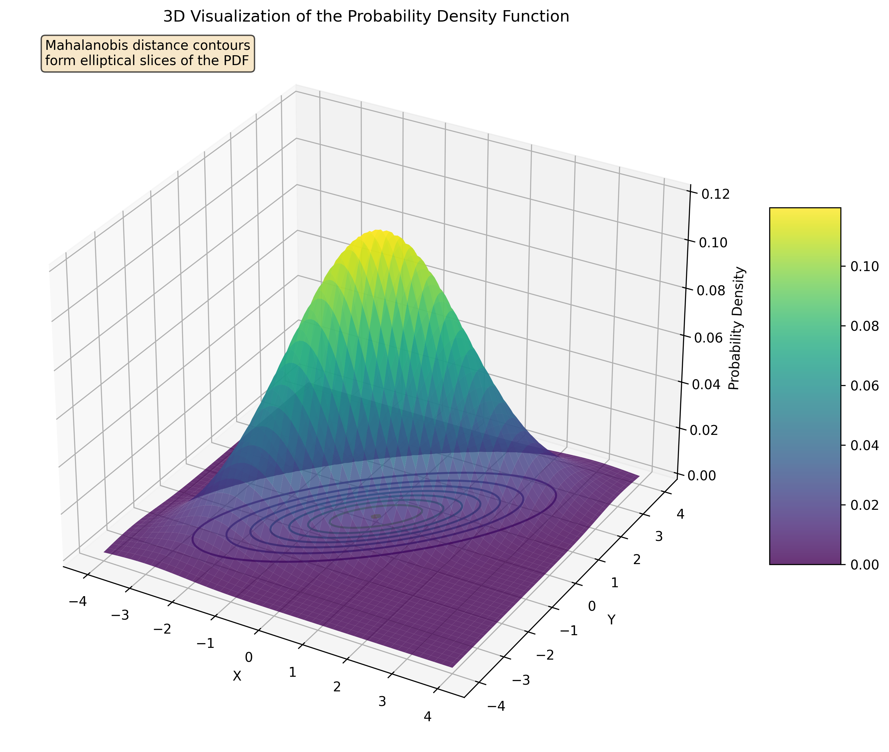
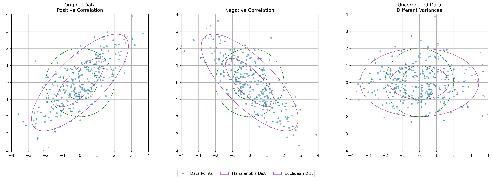
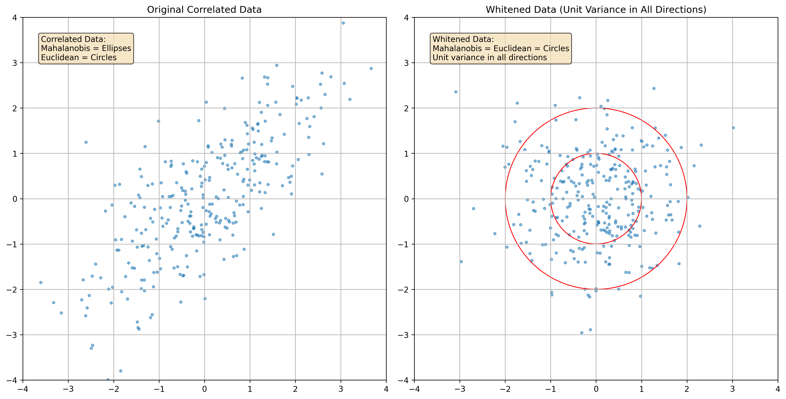

# Example 7: Mahalanobis Distance vs Euclidean Distance

## Problem Statement
Why is Euclidean distance inadequate for correlated data, and how does Mahalanobis distance address this limitation?

We'll examine a 2D dataset with strong positive correlation (ρ = 0.75) and compare how Euclidean and Mahalanobis distances evaluate "outlierness" of points at various positions.

## Understanding the Problem
When working with multivariate data, we need appropriate ways to measure distances between points or from points to a distribution center. The standard Euclidean distance treats all dimensions equally and independently, which can be misleading when variables are correlated. The Mahalanobis distance accounts for the covariance structure of the data, providing a more meaningful measure of distance for correlated variables.

## Solution

### Step 1: Understanding Distance Metrics
Distance metrics provide a way to measure how 'far' points are from each other or from a reference point.
For multivariate data with correlation structure, standard Euclidean distance can be misleading.

Euclidean distance:
- Treats all dimensions equally and independently
- Represented by circles of equal distance from the mean
- Formula: d_E(x) = √[(x-μ)^T(x-μ)]

Mahalanobis distance:
- Accounts for the covariance structure of the data
- Represented by ellipses aligned with the data's natural distribution
- Points at the same Mahalanobis distance have equal probability density under a multivariate normal model
- Formula: d_M(x) = √[(x-μ)^T Σ^(-1) (x-μ)]
  where μ is the mean and Σ is the covariance matrix

### Step 2: Generate Correlated Data
We create data from a multivariate normal distribution with positive correlation:
- Mean vector: $\mu = [0, 0]$
- Covariance matrix: $\Sigma = \begin{bmatrix} 2.0 & 1.5 \\ 1.5 & 2.0 \end{bmatrix}$
- The correlation coefficient is $\rho = 0.75$ (strong positive correlation)
- The data forms an elongated cloud along the $y = x$ direction

### Step 3: Calculate the Inverse Covariance Matrix
The inverse of the covariance matrix (also called the precision matrix) is needed to compute Mahalanobis distances:

$$\Sigma^{-1} = \begin{bmatrix} 1.1429 & -0.8571 \\ -0.8571 & 1.1429 \end{bmatrix}$$

### Step 4: Detailed Calculation for a Test Point
Let's calculate the Mahalanobis distance for a test point $[2, 0]$ step by step:

1. Compute the difference vector: $x - \mu = [2, 0] - [0, 0] = [2, 0]$

2. Matrix multiplication with inverse covariance:
   $(x - \mu)^T \Sigma^{-1} = [2.00, 0.00] \times \begin{bmatrix} 1.1429 & -0.8571 \\ -0.8571 & 1.1429 \end{bmatrix} = [2.2857, -1.7143]$

3. Complete the quadratic form:
   $(x - \mu)^T \Sigma^{-1} (x - \mu) = [2.2857, -1.7143] \times [2.00, 0.00]^T$
   $= 2.2857 \times 2.00 + (-1.7143) \times 0.00$
   $= 4.5714$

4. Take the square root: $\sqrt{4.5714} = 2.1381$

For comparison, the Euclidean distance of this point is:
$d_E = \sqrt{2^2 + 0^2} = 2.0000$

### Step 5: Compare Distances for Multiple Test Points
We select specific test points and calculate their Mahalanobis and Euclidean distances from the mean:

| Point | Coordinates | Euclidean Distance | Mahalanobis Distance |
|-------|-------------|-------------------|---------------------|
| P1    | (2.0, 0.0)  | 2.00              | 2.14                |
| P2    | (0.0, 2.0)  | 2.00              | 2.14                |
| P3    | (2.0, 2.0)  | 2.83              | 1.51                |
| P4    | (-1.5, 1.5) | 2.12              | 3.00                |

Notice that points at the same Euclidean distance (P1 and P2) have the same Mahalanobis distance, but the point along the correlation direction (P3) has a smaller Mahalanobis distance despite being at a greater Euclidean distance from the origin.

### Step 6: Visualize Distance Contours
We plot contours of equal Mahalanobis distance (ellipses) and equal Euclidean distance (circles) to show the fundamental difference:
- Euclidean distance treats all directions equally (circles)
- Mahalanobis distance accounts for correlation (ellipses aligned with the data)

The Mahalanobis distance contours form ellipses that:
- Share the same orientation as the data cloud
- Have the same shape as the probability density contours
- Stretch along directions of higher variance (along the correlation axis)
- Contract along directions of lower variance (perpendicular to correlation)

### Step 7: 3D Probability Density Visualization

The 3D probability density function surface of the correlated bivariate normal distribution demonstrates that:
- The peak of the distribution is at the mean (0, 0)
- The contours of equal probability density (and equal Mahalanobis distance) form ellipses
- The orientation of these ellipses is determined by the correlation structure of the data
- The Mahalanobis distance effectively measures the "standardized" distance from a point to the center of the distribution

### Step 8: Comparison of Different Covariance Structures

Comparing Mahalanobis distance contours under different covariance structures shows that:
- For positively correlated data, Mahalanobis contours are ellipses tilted along the y=x direction
- For negatively correlated data, Mahalanobis contours are ellipses tilted along the y=-x direction
- For uncorrelated data with different variances, Mahalanobis contours are axis-aligned ellipses

### Step 9: Whitening Transformation

The whitening transformation is a linear transformation that converts correlated data into uncorrelated data with unit variance in all directions.

The whitening transformation:
- Decorrelates the variables
- Standardizes the variance in all directions
- Makes Euclidean distance in the whitened space equivalent to Mahalanobis distance in the original space
- Is computed using the eigendecomposition of the covariance matrix

The whitening matrix for our example is:
$$W = \begin{bmatrix} 0.9744 & -0.4398 \\ -0.4398 & 0.9744 \end{bmatrix}$$

Using the whitening transformation, our point P1 (2.0, 0.0) becomes (1.9487, -0.8797) in the whitened space. The Euclidean distance of this whitened point (2.1381) exactly equals the Mahalanobis distance in the original space.

### Step 10: Key Observations and Practical Applications

Key observations:
- Points at the same Euclidean distance can have very different Mahalanobis distances
- Points along the major axis of correlation have smaller Mahalanobis distances
- Points perpendicular to the correlation direction have larger Mahalanobis distances
- The Mahalanobis distance effectively 'scales' the space according to the data variance
- Points with the same Mahalanobis distance from the mean form ellipses aligned with the data
- For uncorrelated data with equal variances, Mahalanobis distance = Euclidean distance
- Whitening transformation makes Euclidean and Mahalanobis distances equivalent

Practical applications:
- Anomaly detection: identifying outliers that account for correlation structure
- Classification: creating decision boundaries that respect data covariance
- Clustering: defining distance metrics that capture the natural data structure
- Quality control: monitoring multivariate processes and detecting unusual states
- Feature normalization: removing correlations in preprocessing steps

## Visual Explanations

### Basic Comparison of Distance Metrics

*Comparison of Euclidean distance (green circles) and Mahalanobis distance (purple ellipses) for correlated data. Points equidistant by Mahalanobis measure lie on ellipses aligned with the data distribution.*

### 3D Probability Density Function

*3D visualization of the probability density function for correlated data. Mahalanobis distance contours form elliptical slices of this surface at constant height (constant probability density).*

### Different Covariance Structures

*Comparison of Mahalanobis distance contours for three different covariance structures: positive correlation (left), negative correlation (middle), and uncorrelated with different variances (right).*

### Whitening Transformation

*Visualization of the whitening transformation. Left: Original correlated data with elliptical Mahalanobis contours. Right: Whitened data with circular contours.*

## Key Insights

### Conceptual Understanding
- Euclidean distance assumes all dimensions are equally important and independent
- Mahalanobis distance accounts for the covariance structure of the data
- In correlated data, proximity should be assessed relative to the natural spread of the data
- Points along the direction of high variance should be considered "closer" than those along directions of low variance

### Mathematical Properties
- Mahalanobis distance is defined as $d_M(x) = \sqrt{(x-\mu)^T \Sigma^{-1} (x-\mu)}$
- It incorporates the inverse covariance matrix to account for correlations and different variances
- For standardized uncorrelated data, Mahalanobis distance reduces to Euclidean distance
- Contours of equal Mahalanobis distance form ellipses aligned with the data distribution
- The shape of these ellipses is determined by the eigendecomposition of the covariance matrix

### Statistical Significance
- Points with the same Mahalanobis distance have the same statistical "outlierness"
- Mahalanobis distance is related to the log probability density under a multivariate normal model
- It accounts for both the distance from the center and the shape of the distribution
- It can be interpreted as a multivariate z-score, generalizing the concept of standard deviations
- Under multivariate normality, squared Mahalanobis distances follow a chi-squared distribution

### Applications in Machine Learning
- Outlier detection: Identifying unusual observations that account for correlation
- Classification: Creating more appropriate decision boundaries for correlated features
- Clustering: Defining distance metrics that respect the natural data structure
- Dimensionality reduction: Identifying directions of maximum variation (related to PCA)
- Data transformation: Whitening to remove correlations in preprocessing steps
- Quality control: Monitoring multivariate processes with appropriate distance metrics

## Running the Examples

You can run the code that generates these examples and visualizations using:

```bash
python3 ML_Obsidian_Vault/Lectures/2/Codes/L2_1_CMC_example_7_mahalanobis_distance.py
```