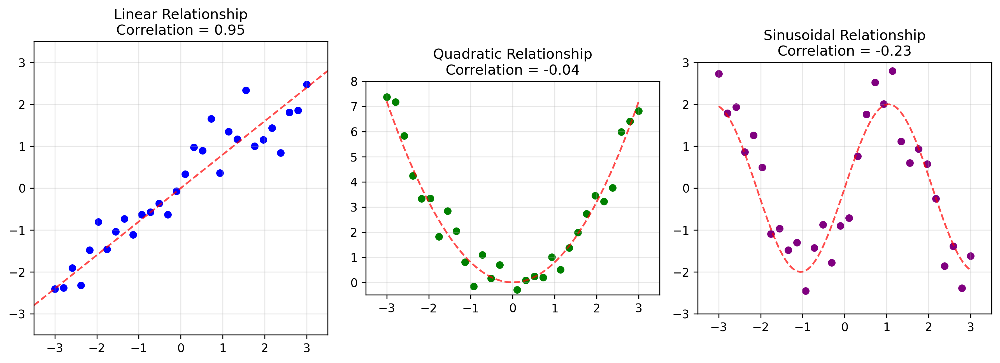

# Example 8: Intuitive Emoji Visualization of Correlation

## Problem Statement
How can we intuitively understand positive and negative correlation using everyday visual metaphors?

In this example:
- We create emoji-like faces to represent correlation patterns
- The "happy face" represents quadratic relationship with points following a smile curve
- The "sad face" represents quadratic relationship with points following a frown curve
- Data points follow the curve of the smile or frown

## Understanding the Problem
Correlation can be challenging to grasp intuitively, particularly for those new to statistics. Using familiar visual metaphors can help bridge the gap between abstract statistical concepts and intuitive understanding. By mapping correlation patterns to facial expressions, we can leverage our natural ability to recognize emotional patterns to better understand statistical relationships.

## Solution

### Step 1: Creating Visual Metaphors for Correlation
We use emoji-like faces to represent different relationship patterns:
- Smiley face: points follow U-shaped pattern (quadratic relationship)
- Sad face: points follow inverted U-shaped pattern (another quadratic relationship)

### Step 2: Analyzing the Smiley Face Pattern
For the smiley face pattern, we observe:
- Points follow a U-shaped pattern (quadratic relationship)
- Data points visually follow the smiling curve
- The covariance ellipse reflects the overall spread of data
- This pattern has very low linear correlation because it's not a linear relationship

The correlation calculation for our smiley face data yields:

$$\text{Correlation coefficient} = \frac{\text{Cov}(X,Y)}{\sigma_X \sigma_Y} = \frac{-0.078}{\sqrt{1.416} \times \sqrt{0.188}} = -0.151$$

### Step 3: Analyzing the Frowny Face Pattern
For the frowny face pattern, we observe:
- Points follow an inverted U-shaped pattern (quadratic relationship)
- Data points visually follow the frowning curve
- The covariance ellipse reflects the overall spread of data
- This pattern has almost zero linear correlation despite the clear pattern

The correlation calculation for our frowny face data yields:

$$\text{Correlation coefficient} = \frac{\text{Cov}(X,Y)}{\sigma_X \sigma_Y} = \frac{0.004}{\sqrt{1.324} \times \sqrt{0.168}} = 0.007$$

### Step 4: Visual Mnemonic and Interpretation
The smiley/sad faces provide an intuitive memory aid:
- Smile curves upward ⌣, showing a general trend where y decreases then increases as x changes
- Frown curves downward ⌢, showing a trend where y increases then decreases as x changes
- Note: The *linear* correlation coefficient (ρ) is near zero in both cases because the relationships aren't linear, but the visual patterns are clear

### Step 5: Linear Correlation Limitations with Non-Linear Relationships

An important educational insight from our emoji visualizations is that the linear correlation coefficients calculated for both patterns are surprisingly low:
- "Smile" pattern: correlation coefficient = -0.151 (near zero, with slight negative correlation)
- "Frown" pattern: correlation coefficient = 0.007 (essentially zero correlation)

This occurs despite the clear visual patterns because:

1. **Linear vs. Non-Linear Relationships**: Pearson's correlation coefficient only measures the strength of *linear* relationships. Our emoji patterns are inherently curved (quadratic or U-shaped), meaning a linear measure can't properly capture them.

2. **Direction Changes**: In both patterns, the y-values first decrease, then increase (smile) or first increase, then decrease (frown). These direction changes within the same dataset effectively "cancel out" when calculating linear correlation.

3. **Quadrant Distribution**: Points are distributed across multiple quadrants in a way that positive and negative area contributions largely balance each other out in the correlation calculation.

This provides several valuable lessons:
- Always visualize your data - strong patterns may exist that correlation coefficients miss
- Consider testing for non-linear relationships when linear correlation is low but patterns are visible
- Tools like scatter plots are essential for identifying the true nature of relationships
- Alternatives like Spearman's rank correlation or distance correlation may better capture non-linear relationships

This emoji example powerfully demonstrates why data visualization should accompany statistical calculations, as relying solely on correlation coefficients could lead to missing important relationships in your data.

## Visual Explanations

### Emoji Correlation Patterns

*Visualization of correlation patterns using emoji-like faces. The left panel shows data arranged in a "smile" pattern with a calculated correlation of -0.15. The right panel shows data arranged in a "frown" pattern with a correlation of 0.007. Both demonstrate how linear correlation fails to capture these quadratic relationships.*

### Linear vs Non-Linear Correlation Comparison

*Visual comparison of how the Pearson correlation coefficient behaves with different relationship patterns. Left: Linear relationship with high correlation. Middle: U-shaped (quadratic) relationship with near-zero correlation despite clear pattern. Right: Sinusoidal relationship with near-zero correlation. This illustrates why linear correlation fails to capture non-linear patterns like our emoji examples.*

## Key Insights

### Intuitive Understanding
- Visualization helps us see patterns that summary statistics might miss
- Non-linear relationships (like quadratic curves in our examples) are common in real-world data
- Facial expressions provide a natural mnemonic for understanding different data patterns

### Educational Value
- Visual metaphors help bridge the gap between abstract statistics and intuitive understanding
- Using familiar patterns (facial expressions) leverages our natural pattern recognition abilities
- This approach can make statistical concepts more accessible to beginners
- The visualization serves as a memory aid for recalling pattern concepts

### Statistical Limitations
- The linear correlation coefficient may not fully capture non-linear relationships
- In our emoji examples, the correlation coefficients are near zero because the relationships are curved
- This illustrates the importance of visualizing data rather than relying solely on summary statistics
- Different types of correlation measures exist for non-linear relationships

### Practical Applications
- Teaching statistical concepts to beginners
- Creating intuitive visualizations of complex relationships
- Developing mnemonics for remembering statistical patterns
- Emphasizing the importance of data visualization alongside numerical measures

## Running the Examples

You can run the code that generates these examples and visualizations using:

```bash
python3 ML_Obsidian_Vault/Lectures/2/Codes/L2_1_CMC_example_8_emoji_covariance.py
```