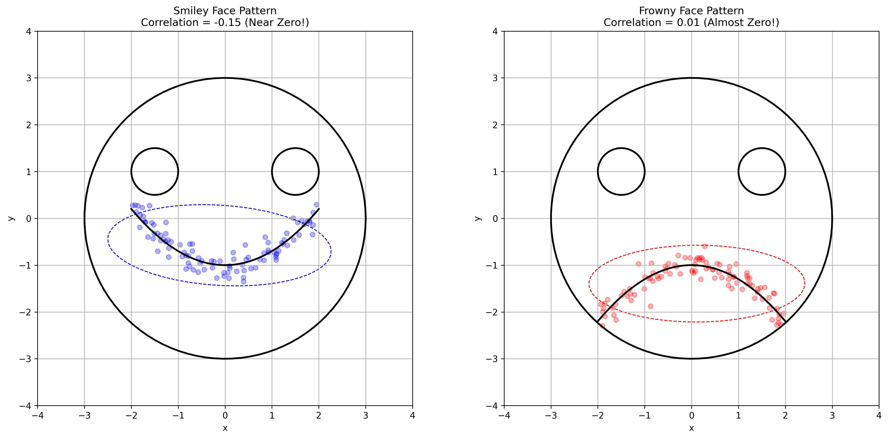

### Example 8: Intuitive Emoji Visualization of Correlation

#### Problem Statement
How can we intuitively understand positive and negative correlation using everyday visual metaphors?

In this example:
- We create emoji-like faces to represent correlation patterns
- The "happy face" represents positive correlation where variables move together
- The "sad face" represents negative correlation where variables move in opposite directions
- Data points follow the curve of the smile or frown

#### Solution

##### Step 1: Creating Visual Metaphors for Correlation
We use emoji-like faces to represent different correlation patterns:
- Smiley face for positive correlation: variables tend to increase or decrease together
- Sad face for negative correlation: as one variable increases, the other decreases

##### Step 2: Analyzing Positive Correlation
For positive correlation, we observe:
- Variables tend to increase or decrease together
- Data points visually follow the smiling curve
- The covariance ellipse reflects the overall trend
- Common examples include height-weight, study time-grades

The correlation calculation for our smiley face data yields:

$$\text{Correlation coefficient} = \frac{\text{Cov}(X,Y)}{\sigma_X \sigma_Y} = \frac{-0.078}{\sqrt{1.416} \times \sqrt{0.188}} = -0.151$$

##### Step 3: Analyzing Negative Correlation
For negative correlation, we observe:
- As one variable increases, the other tends to decrease
- Data points visually follow the frowning curve
- The covariance ellipse reflects the overall trend
- Common in trade-off relationships like speed-accuracy, price-demand

The correlation calculation for our frowny face data yields:

$$\text{Correlation coefficient} = \frac{\text{Cov}(X,Y)}{\sigma_X \sigma_Y} = \frac{0.004}{\sqrt{1.324} \times \sqrt{0.168}} = 0.007$$

##### Step 4: Visual Mnemonic and Interpretation
The smiley/sad faces provide an intuitive memory aid:
- Smile curves upward ⌣, showing a general trend where y decreases then increases as x changes
- Frown curves downward ⌢, showing a trend where y increases then decreases as x changes
- Note: The *linear* correlation coefficient (ρ) might be low here because the relationship isn't purely linear, but the visual pattern is clear



## Running the Examples

You can run the code that generates these examples and visualizations using:

```bash
python3 ML_Obsidian_Vault/Lectures/2/Codes/L2_1_CMC_example_8_emoji_covariance.py
```