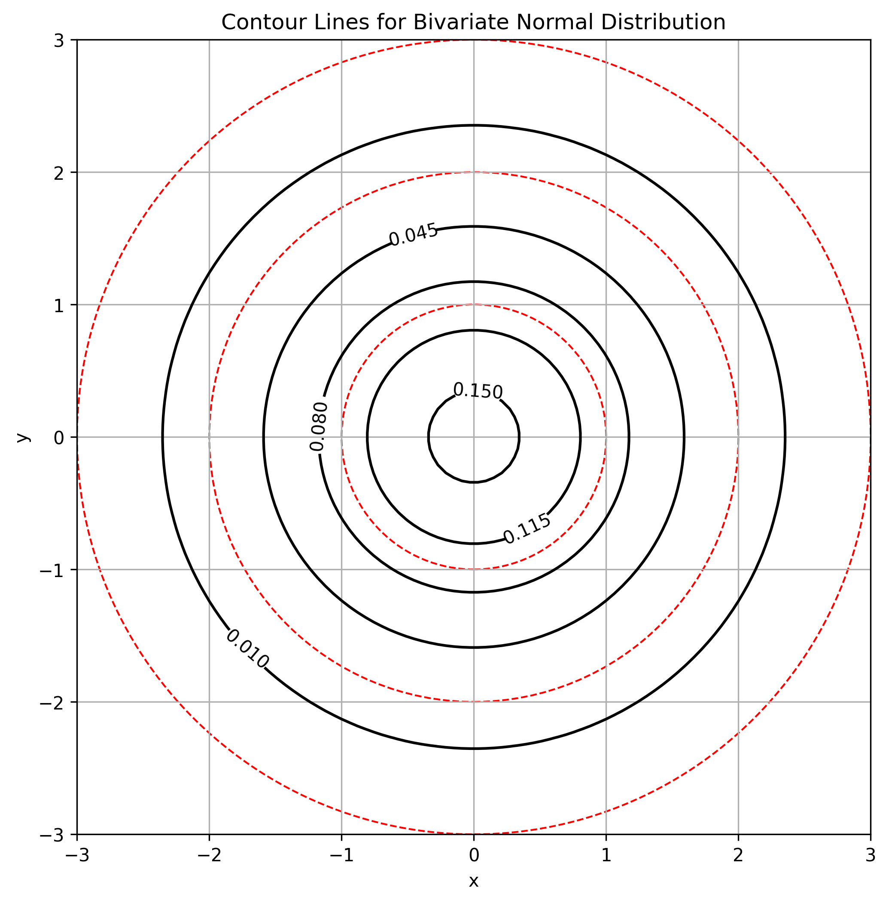
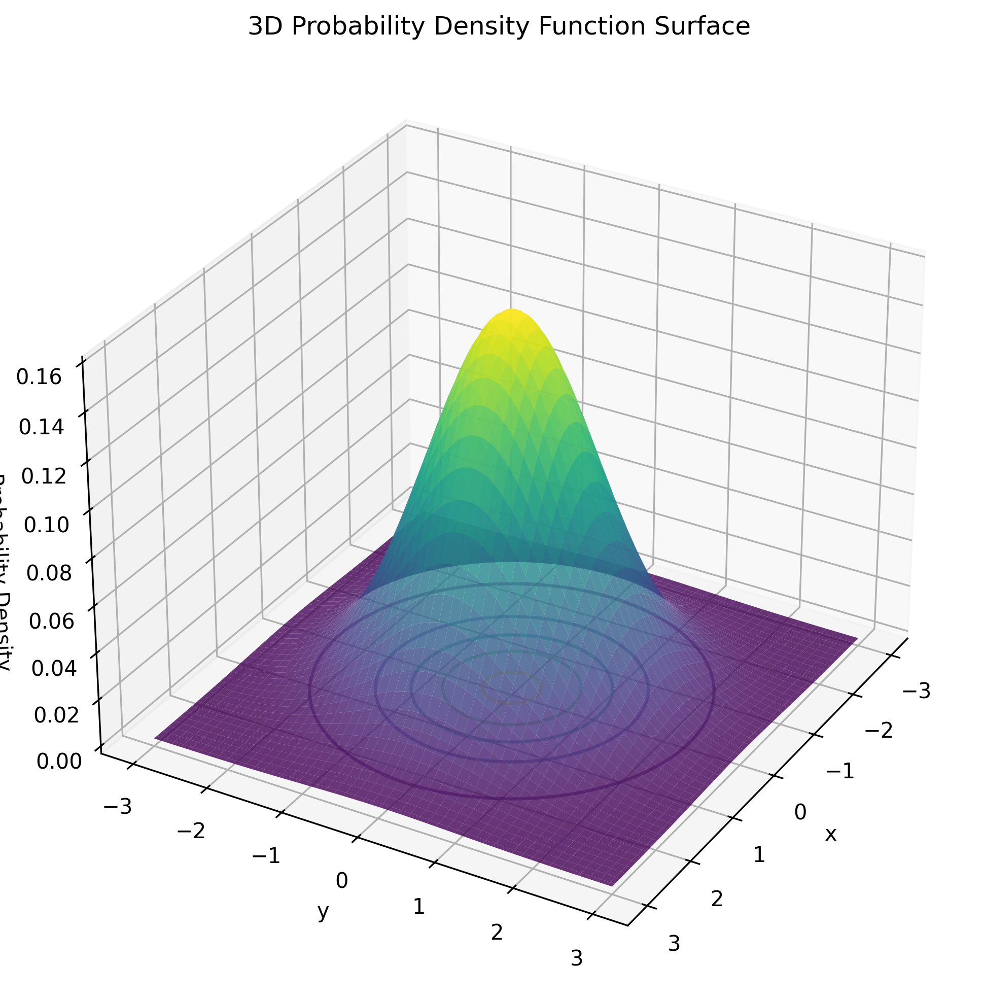
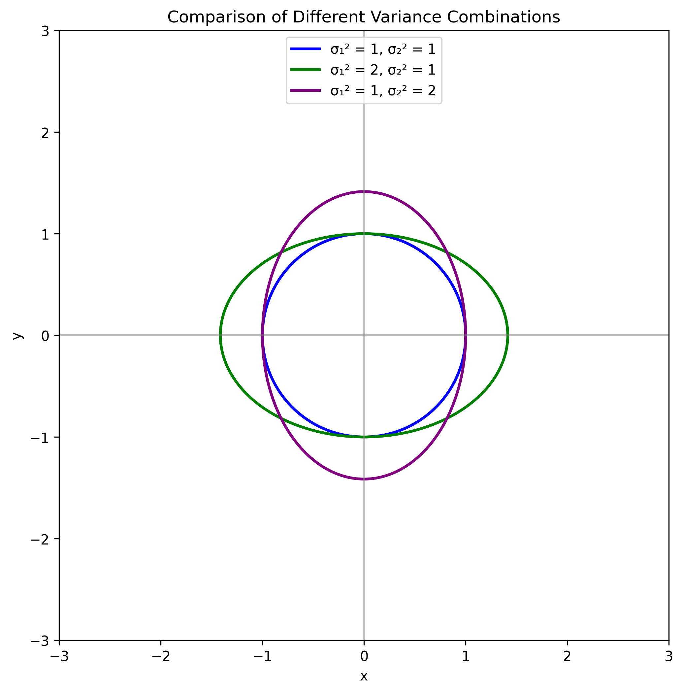

# Example 9: Sketching Contours of a Bivariate Normal Distribution

## Problem Statement
Sketch the contour lines for the probability density function of a bivariate normal distribution with mean $\mu = (0,0)$ and covariance matrix $\Sigma = \begin{pmatrix} \sigma_1^2 & 0 \\ 0 & \sigma_2^2 \end{pmatrix}$, where $\sigma_1^2 = 2.0$ and $\sigma_2^2 = 0.5$.

## Understanding the Problem
Contour lines (or level curves) of a bivariate probability density function represent points of equal probability density. For a bivariate normal distribution, these contours form ellipses. The shape, orientation, and size of these ellipses are determined by the covariance matrix. This problem asks us to sketch these contours for a specific diagonal covariance matrix, where the variables are uncorrelated but have different variances.

## Solution

### Step 1: Mathematical Formula Setup
The bivariate normal probability density function with mean $\mu = (0,0)$ and diagonal covariance matrix $\Sigma = \begin{pmatrix} \sigma_1^2 & 0 \\ 0 & \sigma_2^2 \end{pmatrix}$ is:

$$f(x,y) = \frac{1}{2\pi\sqrt{\sigma_1^2\sigma_2^2}} \exp\left(-\frac{1}{2}\left[\frac{x^2}{\sigma_1^2} + \frac{y^2}{\sigma_2^2}\right]\right)$$

### Step 2: Analyzing the Covariance Matrix
For the diagonal covariance matrix $\Sigma = \begin{pmatrix} 2.0 & 0 \\ 0 & 0.5 \end{pmatrix}$:

- The determinant: $|\Sigma| = \sigma_1^2 \cdot \sigma_2^2 = 2.0 \cdot 0.5 = 1.0$
- The inverse: $\Sigma^{-1} = \begin{pmatrix} \frac{1}{\sigma_1^2} & 0 \\ 0 & \frac{1}{\sigma_2^2} \end{pmatrix} = \begin{pmatrix} 0.5 & 0 \\ 0 & 2.0 \end{pmatrix}$
- The eigenvalues are $\lambda_1 = 2.0$ and $\lambda_2 = 0.5$
- The eigenvectors are $v_1 = (1,0)$ and $v_2 = (0,1)$

The zero covariance means the variables are uncorrelated, resulting in contour lines aligned with the coordinate axes.

### Step 3: Deriving the Contour Equation
To find the contour lines, we set the PDF equal to a constant $c$:

$$\frac{1}{2\pi\sqrt{\sigma_1^2\sigma_2^2}} \exp\left(-\frac{1}{2}\left[\frac{x^2}{\sigma_1^2} + \frac{y^2}{\sigma_2^2}\right]\right) = c$$

Taking the natural logarithm of both sides:

$$\ln\left[\frac{1}{2\pi\sqrt{\sigma_1^2\sigma_2^2}} \exp\left(-\frac{1}{2}\left[\frac{x^2}{\sigma_1^2} + \frac{y^2}{\sigma_2^2}\right]\right)\right] = \ln(c)$$

Simplifying:

$$-\ln(2\pi\sqrt{\sigma_1^2\sigma_2^2}) - \frac{1}{2}\left[\frac{x^2}{\sigma_1^2} + \frac{y^2}{\sigma_2^2}\right] = \ln(c)$$

Rearranging to isolate the quadratic terms:

$$\frac{x^2}{\sigma_1^2} + \frac{y^2}{\sigma_2^2} = -2\ln(c) - 2\ln(2\pi\sqrt{\sigma_1^2\sigma_2^2}) = k$$

Where $k$ is a positive constant that depends on the contour value $c$.

### Step 4: Recognize the Geometric Shape
The equation $\frac{x^2}{\sigma_1^2} + \frac{y^2}{\sigma_2^2} = k$ describes an ellipse:

- Centered at the origin $(0,0)$
- Semi-axes aligned with the coordinate axes
- Semi-axis length along x-direction: $a = \sqrt{k\sigma_1^2} = \sqrt{2.0k}$
- Semi-axis length along y-direction: $b = \sqrt{k\sigma_2^2} = \sqrt{0.5k}$

For our specific case with $\sigma_1^2 = 2.0$ and $\sigma_2^2 = 0.5$:

$$\frac{x^2}{2.0} + \frac{y^2}{0.5} = k$$

### Step 5: Understand the Probability Content
For a bivariate normal distribution, the ellipses with constant $k$ represent specific probability content:

- $k = 1$: The 1σ ellipse containing approximately 39% of the probability mass
- $k = 4$: The 2σ ellipse containing approximately 86% of the probability mass
- $k = 9$: The 3σ ellipse containing approximately 99% of the probability mass

### Step 6: Sketch the Contours
To sketch the contours, we draw concentric ellipses centered at $(0,0)$:

- 1σ ellipse: semi-axes $a_1 = \sqrt{2.0} \approx 1.41$ and $b_1 = \sqrt{0.5} \approx 0.71$
- 2σ ellipse: semi-axes $a_2 = 2\sqrt{2.0} \approx 2.83$ and $b_2 = 2\sqrt{0.5} \approx 1.41$
- 3σ ellipse: semi-axes $a_3 = 3\sqrt{2.0} \approx 4.24$ and $b_3 = 3\sqrt{0.5} \approx 2.12$

The ellipses are stretched along the x-axis (since $\sigma_1^2 > \sigma_2^2$).

## Visual Explanations

### Basic Contour Plot

*This figure shows the contour lines of a bivariate normal distribution with mean (0,0) and diagonal covariance matrix. The black lines are probability density contours, while the red dashed ellipses represent the 1σ, 2σ, and 3σ contours that contain approximately 39%, 86%, and 99% of the probability mass, respectively.*

### 3D Probability Density Surface

*This 3D visualization shows the probability density function surface for the bivariate normal distribution. The height at each point (x,y) represents the probability density at that location. Notice how the bell-shaped surface peaks at the mean (0,0) and falls off in all directions, with the spread determined by the variances.*

### Comparison of Variance Effects

*This figure compares contour shapes for different variance combinations. The blue ellipse shows equal variances (σ₁² = σ₂² = 1), resulting in a circle. The green ellipse shows σ₁² = 2, σ₂² = 1, stretching the contour along the x-axis. The purple ellipse shows σ₁² = 1, σ₂² = 2, stretching the contour along the y-axis.*

### Interactive Visualization

*This interactive visualization allows for adjusting the variances σ₁² and σ₂² to see how they affect the shape of the contour lines. As variances change, the ellipses stretch or compress along their respective axes.*

## Key Insights

### Mathematical Foundations
- The contour lines of a bivariate normal PDF form ellipses
- For a diagonal covariance matrix, the ellipses are aligned with the coordinate axes
- The equation of these ellipses is $\frac{x^2}{\sigma_1^2} + \frac{y^2}{\sigma_2^2} = k$
- The semi-axes lengths are proportional to the square roots of the variances
- The constant $k$ determines the probability content within the ellipse

### Geometric Interpretation
- Larger variance along an axis leads to stretching of the ellipse in that direction
- The ratio of the semi-axes is proportional to the ratio of the standard deviations
- When variances are equal ($\sigma_1^2 = \sigma_2^2$), the ellipses become circles
- The area of the ellipse is proportional to the determinant of the covariance matrix
- The eigenvalues of the covariance matrix determine the squared lengths of the semi-axes

### Probability Content
- The 1σ ellipse contains approximately 39% of the probability mass
- The 2σ ellipse contains approximately 86% of the probability mass
- The 3σ ellipse contains approximately 99% of the probability mass
- These percentages differ from the 1D normal distribution due to the increased dimensionality
- The quadratic form $(x-\mu)^T\Sigma^{-1}(x-\mu)$ follows a chi-squared distribution with 2 degrees of freedom

### Practical Applications
- Understanding the geometry of multivariate normal distributions is crucial for many machine learning algorithms
- These contours help visualize decision boundaries in classification problems
- The orientation and shape of the ellipses reveal the correlation structure in the data
- Anomaly detection often uses these contours to identify unusual observations
- Principal Component Analysis (PCA) is related to finding the principal axes of these ellipses

## Running the Examples

You can run the code that generates these examples and visualizations using:

```bash
python3 ML_Obsidian_Vault/Lectures/2/Codes/L2_1_CMC_example_9_contour_plots.py
```