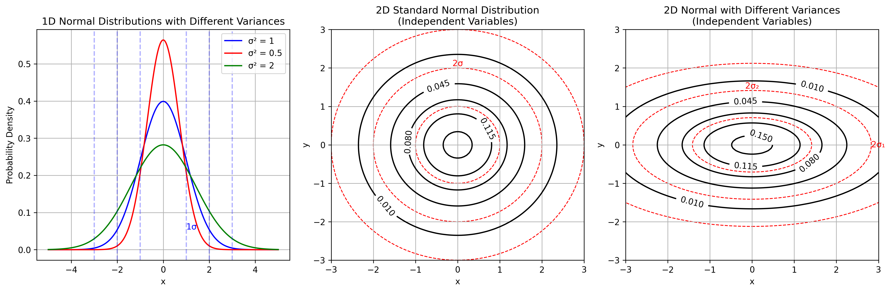
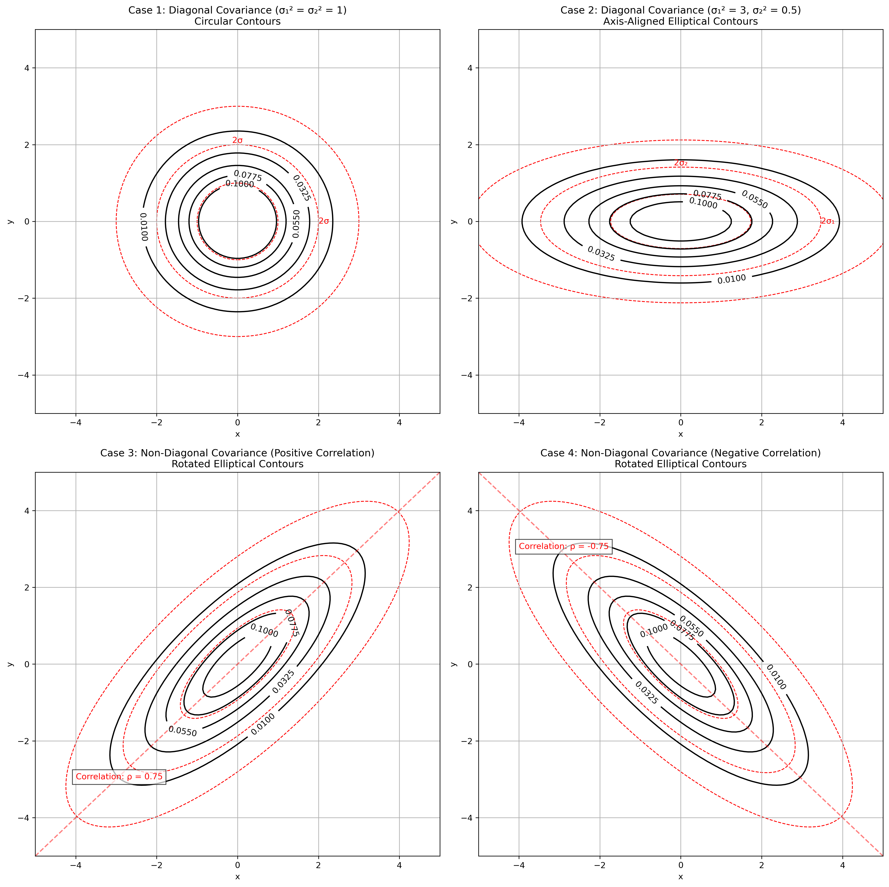
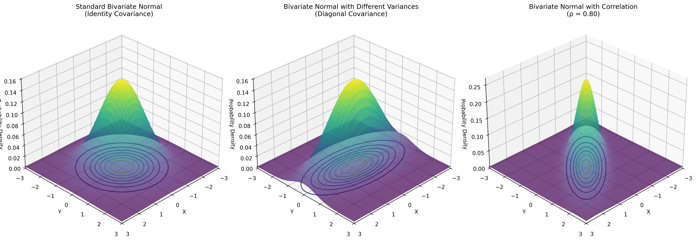
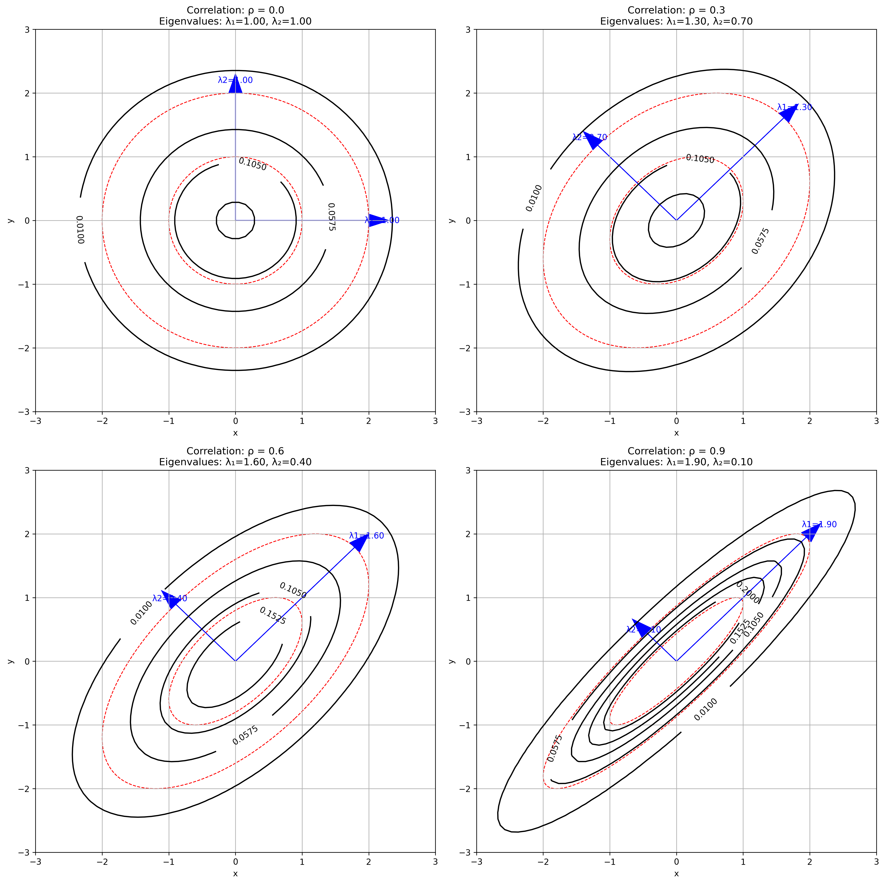
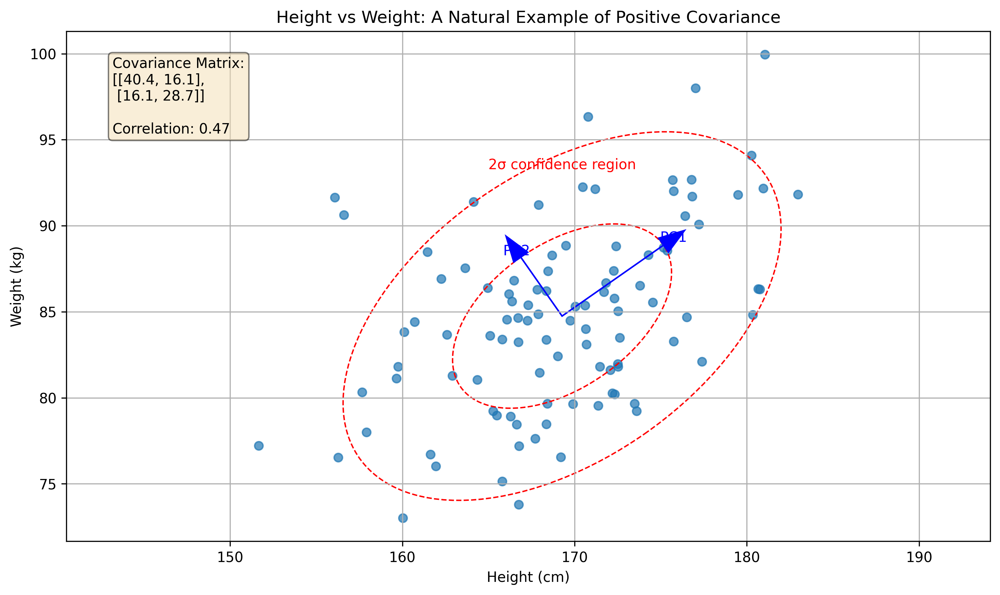
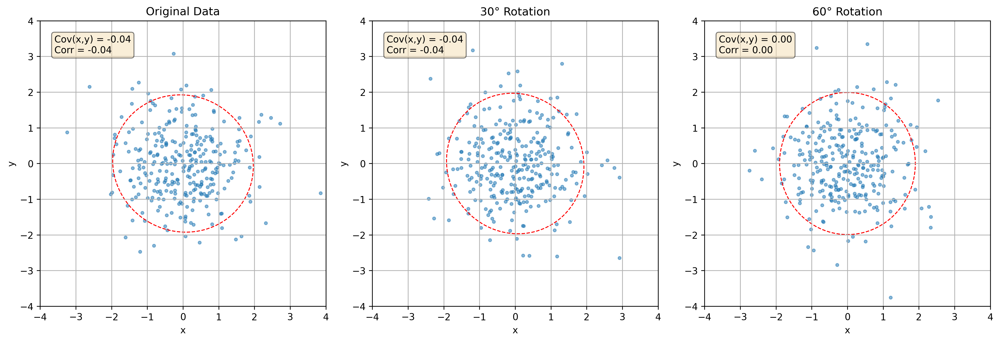
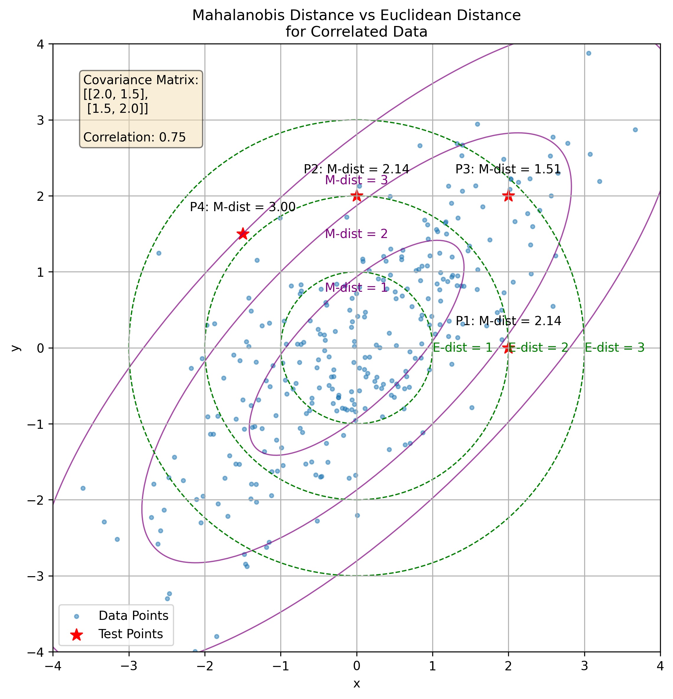
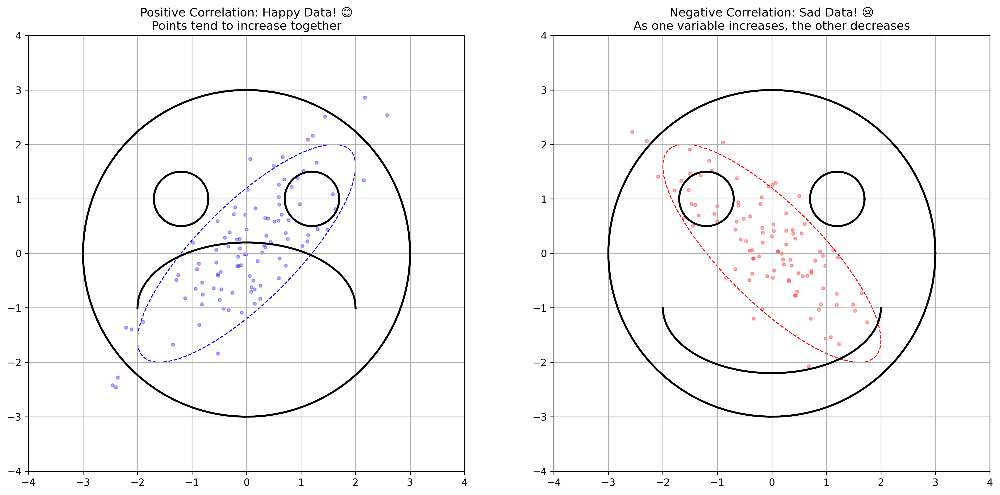
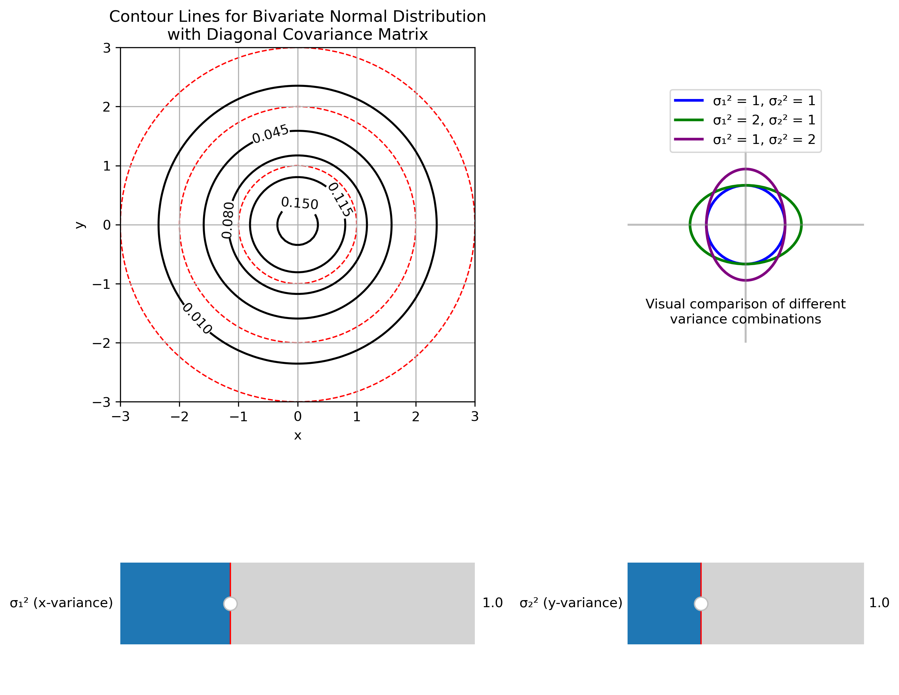

# Covariance Matrix Contours Examples

This document provides practical examples of covariance matrices and their effects on multivariate normal distributions, illustrating the concept of covariance and correlation in machine learning and data analysis contexts.

## Key Concepts and Formulas

The covariance matrix is a square matrix that captures how variables in a multivariate distribution vary with respect to each other. For a bivariate normal distribution, the shape and orientation of its probability density contours are directly determined by the covariance matrix.

### The Multivariate Gaussian Formula

The probability density function (PDF) of a multivariate Gaussian distribution is given by:

$$f(\mathbf{x}) = \frac{1}{(2\pi)^{n/2}|\boldsymbol{\Sigma}|^{1/2}} \exp\left(-\frac{1}{2}(\mathbf{x}-\boldsymbol{\mu})^T \boldsymbol{\Sigma}^{-1} (\mathbf{x}-\boldsymbol{\mu})\right)$$

For a bivariate case (n = 2), this becomes:

$$f(x,y) = \frac{1}{2\pi\sqrt{|\Sigma|}} \exp\left(-\frac{1}{2}(X-\mu)^T \Sigma^{-1} (X-\mu)\right)$$

Where:
- $X = (x, y)$ = Vector of variables
- $\mu = (\mu_x, \mu_y)$ = Mean vector
- $\Sigma$ = Covariance matrix $\begin{bmatrix} \sigma_x^2 & \sigma_{xy} \\ \sigma_{xy} & \sigma_y^2 \end{bmatrix}$
- $|\Sigma|$ = Determinant of the covariance matrix = $\sigma_x^2\sigma_y^2 - \sigma_{xy}^2$
- $\Sigma^{-1}$ = Inverse of the covariance matrix

The contour plots of this distribution form ellipses described by:

$$(X-\mu)^T \Sigma^{-1} (X-\mu) = c$$

Where $c$ is a constant value. These ellipses represent points of equal probability density.

### Types of Covariance Matrices

1. **Diagonal Covariance Matrix with Equal Variances (Identity Matrix)**:
   $$\Sigma = \begin{bmatrix} \sigma^2 & 0 \\ 0 & \sigma^2 \end{bmatrix} = \sigma^2 I$$
   - Produces circular contours
   - Equal spread in all directions
   - Contour equation: $(x-\mu_x)^2 + (y-\mu_y)^2 = c\sigma^2$

2. **Diagonal Covariance Matrix with Different Variances**:
   $$\Sigma = \begin{bmatrix} \sigma_1^2 & 0 \\ 0 & \sigma_2^2 \end{bmatrix}$$
   - Produces axis-aligned elliptical contours
   - Different spread along x and y axes
   - Contour equation: $\frac{(x-\mu_x)^2}{\sigma_1^2} + \frac{(y-\mu_y)^2}{\sigma_2^2} = c$

3. **Non-Diagonal Covariance Matrix (With Correlation)**:
   $$\Sigma = \begin{bmatrix} \sigma_1^2 & \rho\sigma_1\sigma_2 \\ \rho\sigma_1\sigma_2 & \sigma_2^2 \end{bmatrix}$$
   - Produces rotated elliptical contours
   - Correlation coefficient $\rho$ determines the rotation angle
   - Contour equation involves cross-terms: $ax^2 + 2bxy + cy^2 = k$ (where $a$, $b$, $c$ depend on $\Sigma^{-1}$)

### Eigendecomposition of Covariance Matrix

The covariance matrix can be decomposed as:

$$\Sigma = V\Lambda V^T$$

Where:
- $V$ = Matrix of eigenvectors (columns are the eigenvectors)
- $\Lambda$ = Diagonal matrix of eigenvalues
- The eigenvectors define the principal axes of the elliptical contours
- The eigenvalues determine the length of each principal axis (proportional to $\sqrt{\lambda_i}$)

## Examples

The following examples demonstrate how different covariance matrices affect the shape and orientation of probability density contours:

- **Basic Normal Distributions**: Visualizing 1D and 2D normal distributions with different variances
- **Diagonal Covariance Matrices**: Exploring axis-aligned elliptical contours
- **Non-Diagonal Covariance Matrices**: Understanding rotated elliptical contours with correlation
- **3D Visualization**: Examining the probability density surface in three dimensions
- **Eigenvalue Effect**: Analyzing how eigenvalues and eigenvectors relate to contour shapes
- **Real-World Covariance**: Exploring height-weight relationships as a natural example of covariance
- **Rotation Effects**: Understanding how rotation affects covariance structure
- **Mahalanobis Distance**: Comparing Euclidean and Mahalanobis distances for correlated data
- **Emoji Visualization**: Using intuitive visual metaphors to understand correlation types
- **Sketching Contours**: Interactive visualization for sketching contours of a bivariate normal distribution

### Example 1: Basic Normal Distributions

#### Problem Statement
How do variance changes affect 1D normal distributions, and what happens when we extend to 2D with independent variables?

#### Solution

We'll start with 1D normal distributions and extend to 2D with diagonal covariance matrices.

##### Step 1: Understanding 1D Normal Distributions with Different Variances
The probability density function of a 1D normal distribution is:

$$f(x) = \frac{1}{\sqrt{2\pi\sigma^2}} \exp\left(-\frac{x^2}{2\sigma^2}\right)$$

Where $\sigma^2$ is the variance parameter. We'll visualize three cases:

1. **Standard normal ($\sigma^2 = 1$)**: 
   $$f(x) = \frac{1}{\sqrt{2\pi}} \exp\left(-\frac{x^2}{2}\right)$$

2. **Narrow normal ($\sigma^2 = 0.5$)**:
   $$f(x) = \frac{1}{\sqrt{\pi}} \exp(-x^2)$$
   - This has a taller peak (larger maximum value)
   - It decreases more rapidly as x moves away from the mean

3. **Wide normal ($\sigma^2 = 2$)**:
   $$f(x) = \frac{1}{\sqrt{4\pi}} \exp\left(-\frac{x^2}{4}\right)$$
   - This has a shorter peak (smaller maximum value)
   - It decreases more slowly as x moves away from the mean

The key insight: The total area under each curve equals 1 (probability axiom). Therefore, curves with higher peaks must be narrower, and those with lower peaks must be wider to maintain the same total area.

##### Step 2: Extending to 2D - The Standard Bivariate Normal Distribution
The PDF of a 2D standard normal distribution (with identity covariance matrix) is:

$$f(x,y) = \frac{1}{2\pi} \exp\left(-\frac{x^2 + y^2}{2}\right)$$

Key properties:
- Equal variance in both dimensions ($\sigma_1^2 = \sigma_2^2 = 1$)
- Zero correlation between x and y ($\rho = 0$)
- Contours form perfect circles centered at the origin
- The equation for the contours is $x^2 + y^2 = \text{constant}$
- The contour value $c$ corresponds to the constant: $-2\ln(2\pi c)$
- 1σ, 2σ, and 3σ circles have radii of 1, 2, and 3 respectively
- The 1σ circle contains approximately 39% of the probability mass
- The 2σ circle contains approximately 86% of the probability mass
- The 3σ circle contains approximately 99% of the probability mass

##### Step 3: 2D Normal with Different Variances (Diagonal Covariance Matrix)
Now we examine a bivariate normal where the variances are different:

$$f(x,y) = \frac{1}{2\pi\sqrt{|\Sigma|}} \exp\left(-\frac{1}{2}\left(\frac{x^2}{\sigma_1^2} + \frac{y^2}{\sigma_2^2}\right)\right)$$

Where $\sigma_1^2 = 2$ and $\sigma_2^2 = 0.5$

Key properties:
- Covariance matrix $\Sigma = \begin{bmatrix} 2 & 0 \\ 0 & 0.5 \end{bmatrix}$
- Determinant $|\Sigma| = 2 \cdot 0.5 = 1$
- Different variances in x and y directions
- Still zero correlation between variables ($\rho = 0$)
- Contours form axis-aligned ellipses
- The equation for the contours is $\frac{x^2}{2} + \frac{y^2}{0.5} = \text{constant}$
- The semi-axes of the ellipses are in the ratio $\sqrt{2} : \sqrt{0.5} \approx 1.41 : 0.71$
- The ellipses are stretched along the x-axis and compressed along the y-axis
- This reflects greater variance in the x direction than in the y direction

##### Step 4: Key Insights from the Comparison
1. 1D normal distributions: As variance increases, the peak height decreases and the spread increases, but the total area remains constant (= 1)
2. 2D standard normal (equal variances): Circular contours indicating equal spread in all directions. This is the simplest case.
3. 2D normal with different variances: Elliptical contours indicating different spread in different directions. The direction of greater variance corresponds to the longer axis of the ellipse.

The mathematical relationship: The shape of the contours directly reflects the structure of the covariance matrix. In these examples, the variables are uncorrelated, so the ellipses are aligned with the coordinate axes.



### Example 2: Covariance Matrix Types and Their Effects

#### Problem Statement
How do different types of covariance matrices affect the shape, size, and orientation of probability density contours?

#### Solution

We'll explore four cases with different covariance matrices and analyze their properties mathematically.

##### Step 1: Diagonal Covariance with Equal Variances (Identity Matrix)
When the covariance matrix is a scaled identity matrix:

$$\Sigma = \begin{bmatrix} 1.0 & 0.0 \\ 0.0 & 1.0 \end{bmatrix} = I$$

Properties:
- Equal variances ($\sigma_1^2 = \sigma_2^2 = 1$)
- Zero correlation ($\rho = 0$)
- Determinant $|\Sigma| = 1$
- Eigenvalues: $\lambda_1 = \lambda_2 = 1$
- The resulting contours form perfect circles
- The equation for these contours is $x^2 + y^2 = \text{constant}$
- This is the standard bivariate normal distribution
- The PDF simplifies to: $f(x,y) = \frac{1}{2\pi} \exp\left(-\frac{x^2 + y^2}{2}\right)$

##### Step 2: Diagonal Covariance with Different Variances
When the covariance matrix has different variances but no correlation:

$$\Sigma = \begin{bmatrix} 3.0 & 0.0 \\ 0.0 & 0.5 \end{bmatrix}$$

Properties:
- Different variances ($\sigma_1^2 = 3$, $\sigma_2^2 = 0.5$)
- Zero correlation ($\rho = 0$)
- Determinant $|\Sigma| = 1.5$
- Eigenvalues: $\lambda_1 = 3$, $\lambda_2 = 0.5$ (same as variances since matrix is diagonal)
- The resulting contours form axis-aligned ellipses
- The equation for these contours is $\frac{x^2}{3} + \frac{y^2}{0.5} = \text{constant}$
- The ellipses are stretched along the x-axis and compressed along the y-axis
- The PDF is: $f(x,y) = \frac{1}{2\pi\sqrt{1.5}} \exp\left(-\frac{1}{2} \left(\frac{x^2}{3} + \frac{y^2}{0.5}\right)\right)$
- The semi-axes of the ellipses are in the ratio $\sqrt{3} : \sqrt{0.5} \approx 1.73 : 0.71$

##### Step 3: Non-Diagonal Covariance with Positive Correlation
When the covariance matrix has non-zero off-diagonal elements with positive correlation:

$$\Sigma = \begin{bmatrix} 2.0 & 1.5 \\ 1.5 & 2.0 \end{bmatrix}$$

Properties:
- Equal variances ($\sigma_1^2 = \sigma_2^2 = 2$)
- Positive correlation ($\rho = 0.75$)
- Determinant $|\Sigma| = 1.75$
- Eigenvalues: $\lambda_1 = 3.50$, $\lambda_2 = 0.50$
- Eigenvectors: $v_1 = [0.71, 0.71]$, $v_2 = [-0.71, 0.71]$
- The resulting contours form rotated ellipses
- The ellipses are tilted along the $y = x$ direction (positive correlation)
- The principal axes align with the eigenvectors of the covariance matrix
- The semi-axes lengths are proportional to $\sqrt{3.5}$ and $\sqrt{0.5}$
- The quadratic form in the exponent is:
  $(x,y)^T \Sigma^{-1} (x,y) = [x \ y] [[a \ b], [b \ c]] [x, y]^T = a \cdot x^2 + 2b \cdot xy + c \cdot y^2$
  where $\Sigma^{-1} = [[a \ b], [b \ c]]$ is the inverse of the covariance matrix

##### Step 4: Non-Diagonal Covariance with Negative Correlation
When the covariance matrix has non-zero off-diagonal elements with negative correlation:

$$\Sigma = \begin{bmatrix} 2.0 & -1.5 \\ -1.5 & 2.0 \end{bmatrix}$$

Properties:
- Equal variances ($\sigma_1^2 = \sigma_2^2 = 2$)
- Negative correlation ($\rho = -0.75$)
- Determinant $|\Sigma| = 1.75$
- Eigenvalues: $\lambda_1 = 3.50$, $\lambda_2 = 0.50$
- Eigenvectors: $v_1 = [0.71, -0.71]$, $v_2 = [0.71, 0.71]$
- The resulting contours form rotated ellipses
- The ellipses are tilted along the $y = -x$ direction (negative correlation)
- The principal axes align with the eigenvectors of the covariance matrix
- The semi-axes lengths are proportional to $\sqrt{3.5}$ and $\sqrt{0.5}$
- The negative correlation means that as one variable increases, the other tends to decrease, creating the rotation in the opposite direction

##### Step 5: Key Insights from Comparison
1. Diagonal covariance matrices produce axis-aligned ellipses or circles:
   - Equal variances (Case 1): Perfect circles
   - Different variances (Case 2): Axis-aligned ellipses
2. Non-diagonal covariance matrices produce rotated ellipses:
   - Positive correlation (Case 3): Ellipses tilted along $y = x$
   - Negative correlation (Case 4): Ellipses tilted along $y = -x$
3. The shape and orientation of the ellipses directly reflect the covariance structure:
   - The principal axes of the ellipses align with the eigenvectors of the covariance matrix
   - The length of each principal axis is proportional to the square root of the corresponding eigenvalue
4. The density contours connect points of equal probability density
5. Mathematical relationship between correlation and geometry:
   - As correlation increases in magnitude, ellipses become more elongated
   - The angle of the principal axis is $\tan^{-1}(\rho\sigma_2/\sigma_1)$ for positive correlation
   - The eccentricity of the ellipses increases with stronger correlation



### Example 3: 3D Visualization of Probability Density Functions

#### Problem Statement
How does the probability density function of a bivariate normal distribution look in 3D space, and how does the covariance matrix affect this surface?

#### Solution

We'll visualize the probability density surface in 3D for different covariance matrices to understand their geometric interpretation.

##### Step 1: Setting Up the Visualization Framework
To visualize bivariate normal distributions in 3D, we need to:
- Create a 2D grid of (x,y) points where we'll evaluate the PDF
- Calculate the PDF value at each point, giving us a 3D surface z = f(x,y)
- Plot this surface in 3D space, with contours projected on the xy-plane

This gives us a comprehensive view of both the probability density surface and its contour lines, helping us understand the distribution's shape.

##### Step 2: Standard Bivariate Normal (Identity Covariance)
For a standard bivariate normal distribution:
- Mean vector: $\mu = [0, 0]$ (centered at the origin)
- Covariance matrix: $\Sigma = \begin{bmatrix} 1 & 0 \\ 0 & 1 \end{bmatrix}$ (identity matrix)
- PDF: $f(x,y) = \frac{1}{2\pi} \exp\left(-\frac{x^2 + y^2}{2}\right)$

Key properties of the 3D surface:
- The peak occurs at (0,0) with a value of $\frac{1}{2\pi} \approx 0.159$
- The surface has perfect radial symmetry around the z-axis
- The contours projected onto the xy-plane form perfect circles
- The surface falls off equally in all directions from the peak
- The volume under the entire surface equals 1 (probability axiom)

##### Step 3: Bivariate Normal with Different Variances (Diagonal Covariance)
For a bivariate normal with different variances:
- Mean vector: $\mu = [0, 0]$ (still centered at the origin)
- Covariance matrix: $\Sigma = \begin{bmatrix} 2.0 & 0 \\ 0 & 0.5 \end{bmatrix}$ (diagonal but unequal)
- PDF: $f(x,y) = \frac{1}{2\pi\sqrt{|\Sigma|}} \exp\left(-\frac{1}{2} \left(\frac{x^2}{2} + \frac{y^2}{0.5}\right)\right)$
- Determinant $|\Sigma| = 2.0 \cdot 0.5 = 1.0$

Key properties of the 3D surface:
- The peak still occurs at (0,0) with the same height as Case 1
- The surface is stretched along the x-axis and compressed along the y-axis
- The contours projected onto the xy-plane form axis-aligned ellipses
- The surface falls off more slowly in the x-direction (larger variance)
- The surface falls off more quickly in the y-direction (smaller variance)
- The volume under the surface still equals 1

##### Step 4: Bivariate Normal with Correlation (Non-Diagonal Covariance)
For a bivariate normal with correlation:
- Mean vector: $\mu = [0, 0]$
- Covariance matrix: $\Sigma = \begin{bmatrix} 1.0 & 0.8 \\ 0.8 & 1.0 \end{bmatrix}$ (non-diagonal)
- Correlation coefficient: $\rho = 0.80$ (strong positive correlation)
- PDF: $f(x,y) = \frac{1}{2\pi\sqrt{|\Sigma|}} \exp\left(-\frac{1}{2} (x,y)^T \Sigma^{-1} (x,y)\right)$
- Determinant $|\Sigma| = 1.0^2 - 0.8^2 = 0.36$

Key properties of the 3D surface:
- The peak still occurs at (0,0), but its height is different due to the determinant
- The surface is tilted, with its principal axes rotated from the coordinate axes
- The contours projected onto the xy-plane form rotated ellipses
- The primary direction of spread is along the y = x line (reflecting positive correlation)
- The surface shows that x and y tend to increase or decrease together
- The correlation creates a 'ridge' along the y = x direction
- The volume under the surface still equals 1

##### Step 5: Key Insights from Comparing All Three 3D Visualizations
1. The covariance matrix directly determines the shape and orientation of the PDF surface
2. Identity covariance (Case 1): Symmetric bell shape with circular contours
3. Diagonal covariance with different variances (Case 2): Stretched bell shape with axis-aligned elliptical contours
4. Non-diagonal covariance with correlation (Case 3): Tilted bell shape with rotated elliptical contours

Mathematical relationships:
- The exponent term in the PDF formula: $-\frac{1}{2} (x,y)^T \Sigma^{-1} (x,y)$ creates the shape
- The determinant term in the denominator: $\sqrt{|\Sigma|}$ adjusts the height of the peak
- Together they ensure that the volume under the surface equals 1



### Example 4: Eigenvalues, Eigenvectors, and Covariance

#### Problem Statement
How do the eigenvalues and eigenvectors of a covariance matrix relate to the shape and orientation of probability density contours?

#### Solution

We'll examine how increasing correlation affects the eigenvalues and eigenvectors of covariance matrices and their geometric interpretation.

##### Step 1: Mathematical Background
The covariance matrix $\Sigma$ can be decomposed as:

$$\Sigma = V \Lambda V^T$$

Where:
- $V$ contains eigenvectors (principal directions) as columns
- $\Lambda$ is a diagonal matrix of eigenvalues (variances along principal directions)
- This decomposition helps us understand the shape and orientation of the contours

The eigenvectors determine the orientation of the principal axes of the elliptical contours, while the eigenvalues determine the length of these axes (proportional to the square root of the eigenvalues).

##### Step 2: No Correlation (ρ = 0)
Covariance matrix:
$$\Sigma = \begin{bmatrix} 1.0 & 0.0 \\ 0.0 & 1.0 \end{bmatrix}$$

Properties:
- Equal variances in both dimensions
- Zero correlation
- Eigenvalues: $\lambda_1 = \lambda_2 = 1$
- Eigenvectors: $v_1 = [1, 0]$, $v_2 = [0, 1]$ (aligned with coordinate axes)
- Circular contours (equal variance in all directions)
- No preferred direction of variability in the data

##### Step 3: Weak Correlation (ρ = 0.3)
Covariance matrix:
$$\Sigma = \begin{bmatrix} 1.0 & 0.3 \\ 0.3 & 1.0 \end{bmatrix}$$

Properties:
- Equal variances in both dimensions
- Weak positive correlation ($\rho = 0.3$)
- Eigenvalues: $\lambda_1 \approx 1.3$, $\lambda_2 \approx 0.7$
- Eigenvectors begin to rotate away from the coordinate axes
- Slightly elliptical contours with mild rotation
- Beginning to show a preferred direction of variability

The larger eigenvalue ($\lambda_1 \approx 1.3$) corresponds to the direction of maximum variance, which is now rotated slightly toward the $y = x$ line.

##### Step 4: Moderate Correlation (ρ = 0.6)
Covariance matrix:
$$\Sigma = \begin{bmatrix} 1.0 & 0.6 \\ 0.6 & 1.0 \end{bmatrix}$$

Properties:
- Equal variances in both dimensions
- Moderate positive correlation ($\rho = 0.6$)
- Eigenvalues: $\lambda_1 \approx 1.6$, $\lambda_2 \approx 0.4$
- Eigenvectors rotate further from the coordinate axes
- More eccentric elliptical contours with significant rotation
- Clear preferred direction of variability emerges

The disparity between eigenvalues increases, leading to more elongated ellipses. The first eigenvector (associated with $\lambda_1$) moves closer to the direction $[1, 1]$ (the $y = x$ line).

##### Step 5: Strong Correlation (ρ = 0.9)
Covariance matrix:
$$\Sigma = \begin{bmatrix} 1.0 & 0.9 \\ 0.9 & 1.0 \end{bmatrix}$$

Properties:
- Equal variances in both dimensions
- Strong positive correlation ($\rho = 0.9$)
- Eigenvalues: $\lambda_1 \approx 1.9$, $\lambda_2 \approx 0.1$
- Eigenvectors nearly align with the $y = x$ and $y = -x$ directions
- Highly eccentric elliptical contours with strong rotation
- Dominant direction of variability along the first eigenvector
- Very little variability along the second eigenvector

The first eigenvector is now very close to $[1, 1]/\sqrt{2}$, and the second eigenvector approaches $[-1, 1]/\sqrt{2}$. The ratio of eigenvalues ($\lambda_1/\lambda_2 \approx 19$) indicates that the ellipses are 19 times longer in one direction than the other.

##### Step 6: Mathematical Relationship
For a covariance matrix with equal variances and correlation $\rho$:
$$\Sigma = \begin{bmatrix} 1 & \rho \\ \rho & 1 \end{bmatrix}$$

The eigenvalues are:
$$\lambda_1 = 1 + \rho$$
$$\lambda_2 = 1 - \rho$$

The eigenvectors are:
$$v_1 = [1, 1]/\sqrt{2}$$
$$v_2 = [-1, 1]/\sqrt{2}$$

As $\rho$ approaches 1, $\lambda_1$ approaches 2 and $\lambda_2$ approaches 0, making the ellipses increasingly elongated along the $y = x$ direction.

##### Step 7: Key Insights
- As correlation increases, eigenvalues become more disparate
- The largest eigenvalue increases, the smallest decreases
- The orientation of eigenvectors approaches $y = x$ (for positive correlation)
- The ellipses become increasingly elongated (higher eccentricity)
- This illustrates why PCA works: it identifies the directions of maximum variance
- When variables are strongly correlated, most of the information can be captured by a single principal component



### Example 5: Height-Weight Relationship - Real-World Covariance

#### Problem Statement
How does natural covariance appear in the real world, and how can it be visualized using height and weight data?

#### Solution

We'll analyze how height and weight naturally covary in human measurements, providing a concrete example of covariance in action.

##### Step 1: Understanding the Natural Relationship
Height and weight are naturally correlated variables in human populations:
- Taller people tend to weigh more (positive correlation)
- This relationship is not deterministic but statistical
- The covariance structure can be visualized as an elliptical pattern in a scatter plot
- The direction of maximum variance typically aligns with the "growth trajectory"

Mathematical model:
- Height (cm): $h \sim \mathcal{N}(170, 7^2)$ (mean 170cm, standard deviation 7cm)
- Weight (kg): $w = 0.5h + \varepsilon$, where $\varepsilon \sim \mathcal{N}(0, 5^2)$
- This creates a positive correlation between height and weight

##### Step 2: Calculating the Covariance Matrix
For our simulated data, we compute the covariance matrix:

$$\Sigma = \begin{bmatrix} \sigma_h^2 & \sigma_{hw} \\ \sigma_{hw} & \sigma_w^2 \end{bmatrix}$$

Where:
- $\sigma_h^2$ is the variance of height
- $\sigma_w^2$ is the variance of weight
- $\sigma_{hw}$ is the covariance between height and weight

The correlation coefficient is calculated as:

$$\rho = \frac{\sigma_{hw}}{\sigma_h \sigma_w}$$

##### Step 3: Eigendecomposition of the Covariance Matrix
We compute the eigenvalues and eigenvectors of the covariance matrix:

$$\Sigma = V \Lambda V^T$$

The eigenvectors represent the principal directions of variation in the data:
- The first principal component (PC1) corresponds to the direction of maximum variance
- The second principal component (PC2) is orthogonal to PC1

##### Step 4: Visualizing with Confidence Ellipses
We draw confidence ellipses to represent regions containing approximately:
- 68% of the data (1σ ellipse)
- 95% of the data (2σ ellipse)

These ellipses are centered at the mean $(μ_h, μ_w)$ with:
- Principal axes aligned with the eigenvectors of the covariance matrix
- Semi-axis lengths proportional to the square roots of the eigenvalues
- Rotation determined by the orientation of the first eigenvector

##### Step 5: Interpreting the Results
The visualization reveals key insights:
- The data cloud forms an elongated elliptical pattern
- The first principal component points along the "growth direction" where both height and weight increase together
- The second principal component represents variations in body type (more weight relative to height or vice versa)
- The angle of the first principal component indicates the rate of weight change relative to height
- The eccentricity of the ellipse reflects the strength of the correlation

This real-world example demonstrates how the abstract mathematical concept of covariance manifests in natural data, helping us understand and model relationships between variables.



### Example 6: Effects of Rotation on Covariance Structure

#### Problem Statement
What happens to the covariance matrix when we rotate a dataset, and why is this important?

#### Solution

We'll explore how geometric rotations affect the covariance structure of data, providing insight into coordinate transformations and feature engineering.

##### Step 1: Mathematical Foundation
When we rotate a dataset using a rotation matrix $R$, the covariance matrix transforms according to:

$$\Sigma' = R \Sigma R^T$$

Where:
- $\Sigma$ is the original covariance matrix
- $\Sigma'$ is the transformed covariance matrix
- $R$ is the rotation matrix

For a 2D rotation by angle $\theta$, the rotation matrix is:

$$R = \begin{bmatrix} \cos\theta & -\sin\theta \\ \sin\theta & \cos\theta \end{bmatrix}$$

##### Step 2: Original Data with Diagonal Covariance
We start with a dataset where variables are uncorrelated:
- Mean vector: $\mu = [0, 0]$
- Covariance matrix: $\Sigma = \begin{bmatrix} 1 & 0 \\ 0 & 1 \end{bmatrix}$ (identity matrix)
- This represents independent variables with equal variances
- The contours form circles centered at the origin
- Zero correlation: $\rho = 0$

##### Step 3: Applying 30° Rotation
We rotate the data by $\theta = 30°$ using the rotation matrix:

$$R_{30°} = \begin{bmatrix} \cos(30°) & -\sin(30°) \\ \sin(30°) & \cos(30°) \end{bmatrix} = \begin{bmatrix} 0.866 & -0.5 \\ 0.5 & 0.866 \end{bmatrix}$$

The transformed covariance matrix becomes:

$$\Sigma' = R_{30°} \Sigma R_{30°}^T$$

For an identity covariance matrix, we get:

$$\Sigma' = \begin{bmatrix} 1 & \sin(2\theta)/2 \\ \sin(2\theta)/2 & 1 \end{bmatrix} = \begin{bmatrix} 1 & 0.433 \\ 0.433 & 1 \end{bmatrix}$$

This introduces a moderate positive correlation: $\rho \approx 0.433$

##### Step 4: Applying 60° Rotation
We rotate the data by $\theta = 60°$ using the rotation matrix:

$$R_{60°} = \begin{bmatrix} \cos(60°) & -\sin(60°) \\ \sin(60°) & \cos(60°) \end{bmatrix} = \begin{bmatrix} 0.5 & -0.866 \\ 0.866 & 0.5 \end{bmatrix}$$

The transformed covariance matrix becomes:

$$\Sigma' = R_{60°} \Sigma R_{60°}^T$$

For an identity covariance matrix, we get:

$$\Sigma' = \begin{bmatrix} 1 & \sin(2\theta)/2 \\ \sin(2\theta)/2 & 1 \end{bmatrix} = \begin{bmatrix} 1 & 0.75 \\ 0.75 & 1 \end{bmatrix}$$

This introduces a strong positive correlation: $\rho = 0.75$

##### Step 5: General Pattern for Rotation Effects
For initially uncorrelated data with equal variances ($\Sigma = \sigma^2 I$), rotation by angle $\theta$ produces:

$$\Sigma' = \sigma^2 \begin{bmatrix} 1 & \sin(2\theta)/2 \\ \sin(2\theta)/2 & 1 \end{bmatrix}$$

The correlation coefficient follows the pattern:

$$\rho = \frac{\sin(2\theta)}{2}$$

Key observations:
- At $\theta = 0°$: $\rho = 0$ (no correlation)
- At $\theta = 45°$: $\rho = 0.5$ (maximum correlation)
- At $\theta = 90°$: $\rho = 0$ (variables effectively swap positions)
- The correlation oscillates as rotation angle increases

##### Step 6: Properties Preserved Under Rotation
Despite the changes in correlation, certain properties remain invariant:
- Total variance (trace of covariance matrix): $\text{tr}(\Sigma') = \text{tr}(\Sigma)$
- Determinant of covariance matrix: $|\Sigma'| = |\Sigma|$
- Eigenvalues of the covariance matrix (though eigenvectors rotate)

##### Step 7: Why This Matters
Understanding rotation effects on covariance has important applications:
1. **Coordinate system choice** affects the observed correlation structure
2. **Feature engineering**: rotation can introduce or remove correlations
3. **Principal Component Analysis (PCA)** exploits this by finding a rotation that diagonalizes the covariance matrix
4. **Feature independence** is coordinate-dependent; what looks uncorrelated in one coordinate system may be correlated in another



### Example 7: Mahalanobis Distance vs Euclidean Distance

#### Problem Statement
Why is Euclidean distance inadequate for correlated data, and how does Mahalanobis distance address this limitation?

#### Solution

We'll compare two distance metrics and understand why Mahalanobis distance is more appropriate for correlated data.

##### Step 1: Generate Correlated Data
We create data from a multivariate normal distribution with positive correlation.

##### Step 2: Calculate Distances for Test Points
We select specific test points and calculate their Mahalanobis distances from the mean, which accounts for the covariance structure.

##### Step 3: Visualize Distance Contours
We plot contours of equal Mahalanobis distance (ellipses) and equal Euclidean distance (circles) to show the fundamental difference:
- Euclidean distance treats all directions equally (circles)
- Mahalanobis distance accounts for correlation (ellipses aligned with the data)

##### Step 4: Interpret the Results
We find that points at the same Euclidean distance can have very different Mahalanobis distances:
- Points along the principal axis of correlation have smaller Mahalanobis distances
- Points perpendicular to the correlation direction have larger Mahalanobis distances

This makes Mahalanobis distance much more suitable for anomaly detection and classification in correlated data.



### Example 8: The Emoji Guide to Correlation

#### Problem Statement
How can we intuitively understand positive and negative correlation using everyday visual metaphors?

#### Solution

We'll use visual metaphors to make correlation concepts more intuitive and memorable.

##### Step 1: Positive Correlation Visualization
We create a "happy face" alongside data showing positive correlation, where variables tend to increase or decrease together:
- Data points form a pattern from bottom-left to top-right
- The covariance ellipse is tilted along the y = x direction
- This pattern is seen in naturally related quantities (height-weight, study time-grades)

##### Step 2: Negative Correlation Visualization
We create a "sad face" alongside data showing negative correlation, where as one variable increases, the other tends to decrease:
- Data points form a pattern from top-left to bottom-right
- The covariance ellipse is tilted along the y = -x direction
- This pattern is common in trade-off relationships (price-demand, speed-accuracy)

##### Step 3: Visual Mnemonic
We establish a visual mnemonic that connects the emotional expressions to the mathematical concept:
- Smile curves upward ⌣ like positive correlation
- Frown curves downward ⌢ like negative correlation

This visual approach helps anchor abstract statistical concepts in intuitive, memorable imagery.



### Example 9: Sketching Contours of a Bivariate Normal Distribution

#### Problem Statement
Sketch the contour lines for the probability density function of a bivariate normal distribution with mean $\mu = (0,0)$ and covariance matrix $\Sigma = \begin{pmatrix} \sigma_1^2 & 0 \\ 0 & \sigma_2^2 \end{pmatrix}$.

In this example:
- The PDF function is defined by its mean vector and covariance matrix
- We want to visualize how changing variances affects the shape of contour lines
- Contour lines connect points of equal probability density
- We need to derive the mathematical equation for these contours and understand their geometric meaning

#### Solution

We'll analyze the mathematical formula and derive the shape of the contour lines through a comprehensive step-by-step approach.

##### Step 1: Mathematical Formula Setup
The probability density function of a bivariate normal distribution is:

$$f(x,y) = \frac{1}{2\pi\sqrt{|\Sigma|}} \exp\left(-\frac{1}{2}(X-\mu)^T \Sigma^{-1} (X-\mu)\right)$$

For our specific case with $\mu = (0,0)$ and $\Sigma = \begin{pmatrix} \sigma_1^2 & 0 \\ 0 & \sigma_2^2 \end{pmatrix}$, this becomes:

$$f(x,y) = \frac{1}{2\pi\sqrt{\sigma_1^2\sigma_2^2}} \exp\left(-\frac{1}{2}\left(\frac{x^2}{\sigma_1^2} + \frac{y^2}{\sigma_2^2}\right)\right)$$

Where:
- $\sigma_1^2$ is the variance in the $x$ direction
- $\sigma_2^2$ is the variance in the $y$ direction
- The determinant $|\Sigma| = \sigma_1^2\sigma_2^2$
- The inverse of the covariance matrix is $\Sigma^{-1} = \begin{pmatrix} \frac{1}{\sigma_1^2} & 0 \\ 0 & \frac{1}{\sigma_2^2} \end{pmatrix}$

##### Step 2: Analyzing the Covariance Matrix
For the diagonal covariance matrix $\Sigma = \begin{pmatrix} \sigma_1^2 & 0 \\ 0 & \sigma_2^2 \end{pmatrix}$:

- This is a diagonal matrix with variances $\sigma_1^2$ and $\sigma_2^2$ along the diagonal
- Zero covariance means the variables are uncorrelated
- The determinant $|\Sigma| = \sigma_1^2 \cdot \sigma_2^2$
- The inverse is $\Sigma^{-1} = \begin{pmatrix} \frac{1}{\sigma_1^2} & 0 \\ 0 & \frac{1}{\sigma_2^2} \end{pmatrix}$
- The eigenvalues are $\lambda_1 = \sigma_1^2$ and $\lambda_2 = \sigma_2^2$ (the diagonal elements)
- The eigenvectors are $v_1 = (1,0)$ and $v_2 = (0,1)$ (aligned with the coordinate axes)

##### Step 3: Deriving the Contour Equation
To find contour lines, we set the PDF equal to a constant $c$:

$$\frac{1}{2\pi\sqrt{\sigma_1^2\sigma_2^2}} \exp\left(-\frac{1}{2}\left(\frac{x^2}{\sigma_1^2} + \frac{y^2}{\sigma_2^2}\right)\right) = c$$

Taking the natural logarithm of both sides:

$$\ln\left[\frac{1}{2\pi\sqrt{\sigma_1^2\sigma_2^2}} \exp\left(-\frac{1}{2}\left(\frac{x^2}{\sigma_1^2} + \frac{y^2}{\sigma_2^2}\right)\right)\right] = \ln(c)$$

$$\ln\left(\frac{1}{2\pi\sqrt{\sigma_1^2\sigma_2^2}}\right) + \ln\left[\exp\left(-\frac{1}{2}\left(\frac{x^2}{\sigma_1^2} + \frac{y^2}{\sigma_2^2}\right)\right)\right] = \ln(c)$$

$$-\ln(2\pi\sqrt{\sigma_1^2\sigma_2^2}) - \frac{1}{2}\left(\frac{x^2}{\sigma_1^2} + \frac{y^2}{\sigma_2^2}\right) = \ln(c)$$

Rearranging to isolate the quadratic terms:

$$\frac{x^2}{\sigma_1^2} + \frac{y^2}{\sigma_2^2} = -2\ln(c) - 2\ln(2\pi\sqrt{\sigma_1^2\sigma_2^2}) = k$$

Where $k$ is a positive constant that depends on the contour value $c$.

##### Step 4: Identifying the Geometric Shape
The equation $\frac{x^2}{\sigma_1^2} + \frac{y^2}{\sigma_2^2} = k$ describes an ellipse:

- Centered at the origin $(0,0)$
- Semi-axes aligned with the coordinate axes
- Semi-axis length along the $x$-axis: $a = \sqrt{k \cdot \sigma_1^2}$
- Semi-axis length along the $y$-axis: $b = \sqrt{k \cdot \sigma_2^2}$
- Aspect ratio of the ellipse: $\frac{a}{b} = \frac{\sigma_1}{\sigma_2}$

Special cases:
- If $\sigma_1^2 = \sigma_2^2 = \sigma^2$ (equal variances), the equation simplifies to:
  $\frac{x^2 + y^2}{\sigma^2} = k$, which describes a circle with radius $r = \sqrt{k \cdot \sigma^2}$
- If $\sigma_1^2 > \sigma_2^2$: The ellipse is stretched along the $x$-axis
- If $\sigma_1^2 < \sigma_2^2$: The ellipse is stretched along the $y$-axis

##### Step 5: Probability Content of Contours
For a bivariate normal distribution, the ellipses with constant $k$ represent:

- $k = 1$: The 1σ ellipse containing approximately 39% of the probability mass
- $k = 4$: The 2σ ellipse containing approximately 86% of the probability mass
- $k = 9$: The 3σ ellipse containing approximately 99% of the probability mass

These ellipses form the boundaries of the confidence regions for the distribution.

##### Step 6: Sketching the Contours
To sketch the contours, we draw concentric ellipses centered at the origin:

- 1σ ellipse: semi-axes $a_1 = \sigma_1$ and $b_1 = \sigma_2$
- 2σ ellipse: semi-axes $a_2 = 2\sigma_1$ and $b_2 = 2\sigma_2$
- 3σ ellipse: semi-axes $a_3 = 3\sigma_1$ and $b_3 = 3\sigma_2$

Let's consider a specific numerical example:
For $\sigma_1^2 = 2.0$ and $\sigma_2^2 = 0.5$:

- 1σ ellipse: semi-axes $a_1 = \sqrt{2} \approx 1.41$ and $b_1 = \sqrt{0.5} \approx 0.71$
- 2σ ellipse: semi-axes $a_2 = 2\sqrt{2} \approx 2.83$ and $b_2 = 2\sqrt{0.5} \approx 1.41$
- 3σ ellipse: semi-axes $a_3 = 3\sqrt{2} \approx 4.24$ and $b_3 = 3\sqrt{0.5} \approx 2.12$

These ellipses are stretched along the $x$-axis (since $\sigma_1^2 > \sigma_2^2$), with the 1σ ellipse being approximately twice as wide as it is tall.

##### Step 7: Visual Comparison of Different Variance Combinations
To better understand how the variances affect the contour shapes, we can compare three scenarios:

1. Equal variances ($\sigma_1^2 = \sigma_2^2 = 1$): Forms circular contours
   - This represents equal uncertainty in both directions
   - The PDF has perfect radial symmetry around the origin

2. Greater x-variance ($\sigma_1^2 = 2, \sigma_2^2 = 1$): Forms ellipses stretched along x-axis
   - This represents greater uncertainty in the x-direction
   - The PDF spreads more widely along the x-axis than the y-axis

3. Greater y-variance ($\sigma_1^2 = 1, \sigma_2^2 = 2$): Forms ellipses stretched along y-axis
   - This represents greater uncertainty in the y-direction
   - The PDF spreads more widely along the y-axis than the x-axis

The interactive visualization allows us to adjust $\sigma_1^2$ and $\sigma_2^2$ using sliders to see how the contour shapes change in real-time.

##### Step 8: Interpreting the Results
The contour plot provides several insights:

- The shape of the ellipses directly reflects the covariance structure
- The axes of the ellipses align with the coordinate axes when the covariance matrix is diagonal
- The relative sizes of the semi-axes are determined by the square roots of the variances
- Larger variance in a particular direction creates elongation of the ellipses in that direction
- The contour values correspond to specific probability densities of the distribution

This connection between matrix algebra (eigenvalues and eigenvectors) and geometry (ellipse axes and orientation) helps visualize the abstract concept of covariance.


*Figure: Interactive visualization of bivariate normal distribution contours with adjustable variance parameters. The plot shows contour lines of equal probability density and ellipses representing 1σ, 2σ, and 3σ boundaries. A companion visualization shows how different variance combinations affect the contour shapes.*

## Key Insights

### Theoretical Insights
- The covariance matrix $\Sigma$ completely determines the shape, size, and orientation of probability density contours
- Diagonal elements (variances $\sigma_i^2$) control the spread along the principal axes
- Off-diagonal elements (covariances $\sigma_{ij}$) control the rotation of the principal axes
- Eigenvalues $\lambda_i$ determine the length of the principal axes (proportional to $\sqrt{\lambda_i}$)
- Eigenvectors determine the orientation of the principal axes
- The determinant $|\Sigma|$ affects the height of the PDF peak (inversely proportional to $\sqrt{|\Sigma|}$)
- For a fixed determinant, the most concentrated distribution occurs when all eigenvalues are equal
- The quadratic form $(x-\mu)^T\Sigma^{-1}(x-\mu)$ in the exponent creates the elliptical level curves

### Geometric Interpretation
- Identity covariance matrix: Circular contours (equal variance in all directions)
- Diagonal covariance matrix: Axis-aligned elliptical contours (different variances, no correlation)
- Non-diagonal covariance matrix: Rotated elliptical contours (correlation between variables)
- Positive correlation: Ellipses tilted along the $y = x$ direction
- Negative correlation: Ellipses tilted along the $y = -x$ direction
- The eccentricity of the ellipses increases as correlation strengthens
- The angle of rotation $\theta$ satisfies $\tan(2\theta) = \frac{2\sigma_{xy}}{\sigma_x^2 - \sigma_y^2}$
- When $\sigma_x^2 = \sigma_y^2$, the angle is $\theta = \frac{\pi}{4}\text{sign}(\sigma_{xy})$

### Mathematical Relationships
- Correlation coefficient: $\rho = \frac{\sigma_{xy}}{\sigma_x\sigma_y}$ (ranges from -1 to +1)
- For a 2×2 covariance matrix, eigenvalues: $\lambda_{1,2} = \frac{\sigma_x^2 + \sigma_y^2}{2} \pm \frac{1}{2}\sqrt{(\sigma_x^2 - \sigma_y^2)^2 + 4\sigma_{xy}^2}$
- Determinant: $|\Sigma| = \sigma_x^2\sigma_y^2 - \sigma_{xy}^2 = \sigma_x^2\sigma_y^2(1-\rho^2)$
- Trace: $\text{tr}(\Sigma) = \sigma_x^2 + \sigma_y^2 = \lambda_1 + \lambda_2$ (preserved under rotation)
- Mahalanobis distance: $d_M(x,\mu) = \sqrt{(x-\mu)^T\Sigma^{-1}(x-\mu)}$
- Points at equal Mahalanobis distance form ellipses aligned with the data distribution

### Practical Applications
- Understanding data correlation structure through visualization
- Designing multivariate confidence regions for statistical inference
- Implementing anomaly detection algorithms using Mahalanobis distance
- Performing dimensionality reduction through principal component analysis (PCA)
- Creating generative models for sampling from multivariate distributions
- Assessing multivariate normality in data
- Developing robust statistics that account for correlation structure

### Common Pitfalls
- Mistaking correlation for causation in data analysis
- Failing to recognize that correlation changes the effective area of confidence regions
- Overlooking the importance of variance normalization when comparing variables
- Assuming independence when significant correlation exists
- Using Euclidean distance for highly correlated data
- Interpreting the magnitude of covariance without considering the scales of the variables
- Neglecting to check for multivariate normality when applying these techniques

## Running the Examples

You can run the code that generates these examples and visualizations using:

```bash
python3 ML_Obsidian_Vault/Lectures/2/Codes/covariance_matrix_contours.py
python3 ML_Obsidian_Vault/Lectures/2/Codes/L2_1_CMC_example_1_covariance_matrix_contours.py
python3 ML_Obsidian_Vault/Lectures/2/Codes/L2_1_CMC_example_2_basic_2d_normal.py
python3 ML_Obsidian_Vault/Lectures/2/Codes/L2_1_CMC_example_3_gaussian_3d_visualization.py
python3 ML_Obsidian_Vault/Lectures/2/Codes/L2_1_CMC_example_4_covariance_eigenvalue_visualization.py
python3 ML_Obsidian_Vault/Lectures/2/Codes/L2_1_CMC_example_5_real_world_covariance.py
python3 ML_Obsidian_Vault/Lectures/2/Codes/L2_1_CMC_example_6_rotation_covariance_change.py
python3 ML_Obsidian_Vault/Lectures/2/Codes/L2_1_CMC_example_7_mahalanobis_distance.py
python3 ML_Obsidian_Vault/Lectures/2/Codes/L2_1_CMC_example_8_emoji_covariance.py
python3 ML_Obsidian_Vault/Lectures/2/Codes/L2_1_CMC_example_9_robust_covariance.py
```

## Related Topics

- [[L2_1_Contour_Plots|Contour Plots]]: Core principles and interpretations of level curves
- [[L2_1_Contour_Plot_Examples|Contour Plot Examples]]: Worked examples of contour plots for various functions
- [[L2_1_Contour_Plot_Visual_Examples|Visual Examples]]: Additional visual examples of covariance matrix effects on contours
- [[L2_1_Multivariate_Distributions|Multivariate Distributions]]: Theoretical foundation for multivariate normal distributions
- [[L2_1_Covariance_Correlation|Covariance and Correlation]]: Deeper exploration of relationship measures
- [[L2_1_Eigendecomposition|Eigendecomposition]]: Mathematical tools for analyzing covariance matrices
- [[L2_1_PCA|Principal Component Analysis]]: Dimensionality reduction technique based on eigendecomposition
- [[L2_1_Mahalanobis_Distance|Mahalanobis Distance]]: Advanced distance metric for correlated variables
- [[L2_1_Linear_Transformation|Linear Transformations]]: How transformations affect covariance structure
- [[L2_1_Mean_Covariance|Mean and Covariance Estimation]]: Statistical estimation of distribution parameters 