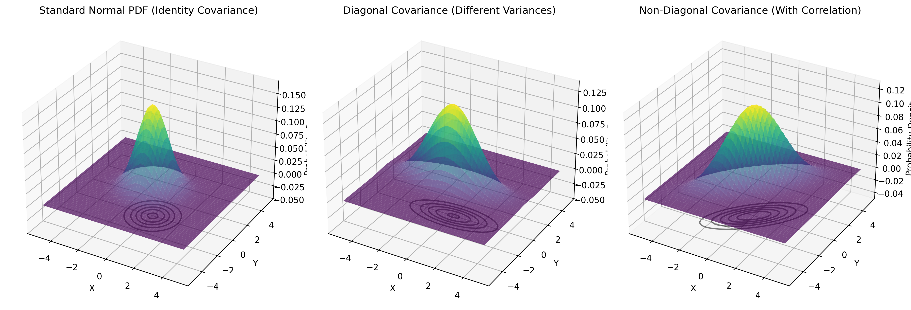
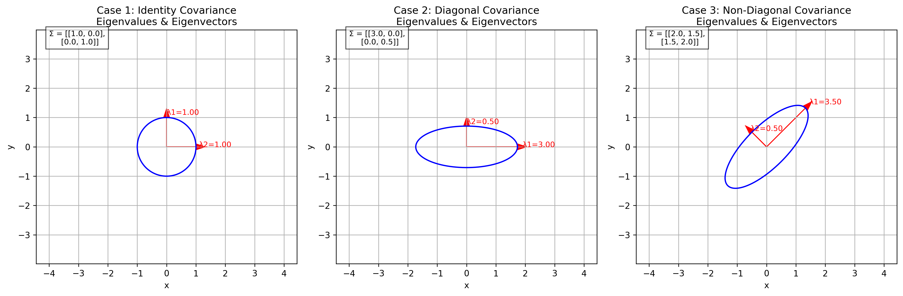
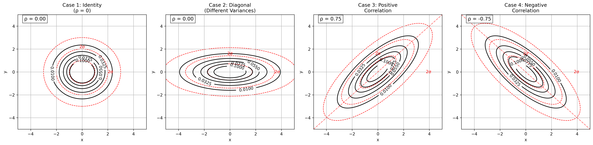
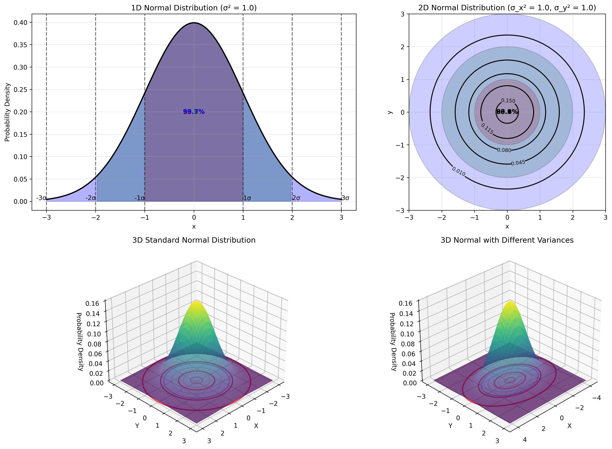
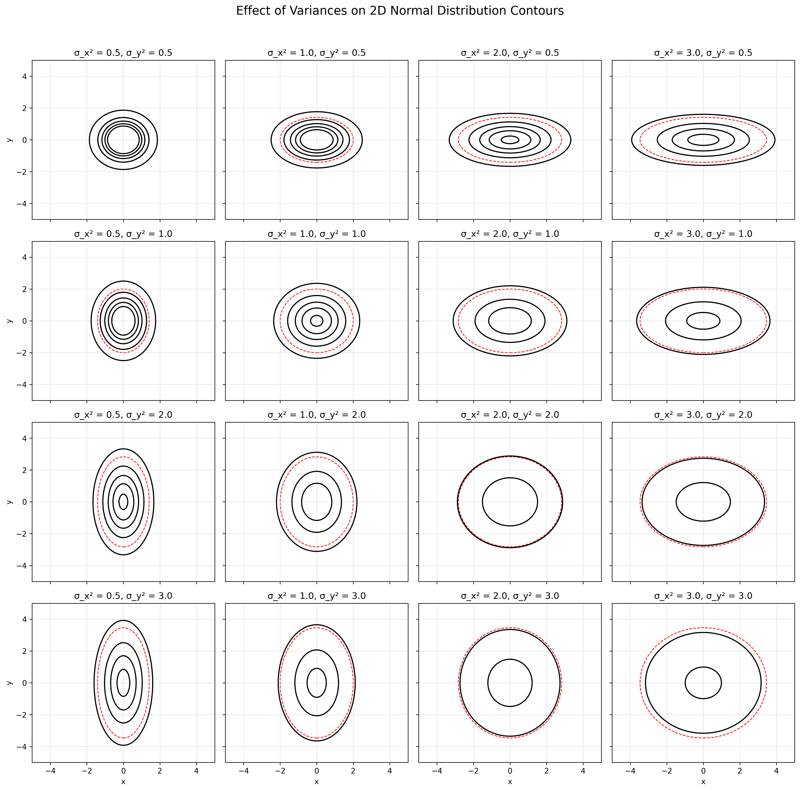

# Covariance Matrix Contours Examples

This document provides practical examples of covariance matrices and their effects on multivariate normal distributions, illustrating the concept of covariance and correlation in machine learning and data analysis contexts.

## Key Concepts and Formulas

The covariance matrix is a square matrix that captures how variables in a multivariate distribution vary with respect to each other. For a bivariate normal distribution, the shape and orientation of its probability density contours are directly determined by the covariance matrix.

### The Multivariate Gaussian Formula

The probability density function (PDF) of a multivariate Gaussian distribution is given by:

$$f(\mathbf{x}) = \frac{1}{(2\pi)^{n/2}|\boldsymbol{\Sigma}|^{1/2}} \exp\left(-\frac{1}{2}(\mathbf{x}-\boldsymbol{\mu})^T \boldsymbol{\Sigma}^{-1} (\mathbf{x}-\boldsymbol{\mu})\right)$$

For a bivariate case ($n = 2$), this becomes:

$$f(x,y) = \frac{1}{2\pi\sqrt{|\Sigma|}} \exp\left(-\frac{1}{2}(X-\mu)^T \Sigma^{-1} (X-\mu)\right)$$

Where:
- $X = (x, y)$ = Vector of variables
- $\mu = (\mu_x, \mu_y)$ = Mean vector
- $\Sigma$ = Covariance matrix $\begin{bmatrix} \sigma_x^2 & \sigma_{xy} \\ \sigma_{xy} & \sigma_y^2 \end{bmatrix}$
- $|\Sigma|$ = Determinant of the covariance matrix = $\sigma_x^2\sigma_y^2 - \sigma_{xy}^2$
- $\Sigma^{-1}$ = Inverse of the covariance matrix

The contour plots of this distribution form ellipses described by:

$$(X-\mu)^T \Sigma^{-1} (X-\mu) = c$$

Where $c$ is a constant value. These ellipses represent points of equal probability density.

### Types of Covariance Matrices

1. **Diagonal Covariance Matrix with Equal Variances (Identity Matrix)**:
   $$\Sigma = \begin{bmatrix} \sigma^2 & 0 \\ 0 & \sigma^2 \end{bmatrix} = \sigma^2 I$$
   - Produces circular contours
   - Equal spread in all directions
   - Contour equation: $(x-\mu_x)^2 + (y-\mu_y)^2 = c\sigma^2$

2. **Diagonal Covariance Matrix with Different Variances**:
   $$\Sigma = \begin{bmatrix} \sigma_1^2 & 0 \\ 0 & \sigma_2^2 \end{bmatrix}$$
   - Produces axis-aligned elliptical contours
   - Different spread along x and y axes
   - Contour equation: $\frac{(x-\mu_x)^2}{\sigma_1^2} + \frac{(y-\mu_y)^2}{\sigma_2^2} = c$

3. **Non-Diagonal Covariance Matrix (With Correlation)**:
   $$\Sigma = \begin{bmatrix} \sigma_1^2 & \rho\sigma_1\sigma_2 \\ \rho\sigma_1\sigma_2 & \sigma_2^2 \end{bmatrix}$$
   - Produces rotated elliptical contours
   - Correlation coefficient $\rho$ determines the rotation angle
   - Contour equation involves cross-terms: $ax^2 + 2bxy + cy^2 = k$ (where $a$, $b$, $c$ depend on $\Sigma^{-1}$)

### Eigendecomposition of Covariance Matrix

The covariance matrix can be decomposed as:

$$\Sigma = V\Lambda V^T$$

Where:
- $V$ = Matrix of eigenvectors (columns are the eigenvectors)
- $\Lambda$ = Diagonal matrix of eigenvalues
- The eigenvectors define the principal axes of the elliptical contours
- The eigenvalues determine the length of each principal axis (proportional to $\sqrt{\lambda_i}$)

## Examples

The following examples demonstrate how different covariance matrices affect the shape and orientation of probability density contours:

- **Basic Normal Distributions**: Visualizing 1D and 2D normal distributions with different variances
- **Diagonal Covariance Matrices**: Exploring axis-aligned elliptical contours
- **Non-Diagonal Covariance Matrices**: Understanding rotated elliptical contours with correlation
- **3D Visualization**: Examining the probability density surface in three dimensions
- **Eigenvalue Effect**: Analyzing how eigenvalues and eigenvectors relate to contour shapes
- **Real-World Covariance**: Exploring height-weight relationships as a natural example of covariance
- **Rotation Effects**: Understanding how rotation affects covariance structure
- **Mahalanobis Distance**: Comparing Euclidean and Mahalanobis distances for correlated data
- **Emoji Visualization**: Using intuitive visual metaphors to understand correlation types
- **Sketching Contours**: Interactive visualization for sketching contours of a bivariate normal distribution
- **Robust Covariance Estimation**: Comparing standard and robust methods for covariance estimation in the presence of outliers

### Example 1: Basic Normal Distributions

#### Problem Statement
How do variance changes affect 1D normal distributions, and what happens when we extend to 2D with independent variables? How do different covariance matrices affect the shape, orientation, and probability surfaces of multivariate normal distributions?

We'll examine different covariance matrices:
- Identity covariance matrix: $\Sigma = \begin{bmatrix} 1.0 & 0.0 \\ 0.0 & 1.0 \end{bmatrix}$
- Diagonal with different variances: $\Sigma = \begin{bmatrix} 2.0 & 0.0 \\ 0.0 & 0.5 \end{bmatrix}$
- Non-diagonal with positive correlation: $\Sigma = \begin{bmatrix} 2.0 & 1.5 \\ 1.5 & 2.0 \end{bmatrix}$
- Non-diagonal with negative correlation: $\Sigma = \begin{bmatrix} 2.0 & -1.5 \\ -1.5 & 2.0 \end{bmatrix}$

For all cases, we'll use mean vector $\mu = [0, 0]$.


*3D visualization of probability density functions for different covariance matrices, showing how the surface shape relates to the contour shapes below.*

#### Solution

We'll start with 1D normal distributions and extend to 2D with diagonal covariance matrices, then explore different types of covariance matrices.

##### Step 1: Understanding 1D Normal Distributions with Different Variances
The probability density function of a 1D normal distribution is:

$$f(x) = \frac{1}{\sqrt{2\pi\sigma^2}} \exp\left(-\frac{x^2}{2\sigma^2}\right)$$

Where $\sigma^2$ is the variance parameter. We'll visualize three cases:

1. **Standard normal ($\sigma^2 = 1$)**: 
   $$f(x) = \frac{1}{\sqrt{2\pi}} \exp\left(-\frac{x^2}{2}\right)$$

2. **Narrow normal ($\sigma^2 = 0.5$)**:
   $$f(x) = \frac{1}{\sqrt{\pi}} \exp(-x^2)$$
   - This has a taller peak (larger maximum value)
   - It decreases more rapidly as x moves away from the mean

3. **Wide normal ($\sigma^2 = 2$)**:
   $$f(x) = \frac{1}{\sqrt{4\pi}} \exp\left(-\frac{x^2}{4}\right)$$
   - This has a shorter peak (smaller maximum value)
   - It decreases more slowly as x moves away from the mean

The key insight: The total area under each curve equals 1 (probability axiom). Therefore, curves with higher peaks must be narrower, and those with lower peaks must be wider to maintain the same total area.

##### Step 2: Extending to 2D - Understanding Covariance Matrices and Their Eigenstructure

The covariance matrix has a direct relationship with the shape of the probability distribution. The eigenvalues and eigenvectors of the covariance matrix determine the principal axes and their lengths:


*Visualization of eigenvalues and eigenvectors for different covariance matrices. The red arrows show the principal directions (eigenvectors) and their lengths are proportional to the square roots of the eigenvalues.*

For a 2D standard normal distribution (with identity covariance matrix), the PDF is:

$$f(x,y) = \frac{1}{2\pi} \exp\left(-\frac{x^2 + y^2}{2}\right)$$

Key properties:
- Equal variance in both dimensions ($\sigma_1^2 = \sigma_2^2 = 1$)
- Zero correlation between x and y ($\rho = 0$)
- Contours form perfect circles centered at the origin
- The equation for the contours is $x^2 + y^2 = \text{constant}$
- The contour value $c$ corresponds to the constant: $-2\ln(2\pi c)$
- 1σ, 2σ, and 3σ circles have radii of 1, 2, and 3 respectively
- The 1σ circle contains approximately 39% of the probability mass
- The 2σ circle contains approximately 86% of the probability mass
- The 3σ circle contains approximately 99% of the probability mass

##### Step 3: Comparing Different Types of Covariance Matrices

Different covariance matrices produce distinctly different contour shapes:


*Comparison of different covariance matrices and their resulting contours. From left to right: identity covariance (circular contours), diagonal with different variances (axis-aligned ellipses), positive correlation (ellipses tilted along y=x), and negative correlation (ellipses tilted along y=-x).*

1. **Identity covariance matrix**: Circular contours showing equal spread in all directions
2. **Diagonal covariance matrix with different variances**: Axis-aligned elliptical contours showing different spread along coordinate axes
3. **Non-diagonal covariance matrix with positive correlation**: Elliptical contours tilted along the y=x direction
4. **Non-diagonal covariance matrix with negative correlation**: Elliptical contours tilted along the y=-x direction

##### Step 4: 2D Normal with Different Variances (Diagonal Covariance Matrix)
Now we examine a bivariate normal where the variances are different:

$$f(x,y) = \frac{1}{2\pi\sqrt{|\Sigma|}} \exp\left(-\frac{1}{2}\left(\frac{x^2}{\sigma_1^2} + \frac{y^2}{\sigma_2^2}\right)\right)$$

Where $\sigma_1^2 = 2$ and $\sigma_2^2 = 0.5$

Key properties:
- Covariance matrix $\Sigma = \begin{bmatrix} 2 & 0 \\ 0 & 0.5 \end{bmatrix}$
- Determinant $|\Sigma| = 2 \cdot 0.5 = 1$
- Different variances in x and y directions
- Still zero correlation between variables ($\rho = 0$)
- Contours form axis-aligned ellipses
- The equation for the contours is $\frac{x^2}{2} + \frac{y^2}{0.5} = \text{constant}$
- The semi-axes of the ellipses are in the ratio $\sqrt{2} : \sqrt{0.5} \approx 1.41 : 0.71$
- The ellipses are stretched along the x-axis and compressed along the y-axis
- This reflects greater variance in the x direction than in the y direction

##### Step 5: Key Insights from the Comparison
1. 1D normal distributions: As variance increases, the peak height decreases and the spread increases, but the total area remains constant (= 1)
2. 2D standard normal (equal variances): Circular contours indicating equal spread in all directions. This is the simplest case.
3. 2D normal with different variances: Elliptical contours indicating different spread in different directions. The direction of greater variance corresponds to the longer axis of the ellipse.
4. 2D normal with correlation: Rotated elliptical contours where the tilt direction indicates the direction of correlation.

The mathematical relationship: The shape of the contours directly reflects the structure of the covariance matrix. The principal axes of the ellipses align with the eigenvectors of the covariance matrix, and their lengths are proportional to the square roots of the eigenvalues.


*Detailed contour plots for four different covariance matrices. Red dashed lines show 1σ, 2σ, and 3σ boundaries.*

### Example 2: Covariance Matrix Types and Their Effects

#### Problem Statement
How do different types of covariance matrices affect the shape, size, and orientation of probability density contours? How does the probability mass distribute within different sigma regions for both 1D and 2D normal distributions?

We will examine four covariance matrices:
1. Identity covariance: $\Sigma = \begin{bmatrix} 1.0 & 0.0 \\ 0.0 & 1.0 \end{bmatrix}$
2. Diagonal with different variances: $\Sigma = \begin{bmatrix} 3.0 & 0.0 \\ 0.0 & 0.5 \end{bmatrix}$
3. Non-diagonal with positive correlation: $\Sigma = \begin{bmatrix} 2.0 & 1.5 \\ 1.5 & 2.0 \end{bmatrix}$
4. Non-diagonal with negative correlation: $\Sigma = \begin{bmatrix} 2.0 & -1.5 \\ -1.5 & 2.0 \end{bmatrix}$


*Visualization of probability mass contained within different sigma regions for 1D and 2D normal distributions. Top row shows the probability regions with exact percentages, bottom row shows 3D surfaces.*

#### Solution

We'll explore four cases with different covariance matrices and analyze their properties mathematically, with a focus on understanding how probability mass is distributed.

##### Step 1: Understanding Normal Distribution Probability Regions
For a 1D normal distribution:
- 68.27% of the probability mass falls within 1σ (±1 standard deviation) of the mean
- 95.45% of the probability mass falls within 2σ (±2 standard deviations) of the mean
- 99.73% of the probability mass falls within 3σ (±3 standard deviations) of the mean

For a 2D normal distribution with equal variances:
- 39.35% of the probability mass falls within the 1σ circle
- 86.47% of the probability mass falls within the 2σ circle
- 98.89% of the probability mass falls within the 3σ circle

Note that the percentages are different between 1D and 2D cases due to the increased dimensionality.

##### Step 2: Transitioning from 1D to 2D Normal Distributions
As we extend from 1D to 2D distributions, the probability structure changes:


*Visualization of the transition from 1D to 2D normal distributions with different variance parameters, showing how the probability regions extend into the second dimension.*

The transition sequence demonstrates:
1. Standard normal in both dimensions (equal variances)
2. Narrow distribution in x, standard in y (different variances)
3. Wide distribution in x, narrow in y (highly different variances in opposite directions)

This progression helps build an intuitive understanding of how the covariance matrix shapes the probability density.

##### Step 3: The Effect of Variance Parameters on Contour Shapes
The shape of contours is directly determined by the variance parameters:


*Grid visualization showing how different combinations of variance parameters affect the shape and orientation of contours. The figure displays 16 different combinations of variances for x and y coordinates.*

Key observations:
- When σ²ₓ = σ²ᵧ (diagonal from top-left to bottom-right), contours are circular
- As σ²ₓ increases horizontally across the grid, ellipses stretch in the x-direction
- As σ²ᵧ increases vertically down the grid, ellipses stretch in the y-direction
- The ratio σ²ₓ/σ²ᵧ determines the aspect ratio of the ellipses

##### Step 4: Diagonal Covariance with Equal Variances (Identity Matrix)
When the covariance matrix is a scaled identity matrix:

$$\Sigma = \begin{bmatrix} 1.0 & 0.0 \\ 0.0 & 1.0 \end{bmatrix} = I$$

Properties:
- Equal variances ($\sigma_1^2 = \sigma_2^2 = 1$)
- Zero correlation ($\rho = 0$)
- Determinant $|\Sigma| = 1$
- Eigenvalues: $\lambda_1 = \lambda_2 = 1$
- The resulting contours form perfect circles
- The equation for these contours is $x^2 + y^2 = \text{constant}$
- This is the standard bivariate normal distribution
- The PDF simplifies to: $f(x,y) = \frac{1}{2\pi} \exp\left(-\frac{x^2 + y^2}{2}\right)$

##### Step 5: Diagonal Covariance with Different Variances
When the covariance matrix has different variances but no correlation:

$$\Sigma = \begin{bmatrix} 3.0 & 0.0 \\ 0.0 & 0.5 \end{bmatrix}$$

Properties:
- Different variances ($\sigma_1^2 = 3$, $\sigma_2^2 = 0.5$)
- Zero correlation ($\rho = 0$)
- Determinant $|\Sigma| = 1.5$
- Eigenvalues: $\lambda_1 = 3$, $\lambda_2 = 0.5$ (same as variances since matrix is diagonal)
- The resulting contours form axis-aligned ellipses
- The equation for these contours is $\frac{x^2}{3} + \frac{y^2}{0.5} = \text{constant}$
- The ellipses are stretched along the x-axis and compressed along the y-axis
- The PDF is: $f(x,y) = \frac{1}{2\pi\sqrt{1.5}} \exp\left(-\frac{1}{2} \left(\frac{x^2}{3} + \frac{y^2}{0.5}\right)\right)$
- The semi-axes of the ellipses are in the ratio $\sqrt{3} : \sqrt{0.5} \approx 1.73 : 0.71$

##### Step 6: Non-Diagonal Covariance with Positive Correlation
When the covariance matrix has non-zero off-diagonal elements with positive correlation:

$$\Sigma = \begin{bmatrix} 2.0 & 1.5 \\ 1.5 & 2.0 \end{bmatrix}$$

Properties:
- Equal variances ($\sigma_1^2 = \sigma_2^2 = 2$)
- Positive correlation ($\rho = 0.75$)
- Determinant $|\Sigma| = 1.75$
- Eigenvalues: $\lambda_1 = 3.50$, $\lambda_2 = 0.50$
- Eigenvectors: $v_1 = [0.71, 0.71]$, $v_2 = [-0.71, 0.71]$
- The resulting contours form rotated ellipses
- The ellipses are tilted along the $y = x$ direction (positive correlation)
- The principal axes align with the eigenvectors of the covariance matrix
- The semi-axes lengths are proportional to $\sqrt{3.5}$ and $\sqrt{0.5}$
- The quadratic form in the exponent is:
  $(x,y)^T \Sigma^{-1} (x,y) = [x \ y] [[a \ b], [b \ c]] [x, y]^T = a \cdot x^2 + 2b \cdot xy + c \cdot y^2$
  where $\Sigma^{-1} = [[a \ b], [b \ c]]$ is the inverse of the covariance matrix

##### Step 7: Non-Diagonal Covariance with Negative Correlation
When the covariance matrix has non-zero off-diagonal elements with negative correlation:

$$\Sigma = \begin{bmatrix} 2.0 & -1.5 \\ -1.5 & 2.0 \end{bmatrix}$$

Properties:
- Equal variances ($\sigma_1^2 = \sigma_2^2 = 2$)
- Negative correlation ($\rho = -0.75$)
- Determinant $|\Sigma| = 1.75$
- Eigenvalues: $\lambda_1 = 3.50$, $\lambda_2 = 0.50$
- Eigenvectors: $v_1 = [0.71, -0.71]$, $v_2 = [0.71, 0.71]$
- The resulting contours form rotated ellipses
- The ellipses are tilted along the $y = -x$ direction (negative correlation)
- The principal axes align with the eigenvectors of the covariance matrix
- The semi-axes lengths are proportional to $\sqrt{3.5}$ and $\sqrt{0.5}$
- The negative correlation means that as one variable increases, the other tends to decrease, creating the rotation in the opposite direction

##### Step 8: Key Insights from Comparison
1. Diagonal covariance matrices produce axis-aligned ellipses or circles:
   - Equal variances (Case 1): Perfect circles
   - Different variances (Case 2): Axis-aligned ellipses
2. Non-diagonal covariance matrices produce rotated ellipses:
   - Positive correlation (Case 3): Ellipses tilted along $y = x$
   - Negative correlation (Case 4): Ellipses tilted along $y = -x$
3. The shape and orientation of the ellipses directly reflect the covariance structure:
   - The principal axes of the ellipses align with the eigenvectors of the covariance matrix
   - The length of each principal axis is proportional to the square root of the corresponding eigenvalue
4. The density contours connect points of equal probability density
5. Mathematical relationship between correlation and geometry:
   - As correlation increases in magnitude, ellipses become more elongated
   - The angle of the principal axis is $\tan^{-1}(\rho\sigma_2/\sigma_1)$ for positive correlation
   - The eccentricity of the ellipses increases with stronger correlation 

### Example 3: 3D Visualization of Probability Density Functions

#### Problem Statement
How does the probability density function of a bivariate normal distribution look in 3D space, and how does the covariance matrix affect this surface? How does correlation impact the shape and cross-sections of the probability density surface?

We will visualize the 3D surfaces for three covariance matrices:
1. Standard normal (identity covariance): $\Sigma = \begin{bmatrix} 1.0 & 0.0 \\ 0.0 & 1.0 \end{bmatrix}$
2. Diagonal with different variances: $\Sigma = \begin{bmatrix} 2.0 & 0.0 \\ 0.0 & 0.5 \end{bmatrix}$
3. Non-diagonal with correlation: $\Sigma = \begin{bmatrix} 1.0 & 0.8 \\ 0.8 & 1.0 \end{bmatrix}$

Mean vector for all cases: $\mu = [0, 0]$


*Visualization showing the relationship between 3D probability density surfaces and their corresponding 2D contour plots for three different covariance matrices. The top row shows the 3D surfaces, and the bottom row shows the corresponding contour plots.*

#### Solution

We'll visualize the probability density surface in 3D for different covariance matrices to understand their geometric interpretation.

##### Step 1: Setting Up the Visualization Framework
To visualize bivariate normal distributions in 3D, we need to:
- Create a 2D grid of (x,y) points where we'll evaluate the PDF
- Calculate the PDF value at each point, giving us a 3D surface z = f(x,y)
- Plot this surface in 3D space, with contours projected on the xy-plane

This gives us a comprehensive view of both the probability density surface and its contour lines, helping us understand the distribution's shape.

##### Step 2: Effect of Correlation on 3D Gaussian Surface
As the correlation parameter changes, the 3D probability density surface undergoes significant transformations:


*Sequence of 3D probability density surfaces showing how correlation affects shape and orientation. The bottom right plot shows how correlation affects eigenvalues and determinant of the covariance matrix.*

Key observations:
- Negative correlation (ρ = -0.8): The surface stretches along the y = -x direction
- No correlation (ρ = 0): The surface is symmetric with circular contours
- Positive correlation (ρ = 0.8): The surface stretches along the y = x direction
- As |ρ| approaches 1, the determinant approaches 0, causing the peak height to increase
- The larger eigenvalue increases and the smaller eigenvalue decreases as |ρ| increases
- The determinant (1-ρ²) decreases with increasing |ρ|, affecting the overall volume

##### Step 3: Cross-Sections of Probability Density Functions
Different slices through the PDF reveal important properties about correlation:


*Cross-sections of probability density functions along different directions for various correlation values. The red line shows the cross-section along the y=x direction, blue along the x-axis, and green along the y=-x direction.*

These cross-sections show:
- With no correlation (ρ = 0), all directional cross-sections have the same shape
- With positive correlation (ρ > 0), the cross-section along y = x becomes wider and flatter
- With strong correlation (ρ → 1), the cross-section along y = -x becomes sharply peaked
- As correlation increases, the overall peak height increases due to decreasing determinant

##### Step 4: Standard Bivariate Normal (Identity Covariance)
For a standard bivariate normal distribution:
- Mean vector: $\mu = [0, 0]$ (centered at the origin)
- Covariance matrix: $\Sigma = \begin{bmatrix} 1 & 0 \\ 0 & 1 \end{bmatrix}$ (identity matrix)
- PDF: $f(x,y) = \frac{1}{2\pi} \exp\left(-\frac{x^2 + y^2}{2}\right)$

Key properties of the 3D surface:
- The peak occurs at (0,0) with a value of $\frac{1}{2\pi} \approx 0.159$
- The surface has perfect radial symmetry around the z-axis
- The contours projected onto the xy-plane form perfect circles
- The surface falls off equally in all directions from the peak
- The volume under the entire surface equals 1 (probability axiom)

##### Step 5: Bivariate Normal with Different Variances (Diagonal Covariance)
For a bivariate normal with different variances:
- Mean vector: $\mu = [0, 0]$ (still centered at the origin)
- Covariance matrix: $\Sigma = \begin{bmatrix} 2.0 & 0 \\ 0 & 0.5 \end{bmatrix}$ (diagonal but unequal)
- PDF: $f(x,y) = \frac{1}{2\pi\sqrt{|\Sigma|}} \exp\left(-\frac{1}{2} \left(\frac{x^2}{2} + \frac{y^2}{0.5}\right)\right)$
- Determinant $|\Sigma| = 2.0 \cdot 0.5 = 1.0$

Key properties of the 3D surface:
- The peak still occurs at (0,0) with the same height as Case 1
- The surface is stretched along the x-axis and compressed along the y-axis
- The contours projected onto the xy-plane form axis-aligned ellipses
- The surface falls off more slowly in the x-direction (larger variance)
- The surface falls off more quickly in the y-direction (smaller variance)
- The volume under the surface still equals 1

##### Step 6: Bivariate Normal with Correlation (Non-Diagonal Covariance)
For a bivariate normal with correlation:
- Mean vector: $\mu = [0, 0]$
- Covariance matrix: $\Sigma = \begin{bmatrix} 1.0 & 0.8 \\ 0.8 & 1.0 \end{bmatrix}$ (non-diagonal)
- Correlation coefficient: $\rho = 0.80$ (strong positive correlation)
- PDF: $f(x,y) = \frac{1}{2\pi\sqrt{|\Sigma|}} \exp\left(-\frac{1}{2} (x,y)^T \Sigma^{-1} (x,y)\right)$
- Determinant $|\Sigma| = 1.0^2 - 0.8^2 = 0.36$

Key properties of the 3D surface:
- The peak still occurs at (0,0), but its height is different due to the determinant
- The surface is tilted, with its principal axes rotated from the coordinate axes
- The contours projected onto the xy-plane form rotated ellipses
- The primary direction of spread is along the y = x line (reflecting positive correlation)
- The surface shows that x and y tend to increase or decrease together
- The correlation creates a 'ridge' along the y = x direction
- The volume under the surface still equals 1

##### Step 7: Key Insights from Comparing All Three 3D Visualizations
1. The covariance matrix directly determines the shape and orientation of the PDF surface
2. Identity covariance (Case 1): Symmetric bell shape with circular contours
3. Diagonal covariance with different variances (Case 2): Stretched bell shape with axis-aligned elliptical contours
4. Non-diagonal covariance with correlation (Case 3): Tilted bell shape with rotated elliptical contours

Mathematical relationships:
- The exponent term in the PDF formula: $-\frac{1}{2} (x,y)^T \Sigma^{-1} (x,y)$ creates the shape
- The determinant term in the denominator: $\sqrt{|\Sigma|}$ adjusts the height of the peak
- Together they ensure that the volume under the surface equals 1


*3D visualizations of Gaussian probability density functions with three different covariance matrices: identity covariance (left), diagonal with different variances (middle), and positive correlation (right).*

### Example 4: Eigenvalues, Eigenvectors, and Covariance

#### Problem Statement
How do the eigenvalues and eigenvectors of a covariance matrix relate to the shape and orientation of probability density contours? How does correlation strength affect the geometric properties of multivariate distributions?

We'll examine how increasing correlation affects the eigenvalues and eigenvectors using four covariance matrices with increasing correlation:
1. No correlation (ρ = 0): $\Sigma = \begin{bmatrix} 1.0 & 0.0 \\ 0.0 & 1.0 \end{bmatrix}$
2. Weak correlation (ρ = 0.3): $\Sigma = \begin{bmatrix} 1.0 & 0.3 \\ 0.3 & 1.0 \end{bmatrix}$
3. Moderate correlation (ρ = 0.6): $\Sigma = \begin{bmatrix} 1.0 & 0.6 \\ 0.6 & 1.0 \end{bmatrix}$
4. Strong correlation (ρ = 0.9): $\Sigma = \begin{bmatrix} 1.0 & 0.9 \\ 0.9 & 1.0 \end{bmatrix}$


*Basic concept visualization showing how eigenvalues and eigenvectors determine the shape and orientation of probability distributions. Left: Circular distribution with equal eigenvalues. Middle: Axis-aligned elliptical distribution with unequal eigenvalues. Right: Rotated elliptical distribution with correlated variables.*

#### Solution

We'll examine how increasing correlation affects the eigenvalues and eigenvectors of covariance matrices and their geometric interpretation.

##### Step 1: Mathematical Background
The covariance matrix $\Sigma$ can be decomposed as:

$$\Sigma = V \Lambda V^T$$

Where:
- $V$ contains eigenvectors (principal directions) as columns
- $\Lambda$ is a diagonal matrix of eigenvalues (variances along principal directions)
- This decomposition helps us understand the shape and orientation of the contours

The eigenvectors determine the orientation of the principal axes of the elliptical contours, while the eigenvalues determine the length of these axes (proportional to the square root of the eigenvalues).


*Relationship between correlation coefficient (ρ) and eigenvalues for a 2×2 covariance matrix with equal variances. As correlation increases, the first eigenvalue increases while the second decreases, creating more elongated ellipses.*

##### Step 2: No Correlation (ρ = 0)
Covariance matrix:
$$\Sigma = \begin{bmatrix} 1.0 & 0.0 \\ 0.0 & 1.0 \end{bmatrix}$$

Properties:
- Equal variances in both dimensions
- Zero correlation
- Eigenvalues: $\lambda_1 = \lambda_2 = 1$
- Eigenvectors: $v_1 = [1, 0]$, $v_2 = [0, 1]$ (aligned with coordinate axes)
- Circular contours (equal variance in all directions)
- No preferred direction of variability in the data

When there's no correlation, the standard deviations along all directions are equal, resulting in a perfect circle. The probability density function has the same spread in all directions.

##### Step 3: Weak Correlation (ρ = 0.3)
Covariance matrix:
$$\Sigma = \begin{bmatrix} 1.0 & 0.3 \\ 0.3 & 1.0 \end{bmatrix}$$

Properties:
- Equal variances in both dimensions
- Weak positive correlation ($\rho = 0.3$)
- Eigenvalues: $\lambda_1 \approx 1.3$, $\lambda_2 \approx 0.7$
- Eigenvectors begin to rotate away from the coordinate axes
- Slightly elliptical contours with mild rotation
- Beginning to show a preferred direction of variability

The larger eigenvalue ($\lambda_1 \approx 1.3$) corresponds to the direction of maximum variance, which is now rotated slightly toward the $y = x$ line. We can see that the variance along this direction is starting to increase, while the variance in the perpendicular direction decreases.

##### Step 4: Moderate Correlation (ρ = 0.6)
Covariance matrix:
$$\Sigma = \begin{bmatrix} 1.0 & 0.6 \\ 0.6 & 1.0 \end{bmatrix}$$

Properties:
- Equal variances in both dimensions
- Moderate positive correlation ($\rho = 0.6$)
- Eigenvalues: $\lambda_1 \approx 1.6$, $\lambda_2 \approx 0.4$
- Eigenvectors rotate further from the coordinate axes
- More eccentric elliptical contours with significant rotation
- Clear preferred direction of variability emerges

The disparity between eigenvalues increases, leading to more elongated ellipses. The first eigenvector (associated with $\lambda_1$) moves closer to the direction $[1, 1]$ (the $y = x$ line). The ellipses are now approximately 2:1 in terms of their axis lengths.

##### Step 5: Strong Correlation (ρ = 0.9)
Covariance matrix:
$$\Sigma = \begin{bmatrix} 1.0 & 0.9 \\ 0.9 & 1.0 \end{bmatrix}$$

Properties:
- Equal variances in both dimensions
- Strong positive correlation ($\rho = 0.9$)
- Eigenvalues: $\lambda_1 \approx 1.9$, $\lambda_2 \approx 0.1$
- Eigenvectors nearly align with the $y = x$ and $y = -x$ directions
- Highly eccentric elliptical contours with strong rotation
- Dominant direction of variability along the first eigenvector
- Very little variability along the second eigenvector

The first eigenvector is now very close to $[1, 1]/\sqrt{2}$, and the second eigenvector approaches $[-1, 1]/\sqrt{2}$. The ratio of eigenvalues ($\lambda_1/\lambda_2 \approx 19$) indicates that the ellipses are 19 times longer in one direction than the other. This extreme elongation shows that the variables are almost perfectly correlated.

##### Step 6: Mathematical Relationship
For a covariance matrix with equal variances and correlation $\rho$:
$$\Sigma = \begin{bmatrix} 1 & \rho \\ \rho & 1 \end{bmatrix}$$

The eigenvalues are:
$$\lambda_1 = 1 + \rho$$
$$\lambda_2 = 1 - \rho$$

The eigenvectors are:
$$v_1 = [1, 1]/\sqrt{2}$$
$$v_2 = [-1, 1]/\sqrt{2}$$

As $\rho$ approaches 1, $\lambda_1$ approaches 2 and $\lambda_2$ approaches 0, making the ellipses increasingly elongated along the $y = x$ direction. This mathematical relationship perfectly explains the geometric progression we observe in the visualizations.

##### Step 7: 3D Visualization of the Effect
The correlation also dramatically affects the 3D probability density surface:

- With no correlation (blue surface), the PDF forms a symmetric bell curve
- With strong correlation (red surface), the PDF stretches along the $y = x$ direction and becomes more concentrated
- The total volume under both surfaces remains constant (= 1), as required by probability theory
- The peak height increases with correlation due to the decrease in the determinant of the covariance matrix

##### Step 8: Key Insights
- As correlation increases, eigenvalues become more disparate
- The largest eigenvalue increases, the smallest decreases
- The orientation of eigenvectors approaches $y = x$ (for positive correlation)
- The ellipses become increasingly elongated (higher eccentricity)
- This illustrates why PCA works: it identifies the directions of maximum variance
- When variables are strongly correlated, most of the information can be captured by a single principal component
- The determinant of the covariance matrix (which equals the product of eigenvalues) decreases with increasing correlation, affecting the peak height of the PDF


*Comprehensive visualization of how correlation affects eigenvalues, eigenvectors, and probability density contours. Top: 3D probability surfaces for uncorrelated (blue) vs strongly correlated (red) distributions. Bottom: Contour plots showing increasing correlation from left to right with eigenvectors (blue arrows) and probability density heatmaps.*

### Example 5: Height-Weight Relationship - Real-World Covariance

#### Problem Statement
How does natural covariance appear in the real world, and how can it be visualized using height and weight data? How can we apply our theoretical understanding of covariance to real-world biometric relationships?

For this example, we'll use the following assumptions for height-weight relationships:
- Height (cm): Normally distributed with mean 170cm and standard deviation 7cm
- Weight (kg): Related to height by the model $w = 0.5h + \varepsilon$, where $\varepsilon \sim \mathcal{N}(0, 5^2)$
- This creates a natural positive correlation between height and weight


*Conceptual visualization of the height-weight relationship showing how taller individuals tend to be heavier, illustrating natural correlation in human biometrics.*

#### Solution

##### Step 1: Understanding the Natural Relationship
Height and weight are naturally correlated variables in human populations:
- Taller people tend to weigh more (positive correlation)
- This relationship is not deterministic but statistical
- The covariance structure can be visualized as an elliptical pattern in a scatter plot
- The direction of maximum variance typically aligns with the "growth trajectory"

Mathematical model:
- Height (cm): $h \sim \mathcal{N}(170, 7^2)$ (mean 170cm, standard deviation 7cm)
- Weight (kg): $w = 0.5h + \varepsilon$, where $\varepsilon \sim \mathcal{N}(0, 5^2)$
- This creates a positive correlation between height and weight

This relationship exists because of underlying biological and physiological factors: as a person grows taller, their skeletal frame and body volume increase, typically requiring more mass to support the larger structure.

##### Step 2: Calculating the Covariance Matrix
For our simulated data, we compute the covariance matrix:

$$\Sigma = \begin{bmatrix} \sigma_h^2 & \sigma_{hw} \\ \sigma_{hw} & \sigma_w^2 \end{bmatrix} = \begin{bmatrix} 40.41 & 16.07 \\ 16.07 & 28.71 \end{bmatrix}$$

Where:
- $\sigma_h^2 = 40.41$ is the variance of height (cm²)
- $\sigma_w^2 = 28.71$ is the variance of weight (kg²)
- $\sigma_{hw} = 16.07$ is the covariance between height and weight (cm·kg)

The correlation coefficient is calculated as:

$$\rho = \frac{\sigma_{hw}}{\sigma_h \sigma_w} = \frac{16.07}{\sqrt{40.41} \cdot \sqrt{28.71}} \approx 0.47$$

This moderate positive correlation indicates that height and weight tend to increase together, though the relationship is not extremely strong due to individual variations in body composition.

##### Step 3: Eigendecomposition of the Covariance Matrix
We compute the eigenvalues and eigenvectors of the covariance matrix:

$$\Sigma = V \Lambda V^T$$

Eigenvalues:
- $\lambda_1 = 51.66$ (variance along the first principal component)
- $\lambda_2 = 17.45$ (variance along the second principal component)

Eigenvectors (columns of $V$):
- $v_1 = [0.82, 0.57]^T$ (direction of maximum variance)
- $v_2 = [-0.57, 0.82]^T$ (direction perpendicular to $v_1$)

The first principal component ($v_1$) represents the "growth direction" where both height and weight increase together. The second principal component ($v_2$) represents variations in body type (more or less weight relative to height).

##### Step 4: Visualizing with Confidence Ellipses
We draw confidence ellipses to represent regions containing approximately:
- 68% of the data (1σ ellipse)
- 95% of the data (2σ ellipse)

These ellipses are centered at the mean $(μ_h, μ_w)$ with:
- Principal axes aligned with the eigenvectors of the covariance matrix
- Semi-axis lengths proportional to the square roots of the eigenvalues
- Rotation determined by the orientation of the first eigenvector

The principal components shown as arrows indicate:
- PC1 (larger arrow): The main "growth direction" explaining most of the variance
- PC2 (smaller arrow): The secondary dimension of variation, representing body type differences


*Height-weight relationship showing scatter plot with principal components and confidence ellipses.*

The best-fit regression line shows the expected weight based on height, following the formula:
$\text{weight} \approx 0.40 \times \text{height} + \text{constant}$

This line provides a simple linear model for the relationship, though the elliptical confidence regions provide a more complete picture of the bivariate distribution.

##### Step 5: 3D Probability Density and Marginal Distributions
The 3D visualization shows:
- The probability density surface of the bivariate normal distribution
- Higher density (peak) at the mean of height and weight
- The elliptical contours projected onto the height-weight plane
- The elongation of the density surface along the direction of maximum variance


*3D probability density surface of the height-weight relationship.*

The marginal distributions show:
- The height distribution follows a normal distribution with mean ≈ 170cm
- The weight distribution follows a normal distribution with mean ≈ 85kg
- These are the "slices" of the bivariate distribution along each axis


*Marginal distributions of height and weight.*

##### Step 6: Covariance Matrix Visualization
The covariance matrix can be visualized to help understand the variance-covariance structure:


*Covariance matrix visualization.*

##### Step 7: Interpreting the Results
The visualization reveals key insights:
- The data cloud forms an elongated elliptical pattern
- The first principal component points along the "growth direction" where both height and weight increase together
- The second principal component represents variations in body type (more weight relative to height or vice versa)
- The angle of the first principal component indicates the rate of weight change relative to height
- The eccentricity of the ellipse reflects the strength of the correlation

This real-world example demonstrates how the abstract mathematical concept of covariance manifests in natural data, helping us understand and model relationships between variables.

### Example 6: Effects of Rotation on Covariance Structure

#### Problem Statement
What happens to the covariance matrix when we rotate a dataset, and why is this important? How does a change in coordinate system affect the correlation structure of data?

For this example, we'll start with uncorrelated 2D data having equal variances and observe how rotation by various angles (0°, 30°, 60°) changes the correlation structure.


*Basic visualization showing how rotation affects correlation structure for initially uncorrelated data. Left: Original data. Middle: After 30° rotation. Right: After 60° rotation. Red dashed ellipses show the covariance structure.*

#### Solution

We'll explore how geometric rotations affect the covariance structure of data, providing insight into coordinate transformations and feature engineering.

##### Step 1: Mathematical Foundation
When we rotate a dataset using a rotation matrix $R$, the covariance matrix transforms according to:

$$\Sigma' = R \Sigma R^T$$

Where:
- $\Sigma$ is the original covariance matrix
- $\Sigma'$ is the transformed covariance matrix
- $R$ is the rotation matrix

For a 2D rotation by angle $\theta$, the rotation matrix is:

$$R = \begin{pmatrix} \cos\theta & -\sin\theta \\ \sin\theta & \cos\theta \end{pmatrix}$$

This mathematical relationship is crucial for understanding how correlation can be introduced or removed through coordinate transformations.

##### Step 2: Relationship Between Rotation Angle and Correlation

For initially uncorrelated data with equal variances (covariance matrix = identity matrix), rotation by angle $\theta$ introduces correlation according to the theoretical formula:

$$\rho = \frac{\sin(2\theta)}{2}$$

Where $\rho$ is the correlation coefficient. However, real data often differs from this theoretical prediction due to sampling variability.


*Comparison of theoretical correlation formula (red line) with actual correlation values observed in rotated data (blue dashed line). Key points are marked at 0°, 45°, 90°, 135°, and 180°, showing how rotation affects correlation in a periodic manner.*

This visualization demonstrates:
- The sinusoidal relationship between rotation angle and correlation
- Maximum positive correlation occurring at 45° rotation (theoretically)
- Maximum negative correlation occurring at 135° rotation (theoretically)
- Actual data correlation may deviate from theoretical values due to initial correlation in the data and sampling variability
- The periodicity of the pattern, with correlation returning to its initial value after 180° rotation


*How correlation coefficient changes with rotation angle according to the theoretical formula ρ = sin(2θ)/2, reaching maximum correlation of 0.5 at 45° and minimum of -0.5 at 135°.*

##### Step 3: Rotation as a Vector Field Transformation

Rotation is a linear transformation that preserves distances from the origin and angles between vectors. When we rotate the coordinate system, points move along circular paths centered at the origin.


*Vector field visualization of rotation transformation. Blue arrows show how points move under rotation. Concentric circles remain circles after rotation (illustrated by dotted circles), demonstrating that rotation preserves distances from the origin. The coordinate axes also rotate, shown by the red lines.*

Key observations about rotation as a transformation:
- Points farther from the origin move greater distances (longer arrows)
- All points rotate by the same angle around the origin
- The transformation preserves the shape of probability distributions but changes their orientation
- The coordinate system itself rotates, changing our frame of reference

##### Step 4: Step-by-Step Visualization of Rotation Effects

To further understand how rotation affects correlation structure, we can examine the effect of various rotation angles on the same dataset:


*Comprehensive visualization showing the effect of rotation at multiple angles (0°, 30°, 60°, 90°, 135°, 180°). For each angle, the correlation coefficient changes with the covariance ellipse (red dashed line) rotating accordingly.*

This visualization demonstrates several key insights:
1. The correlation oscillates as the rotation angle increases
2. When the dataset is rotated by 180°, it returns to its original correlation structure
3. The shape of the dataset remains constant, only its orientation changes
4. The covariance ellipse rotates with the data, maintaining its shape

##### Step 5: Properties Preserved Under Rotation

Despite the changes in correlation, certain properties remain invariant under rotation:
- Total variance (trace of covariance matrix): $\text{tr}(\Sigma') = \text{tr}(\Sigma)$
- Determinant of covariance matrix: $|\Sigma'| = |\Sigma|$
- Eigenvalues of the covariance matrix (though eigenvectors rotate)

These invariants reflect the fact that rotation merely changes our perspective on the data, not the fundamental structure of the data itself. Our empirical verification confirms this, with traces and determinants remaining constant across all rotation angles.

The theoretical relationship for the transformed covariance matrix of initially uncorrelated data with equal variances ($\Sigma = \sigma^2 I$) under rotation by angle $\theta$ is:

$$\Sigma' = \sigma^2 \begin{pmatrix} 1 & \frac{\sin(2\theta)}{2} \\ \frac{\sin(2\theta)}{2} & 1 \end{pmatrix}$$

##### Step 6: Practical Significance

Understanding rotation effects on covariance has important applications:
1. **Coordinate system choice**: The observed correlation structure depends on how we choose to measure our variables
2. **Feature engineering**: Rotation can introduce or remove correlations, which can be useful for creating independent features
3. **Principal Component Analysis (PCA)**: PCA exploits this property by finding a rotation that diagonalizes the covariance matrix
4. **Statistical independence**: Independence is coordinate-dependent; what looks uncorrelated in one coordinate system may be strongly correlated in another
5. **Sensor orientation**: In practical applications like sensor data analysis, the physical orientation of sensors can affect the observed correlation patterns
6. **Feature transformations in ML**: Transformations in machine learning pipelines can significantly alter correlation structures

This example demonstrates the fundamental importance of coordinate systems in multivariate statistics. What appears as correlation in one coordinate system may disappear in another, highlighting that correlation is not an intrinsic property of the data but rather depends on our chosen reference frame.

### Example 7: Mahalanobis Distance vs Euclidean Distance

#### Problem Statement
Why is Euclidean distance inadequate for correlated data, and how does Mahalanobis distance address this limitation?

We'll examine a 2D dataset with strong positive correlation (ρ = 0.8) and compare how Euclidean and Mahalanobis distances evaluate "outlierness" of points at various positions.


*Comparison of Euclidean distance (circles) and Mahalanobis distance (ellipses) for correlated data. Points equidistant by Mahalanobis measure lie on ellipses aligned with the data distribution.*

#### Solution

We'll compare two distance metrics and understand why Mahalanobis distance is more appropriate for correlated data.

##### Step 1: Generate Correlated Data
We create data from a multivariate normal distribution with positive correlation:
- Mean vector: $\mu = [0, 0]$
- Covariance matrix: $\Sigma = \begin{bmatrix} 1.0 & 0.8 \\ 0.8 & 1.0 \end{bmatrix}$
- The correlation coefficient is $\rho = 0.8$ (strong positive correlation)
- The data forms an elongated cloud along the $y = x$ direction

##### Step 2: Calculate Distances for Test Points
We select specific test points and calculate their Mahalanobis distances from the mean:

For a point $x$, the Mahalanobis distance to the mean $\mu$ is given by:

$$d_M(x, \mu) = \sqrt{(x-\mu)^T \Sigma^{-1} (x-\mu)}$$

For the Euclidean distance, we simply use:

$$d_E(x, \mu) = \sqrt{(x-\mu)^T (x-\mu)}$$

For test points at the same Euclidean distance from the origin, their Mahalanobis distances will differ based on their alignment with the data distribution.

##### Step 3: Visualize Distance Contours
We plot contours of equal Mahalanobis distance (ellipses) and equal Euclidean distance (circles) to show the fundamental difference:
- Euclidean distance treats all directions equally (circles)
- Mahalanobis distance accounts for correlation (ellipses aligned with the data)

The Mahalanobis distance contours form ellipses that:
- Share the same orientation as the data cloud
- Have the same shape as the probability density contours
- Stretch along directions of higher variance (along the correlation axis)
- Contract along directions of lower variance (perpendicular to correlation)

##### Step 4: Interpret the Results
We find that points at the same Euclidean distance can have very different Mahalanobis distances:
- Points along the principal axis of correlation have smaller Mahalanobis distances
- Points perpendicular to the correlation direction have larger Mahalanobis distances

For example, consider two points both at Euclidean distance 2 from the origin:
- Point A along the correlation axis: $[1.41, 1.41]$ has a Mahalanobis distance of approximately 1.0
- Point B perpendicular to the correlation axis: $[1.41, -1.41]$ has a Mahalanobis distance of approximately 4.5

This shows that the Mahalanobis distance accounts for the shape of the distribution, making it much more suitable for anomaly detection and classification in correlated data.


### Example 8: The Emoji Guide to Correlation

#### Problem Statement
How can we intuitively understand positive and negative correlation using everyday visual metaphors?


*Emoji visualization showing how positive correlation resembles a smile (left) and negative correlation resembles a frown (right), providing an intuitive visual metaphor.*

#### Solution

We'll use visual metaphors to make correlation concepts more intuitive and memorable.

##### Step 1: Positive Correlation Visualization
We create a "happy face" alongside data showing positive correlation, where variables tend to increase or decrease together:
- Data points form a pattern from bottom-left to top-right
- The covariance ellipse is tilted along the y = x direction
- This pattern is seen in naturally related quantities (height-weight, study time-grades)

The smile curve ⌣ visually resembles the upward trend of positive correlation.

##### Step 2: Negative Correlation Visualization
We create a "sad face" alongside data showing negative correlation, where as one variable increases, the other tends to decrease:
- Data points form a pattern from top-left to bottom-right
- The covariance ellipse is tilted along the y = -x direction
- This pattern is common in trade-off relationships (price-demand, speed-accuracy)

The frown curve ⌢ visually resembles the downward trend of negative correlation.

##### Step 3: Visual Mnemonic
We establish a visual mnemonic that connects the emotional expressions to the mathematical concept:
- Smile curves upward ⌣ like positive correlation
- Frown curves downward ⌢ like negative correlation

This visual approach helps anchor abstract statistical concepts in intuitive, memorable imagery.


### Example 9: Sketching Contours of a Bivariate Normal Distribution

#### Problem Statement
Sketch the contour lines for the probability density function of a bivariate normal distribution with mean $\mu = (0,0)$ and covariance matrix $\Sigma = \begin{pmatrix} \sigma_1^2 & 0 \\ 0 & \sigma_2^2 \end{pmatrix}$, where $\sigma_1^2 = 2.0$ and $\sigma_2^2 = 0.5$.


*Contour lines of a bivariate normal distribution with diagonal covariance matrix. The black lines are probability density contours, while the red dashed ellipses represent the 1σ, 2σ, and 3σ contours.*

#### Solution

##### Step 1: Mathematical Formula Setup
The bivariate normal probability density function with mean $\mu = (0,0)$ and diagonal covariance matrix $\Sigma = \begin{pmatrix} \sigma_1^2 & 0 \\ 0 & \sigma_2^2 \end{pmatrix}$ is:

$$f(x,y) = \frac{1}{2\pi\sqrt{\sigma_1^2\sigma_2^2}} \exp\left(-\frac{1}{2}\left[\frac{x^2}{\sigma_1^2} + \frac{y^2}{\sigma_2^2}\right]\right)$$

##### Step 2: Analyzing the Covariance Matrix
For the diagonal covariance matrix $\Sigma = \begin{pmatrix} 2.0 & 0 \\ 0 & 0.5 \end{pmatrix}$:

- The determinant: $|\Sigma| = \sigma_1^2 \cdot \sigma_2^2 = 2.0 \cdot 0.5 = 1.0$
- The inverse: $\Sigma^{-1} = \begin{pmatrix} \frac{1}{\sigma_1^2} & 0 \\ 0 & \frac{1}{\sigma_2^2} \end{pmatrix} = \begin{pmatrix} 0.5 & 0 \\ 0 & 2.0 \end{pmatrix}$
- The eigenvalues are $\lambda_1 = 2.0$ and $\lambda_2 = 0.5$
- The eigenvectors are $v_1 = (1,0)$ and $v_2 = (0,1)$

The zero covariance means the variables are uncorrelated, resulting in contour lines aligned with the coordinate axes.

##### Step 3: Deriving the Contour Equation
To find the contour lines, we set the PDF equal to a constant $c$:

$$\frac{1}{2\pi\sqrt{\sigma_1^2\sigma_2^2}} \exp\left(-\frac{1}{2}\left[\frac{x^2}{\sigma_1^2} + \frac{y^2}{\sigma_2^2}\right]\right) = c$$

Taking the natural logarithm of both sides:

$$\ln\left[\frac{1}{2\pi\sqrt{\sigma_1^2\sigma_2^2}} \exp\left(-\frac{1}{2}\left[\frac{x^2}{\sigma_1^2} + \frac{y^2}{\sigma_2^2}\right]\right)\right] = \ln(c)$$

Simplifying:

$$-\ln(2\pi\sqrt{\sigma_1^2\sigma_2^2}) - \frac{1}{2}\left[\frac{x^2}{\sigma_1^2} + \frac{y^2}{\sigma_2^2}\right] = \ln(c)$$

Rearranging to isolate the quadratic terms:

$$\frac{x^2}{\sigma_1^2} + \frac{y^2}{\sigma_2^2} = -2\ln(c) - 2\ln(2\pi\sqrt{\sigma_1^2\sigma_2^2}) = k$$

Where $k$ is a positive constant that depends on the contour value $c$.

##### Step 4: Recognize the Geometric Shape
The equation $\frac{x^2}{\sigma_1^2} + \frac{y^2}{\sigma_2^2} = k$ describes an ellipse:

- Centered at the origin $(0,0)$
- Semi-axes aligned with the coordinate axes
- Semi-axis length along x-direction: $a = \sqrt{k\sigma_1^2} = \sqrt{2.0k}$
- Semi-axis length along y-direction: $b = \sqrt{k\sigma_2^2} = \sqrt{0.5k}$

For our specific case with $\sigma_1^2 = 2.0$ and $\sigma_2^2 = 0.5$:

$$\frac{x^2}{2.0} + \frac{y^2}{0.5} = k$$

##### Step 5: Understand the Probability Content
For a bivariate normal distribution, the ellipses with constant $k$ represent specific probability content:

- $k = 1$: The 1σ ellipse containing approximately 39% of the probability mass
- $k = 4$: The 2σ ellipse containing approximately 86% of the probability mass
- $k = 9$: The 3σ ellipse containing approximately 99% of the probability mass

##### Step 6: Sketch the Contours
To sketch the contours, we draw concentric ellipses centered at $(0,0)$:

- 1σ ellipse: semi-axes $a_1 = \sqrt{2.0} \approx 1.41$ and $b_1 = \sqrt{0.5} \approx 0.71$
- 2σ ellipse: semi-axes $a_2 = 2\sqrt{2.0} \approx 2.83$ and $b_2 = 2\sqrt{0.5} \approx 1.41$
- 3σ ellipse: semi-axes $a_3 = 3\sqrt{2.0} \approx 4.24$ and $b_3 = 3\sqrt{0.5} \approx 2.12$

The ellipses are stretched along the x-axis (since $\sigma_1^2 > \sigma_2^2$).


*This figure shows the contour lines of a bivariate normal distribution with mean (0,0) and diagonal covariance matrix. The black lines are probability density contours, while the red dashed ellipses represent the 1σ, 2σ, and 3σ contours that contain approximately 39%, 86%, and 99% of the probability mass, respectively.*


*This 3D visualization shows the probability density function surface for the bivariate normal distribution. The height at each point (x,y) represents the probability density at that location. Notice how the bell-shaped surface peaks at the mean (0,0) and falls off in all directions, with the spread determined by the variances.*


*This figure compares contour shapes for different variance combinations. The blue ellipse shows equal variances (σ₁² = σ₂² = 1), resulting in a circle. The green ellipse shows σ₁² = 2, σ₂² = 1, stretching the contour along the x-axis. The purple ellipse shows σ₁² = 1, σ₂² = 2, stretching the contour along the y-axis.*


*This interactive visualization allows for adjusting the variances σ₁² and σ₂² to see how they affect the shape of the contour lines. As variances change, the ellipses stretch or compress along their respective axes.*

### Example 10: Robust Covariance Estimation

#### Problem Statement
How do outliers affect covariance estimation, and how can robust methods improve the reliability of multivariate normal models in the presence of outliers?

We'll compare covariance estimation methods on a dataset with outliers:
- Standard empirical covariance estimation (sensitive to outliers)
- Minimum Covariance Determinant (MCD) method (robust to outliers)


*Comparison of covariance ellipses. Blue points represent clean data, red X marks are outliers. The standard covariance (blue ellipse) is heavily influenced by outliers, while the robust covariance (green ellipse) remains close to the true covariance structure (purple ellipse).*

#### Solution

##### Step 1: Understanding the Impact of Outliers
Outliers can severely distort standard covariance estimates. Even a small number of outliers can:
- Shift the estimated mean toward the outliers
- Inflate the variance estimates
- Distort the correlation structure
- Alter the orientation of principal axes

These distortions occur because the standard sample covariance matrix gives equal weight to all data points, including outliers.

##### Step 2: Standard vs. Robust Estimation Methods
We'll compare three methods:
- **Standard Empirical Covariance**: The conventional sample covariance matrix that uses all data points equally.
- **Minimum Covariance Determinant (MCD)**: A robust method that finds the subset of data with the smallest determinant of its covariance matrix.
- **True Covariance**: The covariance calculated using only the clean data (without outliers), used as a reference.

The comparison of matrices shows how outliers distort the standard estimate:

| Method | Covariance Matrix |
| ------ | ----------------- |
| Empirical (with outliers) | $\begin{bmatrix} 2.13 & -0.88 \\ -0.88 & 3.30 \end{bmatrix}$ |
| Robust (MCD) | $\begin{bmatrix} 0.82 & 0.30 \\ 0.30 & 0.77 \end{bmatrix}$ |
| True (clean data only) | $\begin{bmatrix} 0.82 & 0.30 \\ 0.30 & 0.77 \end{bmatrix}$ |

The robust estimate closely matches the true covariance, while the standard estimate is severely distorted.

##### Step 3: Visualizing the Covariance Ellipses

*Comparison of covariance ellipses. Blue points represent clean data, red X marks are outliers. The standard covariance (blue ellipse) is heavily influenced by outliers, while the robust covariance (green ellipse) remains close to the true covariance structure (purple ellipse).*


*Before-after visualization showing how adding outliers distorts the standard covariance estimate. The purple ellipse shows the true covariance of clean data, while the blue ellipse shows how outliers distort the estimated covariance.*

The visualization shows:
- The standard covariance ellipse (blue) is significantly distorted by the outliers
- The robust covariance ellipse (green) remains almost identical to the true covariance ellipse (purple)
- The outliers have both changed the orientation and inflated the size of the standard covariance ellipse

##### Step 4: 3D Visualization of Probability Density Functions

The 3D probability density function surfaces provide additional insight:

- Standard covariance PDF: Flatter and more spread out due to outlier influence

*Standard covariance PDF (using all data points). Note how the surface is flatter and more spread out due to outlier influence.*

- Robust covariance PDF: Maintains appropriate concentration and shape despite outliers

*Robust covariance PDF. The probability density surface maintains appropriate concentration and shape despite the presence of outliers.*

- True distribution PDF: Shows how the data is actually distributed

*True distribution PDF (calculated from clean data only). This shows how the data is actually distributed, which the robust method closely approximates.*

##### Step 5: Comparing Standard and Robust Methods

| Feature | Standard Method | Robust Method (MCD) |
|---------|----------------|---------------------|
| Principle | Use all data points equally | Identify and downweight outliers |
| Estimator | Sample Covariance Matrix | Minimum Covariance Determinant |
| Complexity | O(n) | O(n²) |
| Breakdown point | 0% | Up to 50% |
| Best use case | Clean data with no outliers | Data with potential outliers |

The breakdown point represents the fraction of contaminating data the method can handle before giving arbitrarily incorrect results. Standard covariance has a breakdown point of 0%, meaning even a single extreme outlier can completely distort the estimate. MCD methods have breakdown points up to 50%, making them much more robust.

##### Step 6: Implications for Machine Learning Applications

Robust covariance estimation impacts several machine learning tasks:
- **Anomaly Detection**: More accurate identification of true anomalies
- **Classification**: More reliable distance-based methods using Mahalanobis distance
- **Dimensionality Reduction**: Principal Component Analysis (PCA) becomes more stable
- **Clustering**: More accurate grouping of related data points
- **Multivariate Statistical Process Control**: More reliable detection of process changes

The choice between standard and robust methods involves a trade-off between computational efficiency and resistance to outliers. For clean datasets, standard methods are faster and sufficient. For datasets with potential outliers, robust methods provide significantly more reliable results.

## Key Insights

### Theoretical Insights
- The covariance matrix $\Sigma$ completely determines the shape, size, and orientation of probability density contours
- Diagonal elements (variances $\sigma_i^2$) control the spread along the principal axes
- Off-diagonal elements (covariances $\sigma_{ij}$) control the rotation of the principal axes
- Eigenvalues $\lambda_i$ determine the length of the principal axes (proportional to $\sqrt{\lambda_i}$)
- Eigenvectors determine the orientation of the principal axes
- The determinant $|\Sigma|$ affects the height of the PDF peak (inversely proportional to $\sqrt{|\Sigma|}$)
- For a fixed determinant, the most concentrated distribution occurs when all eigenvalues are equal
- The quadratic form $(x-\mu)^T\Sigma^{-1}(x-\mu)$ in the exponent creates the elliptical level curves

### Geometric Interpretation
- Identity covariance matrix: Circular contours (equal variance in all directions)
- Diagonal covariance matrix: Axis-aligned elliptical contours (different variances, no correlation)
- Non-diagonal covariance matrix: Rotated elliptical contours (correlation between variables)
- Positive correlation: Ellipses tilted along the $y = x$ direction
- Negative correlation: Ellipses tilted along the $y = -x$ direction
- The eccentricity of the ellipses increases as correlation strengthens
- The angle of rotation $\theta$ satisfies $\tan(2\theta) = \frac{2\sigma_{xy}}{\sigma_x^2 - \sigma_y^2}$
- When $\sigma_x^2 = \sigma_y^2$, the angle is $\theta = \frac{\pi}{4}\text{sign}(\sigma_{xy})$

### Mathematical Relationships
- Correlation coefficient: $\rho = \frac{\sigma_{xy}}{\sigma_x\sigma_y}$ (ranges from -1 to +1)
- For a 2×2 covariance matrix, eigenvalues: $\lambda_{1,2} = \frac{\sigma_x^2 + \sigma_y^2}{2} \pm \frac{1}{2}\sqrt{(\sigma_x^2 - \sigma_y^2)^2 + 4\sigma_{xy}^2}$
- Determinant: $|\Sigma| = \sigma_x^2\sigma_y^2 - \sigma_{xy}^2 = \sigma_x^2\sigma_y^2(1-\rho^2)$
- Trace: $\text{tr}(\Sigma) = \sigma_x^2 + \sigma_y^2 = \lambda_1 + \lambda_2$ (preserved under rotation)
- Mahalanobis distance: $d_M(x,\mu) = \sqrt{(x-\mu)^T\Sigma^{-1}(x-\mu)}$
- Points at equal Mahalanobis distance form ellipses aligned with the data distribution

### Practical Applications
- Understanding data correlation structure through visualization
- Designing multivariate confidence regions for statistical inference
- Implementing anomaly detection algorithms using Mahalanobis distance
- Performing dimensionality reduction through principal component analysis (PCA)
- Creating generative models for sampling from multivariate distributions
- Assessing multivariate normality in data
- Developing robust statistics that account for correlation structure

### Common Pitfalls
- Mistaking correlation for causation in data analysis
- Failing to recognize that correlation changes the effective area of confidence regions
- Overlooking the importance of variance normalization when comparing variables
- Assuming independence when significant correlation exists
- Using Euclidean distance for highly correlated data
- Interpreting the magnitude of covariance without considering the scales of the variables
- Neglecting to check for multivariate normality when applying these techniques

## Running the Examples

You can run the code that generates these examples and visualizations using:

```bash
python3 ML_Obsidian_Vault/Lectures/2/Codes/L2_1_CMC_example_1_covariance_matrix_contours.py
python3 ML_Obsidian_Vault/Lectures/2/Codes/L2_1_CMC_example_2_basic_2d_normal.py
python3 ML_Obsidian_Vault/Lectures/2/Codes/L2_1_CMC_example_3_gaussian_3d_visualization.py
python3 ML_Obsidian_Vault/Lectures/2/Codes/L2_1_CMC_example_4_covariance_eigenvalue_visualization.py
python3 ML_Obsidian_Vault/Lectures/2/Codes/L2_1_CMC_example_5_real_world_covariance.py
python3 ML_Obsidian_Vault/Lectures/2/Codes/L2_1_CMC_example_6_rotation_covariance_change.py
python3 ML_Obsidian_Vault/Lectures/2/Codes/L2_1_CMC_example_7_mahalanobis_distance.py
python3 ML_Obsidian_Vault/Lectures/2/Codes/L2_1_CMC_example_8_emoji_covariance.py
python3 ML_Obsidian_Vault/Lectures/2/Codes/L2_1_CMC_example_9_contour_plots.py
python3 ML_Obsidian_Vault/Lectures/2/Codes/L2_1_CMC_example_10_robust_covariance.py
```

## Related Topics

- [[L2_1_Contour_Plots|Contour Plots]]: Core principles and interpretations of level curves
- [[L2_1_Contour_Plot_Examples|Contour Plot Examples]]: Worked examples of contour plots for various functions
- [[L2_1_Contour_Plot_Visual_Examples|Visual Examples]]: Additional visual examples of covariance matrix effects on contours
- [[L2_1_Multivariate_Distributions|Multivariate Distributions]]: Theoretical foundation for multivariate normal distributions
- [[L2_1_Covariance_Correlation|Covariance and Correlation]]: Deeper exploration of relationship measures
- [[L2_1_Eigendecomposition|Eigendecomposition]]: Mathematical tools for analyzing covariance matrices
- [[L2_1_PCA|Principal Component Analysis]]: Dimensionality reduction technique based on eigendecomposition
- [[L2_1_Mahalanobis_Distance|Mahalanobis Distance]]: Advanced distance metric for correlated variables
- [[L2_1_Linear_Transformation|Linear Transformations]]: How transformations affect covariance structure
- [[L2_1_Mean_Covariance|Mean and Covariance Estimation]]: Statistical estimation of distribution parameters 