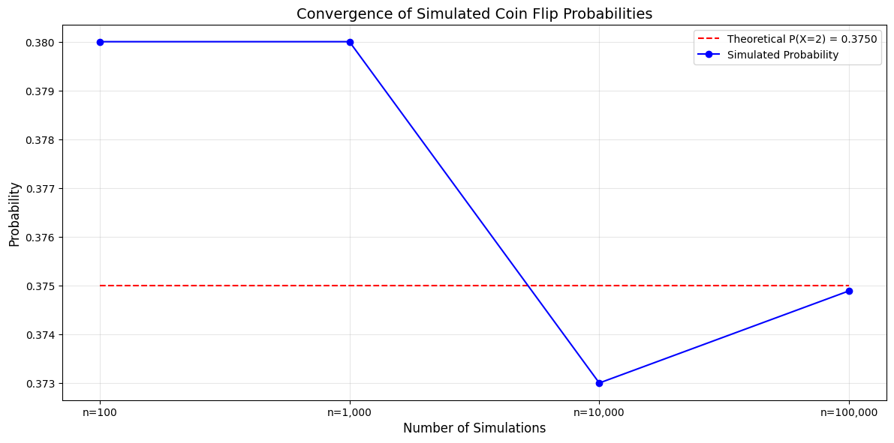

# Discrete Probability Examples

This document provides practical examples of discrete probability for various scenarios, illustrating the concept of probability mass functions and their significance in machine learning and data analysis contexts.

## Key Concepts and Formulas

Discrete probability deals with random variables that can take on a countable number of distinct values. For a discrete random variable X, we define a probability mass function (PMF) that assigns probabilities to each possible value.

### Key Discrete Probability Formulas

$$P(X = x) \geq 0 \text{ for all } x$$

$$\sum_{x \in \mathcal{X}} P(X = x) = 1$$

Where:
- $P(X = x)$ = Probability that random variable X takes value x
- $\mathcal{X}$ = Sample space (set of all possible values of X)

## Examples

The following examples demonstrate discrete probability:

- **Coin Flipping**: Bernoulli trials and probability of heads/tails
- **Dice Rolling**: Finding probabilities with fair and loaded dice
- **Card Problems**: Calculating probabilities of drawing specific cards
- **Discrete Random Variables**: Working with PMFs and expected values

### Example 1: Fair Coin Flipping

#### Problem Statement
Consider flipping a fair coin 3 times. What is the probability of getting exactly 2 heads?

In this example:
- We have a fair coin (probability of heads = 0.5)
- We flip the coin 3 times independently
- We want to find P(exactly 2 heads)

#### Solution

We'll use the binomial probability formula since we have independent and identical Bernoulli trials.

##### Step 1: Identify the relevant probability model
This is a binomial probability problem with n=3 trials and probability of success p=0.5.

##### Step 2: Apply the binomial formula
The binomial formula for k successes in n trials with probability p is:

$$P(X = k) = \binom{n}{k} p^k (1-p)^{n-k}$$

For our problem:
$$P(X = 2) = \binom{3}{2} (0.5)^2 (1-0.5)^{3-2}$$

##### Step 3: Calculate the result
First, calculate the binomial coefficient:
$$\binom{3}{2} = \frac{3!}{2!(3-2)!} = \frac{3 \times 2 \times 1}{2 \times 1 \times 1} = 3$$

Then, substitute into the formula:
$$P(X = 2) = 3 \times (0.5)^2 \times (0.5)^1 = 3 \times 0.25 \times 0.5 = 0.375$$

Therefore, the probability of getting exactly 2 heads when flipping a fair coin 3 times is 0.375 or 37.5%.


To validate our theoretical calculation, we can simulate this experiment many times and observe how the empirical probability converges to our calculated probability:



### Example 2: Rolling Dice

#### Problem Statement
You roll two fair six-sided dice. What is the probability that the sum of the dice equals 7?

#### Solution

##### Step 1: Identify the sample space
When rolling two dice, each die can show a value from 1 to 6. The total number of possible outcomes is 6 × 6 = 36, and each outcome is equally likely with probability 1/36.

##### Step 2: Count favorable outcomes
We need to count how many ways we can get a sum of 7:
- (1,6): First die shows 1, second die shows 6
- (2,5): First die shows 2, second die shows 5
- (3,4): First die shows 3, second die shows 4
- (4,3): First die shows 4, second die shows 3
- (5,2): First die shows 5, second die shows 2
- (6,1): First die shows 6, second die shows 1

There are 6 favorable outcomes.

##### Step 3: Calculate the probability
The probability is the number of favorable outcomes divided by the total number of possible outcomes:

$$P(\text{sum} = 7) = \frac{6}{36} = \frac{1}{6} \approx 0.167$$

Therefore, the probability of rolling a sum of 7 with two fair dice is 1/6 or approximately 16.7%.


We can verify this theoretical probability through simulation, observing how the empirical probability converges as we increase the number of trials:


### Example 3: Drawing Cards

#### Problem Statement
A standard deck has 52 cards with 4 suits (hearts, diamonds, clubs, spades), each with 13 cards (Ace, 2-10, Jack, Queen, King). If you draw 5 cards randomly without replacement, what is the probability of getting exactly 2 hearts?

#### Solution

##### Step 1: Identify the total number of possible 5-card hands
The total number of ways to draw 5 cards from a 52-card deck is:

$$\binom{52}{5} = \frac{52!}{5!(52-5)!} = \frac{52!}{5!47!} = 2,598,960$$

##### Step 2: Count the number of favorable outcomes
To get exactly 2 hearts:
- We need to choose 2 cards from the 13 hearts: $\binom{13}{2} = 78$ ways
- We need to choose 3 cards from the 39 non-hearts: $\binom{39}{3} = 9,139$ ways

The total number of favorable outcomes is the product:
$$\binom{13}{2} \times \binom{39}{3} = 78 \times 9,139 = 712,842$$

##### Step 3: Calculate the probability
The probability is:

$$P(\text{exactly 2 hearts}) = \frac{\binom{13}{2} \times \binom{39}{3}}{\binom{52}{5}}$$

$$= \frac{78 \times 9,139}{2,598,960} \approx 0.2743$$

Therefore, the probability of drawing exactly 2 hearts when drawing 5 cards from a standard deck is approximately 0.2743 or 27.43%.


To validate this theoretical calculation, we can simulate many random card draws and compare the empirical probability with our calculated probability:


## Key Insights

### Theoretical Insights
- Discrete probability problems often involve counting techniques like combinations and permutations
- The binomial distribution is useful for modeling independent trials with two outcomes
- The hypergeometric distribution applies to sampling without replacement scenarios

### Practical Applications
- Binary classification in machine learning uses discrete probability concepts
- Discrete probability underlies many sampling techniques used in data science
- Error rate calculation in ML algorithms relies on discrete probability principles

### Common Pitfalls
- Forgetting to account for the order of events when it matters
- Assuming independence when events are dependent
- Applying the wrong probability distribution to a problem

## Running the Examples

You can run the code that generates the probability examples and visualizations using:

```bash
python3 ML_Obsidian_Vault/Lectures/2/Codes/1_discrete_probability_examples.py
python3 ML_Obsidian_Vault/Lectures/2/Codes/1_discrete_probability_simulations.py
```

## Related Topics

- [[L2_1_Basic_Probability|Basic Probability]]: Foundation concepts for discrete probability
- [[L2_1_Bernoulli_Binomial|Bernoulli and Binomial Distributions]]: Special cases of discrete distributions
- [[L2_1_Combinatorial_Probability_Examples|Combinatorial Probability Examples]]: More examples using counting techniques 