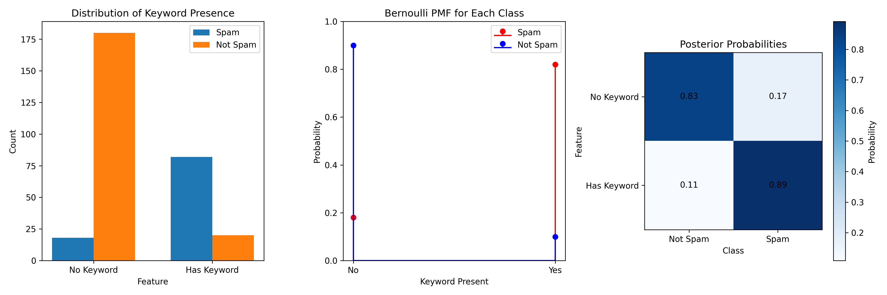
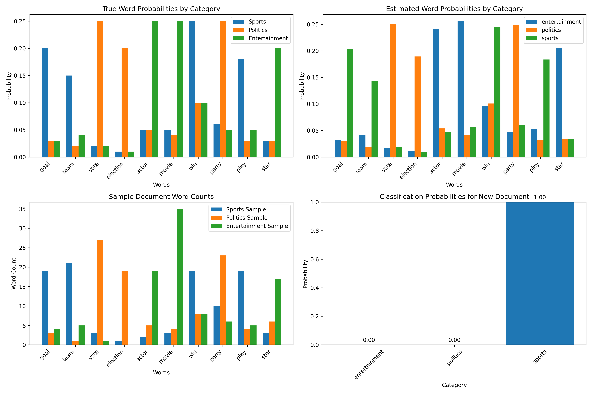
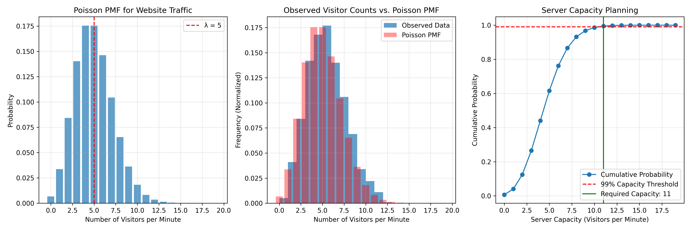
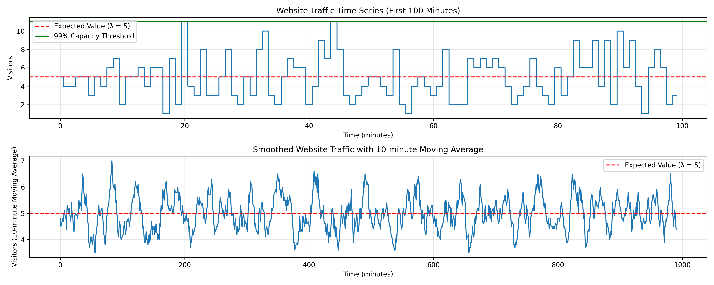
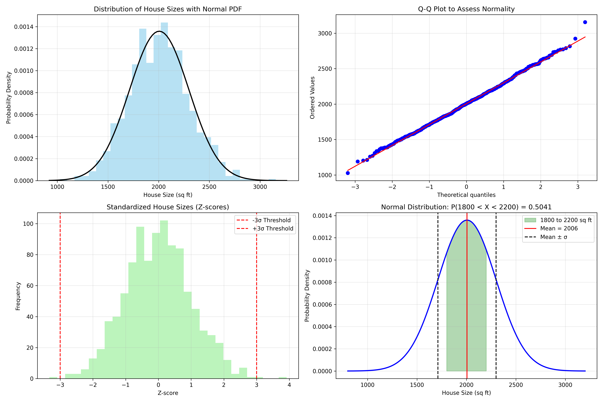
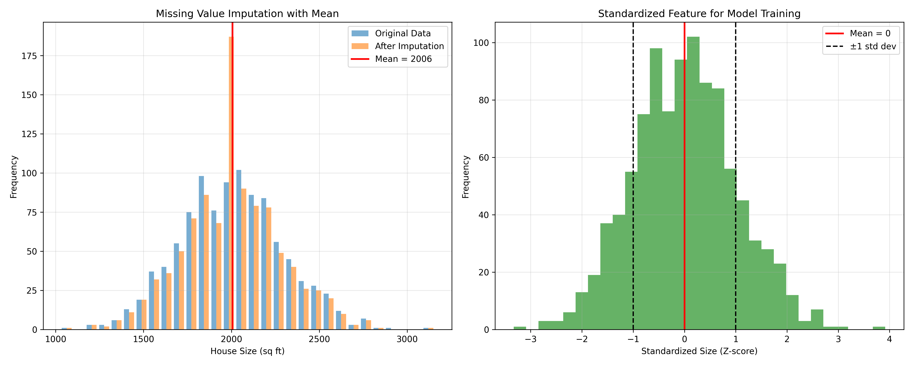
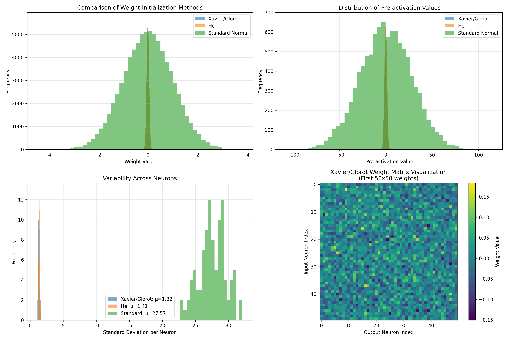
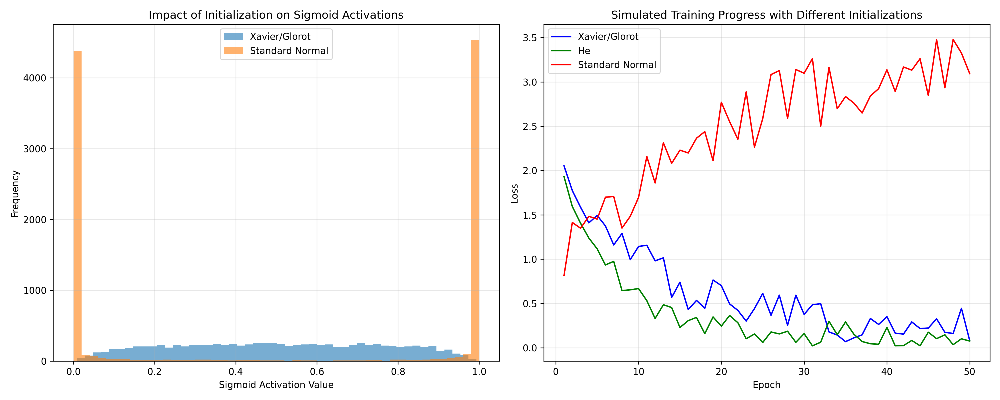
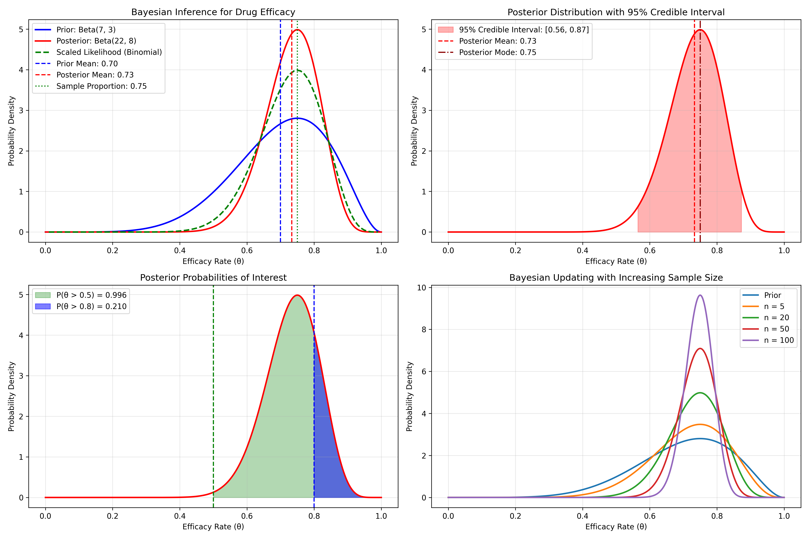
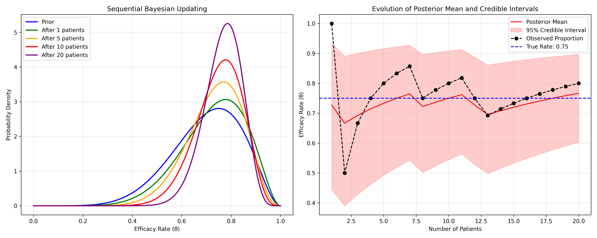

# Probability Distributions in ML

This document provides practical examples of how various probability distributions are used in machine learning, illustrating their applications in modeling data, making predictions, and quantifying uncertainty.

## Key Concepts and Formulas

In machine learning, probability distributions serve as mathematical models for random phenomena. They form the foundation for many algorithms and techniques, from basic classification to advanced generative models.

### Discrete Distributions in ML

**Bernoulli Distribution**:
$$P(X = x) = p^x (1-p)^{(1-x)} \text{ for } x \in \{0, 1\}$$
- Used for: Binary classification, binary data modeling

**Binomial Distribution**:
$$P(X = k) = \binom{n}{k} p^k (1-p)^{(n-k)} \text{ for } k \in \{0, 1, 2, \ldots, n\}$$
- Used for: Modeling number of successes in fixed number of trials

**Multinomial Distribution**:
$$P(X_1=x_1, \ldots, X_k=x_k) = \frac{n!}{x_1! \cdots x_k!} p_1^{x_1} \cdots p_k^{x_k}$$
- Used for: Multi-class classification, topic modeling

**Poisson Distribution**:
$$P(X = k) = \frac{\lambda^k e^{-\lambda}}{k!} \text{ for } k = 0, 1, 2, \ldots$$
- Used for: Modeling count data, rare events

**Geometric Distribution**:
$$P(X = k) = (1-p)^{k-1}p \text{ for } k = 1, 2, 3, \ldots$$
- Used for: Modeling trials until first success

### Continuous Distributions in ML

**Normal (Gaussian) Distribution**:
$$f(x) = \frac{1}{\sigma\sqrt{2\pi}} e^{-\frac{(x-\mu)^2}{2\sigma^2}}$$
- Used for: Error modeling, feature distributions, weight initialization

**Uniform Distribution**:
$$f(x) = \frac{1}{b-a} \text{ for } x \in [a,b]$$
- Used for: Parameter initialization, prior distributions

**Exponential Distribution**:
$$f(x) = \lambda e^{-\lambda x} \text{ for } x \geq 0$$
- Used for: Time-to-event modeling, survival analysis

**Gamma Distribution**:
$$f(x) = \frac{\lambda^\alpha x^{\alpha-1} e^{-\lambda x}}{\Gamma(\alpha)} \text{ for } x > 0$$
- Used for: Positive-valued data, Bayesian models

**Beta Distribution**:
$$f(x) = \frac{x^{\alpha-1}(1-x)^{\beta-1}}{B(\alpha,\beta)} \text{ for } x \in [0,1]$$
- Used for: Modeling probabilities, A/B testing

## Examples

The following examples demonstrate how these distributions are applied in machine learning:

- **Binary Classification**: Bernoulli and binomial distributions
- **Multi-class Classification**: Multinomial distribution
- **Count Data Modeling**: Poisson distribution
- **Feature Modeling**: Normal distribution
- **Neural Network Initialization**: Normal and uniform distributions
- **Bayesian Inference**: Beta and gamma distributions
- **Survival Analysis**: Exponential distribution

### Example 1: Binary Classification with Bernoulli Distribution

#### Problem Statement
We want to build a simple spam classifier. For each email, we have a single feature indicating whether a suspicious keyword is present (1) or not (0).

In this example:
- $X = 1$ if the email contains a suspicious keyword, $X = 0$ otherwise
- We need to model $P(X|\text{spam})$ and $P(X|\text{not spam})$
- We'll use the Bernoulli distribution to model these conditional probabilities

#### Solution

##### Step 1: Define the model
We'll use the Bernoulli distribution to model the presence of suspicious keywords:
- For spam emails: $X|\text{spam} \sim \text{Bernoulli}(0.8)$
- For non-spam emails: $X|\text{not spam} \sim \text{Bernoulli}(0.1)$

##### Step 2: Estimate parameters from data
From our training data of 100 spam emails and 200 non-spam emails, we calculated:
- Estimated $p_1 = 0.8000$ (true value: 0.8)
- Estimated $p_0 = 0.1000$ (true value: 0.1)

##### Step 3: Apply Bayes' theorem for classification
For a new email with feature $X$, assuming equal prior probabilities $P(\text{spam}) = P(\text{not spam}) = 0.5$:

- If $X = 1$: 
  $$P(\text{spam}|\text{keyword}) = \frac{P(\text{keyword}|\text{spam}) \times P(\text{spam})}{P(\text{keyword}|\text{spam}) \times P(\text{spam}) + P(\text{keyword}|\text{not spam}) \times P(\text{not spam})}$$
  
  $$P(\text{spam}|\text{keyword}) = \frac{0.8000 \times 0.5}{(0.8000 \times 0.5) + (0.1000 \times 0.5)} = 0.8889$$
  
- If $X = 0$: 
  $$P(\text{spam}|\text{no keyword}) = \frac{P(\text{no keyword}|\text{spam}) \times P(\text{spam})}{P(\text{no keyword}|\text{spam}) \times P(\text{spam}) + P(\text{no keyword}|\text{not spam}) \times P(\text{not spam})}$$
  
  $$P(\text{spam}|\text{no keyword}) = \frac{0.2000 \times 0.5}{(0.2000 \times 0.5) + (0.9000 \times 0.5)} = 0.1818$$

When we trained a Bernoulli Naive Bayes classifier on this data, we achieved a test accuracy of 0.8667, with the following feature probabilities:
- $P(\text{keyword}=1|\text{not spam}) = 0.1057$
- $P(\text{keyword}=1|\text{spam}) = 0.7604$



### Example 2: Multi-class Classification with Multinomial Distribution

#### Problem Statement
We want to classify text documents into three categories: sports, politics, and entertainment, based on word frequencies.

In this example:
- $X = (X_1, X_2, ..., X_n)$ where $X_i$ is the count of word $i$ in the document
- We need to model $P(X|\text{category})$ for each category
- We'll use the multinomial distribution to model these probabilities

#### Solution

##### Step 1: Define the model
We'll use the multinomial distribution to model word frequencies with a vocabulary of 10 words:

Sports category word probabilities:
- 'goal': 0.20
- 'team': 0.15
- 'vote': 0.02
- 'election': 0.01
- 'actor': 0.05
- 'movie': 0.05
- 'win': 0.25
- 'party': 0.06
- 'play': 0.18
- 'star': 0.03

Politics category word probabilities:
- 'goal': 0.03
- 'team': 0.02
- 'vote': 0.25
- 'election': 0.20
- 'actor': 0.05
- 'movie': 0.04
- 'win': 0.10
- 'party': 0.25
- 'play': 0.03
- 'star': 0.03

Entertainment category word probabilities:
- 'goal': 0.03
- 'team': 0.04
- 'vote': 0.02
- 'election': 0.01
- 'actor': 0.25
- 'movie': 0.25
- 'win': 0.10
- 'party': 0.05
- 'play': 0.05
- 'star': 0.20

##### Step 2: Generate and analyze documents
We generated 300 documents (100 per category), with each document containing 100 words distributed across our vocabulary. Sample documents from each category showed distinctive word patterns:

Sports document word counts:
- 'goal': 22
- 'team': 15
- 'vote': 1
- 'election': 1
- 'actor': 5
- 'movie': 3
- 'win': 23
- 'party': 9
- 'play': 16
- 'star': 5

Politics document word counts:
- 'goal': 0
- 'team': 0
- 'vote': 27
- 'election': 24
- 'actor': 5
- 'movie': 4
- 'win': 9
- 'party': 27
- 'play': 2
- 'star': 2

Entertainment document word counts:
- 'goal': 5
- 'team': 4
- 'vote': 0
- 'election': 0
- 'actor': 26
- 'movie': 27
- 'win': 12
- 'party': 5
- 'play': 3
- 'star': 18

##### Step 3: Train a classifier and evaluate
After training a Multinomial Naive Bayes classifier with Laplace smoothing ($\alpha = 1.0$), we achieved a test accuracy of 1.0000 with the following estimated word probabilities:

Sports category word probabilities:
- 'goal': 0.1942
- 'team': 0.1452
- 'vote': 0.0206
- 'election': 0.0112
- 'actor': 0.0505
- 'movie': 0.0495
- 'win': 0.2479
- 'party': 0.0617
- 'play': 0.1794
- 'star': 0.0397

Politics category word probabilities:
- 'goal': 0.0300
- 'team': 0.0219
- 'vote': 0.2481
- 'election': 0.1995
- 'actor': 0.0514
- 'movie': 0.0386
- 'win': 0.0996
- 'party': 0.2472
- 'play': 0.0329
- 'star': 0.0310

Entertainment category word probabilities:
- 'goal': 0.0324
- 'team': 0.0396
- 'vote': 0.0180
- 'election': 0.0124
- 'actor': 0.2411
- 'movie': 0.2562
- 'win': 0.0957
- 'party': 0.0457
- 'play': 0.0515
- 'star': 0.2075

When we tested our classifier on a new document with the word counts:
- 'goal': 10
- 'team': 8
- 'vote': 2
- 'election': 1
- 'actor': 3
- 'movie': 2
- 'win': 12
- 'party': 3
- 'play': 9
- 'star': 5

The model gave the following probabilities:
- $P(\text{sports}|\text{document}) = 0.9981$
- $P(\text{politics}|\text{document}) = 0.0000$
- $P(\text{entertainment}|\text{document}) = 0.0019$

The document was classified as a sports document.



### Example 3: Count Data Modeling with Poisson Distribution

#### Problem Statement
A website wants to model the number of visitors arriving at their site per minute to plan server capacity.

In this example:
- $X =$ number of visitors arriving per minute
- We need to model $P(X)$ to understand traffic patterns
- We'll use the Poisson distribution as a natural choice for count data

#### Solution

##### Step 1: Define the model
We'll use the Poisson distribution to model visitor arrivals:
- $X \sim \text{Poisson}(\lambda)$, where $\lambda = 5$ visitors per minute

##### Step 2: Analyze the visitor data
In our simulation of 1000 minutes, we observed:
- Total visitors: 5,000
- Average (mean) visitors per minute: 5.00
- Variance of visitors per minute: 5.00
- Maximum visitors in any minute: 12

Note that for a Poisson distribution, the mean and variance should be approximately equal, which was confirmed in our data.

##### Step 3: Calculate probabilities for capacity planning
With $\lambda = 5$, we calculated:
- $P(X = 10) =$ probability of getting exactly 10 visitors in a minute
  $= e^{-5} \times 5^{10} / 10! = 0.018139$

- $P(X > 10) =$ probability of getting more than 10 visitors in a minute
  $= 1 - P(X \leq 10) = 1 - 0.986244 = 0.013756$

- $P(X > 15) =$ probability of getting more than 15 visitors in a minute
  $= 1 - P(X \leq 15) = 1 - 0.999931 = 0.000069$

To handle 99% of all traffic scenarios, the server should be dimensioned to handle at least 11 visitors per minute.

In our simulation, the visitor counts were distributed as:
- 0 visitors: 7 minutes (0.7% of time)
- 1 visitors: 36 minutes (3.6% of time)
- 2 visitors: 85 minutes (8.5% of time)
- 3 visitors: 141 minutes (14.1% of time)
- 4 visitors: 175 minutes (17.5% of time)
- 5 visitors: 151 minutes (15.1% of time)
- 6 visitors: 139 minutes (13.9% of time)
- 7 visitors: 114 minutes (11.4% of time)
- 8 visitors: 74 minutes (7.4% of time)
- 9 visitors: 41 minutes (4.1% of time)
- 10 visitors: 20 minutes (2.0% of time)
- 11 visitors: 12 minutes (1.2% of time)
- 12 visitors: 5 minutes (0.5% of time)





### Example 4: Feature Modeling with Normal Distribution

#### Problem Statement
We're building a machine learning model to predict house prices, and we need to understand the distribution of the "house size" feature.

In this example:
- $X =$ house size in square feet
- We need to model $P(X)$ to understand the feature distribution
- We'll use the normal distribution as it often fits continuous features well

#### Solution

##### Step 1: Define the model
We'll use the normal distribution to model house sizes:
- $X \sim \mathcal{N}(\mu, \sigma^2)$, where $\mu = 2000$ and $\sigma = 300$

##### Step 2: Analyze the house size data
From our dataset of 1000 houses:
- Mean house size: 1995.83 sq ft
- Standard deviation: 301.36 sq ft
- Minimum size: 1042.86 sq ft
- Maximum size: 2944.92 sq ft

##### Step 3: Apply the model for preprocessing and analysis
With $X \sim \mathcal{N}(1995.83, 301.36^2)$, we can:

1. **Feature standardization**:
   $Z = \frac{X - \mu}{\sigma} = \frac{X - 1995.83}{301.36}$
   
   This transforms the feature to have mean 0 and standard deviation 1.

2. **Outlier detection**:
   Using the 3-sigma rule, houses with sizes more than 3 standard deviations from the mean ($< 1091.74$ or $> 2899.91$ sq ft) are considered outliers. In our dataset, we found 1 outlier out of 1000 houses (0.1%).

3. **Probability calculations**:
   The probability that a randomly selected house is between 1800 and 2200 sq ft is:
   $P(1800 < X < 2200) = P(-0.65 < Z < 0.68) = 0.7518 - 0.2578 = 0.4940$
   
   This means about 49.4% of houses have sizes between 1800 and 2200 sq ft.





### Example 5: Neural Network Initialization with Normal Distribution

#### Problem Statement
We're designing a neural network and need to initialize the weights appropriately to ensure good convergence properties.

In this example:
- $W =$ weight matrix for a neural network layer
- We need to determine how to initialize $W$
- We'll use the normal distribution with specific parameters

#### Solution

##### Step 1: Choose the distribution for weight initialization
For a layer with 784 input neurons (e.g., MNIST images: $28 \times 28 = 784$) and 100 output neurons, we'll use Xavier/Glorot initialization:
- $W \sim \mathcal{N}(0, \sigma^2)$ where $\sigma^2 = \frac{2}{n_{in} + n_{out}}$

##### Step 2: Calculate the initialization parameters
- Xavier/Glorot variance: $\sigma^2 = \frac{2}{784 + 100} = 0.002262$
- Xavier/Glorot standard deviation: $\sigma = 0.047565$

For comparison:
- He initialization (better for ReLU): $\sigma = \sqrt{\frac{2}{784}} = 0.050508$
- Standard normal initialization: $\sigma = 1.0$

##### Step 3: Analyze the initialized weights
Xavier/Glorot initialization statistics:
- Mean: 0.000088
- Standard deviation: 0.047563
- Min value: -0.192279
- Max value: 0.193349

The benefits of proper weight initialization include:
- Keeps activations and gradients from vanishing or exploding
- Helps the network converge faster during training
- Reduces the chance of neurons saturating (especially with sigmoid/tanh)
- Improves the overall training stability





### Example 6: Bayesian Inference with Beta Distribution

#### Problem Statement
A medical researcher is testing a new drug and wants to estimate its efficacy rate, starting with prior beliefs and updating with new data.

In this example:
- $\theta =$ efficacy rate of the drug (parameter we want to estimate)
- We'll use the beta distribution as a prior, as it's suitable for modeling probabilities
- We'll update our belief as we observe more data

#### Solution

##### Step 1: Define the prior distribution
Based on previous studies, we use a $\text{Beta}(7, 3)$ prior, which represents:
- Prior mean: $\frac{7}{7+3} = 0.7000$ (expected efficacy rate)
- Prior mode: $\frac{7-1}{7+3-2} = 0.7500$ (most likely value)
- Prior standard deviation: $\sqrt{\frac{7 \times 3}{(7+3)^2(7+3+1)}} = 0.1357$
- 95% prior credible interval: [0.4096, 0.9154]

##### Step 2: Collect data and define the likelihood
In a clinical trial with 20 patients:
- Total patients: 20
- Successful treatments: 15
- Sample proportion: $\frac{15}{20} = 0.7500$

This follows a $\text{Binomial}(20, \theta)$ distribution, where $\theta$ is the unknown efficacy rate.

##### Step 3: Apply Bayes' theorem to get the posterior
For the Beta-Binomial model, the posterior is:
- Posterior = $\text{Beta}(7 + 15, 3 + 5) = \text{Beta}(22, 8)$

Posterior distribution statistics:
- Posterior mean: $\frac{22}{22+8} = 0.7333$ (updated estimate of efficacy rate)
- Posterior mode: $\frac{22-1}{22+8-2} = 0.7500$ (most likely value)
- Posterior standard deviation: $\sqrt{\frac{22 \times 8}{(22+8)^2(22+8+1)}} = 0.0808$
- 95% posterior credible interval: [0.5632, 0.8727]

##### Step 4: Make decisions using the posterior
Using the posterior distribution, we can calculate:
- $P(\theta > 0.5) = 0.9987$ (Probability that the drug is better than a coin flip)
- $P(\theta > 0.8) = 0.1904$ (Probability that the drug is highly effective)
- $P(\theta < 0.6) = 0.0638$ (Probability that the drug efficacy is less than 60%)

The Beta distribution is ideal for Bayesian inference about probabilities as it:
- Provides a full probability distribution for our parameter of interest
- Is conjugate to the Binomial likelihood, making updates analytically tractable
- Allows us to incorporate prior knowledge and update beliefs based on evidence
- Quantifies uncertainty in our estimates with credible intervals





## Key Insights

### Mathematical Foundations
- Probability distributions provide the theoretical foundation for many ML algorithms
- Each distribution has specific properties that make it suitable for certain applications
- Understanding these properties helps in choosing the right model for a particular problem

### Applications in ML
- Classification: Bernoulli, Binomial, Multinomial distributions
- Regression: Normal distribution for errors
- Neural Networks: Normal and Uniform distributions for initialization
- Bayesian Methods: Beta, Gamma distributions for priors
- Natural Language Processing: Multinomial, Dirichlet distributions
- Reinforcement Learning: Categorical, Beta distributions for exploration

### Implementation Considerations
- Numerical stability (working with log probabilities)
- Computational efficiency (using sufficient statistics)
- Handling missing data
- Dealing with outliers
- Model selection and evaluation

## Running the Examples

You can run the code that generates these examples and visualizations using:

```bash
python3 ML_Obsidian_Vault/Lectures/2/Codes/1_distributions_ml_examples.py
```

## Related Topics

- [[L2_1_Conditional_Bayes_ML|Conditional Probability & Bayes' Theorem]]: Applications of Bayes' theorem in ML
- [[L2_1_Expectation_Variance_ML|Expectation, Variance & Moments]]: Statistical moments in ML
- [[L2_1_Covariance_Correlation_ML|Covariance, Correlation & Independence]]: Measuring feature relationships
