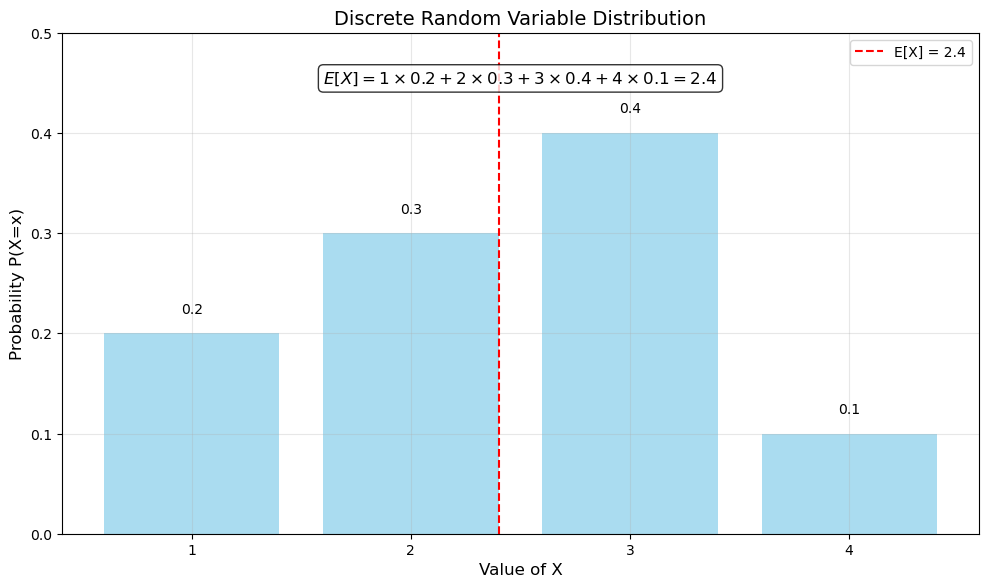
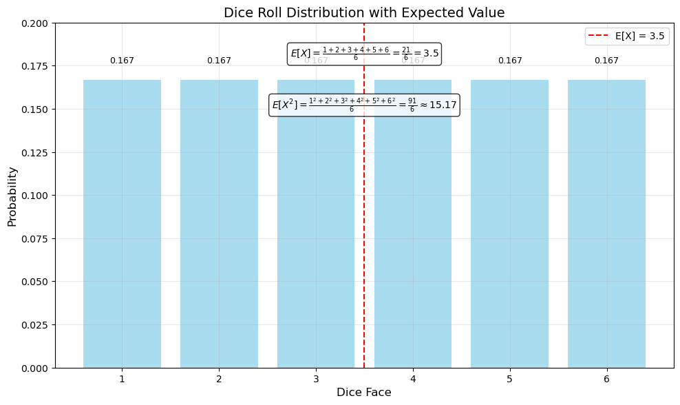
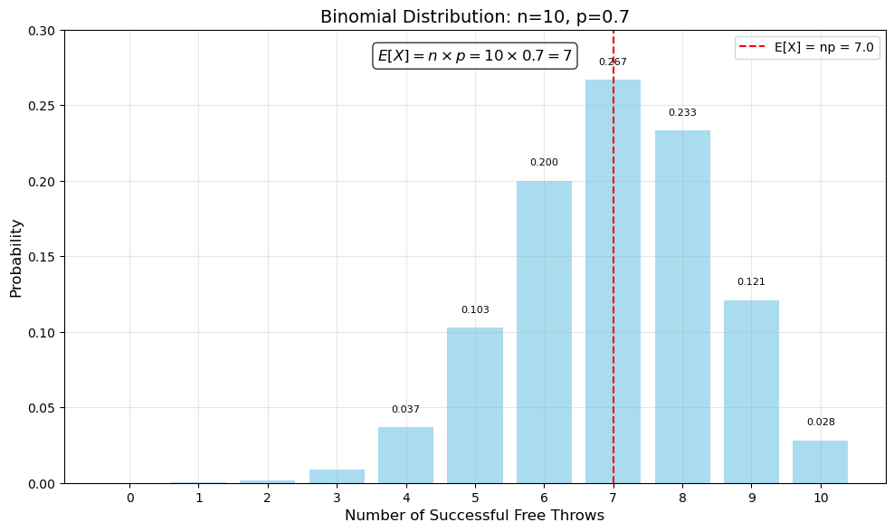
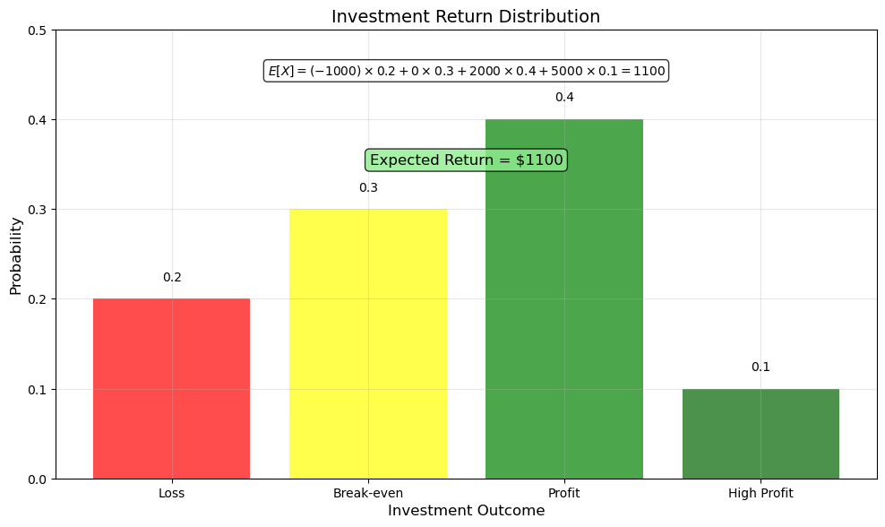
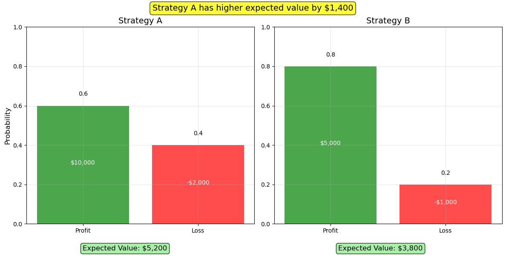
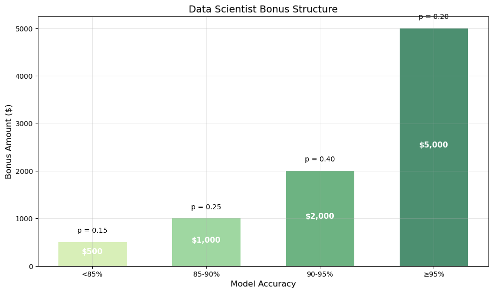

# Expectation Examples

This document provides practical examples of expectation (expected value) calculations for various probability distributions and scenarios, demonstrating how to compute and interpret expected values in practice.

## Discrete Distribution Examples

### Example 1: Discrete Random Variable

#### Problem Statement
A discrete random variable $X$ has the following probability mass function:

| $x$ | $P(X=x)$ |
|-----|----------|
| 1   | 0.2      |
| 2   | 0.3      |
| 3   | 0.4      |
| 4   | 0.1      |

Calculate the expected value of $X$.

#### Solution
Using the definition of expectation for a discrete random variable:

$$E[X] = \sum_x x \cdot P(X=x)$$

Substituting the values:

$$E[X] = 1 \times 0.2 + 2 \times 0.3 + 3 \times 0.4 + 4 \times 0.1 = 0.2 + 0.6 + 1.2 + 0.4 = 2.4$$

Therefore, the expected value of $X$ is 2.4.



### Example 2: Dice Roll Expected Value

#### Problem Statement
Consider rolling a fair six-sided die. Calculate:
1. The expected value of the number shown
2. The expected value of the square of the number shown

#### Solution

**Part 1: Expected value of the number shown**

For a fair die, each face has probability $\frac{1}{6} \approx 0.167$:

$$E[X] = 1 \times \frac{1}{6} + 2 \times \frac{1}{6} + 3 \times \frac{1}{6} + 4 \times \frac{1}{6} + 5 \times \frac{1}{6} + 6 \times \frac{1}{6} = \frac{21}{6} = 3.5$$

**Part 2: Expected value of the square of the number shown**

Using the law of the unconscious statistician:

$$E[X^2] = 1^2 \times \frac{1}{6} + 2^2 \times \frac{1}{6} + 3^2 \times \frac{1}{6} + 4^2 \times \frac{1}{6} + 5^2 \times \frac{1}{6} + 6^2 \times \frac{1}{6}$$
$$E[X^2] = \frac{1 + 4 + 9 + 16 + 25 + 36}{6} = \frac{91}{6} \approx 15.167$$

Therefore, the expected value of $X$ is 3.5, and the expected value of $X^2$ is approximately 15.167.



### Example 3: Binomial Random Variable

#### Problem Statement
A basketball player has a 70% free throw success rate. If she attempts 10 free throws, what is the expected number of successful shots?

#### Solution
This follows a Binomial distribution with $n = 10$ and $p = 0.7$.

For a binomial distribution, the expected value is:

$$E[X] = n \cdot p = 10 \times 0.7 = 7$$

Therefore, the player is expected to make 7 successful free throws out of 10 attempts.

The probability mass function values show that getting exactly 7 successful shots has the highest probability (about 0.2668 or 26.68%).



The plot shows the full probability distribution for the number of successful shots, with the red dashed line indicating the expected value. The probability peaks at 7 successful shots, confirming our calculated expectation.

## Continuous Distribution Examples

### Example 1: Expected Value of a Continuous Uniform Distribution

#### Problem Statement
Suppose $X$ follows a continuous uniform distribution over the interval $[3, 9]$. Calculate the expected value of $X$.

#### Solution
For a continuous uniform distribution over $[a, b]$, the expected value is:

$$E[X] = \frac{a + b}{2}$$

Substituting $a = 3$ and $b = 9$:

$$E[X] = \frac{3 + 9}{2} = \frac{12}{2} = 6$$

Therefore, the expected value of $X$ is 6.

### Example 2: Expected Value of an Exponential Distribution

#### Problem Statement
The time between customer arrivals at a store follows an exponential distribution with rate parameter $\lambda = 0.5$ customers per minute. What is the expected time between customer arrivals?

#### Solution
For an exponential distribution with rate parameter $\lambda$, the expected value is:

$$E[X] = \frac{1}{\lambda}$$

Substituting $\lambda = 0.5$:

$$E[X] = \frac{1}{0.5} = 2$$

Therefore, the expected time between customer arrivals is 2 minutes.

### Example 3: Expected Value of a Normal Distribution

#### Problem Statement
Adult male heights in a certain population follow a normal distribution with mean $\mu = 175$ cm and standard deviation $\sigma = 7$ cm. What is the expected height of an adult male from this population?

#### Solution
For a normal distribution, the expected value is equal to the mean:

$$E[X] = \mu = 175$$

Therefore, the expected height of an adult male from this population is 175 cm.

## Application Examples

### Example 1: Expected Return on Investment

#### Problem Statement
An investor is considering a project with the following possible returns and associated probabilities:

| Return | Probability |
|--------|-------------|
| -$1,000 (loss) | 0.2 |
| $0 (break-even) | 0.3 |
| $2,000 (profit) | 0.4 |
| $5,000 (high profit) | 0.1 |

Calculate the expected return on this investment.

#### Solution
Using the definition of expectation:

$$E[X] = \sum_x x \cdot P(X=x)$$

Substituting the values:

$$E[X] = (-1000) \times 0.2 + 0 \times 0.3 + 2000 \times 0.4 + 5000 \times 0.1$$
$$E[X] = -200 + 0 + 800 + 500 = 1100$$

Therefore, the expected return on this investment is $1,100.



The visualization shows the probability of each outcome, along with the calculation of the expected value. The expected return of $1,100 is positive, suggesting that despite the risk of loss, this investment has a positive expected outcome.

### Example 2: Expected Number of Trials Until Success

#### Problem Statement
A manufacturing process has a 20% defect rate. Quality control inspects items one by one until a non-defective item is found. What is the expected number of items that need to be inspected?

#### Solution
This follows a geometric distribution with probability of success $p = 0.8$ (probability of finding a non-defective item).

For a geometric distribution, the expected value is:

$$E[X] = \frac{1}{p} = \frac{1}{0.8} = 1.25$$

Therefore, on average, 1.25 items need to be inspected before finding a non-defective item.

### Example 3: Expected Value in Decision Making

#### Problem Statement
A company is deciding between two marketing strategies:
- Strategy A: 60% chance of $10,000 profit, 40% chance of $2,000 loss
- Strategy B: 80% chance of $5,000 profit, 20% chance of $1,000 loss

Which strategy has the higher expected profit?

#### Solution
Expected profit for Strategy A:
$$E[A] = 10000 \times 0.6 + (-2000) \times 0.4 = 6000 - 800 = 5200$$

Expected profit for Strategy B:
$$E[B] = 5000 \times 0.8 + (-1000) \times 0.2 = 4000 - 200 = 3800$$

Therefore, Strategy A has the higher expected profit of $5,200 compared to Strategy B's $3,800, which is a difference of $1,400.



The visualization compares both strategies side by side. Despite Strategy B having a higher probability of profit (80% vs. 60%), Strategy A has a higher expected value because of the larger potential profit. This demonstrates how expected value helps in quantitative decision-making.

## Quiz Example

### Problem Statement
A data scientist receives bonus payments based on model performance. The bonus structure is as follows:
- $500 if the model accuracy is below 85%
- $1,000 if the model accuracy is between 85% and 90%
- $2,000 if the model accuracy is between 90% and 95%
- $5,000 if the model accuracy is 95% or higher

Based on historical performance, the probabilities of achieving these accuracy levels are:
- Below 85%: 0.15
- Between 85% and 90%: 0.25
- Between 90% and 95%: 0.40
- 95% or higher: 0.20

What is the expected bonus payment?

#### Solution

**Step 1: Define the random variable and its probability distribution**
Let $X$ be the bonus payment:
- $X = 500$ with probability 0.15
- $X = 1000$ with probability 0.25
- $X = 2000$ with probability 0.40
- $X = 5000$ with probability 0.20

**Step 2: Apply the expectation formula**
$$E[X] = \sum_x x \cdot P(X=x)$$

$$E[X] = 500 \times 0.15 + 1000 \times 0.25 + 2000 \times 0.40 + 5000 \times 0.20$$
$$E[X] = 75 + 250 + 800 + 1000 = 2125$$

Therefore, the expected bonus payment is $2,125.



The visualization shows the bonus structure and the corresponding probabilities, with the calculation of the expected bonus. This example demonstrates how expected value can be useful for financial planning and performance assessment.

## Running the Examples

You can run the code that generates the probability examples and visualizations using:

```bash
python3 ML_Obsidian_Vault/Lectures/2/Codes/1_expectation_examples.py
```

## Related Topics

- [[L2_1_Expectation|Expectation]]: Theoretical foundations of expected values
- [[L2_1_Variance_Examples|Variance_Examples]]: Examples of calculating variance
- [[L2_1_Examples|Probability_Examples]]: Examples of probability calculations 