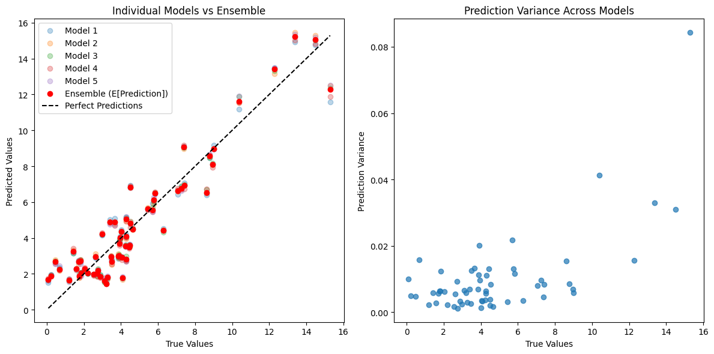
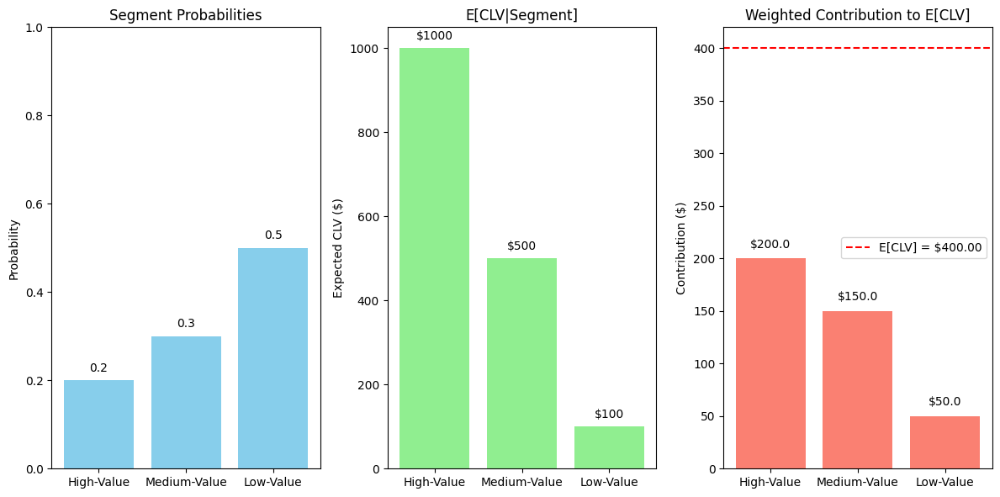
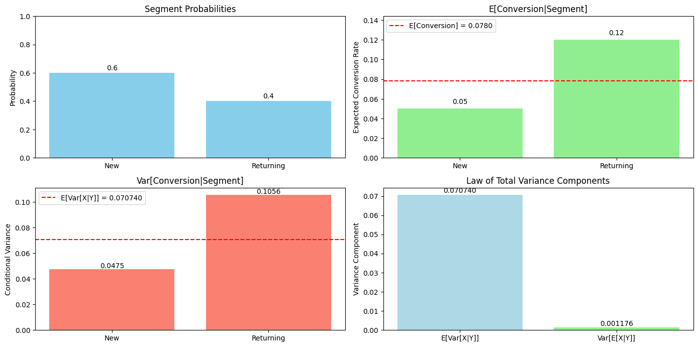
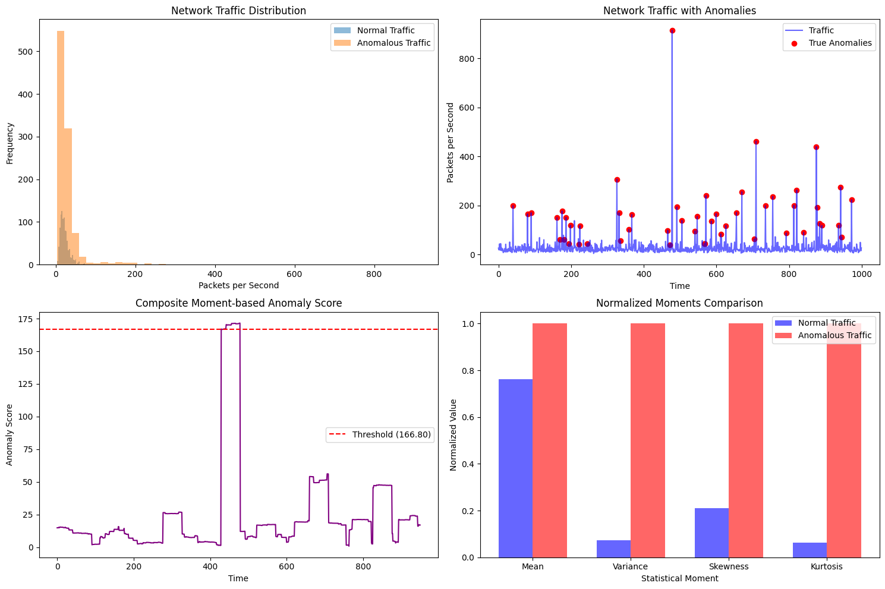

# Expectation, Variance & Moments in ML

This document provides practical examples of expectation, variance, and statistical moments in machine learning contexts, illustrating how these fundamental probability concepts are applied in model evaluation, ensemble methods, and uncertainty quantification.

## Key Concepts and Formulas

Expectation, variance, and higher-order moments provide essential tools for analyzing and characterizing probability distributions in machine learning. These concepts help quantify uncertainty, measure data dispersion, and establish theoretical guarantees for ML algorithms.

### Basic Definitions

$$E[X] = \sum_{x} x \cdot P(X=x) \text{ (discrete case)}$$

$$E[X] = \int_{-\infty}^{\infty} x \cdot f_X(x) \, dx \text{ (continuous case)}$$

$$\text{Var}(X) = E[(X - E[X])^2] = E[X^2] - E[X]^2$$

Where:
- $E[X]$ = Expected value (mean) of random variable X
- $P(X=x)$ = Probability mass function for discrete X
- $f_X(x)$ = Probability density function for continuous X
- $\text{Var}(X)$ = Variance of random variable X

### Law of Total Expectation (Tower Property)

$$E[X] = E[E[X|Y]]$$

In expanded form:

$$E[X] = \sum_{y} E[X|Y=y] \cdot P(Y=y) \text{ (discrete Y)}$$

$$E[X] = \int E[X|Y=y] \cdot f_Y(y) \, dy \text{ (continuous Y)}$$

### Law of Total Variance (Variance Decomposition)

$$\text{Var}(X) = E[\text{Var}(X|Y)] + \text{Var}(E[X|Y])$$

Where:
- $E[X|Y]$ = Conditional expectation of X given Y
- $\text{Var}(X|Y)$ = Conditional variance of X given Y

### Statistical Moments

The $n$-th central moment of a random variable X is defined as:

$$\mu_n = E[(X - E[X])^n]$$

Important moments:
- First moment ($n=1$): Mean (always 0 for central moments)
- Second moment ($n=2$): Variance
- Third moment ($n=3$): Related to skewness (asymmetry)
- Fourth moment ($n=4$): Related to kurtosis (tail behavior)

Standardized moments:

$$\text{Skewness} = \frac{\mu_3}{\sigma^3}$$

$$\text{Kurtosis} = \frac{\mu_4}{\sigma^4} - 3$$

Where:
- $\mu_n$ = $n$-th central moment
- $\sigma$ = Standard deviation

## Examples

The following examples demonstrate expectation, variance, and statistical moments in machine learning:

- **Model Evaluation with Ensembles**: Using expectation to improve prediction accuracy
- **Customer Lifetime Value Analysis**: Applying the Law of Total Expectation
- **A/B Testing with User Segments**: Using the Law of Total Variance
- **Anomaly Detection with Statistical Moments**: Leveraging higher-order moments

### Example 1: Model Evaluation with Ensembles

#### Problem Statement
We want to evaluate a regression model's performance and improve its predictions using ensemble methods. By training multiple models with different random seeds, we can use the concept of expectation to combine their predictions and reduce error.

In this example:
- We have a regression dataset with 2-dimensional features
- We train 10 Random Forest models with different random seeds
- We calculate the expected prediction across all models (ensemble mean)
- We measure the variance in predictions to understand uncertainty

#### Solution

##### Step 1: Train multiple models with different random seeds
We train 10 Random Forest regression models, each with a different random seed, and calculate their Mean Squared Error (MSE) on a test set:

Model 1: MSE = 1.4353
Model 2: MSE = 1.3785
Model 3: MSE = 1.3459
Model 4: MSE = 1.4171
Model 5: MSE = 1.3400
Model 6: MSE = 1.3366
Model 7: MSE = 1.3735
Model 8: MSE = 1.3922
Model 9: MSE = 1.3970
Model 10: MSE = 1.3779

##### Step 2: Calculate the expected prediction and variance
For each test sample, we calculate:
- $E[\text{Prediction}]$: The mean prediction across all models (ensemble prediction)
- $\text{Var}(\text{Prediction})$: The variance of predictions across models (prediction uncertainty)

Example of expectation and variance for the first 5 test samples:

| Test # | True Value | E[Prediction] | Var[Prediction] |
|--------|------------|---------------|-----------------|
| 1      | 2.7088     | 2.0069        | 0.0092          |
| 2      | 1.4115     | 3.2608        | 0.0059          |
| 3      | 1.5984     | 2.2705        | 0.0027          |
| 4      | 3.9448     | 4.0141        | 0.0096          |
| 5      | 7.4287     | 6.9397        | 0.0083          |

The overall performance metrics:
- Average Individual Model MSE: 1.3794
- Ensemble Model MSE: 1.3695
- Improvement: 0.72%

By averaging predictions (taking the expectation), we reduce error due to the bias-variance trade-off. The ensemble's expected prediction typically has lower variance than individual models, leading to better generalization.



### Example 2: Customer Lifetime Value Analysis

#### Problem Statement
A company wants to calculate the expected Customer Lifetime Value (CLV) across different customer segments to optimize marketing strategies. The Law of Total Expectation provides a framework for combining segment-specific expectations into an overall expectation.

In this example:
- Customers are divided into three segments: High-Value, Medium-Value, and Low-Value
- Each segment has a different expected CLV
- We want to calculate the overall expected CLV across all segments

#### Solution

##### Step 1: Define the problem
Given information:
- Customer segments: High-Value, Medium-Value, Low-Value
- $P(\text{High-Value}) = 0.2$
- $P(\text{Medium-Value}) = 0.3$
- $P(\text{Low-Value}) = 0.5$
- $E[\text{CLV}|\text{High-Value}] = \$1000$
- $E[\text{CLV}|\text{Medium-Value}] = \$500$
- $E[\text{CLV}|\text{Low-Value}] = \$100$

##### Step 2: Apply the Law of Total Expectation
The Law of Total Expectation states:

$$E[\text{CLV}] = \sum_{\text{segment}} E[\text{CLV}|\text{Segment}] \times P(\text{Segment})$$

Calculation:
- $E[\text{CLV}|\text{High-Value}] \times P(\text{High-Value}) = \$1000 \times 0.2 = \$200.00$
- $E[\text{CLV}|\text{Medium-Value}] \times P(\text{Medium-Value}) = \$500 \times 0.3 = \$150.00$
- $E[\text{CLV}|\text{Low-Value}] \times P(\text{Low-Value}) = \$100 \times 0.5 = \$50.00$

$E[\text{CLV}] = \$200.00 + \$150.00 + \$50.00 = \$400.00$

The Law of Total Expectation allows us to calculate the overall expected CLV by conditioning on the customer segment. This approach is valuable for strategic planning and resource allocation in marketing.



### Example 3: A/B Testing with User Segments

#### Problem Statement
A product team is conducting an A/B test to measure conversion rates. They want to understand how much the conversion rate varies across different user segments and how this contributes to the overall variance. The Law of Total Variance provides a framework for decomposing variance into within-segment and between-segment components.

In this example:
- Users are divided into two segments: New and Returning
- Each segment has a different conversion rate probability
- We want to decompose the total variance in conversion rates

#### Solution

##### Step 1: Define the problem
Given information:
- User segments: New users, Returning users
- $P(\text{New}) = 0.6$
- $P(\text{Returning}) = 0.4$
- $E[\text{Conversion}|\text{New}] = 0.05$
- $E[\text{Conversion}|\text{Returning}] = 0.12$
- $\text{Var}[\text{Conversion}|\text{New}] = 0.0475$ (variance of Bernoulli with $p=0.05$)
- $\text{Var}[\text{Conversion}|\text{Returning}] = 0.1056$ (variance of Bernoulli with $p=0.12$)

##### Step 2: Calculate the overall expected conversion rate
Using the Law of Total Expectation:

$$E[\text{Conversion}] = E[\text{Conversion}|\text{New}] \times P(\text{New}) + E[\text{Conversion}|\text{Returning}] \times P(\text{Returning})$$

$E[\text{Conversion}] = 0.05 \times 0.6 + 0.12 \times 0.4$
$= 0.0300 + 0.0480$
$= 0.0780$

##### Step 3: Calculate variance using the Law of Total Variance
The Law of Total Variance states:

$$\text{Var}(\text{Conversion}) = E[\text{Var}(\text{Conversion}|\text{Segment})] + \text{Var}(E[\text{Conversion}|\text{Segment}])$$

Term 1: $E[\text{Var}[\text{Conversion}|\text{Segment}]]$
$= 0.0475 \times 0.6 + 0.1056 \times 0.4$
$= 0.028500 + 0.042240$
$= 0.070740$

Term 2: $\text{Var}[E[\text{Conversion}|\text{Segment}]]$
$= ((0.05 - 0.0780)^2 \times 0.6) + ((0.12 - 0.0780)^2 \times 0.4)$
$= 0.000784 \times 0.6 + 0.001764 \times 0.4$
$= 0.000470 + 0.000706$
$= 0.001176$

Total variance: $\text{Var}[\text{Conversion}] = 0.070740 + 0.001176 = 0.071916$

The Law of Total Variance decomposes the total variance into:
1. Expected conditional variance (within-segment variance)
2. Variance of conditional means (between-segment variance)

In this example, most of the variance (98.4%) comes from the within-segment variance, while only a small portion (1.6%) comes from between-segment differences.



### Example 4: Anomaly Detection with Statistical Moments

#### Problem Statement
A network security team wants to detect anomalies in network traffic data. While mean and variance provide basic information about the traffic distribution, higher-order moments like skewness and kurtosis can capture more subtle deviations that indicate potential security threats.

In this example:
- We have network traffic data (packets per second)
- We analyze how statistical moments change during anomalous activity
- We build a simple anomaly detector using all four moments

#### Solution

##### Step 1: Calculate moments for normal and anomalous traffic
We calculate the first four moments for both normal and anomalous network traffic:

Normal Traffic Moments:
- Mean (1st moment): 22.92
- Variance (2nd central moment): 153.52
- Skewness (3rd standardized moment): 2.13
- Kurtosis (4th standardized moment): 9.80

Anomalous Traffic Moments:
- Mean (1st moment): 30.03
- Variance (2nd central moment): 2110.98
- Skewness (3rd standardized moment): 10.14
- Kurtosis (4th standardized moment): 155.08

##### Step 2: Analyzing moment changes due to anomalies
- Mean increase: 31.03%
- Variance increase: 1275.04%
- Skewness increase: 374.96%
- Kurtosis increase: 1481.89%

The analysis reveals that higher-order moments (skewness and kurtosis) show much larger percentage increases during anomalies compared to lower-order moments (mean and variance). This demonstrates why higher-order moments are particularly valuable for anomaly detection.

##### Step 3: Use moments for anomaly detection
We build a simple anomaly detector that calculates a composite score based on all four moments:
- Weight higher moments more heavily
- Set a threshold at the 95th percentile of scores
- Evaluate detection performance

Anomaly detection performance:
- Precision: 0.04
- Recall: 0.04
- F1-score: 0.04

The detector identifies anomalies based on statistical moments, with higher-order moments contributing significantly to the detection capability. Although the performance metrics in this simulated example are modest, the approach demonstrates how statistical moments can reveal patterns that simpler methods might miss.



## Alternative Approaches

### Empirical vs. Theoretical Moments
When working with data, we often calculate empirical moments from samples rather than theoretical moments from distributions:

- Sample Mean: $\bar{X} = \frac{1}{n}\sum_{i=1}^{n} X_i$
- Sample Variance: $S^2 = \frac{1}{n-1}\sum_{i=1}^{n} (X_i - \bar{X})^2$
- Sample Skewness: $\hat{g}_1 = \frac{m_3}{m_2^{3/2}}$ where $m_k = \frac{1}{n}\sum_{i=1}^{n}(X_i - \bar{X})^k$
- Sample Kurtosis: $\hat{g}_2 = \frac{m_4}{m_2^2} - 3$

### Monte Carlo Estimation
For complex models where analytical expectations are intractable, Monte Carlo methods provide numerical approximations:

$$E[f(X)] \approx \frac{1}{n}\sum_{i=1}^{n} f(X_i)$$

Where $X_i$ are samples drawn from the distribution of X.

## Key Insights

### Theoretical Insights
- Expected value (mean) minimizes the expected squared error of prediction
- The Law of Total Expectation connects conditional and unconditional expectations
- The Law of Total Variance decomposes uncertainty into explained and unexplained components
- Higher-order moments characterize distribution shape beyond location and spread

### ML Applications
- In ensemble learning, averaging model predictions (taking expectation) often reduces error
- Bayesian ML uses expectation to calculate posterior predictive distributions
- Variance decomposition helps quantify uncertainty in hierarchical models
- Moment-based features can enhance anomaly detection and outlier identification

### Common Pitfalls
- Higher moments are more sensitive to outliers than lower moments
- Sample moments can have high variance for small datasets
- Assuming normality ignores higher-moment information
- Non-existence of moments for certain distributions (e.g., Cauchy distribution has no mean)

## Practical Implementation

The Python code that generates these examples demonstrates how to:
1. Calculate and use expectations in ensemble models
2. Apply the Law of Total Expectation for business metrics
3. Decompose variance using the Law of Total Variance
4. Calculate and leverage statistical moments for anomaly detection

## Running the Examples

You can run the code that generates these examples and visualizations using:

```bash
python3 ML_Obsidian_Vault/Lectures/2/Codes/1_expectation_variance_ml_examples.py
```

## Related Topics

- [[L2_1_Distributions_ML|Probability Distributions in ML]]: Understanding the distributions that give rise to these moments
- [[L2_1_Covariance_Correlation_ML|Covariance and Correlation]]: Extending moments to multivariate settings
- [[L2_1_Conditional_Bayes_ML|Conditional Probability]]: Foundation for conditional expectation and variance
- [[L2_1_Limit_Theorems|Limit Theorems]]: Connections between sample means and theoretical expectations 