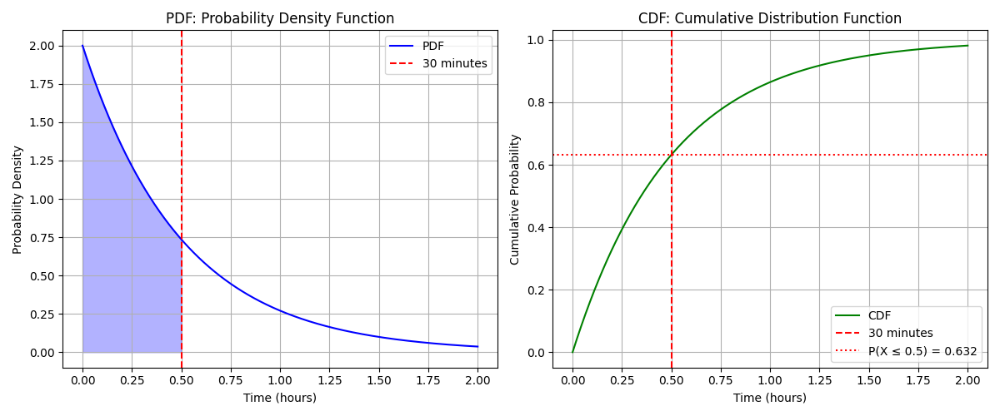
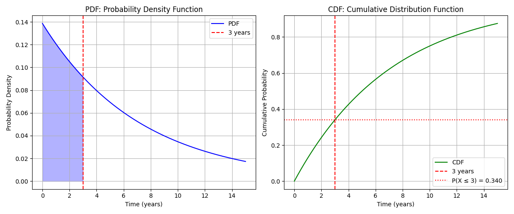
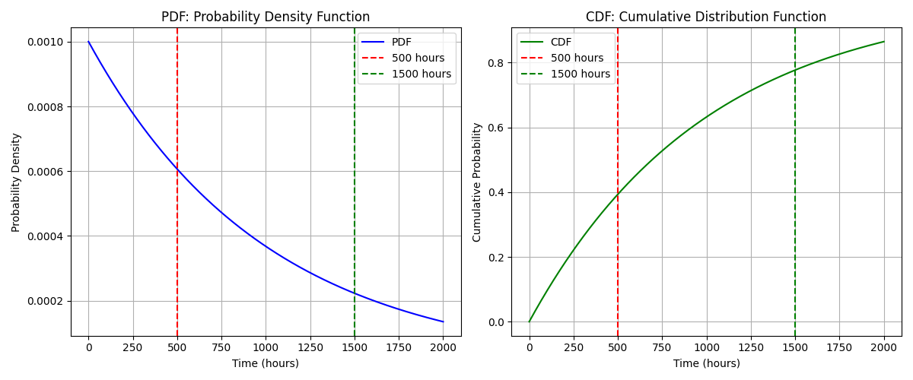
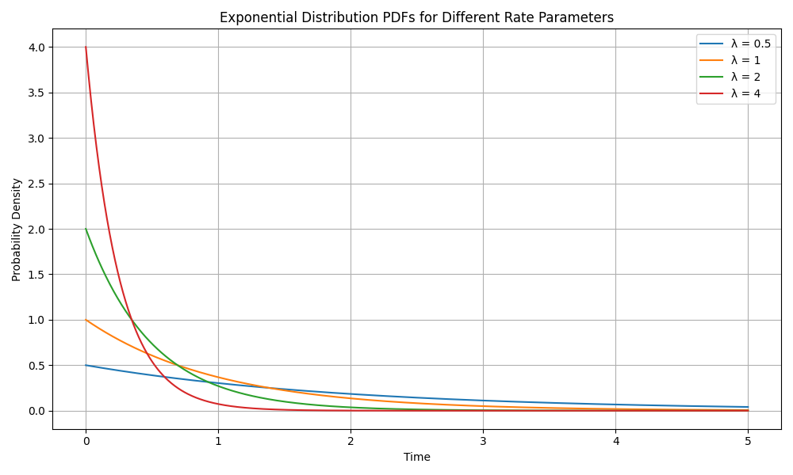
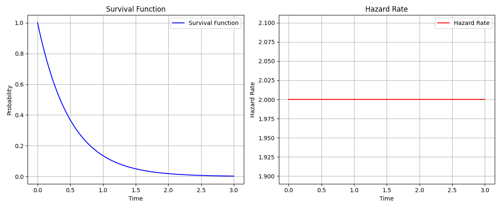
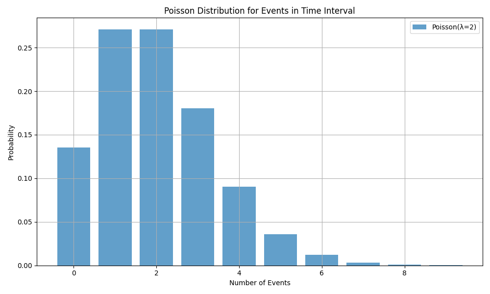
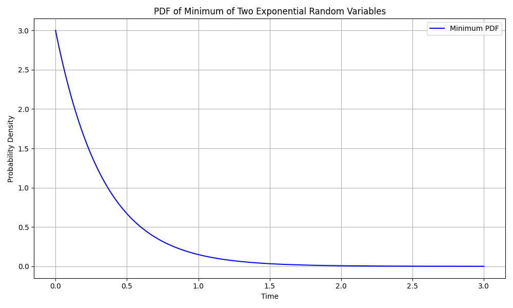

# Exponential Distribution Examples

This document provides practical examples of the exponential distribution, focusing on modeling waiting times and decay processes in machine learning and data analysis.

## Key Concepts and Formulas

The exponential distribution is a continuous probability distribution that models the time between events in a Poisson process. It's characterized by its memoryless property and constant hazard rate.

### The Exponential Distribution Formula

The probability density function (PDF) is:

$$f(x; \lambda) = \begin{cases}
\lambda e^{-\lambda x} & \text{for } x \geq 0 \\
0 & \text{for } x < 0
\end{cases}$$

Where:
- $\lambda$ = rate parameter (events per unit time)
- $x$ = time between events

Key properties:
- Mean: $\mu = \frac{1}{\lambda}$
- Variance: $\sigma^2 = \frac{1}{\lambda^2}$
- Memoryless Property: $P(X > s + t | X > s) = P(X > t)$

## Examples

### Example 1: Customer Service Waiting Times

#### Problem Statement
A customer service center receives calls at an average rate of 2 calls per hour. What is the probability that:
1. The next call will arrive within 30 minutes?
2. The waiting time will be more than 1 hour?
3. The waiting time will be between 30 minutes and 1 hour?

#### Solution

##### Step 1: Identify Parameters
- Rate parameter $\lambda = 2$ calls/hour
- Convert times to hours: 30 minutes = 0.5 hours

##### Step 2: Calculate Probabilities
1. Probability of next call within 30 minutes:
   $$P(X \leq 0.5) = 1 - e^{-\lambda t} = 1 - e^{-2 \times 0.5} = 1 - e^{-1} = 0.632$$

2. Probability of waiting more than 1 hour:
   $$P(X > 1) = e^{-\lambda t} = e^{-2 \times 1} = e^{-2} = 0.135$$

3. Probability between 30 minutes and 1 hour:
   $$P(0.5 < X \leq 1) = P(X \leq 1) - P(X \leq 0.5) = (1 - e^{-2}) - (1 - e^{-1}) = 0.233$$



### Example 2: Radioactive Decay

#### Problem Statement
A radioactive material has a half-life of 5 years. What is:
1. The decay rate parameter?
2. The probability that an atom will decay within 3 years?
3. The probability that an atom will survive more than 8 years?

#### Solution

##### Step 1: Find Decay Rate
Given half-life $t_{1/2} = 5$ years:
$$\lambda = \frac{\ln(2)}{t_{1/2}} = \frac{\ln(2)}{5} = 0.139 \text{ decays/year}$$

##### Step 2: Calculate Probabilities
1. Probability of decay within 3 years:
   $$P(X \leq 3) = 1 - e^{-\lambda t} = 1 - e^{-0.139 \times 3} = 0.343$$

2. Probability of surviving more than 8 years:
   $$P(X > 8) = e^{-\lambda t} = e^{-0.139 \times 8} = 0.330$$



### Example 3: Memoryless Property

#### Problem Statement
A light bulb has an exponential lifetime with mean of 1000 hours. If the bulb has already lasted 500 hours:
1. What is the probability it will last another 1000 hours?
2. Compare this with the probability a new bulb lasts 1000 hours.

#### Solution

##### Step 1: Find Rate Parameter
Given mean $\mu = 1000$ hours:
$$\lambda = \frac{1}{\mu} = \frac{1}{1000} = 0.001 \text{ failures/hour}$$

##### Step 2: Calculate Probabilities
1. Probability of lasting another 1000 hours given 500 hours already:
   $$P(X > 1500 | X > 500) = P(X > 1000) = e^{-\lambda t} = e^{-0.001 \times 1000} = 0.368$$

2. Probability new bulb lasts 1000 hours:
   $$P(X > 1000) = e^{-\lambda t} = e^{-0.001 \times 1000} = 0.368$$

This demonstrates the memoryless property - the remaining lifetime is independent of how long the bulb has already lasted.



## Additional Visualizations

### Rate Parameter Comparison
This visualization shows how different rate parameters (λ) affect the shape of the exponential distribution. Higher rates result in steeper decay and lower means.



### Survival Function and Hazard Rate
The survival function shows the probability of surviving beyond a given time, while the hazard rate demonstrates the constant failure rate property of the exponential distribution.



### Relationship with Poisson
This visualization demonstrates the connection between the exponential distribution (time between events) and the Poisson distribution (number of events in a fixed interval).



### Minimum of Exponential Random Variables
This plot shows the distribution of the minimum of two exponential random variables, which is itself exponentially distributed with a rate equal to the sum of the individual rates.



## Key Insights

### Theoretical Insights
- The exponential distribution is memoryless, making it ideal for modeling waiting times
- The rate parameter $\lambda$ determines both the mean and variance
- The distribution has a constant hazard rate, meaning the probability of an event occurring in the next instant is constant

### Practical Applications
- Customer service and queuing systems
- Reliability engineering and failure analysis
- Radioactive decay and survival analysis
- Modeling time between events in Poisson processes

### Common Pitfalls
- Confusing the rate parameter $\lambda$ with the mean $\mu$
- Forgetting to convert time units consistently
- Misapplying the memoryless property to non-exponential distributions

## Running the Examples

You can run the code that generates these examples and visualizations using:

```bash
python3 ML_Obsidian_Vault/Lectures/2/Codes/1_exponential_examples.py
```

## Related Topics

- [[L2_1_Continuous_Distributions|Continuous Distributions]]: Overview of continuous probability distributions
- [[L2_1_Poisson_Distribution|Poisson Distribution]]: Related discrete distribution for counting events
- [[L2_1_Gamma_Distribution|Gamma Distribution]]: Generalization of exponential distribution
- [[L2_1_Survival_Analysis|Survival Analysis]]: Applications in time-to-event analysis 