# Gamma Distribution Examples

This document provides practical examples of the Gamma distribution, illustrating its properties and applications in machine learning and data analysis.

## Key Concepts and Formulas

The Gamma distribution is a continuous probability distribution that generalizes the exponential distribution. It's commonly used to model waiting times, reliability, and Bayesian statistics.

### The Gamma Distribution PDF

$$f(x; \alpha, \lambda) = \begin{cases}
\frac{\lambda^\alpha x^{\alpha-1} e^{-\lambda x}}{\Gamma(\alpha)} & \text{for } x > 0 \\
0 & \text{for } x \leq 0
\end{cases}$$

Where:
- $\alpha$ is the shape parameter ($\alpha > 0$)
- $\lambda$ is the rate parameter ($\lambda > 0$)
- $\Gamma(\alpha)$ is the gamma function

### Key Properties

- **Mean**: $\mu = \frac{\alpha}{\lambda}$
- **Variance**: $\sigma^2 = \frac{\alpha}{\lambda^2}$
- **Moment Generating Function**: $M_X(t) = \left(\frac{\lambda}{\lambda - t}\right)^\alpha$ for $t < \lambda$

## Examples

### Example 1: Basic Properties of Gamma Distribution

#### Problem Statement
Consider a Gamma distribution with shape parameter $\alpha = 2$ and rate parameter $\lambda = 0.5$. Calculate:
1. The mean and variance
2. The probability that a random variable from this distribution is less than 4
3. The 90th percentile of the distribution

#### Solution

##### Step 1: Basic Distribution
First, let's visualize the basic Gamma distribution with the given parameters:

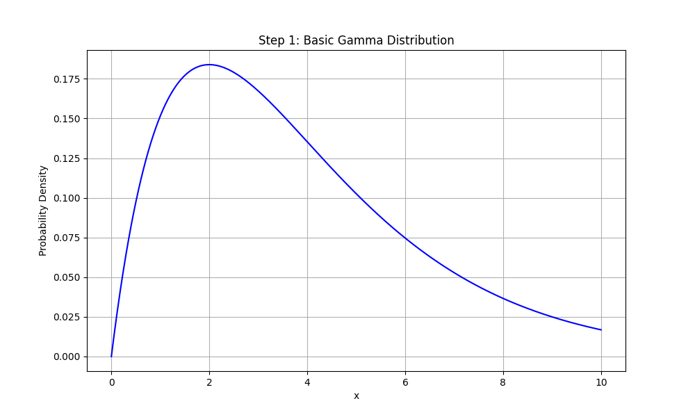

The distribution shows the probability density function (PDF) of the Gamma distribution with $\alpha = 2$ and $\lambda = 0.5$. The shape is skewed to the right, which is typical for Gamma distributions with small shape parameters.

##### Step 2: Mean and Variance
Using the formulas:
- Mean = $\frac{\alpha}{\lambda} = \frac{2}{0.5} = 4.0000$
- Variance = $\frac{\alpha}{\lambda^2} = \frac{2}{0.5^2} = 8.0000$
- Standard Deviation = $\sqrt{8} = 2.8284$

The mean is shown as a vertical red line in the following plot:

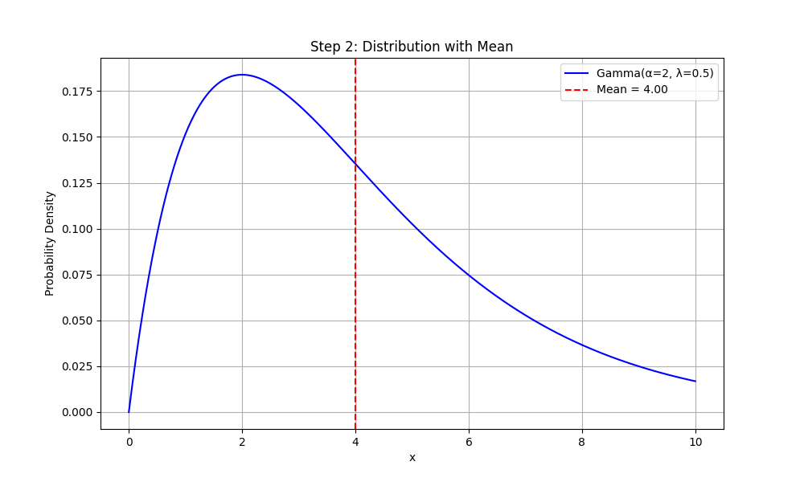

##### Step 3: Probability Calculation
Using the CDF of the Gamma distribution:
$P(X < 4) = F(4) = 0.5940$

The shaded area in the following plot represents this probability:

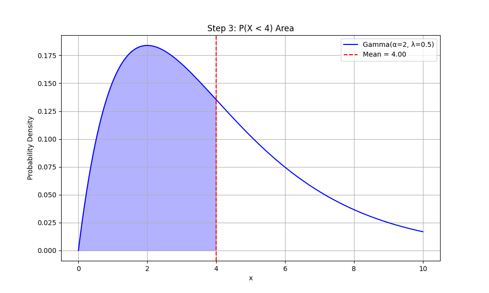

##### Step 4: Percentile Calculation
The 90th percentile is the value x such that $F(x) = 0.9$
$P_{90} = 7.7794$

The complete distribution with all features is shown below:

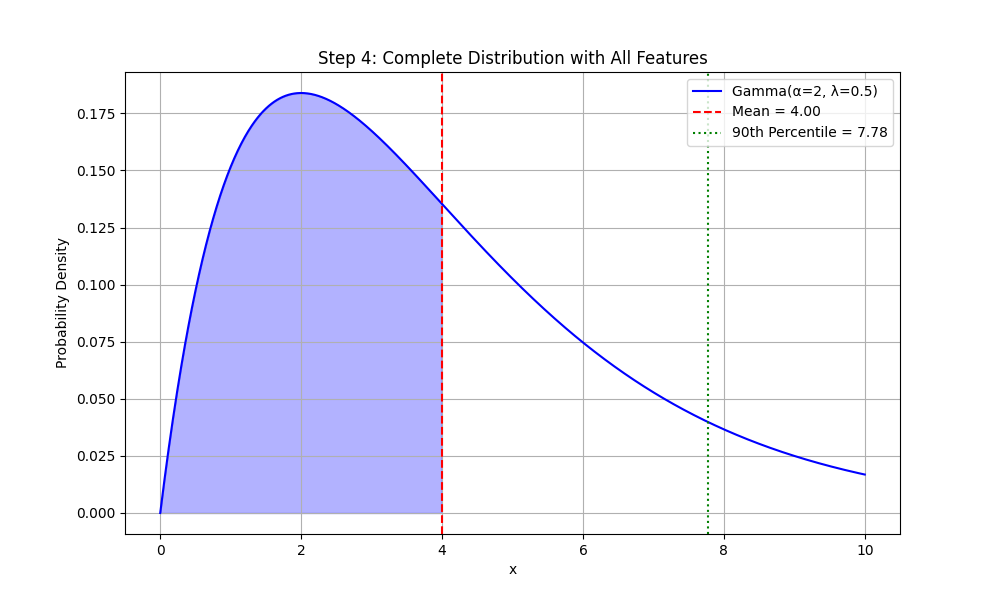

### Example 2: Shape Parameter Effect

#### Problem Statement
Compare three Gamma distributions with different shape parameters:
1. $\alpha = 1, \lambda = 1$
2. $\alpha = 2, \lambda = 1$
3. $\alpha = 3, \lambda = 1$

Calculate and compare their means, variances, and probabilities of being less than 2.

#### Solution

##### Step 1: Individual Distributions
Let's examine each distribution separately:

1. Gamma(α=1, λ=1):
   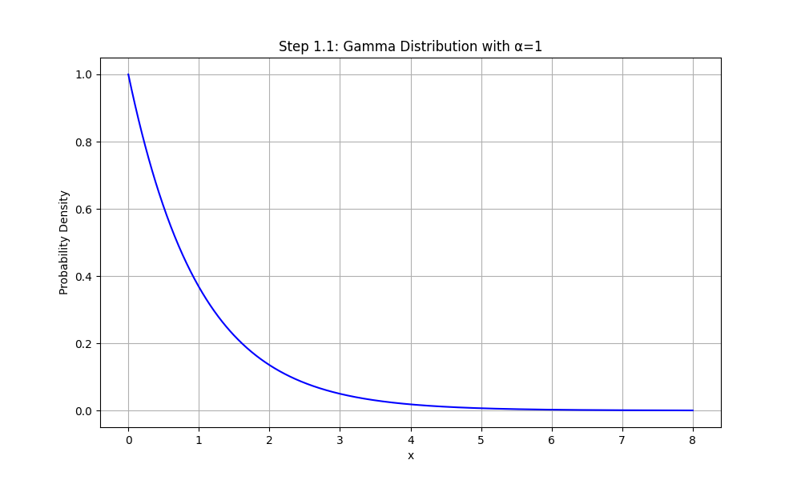
   - Mean = 1.0000
   - Variance = 1.0000
   - P(X < 2) = 0.8647

2. Gamma(α=2, λ=1):
   
   - Mean = 2.0000
   - Variance = 2.0000
   - P(X < 2) = 0.5940

3. Gamma(α=3, λ=1):
   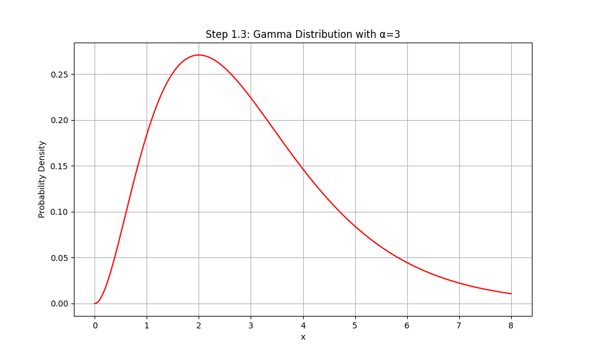
   - Mean = 3.0000
   - Variance = 3.0000
   - P(X < 2) = 0.3233

##### Step 2: Combined View
Now let's see all distributions together:

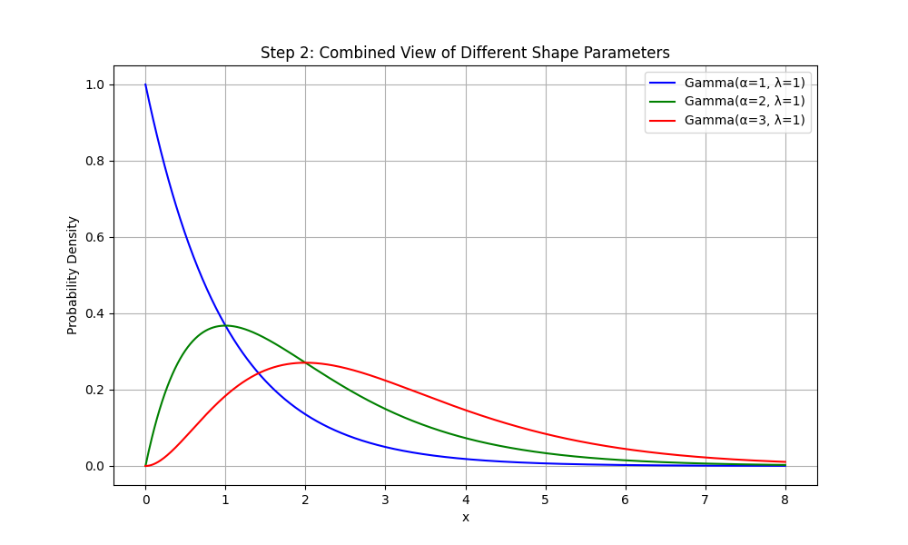

As the shape parameter α increases:
- The mean increases linearly
- The variance increases linearly
- The probability of being less than 2 decreases
- The distribution becomes more symmetric and bell-shaped

### Example 3: Rate Parameter Effect

#### Problem Statement
Compare three Gamma distributions with different rate parameters:
1. $\alpha = 2, \lambda = 0.5$
2. $\alpha = 2, \lambda = 1$
3. $\alpha = 2, \lambda = 2$

Calculate and compare their means, variances, and probabilities of being less than 3.

#### Solution

##### Step 1: Individual Distributions
Let's examine each distribution separately:

1. Gamma(α=2, λ=0.5):
   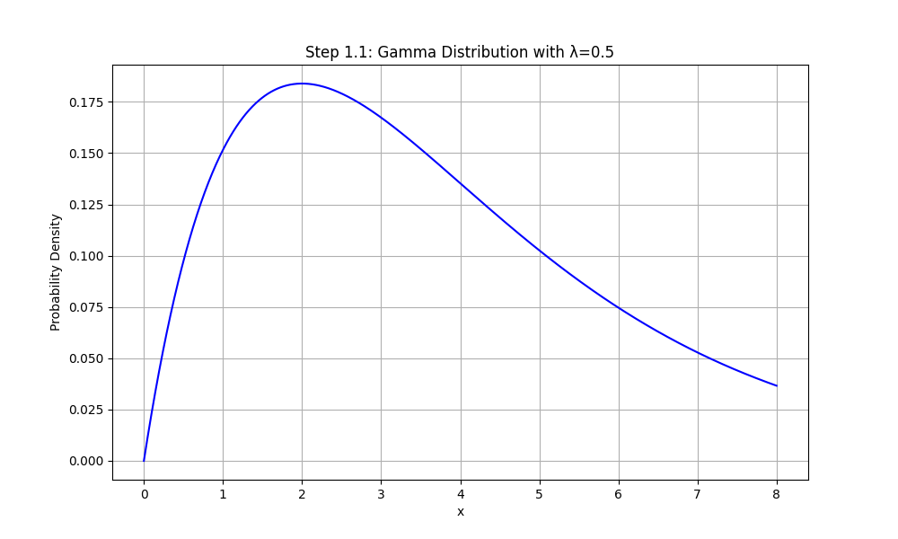
   - Mean = 4.0000
   - Variance = 8.0000
   - P(X < 3) = 0.4422

2. Gamma(α=2, λ=1):
   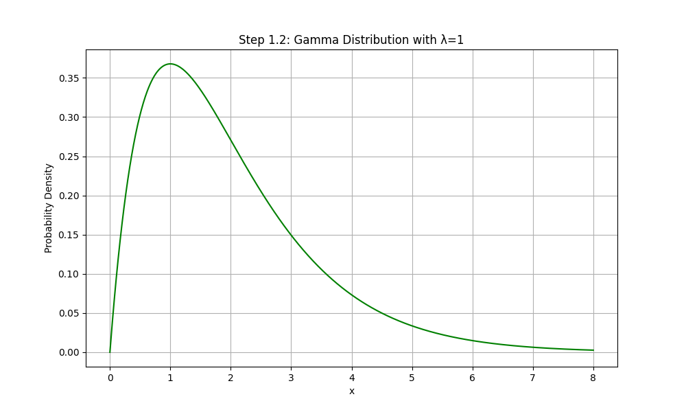
   - Mean = 2.0000
   - Variance = 2.0000
   - P(X < 3) = 0.8009

3. Gamma(α=2, λ=2):
   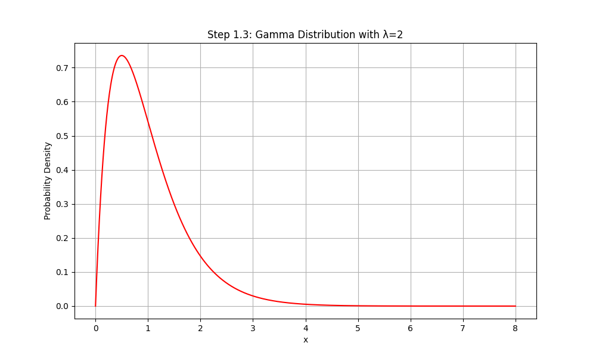
   - Mean = 1.0000
   - Variance = 0.5000
   - P(X < 3) = 0.9826

##### Step 2: Combined View
Now let's see all distributions together:

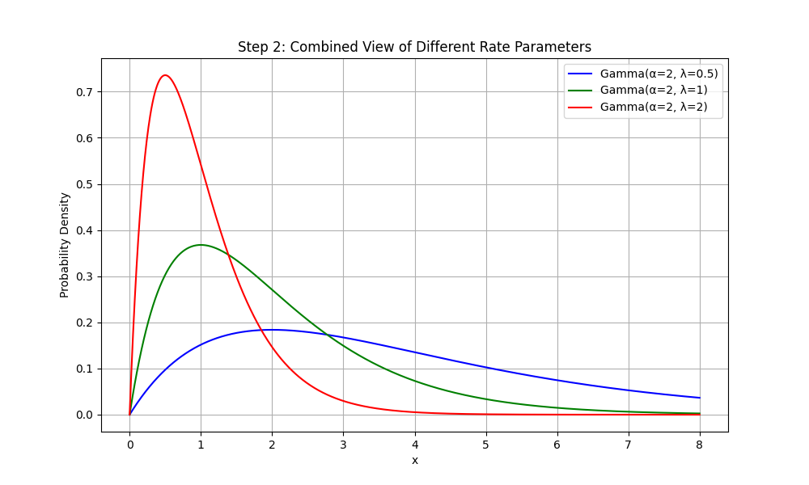

As the rate parameter λ increases:
- The mean decreases
- The variance decreases
- The probability of being less than 3 increases
- The distribution becomes more concentrated around smaller values

### Example 4: Special Cases

#### Problem Statement
Demonstrate the relationship between Gamma and Exponential distributions:
1. Show that when $\alpha = 1$, the Gamma distribution reduces to an Exponential distribution
2. Compare a Gamma($\alpha = 1, \lambda = 0.5$) with an Exponential($\lambda = 0.5$)

#### Solution

##### Step 1: Gamma Distribution
First, let's look at the Gamma distribution with $\alpha = 1$:

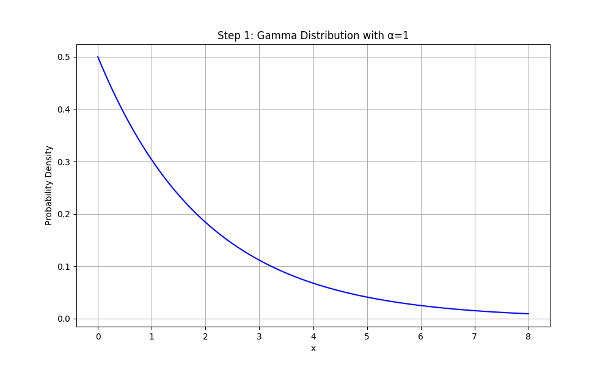

##### Step 2: Exponential Distribution
Now, let's look at the Exponential distribution:

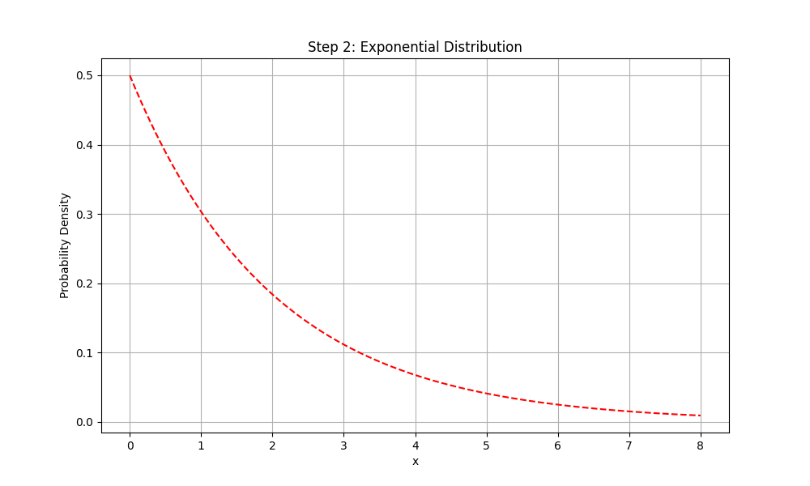

##### Step 3: Comparison
Let's compare both distributions together:

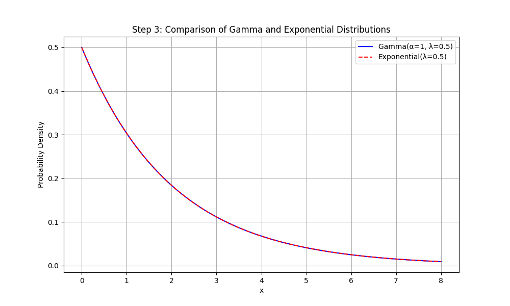

Comparison of probabilities for various x values:

| x | Gamma | Exponential |
|---|--------|-------------|
| 1 | 0.3935 | 0.3935 |
| 2 | 0.6321 | 0.6321 |
| 3 | 0.7769 | 0.7769 |
| 4 | 0.8647 | 0.8647 |

The probabilities are identical, confirming that Gamma(α=1, λ) is equivalent to Exponential(λ).

## Key Insights

### Theoretical Insights
- The shape parameter $\alpha$ controls the form of the distribution
- The rate parameter $\lambda$ controls the scale
- The Gamma distribution is flexible and can model various types of positive-valued data
- When $\alpha = 1$, the Gamma distribution reduces to an Exponential distribution

### Practical Applications
- Modeling waiting times in queuing systems
- Reliability analysis in engineering
- Bayesian statistics as conjugate priors
- Hierarchical models in machine learning

### Common Pitfalls
- Confusing shape and rate parameters
- Forgetting that the Gamma distribution is only defined for positive values
- Misinterpreting the relationship between Gamma and Exponential distributions

## Running the Examples

You can run the code that generates these examples and visualizations using:

```bash
python3 ML_Obsidian_Vault/Lectures/2/Codes/1_gamma_examples.py
```

## Related Topics

- [[L2_1_Gamma_Distribution|Gamma Distribution]]: Detailed theory and properties
- [[L2_1_Exponential_Distribution|Exponential Distribution]]: Special case of Gamma distribution
- [[L2_1_Continuous_Distributions|Continuous Distributions]]: Overview of continuous probability distributions
- [[L2_5_Bayesian_Inference|Bayesian Inference]]: Using Gamma distribution as prior 