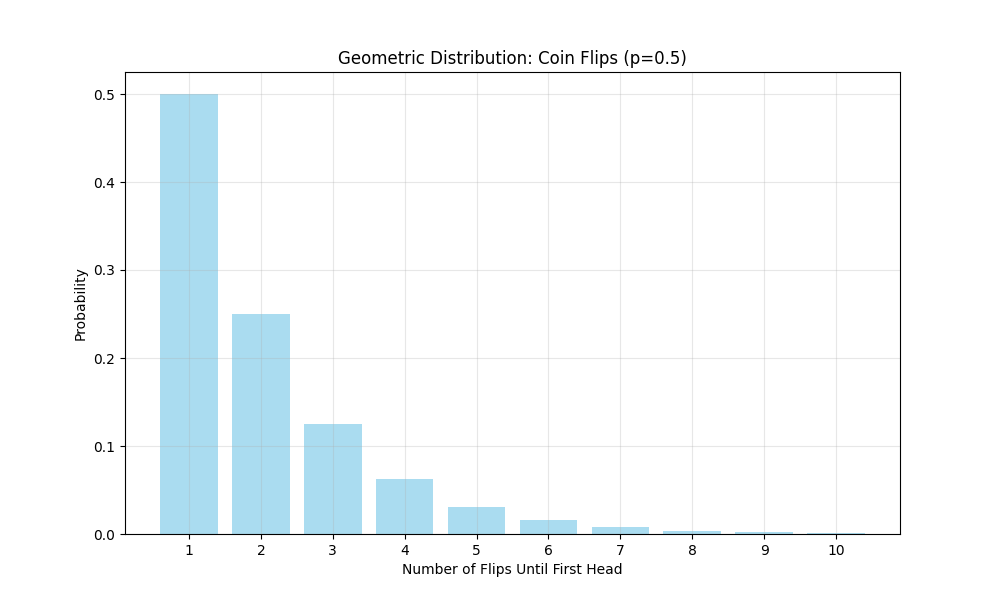
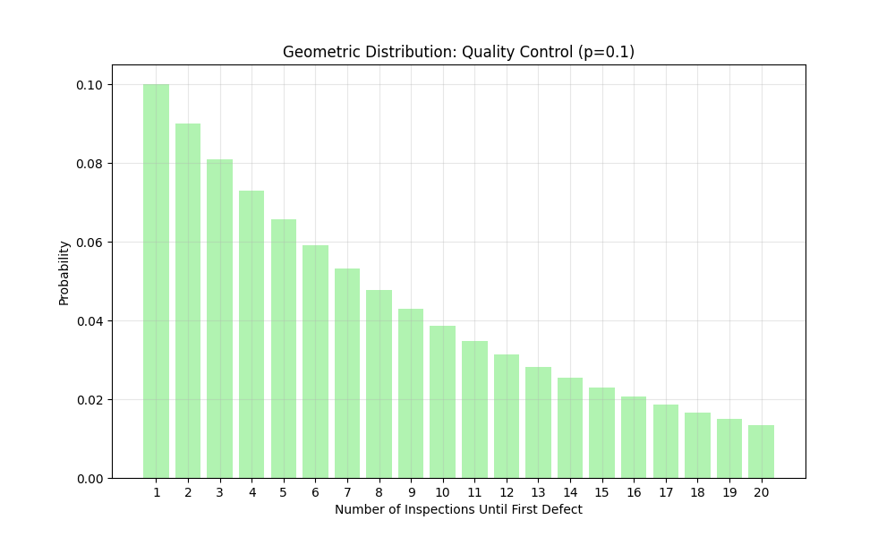
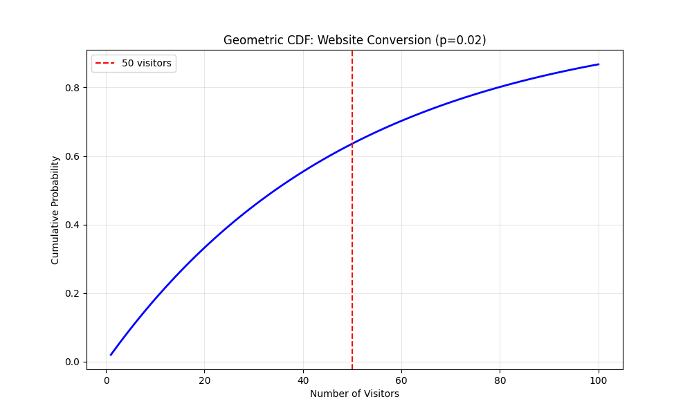
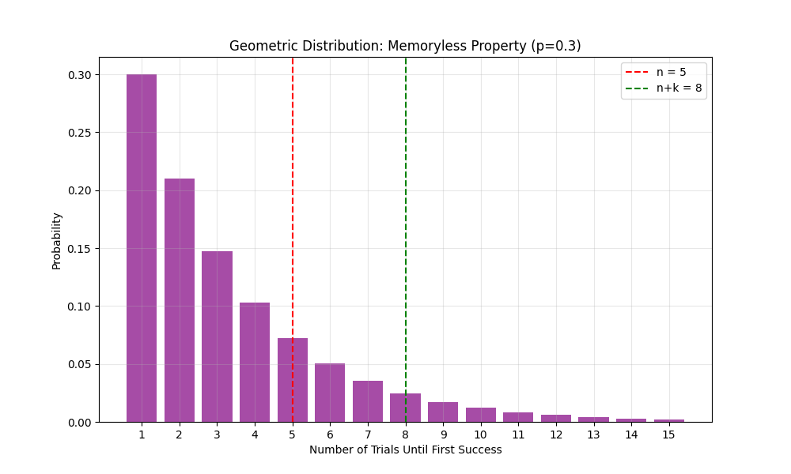

# Geometric Distribution Examples

This document provides practical examples of the geometric distribution, which models the number of trials needed to get the first success in a sequence of independent Bernoulli trials.

## Key Concepts and Formulas

The geometric distribution is a discrete probability distribution that models the number of trials needed to get the first success in a sequence of independent Bernoulli trials with success probability p.

### Geometric Distribution Formulas

- **Probability Mass Function (PMF)**: $P(X = k) = (1-p)^{k-1}p$ for $k = 1, 2, 3, ...$
- **Cumulative Distribution Function (CDF)**: $P(X \leq k) = 1 - (1-p)^k$
- **Expected Value**: $E[X] = \frac{1}{p}$
- **Variance**: $\text{Var}(X) = \frac{1-p}{p^2}$

Where:
- $p$ = probability of success on each trial
- $k$ = number of trials until first success
- $X$ = random variable representing the number of trials until first success

## Examples

### Example 1: Basic Geometric Distribution

#### Problem Statement
A fair coin is flipped repeatedly until the first head appears. What is the probability distribution of the number of flips needed?

In this example:
- Success = getting a head
- p = 0.5 (probability of getting a head)
- We want to find P(X = k) for k = 1, 2, 3, ...

#### Solution

The probability mass function for this scenario is:
$$P(X = k) = (1-0.5)^{k-1} \times 0.5 = 0.5^{k-1} \times 0.5 = 0.5^k$$

For the first 10 flips:
- P(X = 1) = 0.5000
- P(X = 2) = 0.2500
- P(X = 3) = 0.1250
- P(X = 4) = 0.0625
- P(X = 5) = 0.0312
- P(X = 6) = 0.0156
- P(X = 7) = 0.0078
- P(X = 8) = 0.0039
- P(X = 9) = 0.0020
- P(X = 10) = 0.0010

Expected number of flips until first head:
$$E[X] = \frac{1}{0.5} = 2.0$$

Variance:
$$\text{Var}(X) = \frac{1-0.5}{0.5^2} = 2.00$$



### Example 2: Quality Control

#### Problem Statement
A manufacturing process produces defective items with probability 0.1. What is the probability that the first defective item is found on the 5th inspection?

In this example:
- Success = finding a defective item
- p = 0.1 (probability of finding a defective item)
- k = 5 (we want the first success on the 5th trial)

#### Solution

Using the geometric PMF:
$$P(X = 5) = (1-0.1)^{5-1} \times 0.1 = 0.9^4 \times 0.1 = 0.0656$$

Expected number of inspections until first defect:
$$E[X] = \frac{1}{0.1} = 10.0$$

Variance:
$$\text{Var}(X) = \frac{1-0.1}{0.1^2} = 90.00$$



### Example 3: Website Click-Through

#### Problem Statement
A website has a 2% chance of converting a visitor into a customer. What is the probability that the first conversion happens within the first 50 visitors?

In this example:
- Success = visitor conversion
- p = 0.02 (probability of conversion)
- We want P(X ≤ 50)

#### Solution

Using the geometric CDF:
$$P(X \leq 50) = 1 - (1-0.02)^{50} = 0.6358$$

Expected number of visitors until first conversion:
$$E[X] = \frac{1}{0.02} = 50.0$$

Variance:
$$\text{Var}(X) = \frac{1-0.02}{0.02^2} = 2450.00$$



### Example 4: Memoryless Property

#### Problem Statement
Demonstrate the memoryless property of the geometric distribution using p = 0.3, n = 5, and k = 3.

In this example:
- Success probability p = 0.3
- We want to show P(X > n + k | X > n) = P(X > k)

#### Solution

Using the geometric distribution:
$$P(X > 8 | X > 5) = \frac{P(X > 8)}{P(X > 5)} = \frac{(1-0.3)^8}{(1-0.3)^5} = (1-0.3)^3 = 0.3430$$

And:
$$P(X > 3) = (1-0.3)^3 = 0.3430$$

This demonstrates the memoryless property:
$$P(X > n + k | X > n) = P(X > k)$$



## Key Insights

### Theoretical Insights
- The geometric distribution is memoryless: P(X > n + k | X > n) = P(X > k)
- The expected value is inversely proportional to the success probability
- The variance increases as the success probability decreases
- The probability mass function decreases exponentially with k

### Practical Applications
- Modeling waiting times until first success
- Quality control and reliability testing
- Customer conversion analysis
- Network packet transmission attempts
- Game theory and strategy analysis

### Common Pitfalls
- Confusing geometric with exponential distribution (continuous vs discrete)
- Forgetting that k starts at 1, not 0
- Misapplying the memoryless property in non-geometric scenarios
- Not considering the full range of possible outcomes

## Running the Examples

You can run the code that generates the probability examples and visualizations using:

```bash
python3 ML_Obsidian_Vault/Lectures/2/Codes/1_geometric_examples.py
```

## Related Topics

- [[L2_1_Basic_Probability_Examples|Basic Probability Examples]]: Understanding fundamental probability concepts
- [[L2_1_Expectation_Examples|Expectation Examples]]: Calculating expected values
- [[L2_1_Variance_Examples|Variance Examples]]: Understanding statistical dispersion
- [[L2_1_Exponential_Examples|Exponential Examples]]: Continuous counterpart to geometric distribution 